2장: 파이썬 프로그래밍 환경
===

Python Programming Environment

***
**박 진 수** 교수  
Intelligent Data Semantics Lab  
Seoul National University
***

<h3>Table of Contents<span class="tocSkip"></span></h3>
<div class="toc"><ul class="toc-item"><li><span><a href="#파이썬-개발-환경-설치하기" data-toc-modified-id="파이썬-개발-환경-설치하기-1">파이썬 개발 환경 설치하기</a></span></li><li><span><a href="#프로그래밍-툴" data-toc-modified-id="프로그래밍-툴-2">프로그래밍 툴</a></span><ul class="toc-item"><li><span><a href="#웹-브라우저에서-파이썬-프로그래밍" data-toc-modified-id="웹-브라우저에서-파이썬-프로그래밍-2.1">웹 브라우저에서 파이썬 프로그래밍</a></span><ul class="toc-item"><li><span><a href="#repl.it" data-toc-modified-id="repl.it-2.1.1">repl.it</a></span></li><li><span><a href="#PythonAnywhere" data-toc-modified-id="PythonAnywhere-2.1.2">PythonAnywhere</a></span></li></ul></li></ul></li><li><span><a href="#텍스트-편집기에서-파이썬-프로그래밍" data-toc-modified-id="텍스트-편집기에서-파이썬-프로그래밍-3">텍스트 편집기에서 파이썬 프로그래밍</a></span><ul class="toc-item"><li><span><a href="#Visual-Studio-Code" data-toc-modified-id="Visual-Studio-Code-3.1">Visual Studio Code</a></span></li><li><span><a href="#Sublime-Text" data-toc-modified-id="Sublime-Text-3.2">Sublime Text</a></span></li><li><span><a href="#Notepad++" data-toc-modified-id="Notepad++-3.3">Notepad++</a></span></li><li><span><a href="#Atom" data-toc-modified-id="Atom-3.4">Atom</a></span></li></ul></li><li><span><a href="#통합개발환경에서-파이썬-프로그래밍" data-toc-modified-id="통합개발환경에서-파이썬-프로그래밍-4">통합개발환경에서 파이썬 프로그래밍</a></span></li><li><span><a href="#IDLE" data-toc-modified-id="IDLE-5">IDLE</a></span></li><li><span><a href="#Lab:-IDLE-둘러보기" data-toc-modified-id="Lab:-IDLE-둘러보기-6">Lab: IDLE 둘러보기</a></span><ul class="toc-item"><li><span><a href="#IDLE-기능-둘러보기" data-toc-modified-id="IDLE-기능-둘러보기-6.1">IDLE 기능 둘러보기</a></span></li><li><span><a href="#IDLE-샘플-코드-맛보기" data-toc-modified-id="IDLE-샘플-코드-맛보기-6.2">IDLE 샘플 코드 맛보기</a></span></li><li><span><a href="#IDLE로-파이썬-실행하기" data-toc-modified-id="IDLE로-파이썬-실행하기-6.3">IDLE로 파이썬 실행하기</a></span><ul class="toc-item"><li><span><a href="#IDLE-대화형-모드" data-toc-modified-id="IDLE-대화형-모드-6.3.1">IDLE 대화형 모드</a></span></li><li><span><a href="#IDLE-인터프리터-모드" data-toc-modified-id="IDLE-인터프리터-모드-6.3.2">IDLE 인터프리터 모드</a></span></li><li><span><a href="#디버깅" data-toc-modified-id="디버깅-6.3.3">디버깅</a></span></li></ul></li><li><span><a href="#정리-:-두-가지-모드에서-파이썬-프로그램-실행" data-toc-modified-id="정리-:-두-가지-모드에서-파이썬-프로그램-실행-6.4">정리 : 두 가지 모드에서 파이썬 프로그램 실행</a></span><ul class="toc-item"><li><span><a href="#대화형-모드(interactive-mode)" data-toc-modified-id="대화형-모드(interactive-mode)-6.4.1">대화형 모드(interactive mode)</a></span></li><li><span><a href="#인터프리터-모드(interpreter-mode)" data-toc-modified-id="인터프리터-모드(interpreter-mode)-6.4.2">인터프리터 모드(interpreter mode)</a></span></li></ul></li></ul></li><li><span><a href="#명령어-셸-실행-환경" data-toc-modified-id="명령어-셸-실행-환경-7">명령어 셸 실행 환경</a></span><ul class="toc-item"><li><span><a href="#사용자-환경-:-셸" data-toc-modified-id="사용자-환경-:-셸-7.1">사용자 환경 : 셸</a></span><ul class="toc-item"><li><span><a href="#셸(shell)이란?" data-toc-modified-id="셸(shell)이란?-7.1.1">셸(shell)이란?</a></span></li><li><span><a href="#셸의-종류" data-toc-modified-id="셸의-종류-7.1.2">셸의 종류</a></span><ul class="toc-item"><li><span><a href="#그래픽-셸(graphic-shell)" data-toc-modified-id="그래픽-셸(graphic-shell)-7.1.2.1">그래픽 셸(graphic shell)</a></span></li><li><span><a href="#명령어-셸(command/character-shell)" data-toc-modified-id="명령어-셸(command/character-shell)-7.1.2.2">명령어 셸(command/character shell)</a></span></li></ul></li></ul></li><li><span><a href="#그래픽-셸-예시" data-toc-modified-id="그래픽-셸-예시-7.2">그래픽 셸 예시</a></span></li><li><span><a href="#명령어-셸-예시" data-toc-modified-id="명령어-셸-예시-7.3">명령어 셸 예시</a></span></li><li><span><a href="#대화형-모드" data-toc-modified-id="대화형-모드-7.4">대화형 모드</a></span><ul class="toc-item"><li><span><a href="#대화형-모드-종료" data-toc-modified-id="대화형-모드-종료-7.4.1">대화형 모드 종료</a></span><ul class="toc-item"><li><span><a href="#방법-1" data-toc-modified-id="방법-1-7.4.1.1">방법 1</a></span></li><li><span><a href="#방법-2" data-toc-modified-id="방법-2-7.4.1.2">방법 2</a></span></li><li><span><a href="#방법-3" data-toc-modified-id="방법-3-7.4.1.3">방법 3</a></span></li><li><span><a href="#방법-4-:-macOS-경우-단축-키-사용" data-toc-modified-id="방법-4-:-macOS-경우-단축-키-사용-7.4.1.4">방법 4 : macOS 경우 단축 키 사용</a></span></li></ul></li></ul></li><li><span><a href="#인터프리터-모드" data-toc-modified-id="인터프리터-모드-7.5">인터프리터 모드</a></span><ul class="toc-item"><li><span><a href="#윈도우(Windows)-명령-프롬프트에서-실행" data-toc-modified-id="윈도우(Windows)-명령-프롬프트에서-실행-7.5.1">윈도우(Windows) 명령 프롬프트에서 실행</a></span></li><li><span><a href="#유닉스-기반-시스템(e.g.,-Unix,-Linux,-또는-macOS)" data-toc-modified-id="유닉스-기반-시스템(e.g.,-Unix,-Linux,-또는-macOS)-7.5.2">유닉스 기반 시스템(e.g., Unix, Linux, 또는 macOS)</a></span></li></ul></li><li><span><a href="#Frequently-Questioned-Answers-(FQA)" data-toc-modified-id="Frequently-Questioned-Answers-(FQA)-7.6">Frequently Questioned Answers (FQA)</a></span></li></ul></li><li><span><a href="#Lab:-셸-명령어-기초" data-toc-modified-id="Lab:-셸-명령어-기초-8">Lab: 셸 명령어 기초</a></span><ul class="toc-item"><li><span><a href="#Windows" data-toc-modified-id="Windows-8.1">Windows</a></span><ul class="toc-item"><li><span><a href="#명령-프롬프트-열기" data-toc-modified-id="명령-프롬프트-열기-8.1.1">명령 프롬프트 열기</a></span></li><li><span><a href="#도우미-명령어" data-toc-modified-id="도우미-명령어-8.1.2">도우미 명령어</a></span></li><li><span><a href="#실습에서-학습하는-명령어" data-toc-modified-id="실습에서-학습하는-명령어-8.1.3">실습에서 학습하는 명령어</a></span></li></ul></li><li><span><a href="#macOS" data-toc-modified-id="macOS-8.2">macOS</a></span><ul class="toc-item"><li><span><a href="#터미널-열기" data-toc-modified-id="터미널-열기-8.2.1">터미널 열기</a></span></li><li><span><a href="#도우미-명령어" data-toc-modified-id="도우미-명령어-8.2.2">도우미 명령어</a></span></li><li><span><a href="#실습에서-학습하는-명령어" data-toc-modified-id="실습에서-학습하는-명령어-8.2.3">실습에서 학습하는 명령어</a></span></li></ul></li><li><span><a href="#파이썬-프로그램-실행-명령어-:-인터프리터-모드" data-toc-modified-id="파이썬-프로그램-실행-명령어-:-인터프리터-모드-8.3">파이썬 프로그램 실행 명령어 : 인터프리터 모드</a></span></li><li><span><a href="#명령어-셸에서-디버깅-하기" data-toc-modified-id="명령어-셸에서-디버깅-하기-8.4">명령어 셸에서 디버깅 하기</a></span><ul class="toc-item"><li><span><a href="#Windows-명령-프롬프트의-경우" data-toc-modified-id="Windows-명령-프롬프트의-경우-8.4.1">Windows 명령 프롬프트의 경우</a></span></li><li><span><a href="#macOS-터미널의-경우" data-toc-modified-id="macOS-터미널의-경우-8.4.2">macOS 터미널의 경우</a></span></li></ul></li><li><span><a href="#Lab-A1:-명령어-셸에서-파이썬-코드-실행하기" data-toc-modified-id="Lab-A1:-명령어-셸에서-파이썬-코드-실행하기-8.5">Lab A1: 명령어 셸에서 파이썬 코드 실행하기</a></span></li></ul></li></ul></div>

# 파이썬 개발 환경 설치하기

<https://www.python.org/downloads/> 

# 프로그래밍 툴

## 웹 브라우저에서 파이썬 프로그래밍

### repl.it
<https://repl.it/languages/python3>

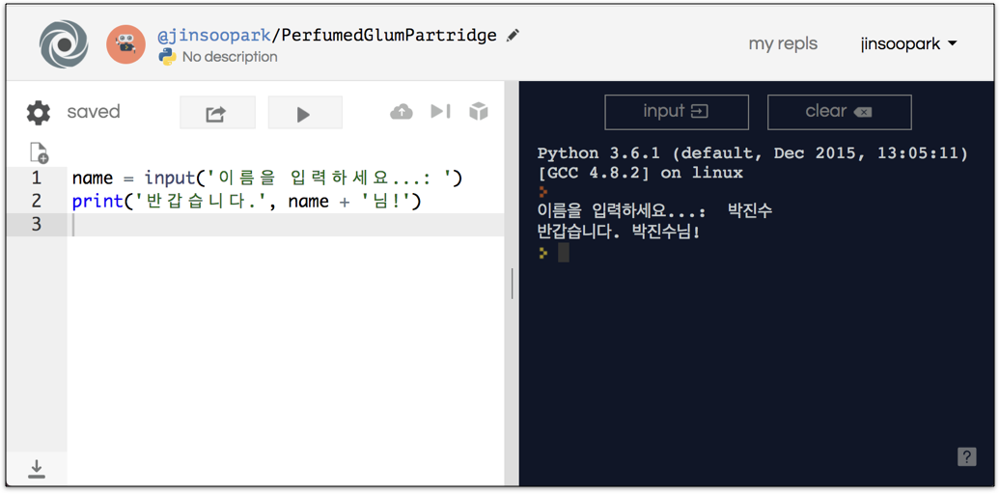

### PythonAnywhere
<https://www.pythonanywhere.com>

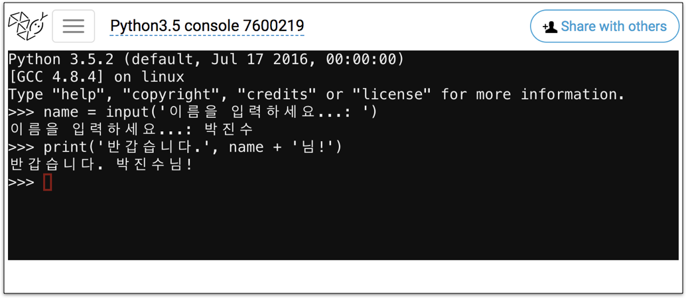

# 텍스트 편집기에서 파이썬 프로그래밍

프로그래밍을 위한 텍스트 편집기(text editors)
- ASCII 파일이나 유니코드 텍스트 파일을 편집할 수 있는 소프트웨어
- 윈도우의 ‘메모장’과 비슷한 기능을 하지만 프로그래밍이 용이하도록 다양한 기능을 제공하는 편집기도 많으니 장단점을 잘 비교해 자신에게 맞는 편집기를 사용

## Visual Studio Code

<https://code.visualstudio.com/>  

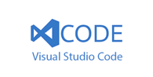

## Sublime Text

<http://www.sublimetext.com>


## Notepad++

<https://notepad-plus-plus.org>


## Atom

<https://atom.io/>


# 통합개발환경에서 파이썬 프로그래밍

**통합개발환경(IDE, integrated development environment)**

- 편집기, 컴파일러 등 프로그램 개발에 필요한 대부분의 도구들을 담고 있는 소프트웨어

**IDE의 장점**

- 함수명, 명령어, 매개변수 등 다양한 코드 구성 요소들을 색깔로 쉽게 구별하는 코드구문강조(syntax highlighting) 기능
- 문법 오류가 있을 경우 실시간으로 확인 가능
- 명령어 자동완성 기능 제공
- 다양한 디버깅 툴을 제공하기 때문에 오류 발견이 용이

**IDE의 단점**
- Visual Studio Code나 Sublime Text 같은 단순한 문서편집기보다 용량을 훨씬 더 많이 차지함

**PyCharm**

- 가장 평가가 좋은 IDE로 Heavy Developer가 주로 사용
- 무료 버전은 ‘Community Edition’

<https://www.jetbrains.com/pycharm/>


# IDLE

그러나... 본 강의의 공식 파이썬 툴은…

**IDLE** : **I**ntegrated **D**evelopment and **L**earning **E**nvironment

**내장(built-in) 프로그램**

- 파이썬 설치 시 기본적으로 함께 설치되는 프로그램
- TkInter 그래픽 사용자 인터페이스(GUI) 라이브러리를 사용

**3가지 핵심 기능**

1. 내장된 코드 편집기를 통해 **자동 들여쓰기**, 색깔을 통해 명령어를 구분하는 **코드구문강조**(syntax highlighting) 기능, **명령어 자동 완성** 기능 등을 지원
1. **디버거**가 장착되어 있어 각 코드 별로 한줄씩 한줄씩 오류를 파악하고 수정하는 것이 가능
1. 대화형 모드와 인터프리터 모드 둘 다 사용 가능
    - **대화형 모드**(interactive mode) : 파이썬 셸(shell)에서 명령어(코드)를 입력받고 그 결과를 바로 출력
    - **인터프리터 모드**(interpreter mode) : 파이썬 프로그램 편집기에서 프로그램을 작성한 후 파이썬 파일을 실행

# Lab: IDLE 둘러보기


<바로 쓰는 파이썬: 기초 편>의 [부록 2 - IDLE 둘러보기](https://github.com/snu-python/pythonbook/blob/master/Appendix2%20IDLE%20Tutorial.pdf) 참조

- <https://github.com/snu-python/pythonbook>

## IDLE 기능 둘러보기

DEMO

## IDLE 샘플 코드 맛보기

DEMO

## IDLE로 파이썬 실행하기

### IDLE 대화형 모드
DEMO

### IDLE 인터프리터 모드
DEMO

### 디버깅
DEMO

## 정리 : 두 가지 모드에서 파이썬 프로그램 실행

### 대화형 모드(interactive mode)
- 대화 창(파이썬 셸)에서 실시간으로 명령어를 입력
- 대화형 모드를 실행하면 프롬프트(‘>>>’ 표시)가 나타남
    - 프롬프트는 사용자로부터 명령어를 입력받을 준비가 되었다는 뜻
    - 명령어가 처리되면 다음 명령어를 기다리는 프롬프트가 다시 나타남
    - 단, 잘못된 명령어를 입력해서 실행할 경우 오류 메시지가 출력됨
- 파이썬의 다양한 기능을 테스트해 볼 때 편리함

### 인터프리터 모드(interpreter mode)
- 파이썬 명령어들을 문서 형태로 저장(즉, 코드 파일을 생성한다는 뜻)
    - 프로그램 창에서 작성한 코드를 파일 형태로 저장
        - 참고 : 대화형 모드에서는 입력한 명령어들이 저장되지 않음
    - 반드시 파일 확장자를 .py로 설정
- 프로그램 파일을 실행하기 위해 메뉴에서 
    - [Run] —> [Run Module]
    또는
    - [F5]

# 명령어 셸 실행 환경

## 사용자 환경 : 셸

### 셸(shell)이란?
- 커널(kernel)이라는 운영체제의 내부 핵심과 사용자 사이의 인터페이스
- 사용자의 명령을 해석해서 운영체제에 전달하고 그 처리 결과를 사용자에게 보여주는 시스템 프로그램
- 사용자는 다양한 셸(shell) 환경에서 프로그램을 실행할 수 있음

### 셸의 종류

#### 그래픽 셸(graphic shell)
- 그래픽 사용자 인터페이스(GUI, graphic user interface)
- 윈도우(Windows) 
- 맥 OS(macOS)
- 유닉스(UINX)와 리눅스(LINUX)의 X 윈도우 시스템(X Window System, X11)

#### 명령어 셸(command/character shell)
- 명령어 인터페이스 또는 명령 줄 인터페이스(CLI, command line interface)
    - 사용자가 컴퓨터 키보드 등을 동해 문자열 형태로 입력을 하며, 컴퓨터로부터의 출력 또한 문자열로 이루어짐
- 윈도우(Windows) 운영체제 : 도스(DOS) 셸 환경의 명령 프롬프트
- 맥 OS(macOS) 운영체제 : bash 셸 환경의 터미널

##  그래픽 셸 예시

**윈도우(Windows)**

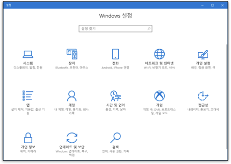

**맥 OS(macOS)**

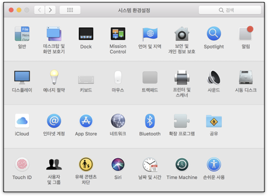

##  명령어 셸 예시

**윈도우(Windows)** 

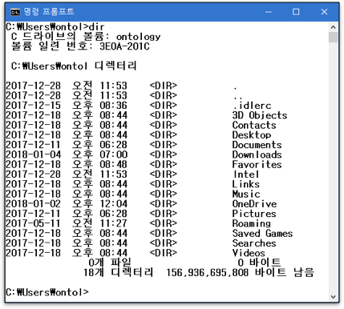

**맥 OS(macOS)**

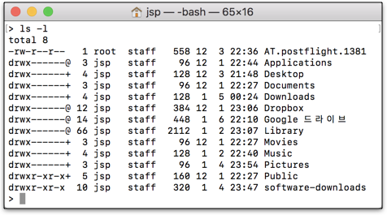

## 대화형 모드

명령어 셸에서 파이썬 셸 실행하기

- 실행 파일 이름 : **python** 또는 **python3**

- 파이썬 셸이 시작 메시지인 파이썬 버전 및 저작권 안내를 출력한 후 프롬프트가 나타남
    - 대화형 모드 기본 프롬프트 : **>>>**
    - 한 명령문 내에서 줄 바꿈이 있을 경우 **...** 프롬프트가 표시됨
    
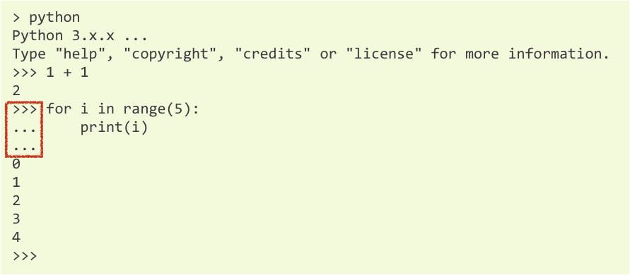    

### 대화형 모드 종료

#### 방법 1

```python
>>> quit()
```

#### 방법 2

```python
import sys
sys.exit()
```

#### 방법 3
창 닫기 아이콘 클릭

#### 방법 4 : macOS 경우 단축 키 사용
**[control] + Z**

**[control] + D**

**만약 같은 파이썬 코드를 여러 번 반복해서 실행해야 한다면?**

## 인터프리터 모드
- 프로그램 파일은 파이썬 인터프리터를 통해 실행됨
- 주로 명령어 셸(CLI)에서 이루어짐

### 윈도우(Windows) 명령 프롬프트에서 실행

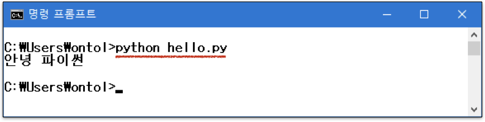

### 유닉스 기반 시스템(e.g., Unix, Linux, 또는 macOS)

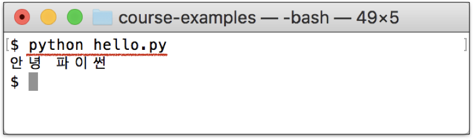

## Frequently Questioned Answers (FQA)

**<인터프리터 모드>로 프로그램을 <실행>하고자 할 때도 IDLE을 사용할 수 있나요?**

- 가능은 합니다만 본 수업에서는 **권장하지 않습니다**. 명령어 셸(CLI), 즉 '명령 프롬프트'(윈도우) 또는 '터미널'(맥)에서 실행하길 권장합니다.
- 만약 '명령 프롬프트'(윈도우) 또는 '터미널'(맥) 사용이 익숙하지 않을 경우 본 수업의 실습 <b><Lab: 셸 명령어 기초></b>에서 기본 내용을 다루니 학습하면 됩니다.
- 추가 정보가 필요할 경우 구글에서 'Command Line Crash Course'를 검색하거나 네이버에서 '명령 프롬프트 사용법' 또는 '터미널 사용법'을 검색하면 관련 정보를 얻을 수 있습니다.

**프로그램 실행 시 ‘No such file or directory’ 라는 메시지가 출력되면서 프로그램이 실행되지 않습니다.**

- '명령 프롬프트'(윈도우) 또는 '터미널'(맥)에서 실행할 경우 실행하고자 하는 파일이 있는 폴더까지 들어가야 합니다.
- '명령 프롬프트'(윈도우) 또는 '터미널'(맥)에서 위치를 이동하는 방법(특정 폴더에 들어가거나 나오는 방법)은 '**cd**' 명령어를 이용하면 됩니다.

- 가령 만약 파일이 저장된 위치가 **c:₩prg₩hello.py**이고 현재 사용자가 위치한 곳이 **C** 드라이버라면 '**cd ₩prg**' 명령어를 입력함으로써 **prg**폴더에 들어갈 수 있으며, '**python hello.py**' 명령어를 입력하면 **hello.py** 파일을 실행할 수 있습니다.
- 상위 폴더로 빠져나가는 명령어는 '**cd ..**'입니다. 즉, '**cd ₩폴더명**'(또는 맥의 경우 '**cd /폴더명**')은 해당 폴더로 들어가는 것이고, '**cd ..**'은 현재 폴더에서 상위 폴드로 빠져나오는 것입니다.
- 아직 잘 이해가 되지 않는다면 구글에서 'Command Line Crash Course'를 검색하거나 네이버에서 '명령 프롬프트 명령어' 또는 '터미널 명령어'를 검색하시면 관련 정보를 얻을 수 있습니다.

# Lab: 셸 명령어 기초

<바로 쓰는 파이썬: 기초 편>의 [부록 1 - 셸 명령어 기초](https://github.com/snu-python/pythonbook/blob/master/Appendix1%20Basic%20Shell%20Commands.pdf) 참조

- <https://github.com/snu-python/pythonbook> 

## Windows

### 명령 프롬프트 열기

1. 키보드에서 <b>[윈도우 시작버튼(창문 아이콘)] + [R]</b>을 누름
1. 실행 창이 나타나면 **cmd**라고 입력한 후 **[Enter]** 키를 누름
1. cmd.exe 파일이 실행됨
1. 그러면 '명령 프롬프트' 창이 열림

### 도우미 명령어
**help** : '명령 프롬프트'에서 제공하는 명령어 목록을 볼 수 있음

**help [명령어]** 또는 **[명령어] /?** : 특정 명령어에 대한 자세한 내용 도움 요청 

**cls** : 화면에 나타난 모든 출력을 지움

**exit** : '명령 프롬프트' 종료

### 실습에서 학습하는 명령어

**cd** / **chdir**

- **cd ..**
- **cd %homepath%**
- 절대경로와 상대경로

**mkdir**  
**dir**  
**rmdir** / **rm**  
**copy**

## macOS

### 터미널 열기

1. 키보드에서 **[command]**(혹은 [control]) + <b>[스페이스 바]</b>를 누름
1. **[스포트라이트(Spotlight) 검색]** 창이 나타나면 **터미널**이라고 입력한 후 **[터미널]** 항목을 더블 클릭
1. 그러면 '터미널' 창이 열림

### 도우미 명령어

**man [명령어]** : 특정 명령어에 대한 자세한 내용 도움 요청 

**clear** : 화면에 나타난 모든 출력을 지움

**exit** : '터미널' 프로세스를 종료

###  실습에서 학습하는 명령어

**pwd**  
**cd**

- **cd \~**
- **cd -**
- 절대경로와 상대경로

**mkdir**  
**ls**  
**rmdir** / **rm**  
**cp**

## 파이썬 프로그램 실행 명령어 : 인터프리터 모드

Windows의 경우 :  

```code
> python [(경로)파일 이름].py
```

macOS의 경우 : 

```code
$ python3 [(경로)파일 이름].py
```

## 명령어 셸에서 디버깅 하기


```python
print('Hello', 'Python~~~!')
print('Hello Python~~~!')
print('I love Python.)
print("So I'll master Python.")      
```


      File "<ipython-input-8-5d4f9f897343>", line 3
        print('I love Python.)
                              ^
    SyntaxError: EOL while scanning string literal


### Windows 명령 프롬프트의 경우

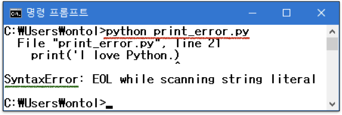

### macOS 터미널의 경우
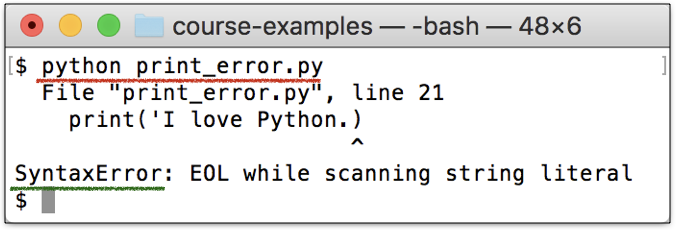

## Lab A1: 명령어 셸에서 파이썬 코드 실행하기

1. 디렉토리 만들기 : 사용자 홈 디렉토리 아래 '**pyprg**' 디렉토리를 만들고 그 아래 '**lab**' 디렉토리를 생성한다.
1. 파이썬 프로그램 작성하기 : '**lab**' 디렉토리에 아래 '**helloworld.py**' 파일을 만들어 아래 내용을 입력한 후 저장한다.

    ```python
    x = 'Hello '
    y = 'World!'
    z = x + y
    print(z)
    ```

1. 파이썬 프로그램 실행하기 : '**helloworld.py**'를 실행하면 아래와 같은 결과가 나와야 한다.

    ```code
    > python helloworld.py
    Hello Word!
    ```

***
**THE END**