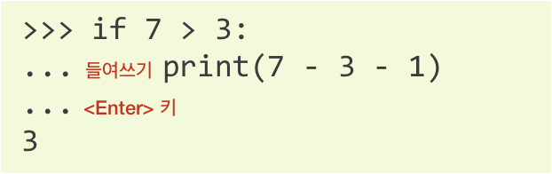
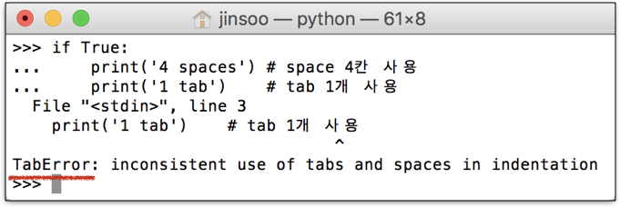

3장: 파이썬 문법 미리 알아두기
===

Prerequisites for Python Programming<

***
**박 진 수** 교수  
Intelligent Data Semantics Lab  
Seoul National University
***

<h3>Table of Contents<span class="tocSkip"></span></h3>
<div class="toc"><ul class="toc-item"><li><span><a href="#아주-간단한-프로그램" data-toc-modified-id="아주-간단한-프로그램-1">아주 간단한 프로그램</a></span></li><li><span><a href="#확장자명" data-toc-modified-id="확장자명-2">확장자명</a></span></li><li><span><a href="#인코딩" data-toc-modified-id="인코딩-3">인코딩</a></span><ul class="toc-item"><li><span><a href="#한-줄이-넘는-코드-작성하기-:-들여쓰기" data-toc-modified-id="한-줄이-넘는-코드-작성하기-:-들여쓰기-3.1">한 줄이 넘는 코드 작성하기 : 들여쓰기</a></span></li></ul></li><li><span><a href="#들여쓰기" data-toc-modified-id="들여쓰기-4">들여쓰기</a></span></li><li><span><a href="#연산" data-toc-modified-id="연산-5">연산</a></span><ul class="toc-item"><li><span><a href="#Lab:-연산해보기" data-toc-modified-id="Lab:-연산해보기-5.1">Lab: 연산해보기</a></span></li></ul></li><li><span><a href="#변수" data-toc-modified-id="변수-6">변수</a></span><ul class="toc-item"><li><span><a href="#변수(variable)란?" data-toc-modified-id="변수(variable)란?-6.1">변수(variable)란?</a></span></li></ul></li><li><span><a href="#식별자" data-toc-modified-id="식별자-7">식별자</a></span><ul class="toc-item"><li><span><a href="#식별자(identifier)란?" data-toc-modified-id="식별자(identifier)란?-7.1">식별자(identifier)란?</a></span></li><li><span><a href="#식별자-구성-규칙" data-toc-modified-id="식별자-구성-규칙-7.2">식별자 구성 규칙</a></span></li><li><span><a href="#Legal…-BUT-NOT-Recommended" data-toc-modified-id="Legal…-BUT-NOT-Recommended-7.3">Legal… BUT NOT Recommended</a></span></li><li><span><a href="#퀴즈" data-toc-modified-id="퀴즈-7.4">퀴즈</a></span></li><li><span><a href="#예약어(Reserved-Words)와-키워드(Keywords)" data-toc-modified-id="예약어(Reserved-Words)와-키워드(Keywords)-7.5">예약어(Reserved Words)와 키워드(Keywords)</a></span></li></ul></li><li><span><a href="#출력" data-toc-modified-id="출력-8">출력</a></span><ul class="toc-item"><li><span><a href="#출력-방식과-출력-형식" data-toc-modified-id="출력-방식과-출력-형식-8.1">출력 방식과 출력 형식</a></span><ul class="toc-item"><li><span><a href="#print()-함수를-사용하지-않고-출력" data-toc-modified-id="print()-함수를-사용하지-않고-출력-8.1.1">print() 함수를 사용하지 않고 출력</a></span></li><li><span><a href="#print()-함수를-사용해서-출력" data-toc-modified-id="print()-함수를-사용해서-출력-8.1.2">print() 함수를 사용해서 출력</a></span></li></ul></li><li><span><a href="#Lab:-다음-내용을-출력해보기" data-toc-modified-id="Lab:-다음-내용을-출력해보기-8.2">Lab: 다음 내용을 출력해보기</a></span></li><li><span><a href="#고급-:-print()-함수-탐구하기" data-toc-modified-id="고급-:-print()-함수-탐구하기-8.3">고급 : <strong>print()</strong> 함수 탐구하기</a></span><ul class="toc-item"><li><span><a href="#작성-방법" data-toc-modified-id="작성-방법-8.3.1">작성 방법</a></span></li><li><span><a href="#따라하기-:-print()-함수-잘-활용하기" data-toc-modified-id="따라하기-:-print()-함수-잘-활용하기-8.3.2">따라하기 : <strong>print()</strong> 함수 잘 활용하기</a></span></li></ul></li><li><span><a href="#print()-함수와-문자열-결합" data-toc-modified-id="print()-함수와-문자열-결합-8.4"><strong>print()</strong> 함수와 문자열 결합</a></span></li></ul></li><li><span><a href="#입력" data-toc-modified-id="입력-9">입력</a></span><ul class="toc-item"><li><span><a href="#Lab:-따라해보기" data-toc-modified-id="Lab:-따라해보기-9.1">Lab: 따라해보기</a></span></li><li><span><a href="#Lab:-입력-값의-자료형을-육안으로-확인하기" data-toc-modified-id="Lab:-입력-값의-자료형을-육안으로-확인하기-9.2">Lab: 입력 값의 자료형을 육안으로 확인하기</a></span><ul class="toc-item"><li><span><a href="#문자열을-입력한-경우" data-toc-modified-id="문자열을-입력한-경우-9.2.1">문자열을 입력한 경우</a></span></li><li><span><a href="#숫자를-입력한-경우" data-toc-modified-id="숫자를-입력한-경우-9.2.2">숫자를 입력한 경우</a></span></li></ul></li><li><span><a href="#정리-:-input([prompt])-함수" data-toc-modified-id="정리-:-input([prompt])-함수-9.3">정리 : input([prompt]) 함수</a></span></li></ul></li><li><span><a href="#형변환" data-toc-modified-id="형변환-10">형변환</a></span><ul class="toc-item"><li><span><a href="#형변환(casting)이란?" data-toc-modified-id="형변환(casting)이란?-10.1">형변환(casting)이란?</a></span></li><li><span><a href="#형변환의-필요성" data-toc-modified-id="형변환의-필요성-10.2">형변환의 필요성</a></span></li><li><span><a href="#자주-사용하는-형변환-클래스" data-toc-modified-id="자주-사용하는-형변환-클래스-10.3">자주 사용하는 형변환 클래스</a></span></li><li><span><a href="#형변환이-가능한-자료형" data-toc-modified-id="형변환이-가능한-자료형-10.4">형변환이 가능한 자료형</a></span></li><li><span><a href="#Lab:-형변환하기" data-toc-modified-id="Lab:-형변환하기-10.5">Lab: 형변환하기</a></span></li></ul></li><li><span><a href="#(제일-중요한)-주석-달기" data-toc-modified-id="(제일-중요한)-주석-달기-11">(제일 중요한) 주석 달기</a></span><ul class="toc-item"><li><span><a href="#주석(comment)이란?" data-toc-modified-id="주석(comment)이란?-11.1">주석(comment)이란?</a></span></li><li><span><a href="#가장-중요한-습관" data-toc-modified-id="가장-중요한-습관-11.2">가장 중요한 습관</a></span></li><li><span><a href="#파이썬에서-주석다는-법" data-toc-modified-id="파이썬에서-주석다는-법-11.3">파이썬에서 주석다는 법</a></span></li><li><span><a href="#머리말(header)-주석달기" data-toc-modified-id="머리말(header)-주석달기-11.4">머리말(header) 주석달기</a></span></li></ul></li><li><span><a href="#Lab:-입력,-연산,-출력하기" data-toc-modified-id="Lab:-입력,-연산,-출력하기-12">Lab: 입력, 연산, 출력하기</a></span></li></ul></div>

# 아주 간단한 프로그램

아래 링크로 가서 파이썬 프로그램을 내려받기 한다.
- <font size=+3><b>h t t p : / / b i t l y . k r / 1 j n i l<sub><font size=-1>(엘)</font></sub> Z</b></font>
- <http://bitly.kr/1jnilZ>

다음 코드를 입력해 실행해보자.


```python
from tkinter import *
 
window = Tk()
window.title('Welcome to Python World!')
window.geometry('370x90')
 
lbl = Label(window, text='Hello, Python!', font=('Arial Bold', 50))
lbl.grid(column=0, row=0)

btn = Button(window, text='Quit', command=window.destroy)
btn.grid(column=0, row=1)
 
window.mainloop()
```

***실행된 창에 'Hello, Python!'라고 되어있는데 이를 'Hi, Python!'으로 바꾸려면 코드의 어디를 수정해야할까?***

여러분은 **심지어** 코드가 어떤 의미를 갖는지도 모르는 상태에서도 프로그램을 수정할 수 있다.

사실, 프로그래밍의 대부분은 이것과 크게 다르지 않다.

컴퓨터가 이해할 수 있는 언어 규칙에 맞춰 여러분이 원하는 바를 작성하는 것이 프로그래밍이다.

# 확장자명

- 파이썬 프로그램 파일의 확장자명 : **.py**  
    - Linux나 macOS 같은 UNIX기반 시스템에서는 파이썬 파일의 확장자가 없을 수도 있다.
- 파이썬 GUI 프로그램의 확장자명 : **.pyw**

# 인코딩

UTF-8 문자 인코딩(encoding)
- 기본적으로 파이썬 파일은 UTF-8  문자 인코딩 방식을 사용한다.
- UTF-8 은 ASCII 보다 상위 개념이다.
- 지구상에 존재하는 대부분 언어의 문자를 지원한다.
- 파이썬 2로부터 분리된 가장 큰 이유다.

## 한 줄이 넘는 코드 작성하기 : 들여쓰기




```python
if 7 > 3:
    print(7 - 3 - 1)
```

# 들여쓰기

**Space sensitive**

- 명령문을 구분할 때 중괄호(‘{’, ‘}’) 대신<들여쓰기(indentation)>를 사용한다.
- 들여쓰기를 할 때는 4칸(space키 4번) 또는 1탭(Tab키 1번)을 입력한다.

- 한 코드 안에서는 반드시 한 종류의 들여쓰기를 사용해야지 혼용하면 안된다.
    - 탭(tab)으로 들여쓰면 계속 탭으로 들여써야 한다.
    - 원칙으로는 공백(빈칸, space) 사용을 권장한다. (PEP 8 권장 사항)




```python
if True:
    print('4 spaces')  # space 4칸 사용
   print('3 spaces')   # space 3칸 사용
```


```python
x = 1
 y = 3
```

# 연산

**숫자 연산**
- 사칙연산


```python
5 + 7
```


```python
5 - 7
```


```python
7 * 2
```


```python
7 / 2
```

**문자열 연산**
- 덧셈과 곱셈만 가능


```python
'안녕' + '파이썬'
```


```python
'파이썬' * 3
```


```python
'안녕' - '파이썬'
```


```python
'안녕' / '파이썬'
```

## Lab: 연산해보기

파이썬 대화형 모드에서 더하기, 빼기 곱하기 등의 연산을 하면 결과를 바로 알려준다.

**Q1.** ***1부터 10까지 더하면 얼마인가?***

**Q2.** ***1부터 10까지 더한 값에 10 이하의 짝수를 모두 더한 값을 빼면 얼마인가?***

***만약 계산된 결과를 반복해서 사용해야 한다면?*** 

변수를 정의해서 사용하면 편리하다.

**Q3.** ***1부터 10까지 더한 값에 10 이하의 홀수를 모두 더한 값을 빼면 얼마인가?***

**Q4.** ***1부터 10까지 더한 값에 10 이하의 3의 배수를 모두 더한 값을 빼면 얼마인가?***

이처럼 **변수**를 사용해서 계산을 하면 데이터를 처리하는 것이 편리하다.

# 변수

## 변수(variable)란?

- 컴퓨터 메모리 어딘가에 위치해(저장되어) 있는 **객체를 참조하기 위해 사용하는 이름**이다.
    - 객체(object) : 숫자, 문자, 클래스 등 값을 가지고 있는 모든 것이다.
    - 파이썬은 객체지향 언어이며 숫자와 문자를 포함해 모든 것이 '객체'(object)로 구현되어 있다.
- 동일 변수에 다른 객체를 언제든 할당할 수 있기 때문에, 즉 참조하는 객체가 바뀔 수 있기 때문에 '변수'라고 부른다.

**변수**를 사용하면 컴퓨터와 프로그래머 모두가 데이터를 쉽게 관리할 수 있다.


```python
x = 1
y = 'Hello'
z = 'Good Bye~~~!'

print(x)
print(y)
print(z)
```

***어떤 데이터에는 따옴표가 있고 어떤 데이터에는 따옴표가 없나요?***

다음 코드를 실행해보자.


```python
x = 1
y = '1'

print(x)
print(y)
```

위의 코드를 보면 두 변수 ***x***와 ***y***는 같은 값을 갖고 있는 것처럼 보인다.

하지만 변수의 종류를 알려주는 함수인 ```type()```을 이용하면 두 변수가 다른 종류인 것을 알 수 있다.


```python
print(type(x))
print(type(y))
```

변수 ***x***는 숫자형인 **int**, 변수 ***y***는 문자열인 ```str```임을 알 수 있다.

지금은 **변수에도 자료형(data type)이 있다**는 것만 알아두고 자세한 내용은 잠시 후에 다루자.

다음 코드를 실행해보자.


```python
x = hello
```

***무엇이 문제인가요?***

- 숫자는 따옴표로 묶지 않기로 약속했지만

- 따옴표로 묶지 않은 문자(문장)는 컴퓨터가 변수로 인식한다.

다음 코드를 실행해보자.


```python
hello = 'Good Bye~~~!'

print(hello)
print('hello')
```

두 개의 비슷한 ```print()``` 문이 전혀 다른 값을 출력하는 것을 알 수 있다.

파이썬에서는 따옴표로 묶은 문자는 **문자열**로 인식하고, 따옴표로 묶지 않은 문자는 **변수의 이름**으로 인식한다.

- ```print(hello)``` : 변수 *hello*가 담고 있는 'Good Bye'라는 문장을 출력
- ```print('hello')``` : 'hello'라는 문장을 출력

***그러면 변수 이름으로 아무 문자를 마음대로 사용할 수 있나요?***


```python
한국어 = '영어'  
숫자 = 5

print(한국어)
print(숫자)
```

- 변수 *한국어* : '영어'라는 문장을 저장

- 변수 *숫자* : 숫자 3을 저장

이처럼 심지어 한국어로 변수 이름을 사용하는 것도 가능하다.

**하지만...**

먼저 숫자 3을 아래와 같이 힘수 ```print```에 할당한다.


```python
print = 3
```

그리고 다시 함수 ```print```를 실행해서 문자를 출력해보자. 


```python
print('Hello, Python!')
```

- 출력 함수 ```print```를 변수 이름으로 사용했기 때문에

- *print*는 이제 숫자 3을 참조하는 **변수**다.

즉, ```print```는 더 이상 출력을 할 수 없게 되어버렸다.


```python
print
```

파이썬이 이미 사용하고 있는 이름을 변수 이름으로 사용하게 되면 이처럼 **복잡한 문제가 발생**할 수 있다.

앞의 예에서는 출력을 담당하는 함수 ```print```의 이름을 변수로 사용해, 더 이상 출력 함수를 사용할 수 없게 되어버렸다.

**따라서...**

파이썬이 이미 사용하고 있는 이름은 건드리지 말자.

이처럼 **변수 이름**으로 사용할 수 있는 것들에는 제약이 생긴다.

- 예) 공백을 사용할 수 없음

# 식별자

## 식별자(identifier)란?

파이썬 ‘객체’(데이터)를 식별하기 위해 붙이는 이름이다.

즉, 컴퓨터의 메모리 어딘가에 저장(위치)한 객체(데이터)를 컴퓨터와 프로그래머 모두가 쉽게 관리할 수 있도록 **변수**, **함수**, **클래스** 등에 붙이는 이름을 말한다.

## 식별자 구성 규칙

하나 또는 그 이상의 **공백이 없는 문자와 숫자의 조합**으로 **길이는 제한이 없다**.

하지만 **숫자로 시작할 수는 없다**.

**문자** : 유니코드 문자(Unicode characters) 중 **영어 알파벳**(a … z, A … Z), **밑줄**('_'), **한글** 등

- 변수 이름이 길거나 두 개 이상의 단어 조합인 경우 단어 사이에 밑줄('_')을 사용하면 가독성이 높아진다.
    - e.g., *firstname*, *lastname*보다는 *first_name*, *last_name*이 좋다.

- 한글도 사용 가능하지만 플랫폼에 따라 인코딩(encoding) 문제가 발생할 수 있기 때문에 가급적이면 영어를 사용하는 것이 좋다.

**숫자** : 0, 1,..., 9
- 첫 글자로 숫자가 올 수 없지만, 첫 글자 이 외에는 사용이 가능하다.
    - *x1* (okay)
    - *1x* (wrong)

**대소문자를 구분(case sensitive)**한다.
- *southkorea*, *Southkorea*, *SouthKorea*, *SouthKOREA*, *SOUTHKOREA*은 모두 다른 식별자다.

파이썬 **예약어(키워드)와 동일한 이름**은 **사용할 수 없다**.

## Legal… BUT NOT Recommended

- 내장 자료형(built-in data types) 이름
    - ```int``` ```float```, ```list```, ```str```, ```tuple``` 등

- 내장(built-in) 함수 이름이나 예외(exceptions) 클래스 이름과 같이 파이썬이 지정한 식별자
    - 참고 : 대문자로 시작하는 이름은 주로 파이썬이 사용하는 예외 클래스 이름이다.

- 이름의 시작과 끝에 밑줄 2개(e.g., ```__package__```)

## 퀴즈

***다음 중 식별자로 적절한 것과 아닌 것을 구별하시오.***

**tax4**


```python
tax4 = 0.05
print(tax4)
```

**4tax**


```code
4tax = 0.07
print(4tax)
```

**interest-rate**


```python
interest-rate = 0.02
print(interest-rate)
```

**interest_rate**


```python
interest_rate = 0.02
print(interest_rate)
```

**korea's**


```python
korea's = '태극기'
print(korea's)
```

**str**


```python
str = 'interest-rate'
print(str)
```

**int**


```python
int = 5
print(int)
```

**이름**


```python
이름 = '대한민국'
print(이름)
```

## 예약어(Reserved Words)와 키워드(Keywords)

예약어(reserved words)란 특별한 용도로 사용하기 위해 미리 예약한 **식별자**(reserved identifiers)

- 예약어는 주로 컴퓨터 프로그래밍 언어에서 사용하면 명령어들로 구성되어 있지만 ‘예약'이란 단어의 의미에서 알 수 있듯이 때로는 아직 구현하지 않은 명령어를 미리 예약어로 지정하기도 한다. 

- 따라서 예약어는 변수나 함수 이름 등 **사용자가 정의하는 식별자로는 사용할 수 없는 단어(이름)들**이다. 

- 흔히 예약어는 **키워드(keywords)**와 혼용해서 사용한다.

***파이썬 예약어/식별자는 어떻게 확인할 수 있을까?***

방법 1:


```python
help('keywords')
```

방법 2:


```python
import keyword
print(keyword.kwlist)
```

# 출력

출력은 특히 초보 프로그래머들에게 필수인 기능(함수)이다.

파이썬에서는 ```print()``` 함수를 이용해 다양한 것들을 출력할 수 있다.


```python
print('Hello, Python!')
```

**따옴표 안**의 내용을 수정해 다양한 문장을 출력해보자.


```python
# --- 실습 : 다양한 문장 출력해보기
print('')
```

***한글도 출력할 수 있나요?***


```python
# --- 실습 : 한글 출력해보기
print('')
```

## 출력 방식과 출력 형식

### print() 함수를 사용하지 않고 출력

- 대화형 모드에서만 가능하다.
- 객체의 자료형을 알 수 있는 **대표 형식**으로 출력한다.


```python
'안녕 파이썬!!!'
```


```python
11 + 22
```

### print() 함수를 사용해서 출력

- 대화형 모드와 인터프리터 모드 둘 다에서 사용할 수 있다.
- 객체를 사람이 보기 편한 **텍스트 형식**으로 출력한다.


```python
print('안녕 파이썬!!!')
```


```python
print(11 + 22)
```

***대표 형식과 텍스트 형식의 차이는 뭔가요?***


```python
a = '홍길동'                    # 변수 a에 문자를 할당한다.
```


```python
a                              # 문자를 대표 형식으로 출력한다.
```


```python
print(a)                       # 문자를 텍스트 형식으로 출력한다.
```


```python
b = '27'                       # 변수 b에 문자를 할당한다.
```


```python
b                              # 문자를 대표 형식으로 출력한다.
```


```python
print(b)                       # 문자를 텍스트 형식으로 출력한다.
```


```python
c = 27                         # 변수 c에 숫자를 할당한다.
```


```python
c                              # 문자를 대표 형식으로 출력한다.
```


```python
print(c)                       # 문자를 텍스트 형식으로 출력한다.
```


```python
d = '첫째 줄\n둘째 줄'          # 변수 d에 특수문자가 있는 문자를 할당한다.
```


```python
d                              # 특수문자가 있는 문자를 대표 형식으로 출력한다.
```


```python
print(d)                       # 특수문자가 있는 문자를 텍스트 형식으로 출력한다.
```


```python
'Python',1, 2,      3          # 여러 개의 객체를 대표 형식으로 출력한다.
```


```python
print('Python',1, 2,      3)   # 여러 개의 객체를 텍스트 형식으로 출력한다.
```

모듈은 대표 형식이나 텍스트 형식으로 출력할 수 없기 때문에 **꺾쇠 괄호** 안에 ```sys```가 파이썬 내장(built-in) 모듈이란 표현이 출력된다.


```python
import sys                     # 모듈을 입력한다.
```


```python
sys                            # 모듈 이름을 대표 형식으로 출력한다.
```


```python
print(sys)                     # 모듈 이름을 텍스트 형식으로 출력한다.
```

## Lab: 다음 내용을 출력해보기


```python
# --- 대표 형식
1,2,3, 4,      5
```


```python
# --- 텍스트 형식
print(1,2,3, 4,      5)
```


```python
# --- 대표 형식
'Python', 3
```


```python
# --- 텍스트 형식
print('Python', 3)
```


```python
# --- 대표 형식
1 + 2 + 3 + 4 + 5
```


```python
# --- 텍스트 형식
print(1 + 2 + 3 + 4 + 5)
```


```python
x = '홍길동'
y = 27
```


```python
# --- 대표 형식
x, y
```


```python
# --- 텍스트 형식
print(x, y)
```


```python
x = '안녕'
y = '파이썬'
```


```python
# --- 대표 형식
x + y
```


```python
# --- 텍스트 형식
print(x + y)
```


```python
# --- 텍스트 형식
print()    # 빈 칸 한 줄이 출력된다.
```

## 고급 : ```print()``` 함수 탐구하기

### 작성 방법

[print(*objects, sep=' ', end='\n', file=sys.stdout, flush=False)](https://docs.python.org/3/library/functions.html#print)

- 다수의 위치 전달인자(\*objects)와 4개의 키워드 전달인자를 받을 수 있다.
    - 각 키워드 전달인자는 기본 값이 있음

- ***sep*** 매개변수의 기본 값은 공백(' ') 
    - 두 개 이상의 위치 전달인자가 주어질 경우 각각의 전달인자는 ***sep*** 값으로 나뉘어 출력한다.
    - 위치 전달인자가 하나만 주어졌을 경우 ***sep*** 매개변수는 아무런 역할도 하지 않는다.
- ***end*** 매개변수의 기본 값은 새줄바꿈(newline)이다.
    - 위치 전달인자들을 출력하고 난 후 마지막에 ***end*** 매개변수의 값을 출력한다.

- ***file*** 매개변수의 기본 값은 표준 출력 스트림이다.
    - 표준 출력 스트림(standard output stream)은 주로 콘솔(console)을 사용한다.
- ***flush*** 매개변수는 파이썬 3.3에 추가한 기능이다.
    - 값이 **True**이면 ***file*** 스트림을 강제적으로 내보낸다(flush).

### 따라하기 : ```print()``` 함수 잘 활용하기


```python
print('Python', 3)
```


```python
print('Python', 3, sep='')
```


```python
print('Python', 3, sep=' version ')
```


```python
print(1, 2, 3, 4, 5, sep=' + ')
```

## ```print()``` 함수와 문자열 결합


```python
name = '파이썬'

# 아래 코드의 차이가 뭔지 확인하세요.
print('Hi!', name)   
print('Hi! ' + name)  # 문자열 결합
```


```python
# 아래 코드의 차이가 뭔지 확인하세요.
print('The length of', name, 'is', len(name))
print('The length of ' + name + ' is ' + str(len(name)))  # 문자열 결합
```


```python
age = 19
# 아래 코드의 차이가 뭔지 확인하세요.
print('You will be', int(age) + 1, 'years old in the next year.')
print('당산의 나이는 내년에 ' + str(int(age) + 1) + '살이 됩니다.')  # 문자열 결합
```

# 입력

파이썬에서 입력을 받는 대표적인 함수로는 ```input()```이 있다.


```python
input('무엇이든 입력해 주세요: ')
```

```input()``` 함수의

- 괄호 안에 따옴표로 묶어서 작성한 내용이 화면으로 출력되며 

- 입력을 기다리는 창이 나오는 것을 알 수 있다.

***'무엇이든 입력해 주세요: ' 대신에 화면에 '좋아하는 숫자를 입력해 주세요: '라고 표시되게 코드를 수정해보자.***

## Lab: 따라해보기


```python
input()                   # no prompt
```


```python
input('이름을 입력하세요: ')  # using prompt
```

그런데, 우리가 입력한 값은 어디로 가는 것일까?

프로그램에서 입력을 받았다면 그 값을 사용할 수 있어야 한다.

다음 코드를 실행해보자.


```python
x = input('좋아하는 숫자를 입력해 주세요: ')
print('당신이 좋아하는 숫자는', x)
```

좋아하는 숫자 ***x***에다 5를 더해보자.


```python
x + 5
```

***어찌된 영문일까?***

입력받은 값의 자료형을 확인해보자.


```python
print(type(x))
```

***x***의 자료형이 문자열이다. 

따라서 숫자 5와 문자열은 덧셈 연산을 할 수 없다.

## Lab: 입력 값의 자료형을 육안으로 확인하기

### 문자열을 입력한 경우


```python
name = input('이름을 입력하세요: ')
```


```python
name  # 문자열이다.
```

### 숫자를 입력한 경우


```python
age = input('나이를 입력하세요: ')
```


```python
age  # 문자열이다.
```

```input()``` 함수가 반환하는 값은 모두 **문자열**이다.

따라서 이 값으로 사용하여 계산을 하려면 문자열 자료형을 숫자 자료형으로 변환해야 한다.


```python
int(age) + 1
```

그렇지 않으면...


```python
age + 1
```

## 정리 : input([prompt]) 함수

- 사용자로부터 값을 입력 받을 수 있는 내장함수다.

- 실행하면 즉시 커서가 나타나 입력을 기다린다.

- 대괄호(**[ ]**) 부분에 문자열 값을 넣으면 사용자로부터 입력받을 때 해당 문자열을 출력할 수 있다.
    - 예) ```input()``` : ```_``` (화면에는 왼쪽과 같이 표시된다)
        - 아무 것도 출력되지 않은 상태에서 사용자의 입력을 기다린다.
    - 예) ```input('당신의 이름은 무엇입니까?')``` : ```당신의 이름은 무엇입니까?_``` (화면에는 왼쪽과 같이 표시된다) 
        - 해당 문자열을 출력하고 사용자의 입력을 기다린다.

- 사용자가 값을 입력을 한 후 <Enter> 또는 <return> 키를 누르면 입력을 종료한다.

- 반환 값
    - 사용자가 입력한 값은 항상 **문자열** 형태로 반환한다.
    - 사용자가 아무런 값도 입력하지 않고 <Enter> 또는 <return> 키를 누르면 빈 문자열을 반환한다.

# 형변환

## 형변환(casting)이란?

어떤 자료형(data type)을 다른 자료형으로 변환시키는 과정

## 형변환의 필요성

파이썬은 변수를 선언할 때 자료형을 지정할 필요가 없다.


```python
x = 1
y = 2
print(x + y)
```

- 변수 ***x***와 ***y***를 숫자라고 선언해 주지 않았음에도 불구하고, 파이썬은 두 변수가 정수(integer)임을 알아채고 ***x*** **+** ***y***의 결과로 3을 반환한다.

- 명시적으로 변수의 자료형을 지정하지 않았음에도 불구하고 변수의 자료형이 존재한다는 것을 알 수 있다.(viz. 동적 언어)

이번에는 숫자 대신에 문자열을 사용해보자.


```python
x = '1'
y = '2'
print(x + y)
```

이번에는 변수 ***x***와 ***y***를 선언할 때 숫자를 작은 따옴표('')로 둘러싸서 문자열 변수라고 선언해 주자 파이썬은 이를 알아채고 결과로 '12'를 반환한다.

***그렇다면, 만약 호환될 수 없는 서로 다른 자료형 변수를 가지고 연산을 한다면 어떤 결과가 나올까?***

문자형 변수와 숫자형 변수의 합 연산 결과는 어떻게 될까?


```python
a = 1
b = '2'
a + b
```

위와 같이 정수와 문자열 변수 간에는 **+** 연산을 할 수 없다면서 **TypeError**가 발생한다.

즉, 두 변수의 자료형이 맞지 않아 에러가 난 것으로, 이런 경우에 연산을 수행하고 싶다면 **형변환(casting)**을 통해 같은 자료형(또는 연산이 가능한 유사 자료형)으로 바꿔 줘야 한다.


```python
x = 1
y = '2'
print(x + int(y))
```

변수 ***y***는 문자형으로 선언되었지만 ```int()``` 클래스를 통해 정수로 변환했기 때문에 1과 합 연산이 가능하다.

## 자주 사용하는 형변환 클래스

- ```str(객체)``` : 객체를 문자형으로 변환

- ```int(객체)``` : 객체를 정수형으로 변환

- ```float(객체)``` : 객체를 실수형으로 변환

**잠깐...**

이번 실습에서 변수 ***x***와 ***y***를 여러 번 사용하였다.

변수 ***x***에 새로운 값이 할당되면 이전의 값은 사라져버린다.

따라서 변수를 여러 개 사용해야 하는 프로그램을 작성하는 경우 적절한 변수 이름을 생각하는 것도 굉장한 노동이다.

## 형변환이 가능한 자료형

형변환은 데이터 분석시 매우 유용하고 강력한 기능이지만

변수의 자료형이 서로 변환 가능한 형태인 경우에만 형변환을 할 수 있다.

**정수(integer)를 실수(float)로, 실수(float)를 정수(integer)로 변환할 수 있다.**


```python
x = 5            # 정수
print(type(x))   # x는 정수다.
```


```python
x = float(x)    # 정수를 실수로 형변환한다.
print(type(x))  # x는 이제 실수다.
```


```python
x = int(x)      # 실수를 정수로 형변환한다.
print(type(x))  # x는 다시 정수로 바뀌었다.
```

**숫자(정수와 실수)를 문자열로 변환할 수 있지만, 문자열은 숫자로 변환 가능한 것만 숫자로 변환할 수 있다.**


```python
x = 5           # 정수
print(type(x))  # x는 정수다.
```


```python
x = str(x)      # 숫자(정수와 실수)는 문자열로 형변환할 수 있다.
print(type(x))  # x는 문자열이다.
```


```python
x = float(x)    # 문자열 중 숫자로 변환이 가능한 문자열은 숫자로 변환할 수 있다.
print(type(x))  # x는 이제 실수다.
```

**만약 자료형이 서로 변환 가능한 형태가 아니면 오류가 발생한다.**


```python
x = 'drum'      # 문자열
print(type(x))  # x는 문자열이다.
```


```python
x = float(x)    # error
```

## Lab: 형변환하기

- 변수 ***i****와 ***s***를 만들어 ***i***에 숫자 1234를 ***s***에 문자열 ‘1234'를 할당한다.
- 두 개의 변수가 같은 값을 가졌는지 확인한다.
    - 참(True) 또는 거짓(False)으로 확인한다.
- 만약 두 개의 변수 값이 다르다면 두 변수의 값이 같을 수 있도록 한다.
    - 참(True) 또는 거짓(False)으로 확인한다.

# (제일 중요한) 주석 달기

## 주석(comment)이란? 

- 중요한 점이나 다시 확인해야 하는 부분(reminder)을 표시하는 것이다.

- 컴퓨터는 주석을 인식하지 않는다. 

- 즉, 사용자만을 위한 것이다.

## 가장 중요한 습관

- 개발자에게 있어서 주석을 다는 습관은 매우 중요한 일 중 하나다.

- 주석을 잘 작성하면 다른 사용자뿐만 아니라 본인도 나중에 작성한 코드를 쉽게 이해할 수 있고 코드의 분석 및 수정이 용이하므로 반드시 코딩하면서 동시에 주석다는 습관을 들이는 것이 중요하다.

## 파이썬에서 주석다는 법

- 주석으로 처리될 내용 맨 앞에 ```#``` 를 입력한다.

- 주석은 한 줄을 온전히 차지할 수도 있고, 그 줄의 코드 뒷 부분에 작성할 수도 있다.

- 그 줄의 ```#``` **뒤에 작성되는 모든 내용**은 주석으로 처리된다.

**한 줄 전체를 주석 처리하는 예** 

```python
# 이름을 출력합니다.
print('Python')
```

**그 줄의 마지막 부분에 작성하는 예**

```python
print('Python')  # 이름을 출력합니다.
```

**주석은...**

- 코드 실행에 영향을 미치지 않을 뿐만 아니라, 

- 프로그램 실행 속도를 느리게 하지도 않고,

- 실행 프로그램의 용량을 늘리지도 않는다.

## 머리말(header) 주석달기

- 프로그램 머리말 부분에 주석으로 프로그램에 대한 기본 정보를 입력하는 습관을 가지는 것이 중요하다.

- 프로그램의 내용, 목적에 대한 간단한 설명을 기술한다.

- 프로그램의 작성자, 소속, 프로젝트명, 버전, 작성 일자, 수정 일자 등의 정보를 입력한다,

**매우 중요!!!**

- **프로그램 과제 머리말 작성하기**

본 강의에서 배부되는 과제의 머리말은 반드시 다음과 같이 작성되어야 한다.

```python
# Assignment Number...: 
# Assignment Title....:
# Student ID..........:
# Student Name........: 반드시 한글 이름으로 이름 작성
# File Name...........:
# Program Description.:
```

# Lab: 입력, 연산, 출력하기

- 사용자로부터 이름을 입력받는다.

- 사용자의 이름과 함께 환영 메시지를 출력한다.

- 그리고 사용자로부터 나이를 입력받아서 내년에 사용자가 몇 살이 되는지를 계산해서 출력한다.

실행 예시

```code
> python lab03.py
이름을 입력하세요...: 파이썬
안녕 파이썬
몇 살이세요? 19
You will be 20 years old in the next year.
내년에 20살이 되시는군요.
Bye~~~!
```

***
**THE END**