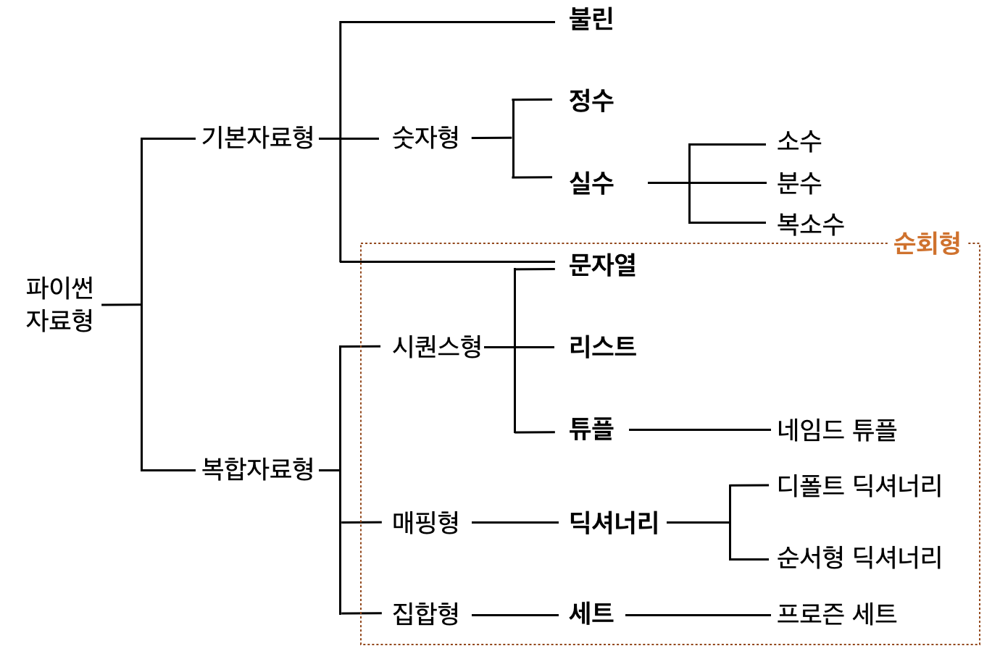
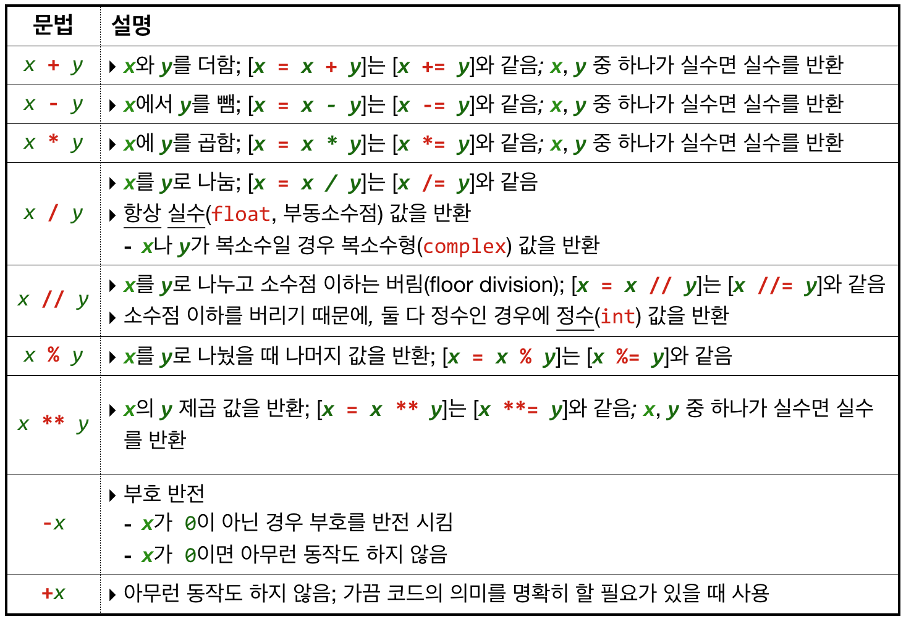
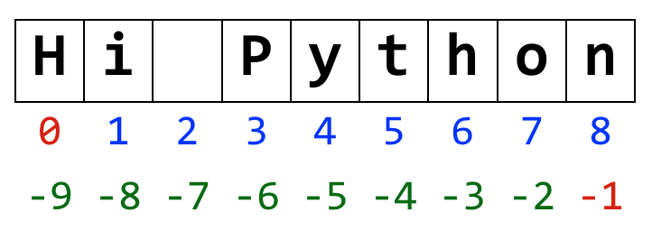
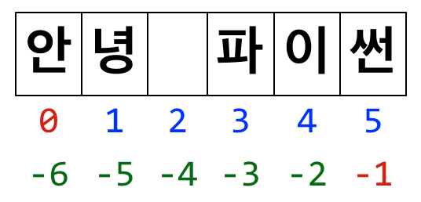

5장: 기본자료형
===

Basic Data Types

***

**박 진 수** 교수    
Intelligent Data Semantics Lab  
Seoul National University

***

<h3>Table of Contents<span class="tocSkip"></span></h3>
<div class="toc"><ul class="toc-item"><li><span><a href="#프로그램-구성-단위" data-toc-modified-id="프로그램-구성-단위-1">프로그램 구성 단위</a></span></li><li><span><a href="#파이썬-프로그램의-기본-구조" data-toc-modified-id="파이썬-프로그램의-기본-구조-2">파이썬 프로그램의 기본 구조</a></span></li><li><span><a href="#파이썬-자료형" data-toc-modified-id="파이썬-자료형-3">파이썬 자료형</a></span><ul class="toc-item"><li><span><a href="#개요" data-toc-modified-id="개요-3.1">개요</a></span></li><li><span><a href="#자료형의-종류" data-toc-modified-id="자료형의-종류-3.2">자료형의 종류</a></span></li><li><span><a href="#따라하기-:-자료형-확인하기" data-toc-modified-id="따라하기-:-자료형-확인하기-3.3">따라하기 : 자료형 확인하기</a></span></li></ul></li><li><span><a href="#불린형" data-toc-modified-id="불린형-4">불린형</a></span><ul class="toc-item"><li><span><a href="#불린형(Boolean-Type)이란?" data-toc-modified-id="불린형(Boolean-Type)이란?-4.1">불린형(Boolean Type)이란?</a></span><ul class="toc-item"><li><span><a href="#따라해보기" data-toc-modified-id="따라해보기-4.1.1">따라해보기</a></span></li></ul></li><li><span><a href="#bool()-클래스" data-toc-modified-id="bool()-클래스-4.2"><code>bool()</code> 클래스</a></span><ul class="toc-item"><li><span><a href="#따라해보기" data-toc-modified-id="따라해보기-4.2.1">따라해보기</a></span></li></ul></li><li><span><a href="#비교-연산자" data-toc-modified-id="비교-연산자-4.3">비교 연산자</a></span><ul class="toc-item"><li><span><a href="#따라해보기" data-toc-modified-id="따라해보기-4.3.1">따라해보기</a></span></li></ul></li><li><span><a href="#논리-연산자" data-toc-modified-id="논리-연산자-4.4">논리 연산자</a></span><ul class="toc-item"><li><span><a href="#따라해보기" data-toc-modified-id="따라해보기-4.4.1">따라해보기</a></span></li><li><span><a href="#최소평가-연산" data-toc-modified-id="최소평가-연산-4.4.2">최소평가 연산</a></span><ul class="toc-item"><li><span><a href="#따라해보기" data-toc-modified-id="따라해보기-4.4.2.1">따라해보기</a></span></li></ul></li><li><span><a href="#논리-연산자-우선-순위" data-toc-modified-id="논리-연산자-우선-순위-4.4.3">논리 연산자 우선 순위</a></span><ul class="toc-item"><li><span><a href="#퀴즈" data-toc-modified-id="퀴즈-4.4.3.1">퀴즈</a></span></li></ul></li></ul></li><li><span><a href="#멤버십-연산자" data-toc-modified-id="멤버십-연산자-4.5">멤버십 연산자</a></span><ul class="toc-item"><li><span><a href="#따라해보기" data-toc-modified-id="따라해보기-4.5.1">따라해보기</a></span></li></ul></li></ul></li><li><span><a href="#숫자형" data-toc-modified-id="숫자형-5">숫자형</a></span><ul class="toc-item"><li><span><a href="#숫자형(Numeric-Data-Types)이란?" data-toc-modified-id="숫자형(Numeric-Data-Types)이란?-5.1">숫자형(Numeric Data Types)이란?</a></span></li><li><span><a href="#정수(Integer-Type)" data-toc-modified-id="정수(Integer-Type)-5.2">정수(Integer Type)</a></span><ul class="toc-item"><li><span><a href="#정수(integers)란?" data-toc-modified-id="정수(integers)란?-5.2.1">정수(integers)란?</a></span></li><li><span><a href="#정수-예시" data-toc-modified-id="정수-예시-5.2.2">정수 예시</a></span></li><li><span><a href="#정수-연산" data-toc-modified-id="정수-연산-5.2.3">정수 연산</a></span><ul class="toc-item"><li><span><a href="#더하기,-빼기,-곱하기" data-toc-modified-id="더하기,-빼기,-곱하기-5.2.3.1">더하기, 빼기, 곱하기</a></span></li><li><span><a href="#나누기" data-toc-modified-id="나누기-5.2.3.2">나누기</a></span></li><li><span><a href="#거듭제곱" data-toc-modified-id="거듭제곱-5.2.3.3">거듭제곱</a></span></li></ul></li><li><span><a href="#정수-연산의-특징" data-toc-modified-id="정수-연산의-특징-5.2.4">정수 연산의 특징</a></span></li><li><span><a href="#산술-연산자-우선-순위" data-toc-modified-id="산술-연산자-우선-순위-5.2.5">산술 연산자 우선 순위</a></span><ul class="toc-item"><li><span><a href="#퀴즈" data-toc-modified-id="퀴즈-5.2.5.1">퀴즈</a></span></li></ul></li><li><span><a href="#증강-할당-연산자-:-x-operator=-y" data-toc-modified-id="증강-할당-연산자-:-x-operator=-y-5.2.6">증강 할당 연산자 : x <em>operator</em>= y</a></span><ul class="toc-item"><li><span><a href="#따라해보기" data-toc-modified-id="따라해보기-5.2.6.1">따라해보기</a></span></li><li><span><a href="#퀴즈" data-toc-modified-id="퀴즈-5.2.6.2">퀴즈</a></span></li></ul></li><li><span><a href="#정리-:-산술-연산자" data-toc-modified-id="정리-:-산술-연산자-5.2.7">정리 : 산술 연산자</a></span></li><li><span><a href="#정수형-변환" data-toc-modified-id="정수형-변환-5.2.8">정수형 변환</a></span><ul class="toc-item"><li><span><a href="#따라해보기" data-toc-modified-id="따라해보기-5.2.8.1">따라해보기</a></span></li></ul></li></ul></li><li><span><a href="#실수(Floating-Point-Numbers)" data-toc-modified-id="실수(Floating-Point-Numbers)-5.3">실수(Floating-Point Numbers)</a></span><ul class="toc-item"><li><span><a href="#실수(float)란?" data-toc-modified-id="실수(float)란?-5.3.1">실수(float)란?</a></span></li><li><span><a href="#실수-예시" data-toc-modified-id="실수-예시-5.3.2">실수 예시</a></span></li><li><span><a href="#실수-연산" data-toc-modified-id="실수-연산-5.3.3">실수 연산</a></span></li><li><span><a href="#실수형-변환" data-toc-modified-id="실수형-변환-5.3.4">실수형 변환</a></span><ul class="toc-item"><li><span><a href="#따라해보기" data-toc-modified-id="따라해보기-5.3.4.1">따라해보기</a></span></li></ul></li></ul></li><li><span><a href="#Lab:-정수와-실수-연산" data-toc-modified-id="Lab:-정수와-실수-연산-5.4">Lab: 정수와 실수 연산</a></span></li><li><span><a href="#정수와-실수에서-자주-사용하는-함수" data-toc-modified-id="정수와-실수에서-자주-사용하는-함수-5.5">정수와 실수에서 자주 사용하는 함수</a></span><ul class="toc-item"><li><span><a href="#정리-:-정수와-실수에서-자주-사용하는-함수" data-toc-modified-id="정리-:-정수와-실수에서-자주-사용하는-함수-5.5.1">정리 : 정수와 실수에서 자주 사용하는 함수</a></span></li></ul></li><li><span><a href="#잠깐-생각하는-코너" data-toc-modified-id="잠깐-생각하는-코너-5.6">잠깐 생각하는 코너</a></span></li></ul></li><li><span><a href="#문자열형(String-Type)" data-toc-modified-id="문자열형(String-Type)-6">문자열형(String Type)</a></span><ul class="toc-item"><li><span><a href="#문자열(String)이란?" data-toc-modified-id="문자열(String)이란?-6.1">문자열(String)이란?</a></span></li><li><span><a href="#문자열-예시" data-toc-modified-id="문자열-예시-6.2">문자열 예시</a></span></li><li><span><a href="#중첩-따옴표" data-toc-modified-id="중첩-따옴표-6.3">중첩 따옴표</a></span></li><li><span><a href="#삼중-따옴표" data-toc-modified-id="삼중-따옴표-6.4">삼중 따옴표</a></span><ul class="toc-item"><li><span><a href="#삼중-따옴표-예시" data-toc-modified-id="삼중-따옴표-예시-6.4.1">삼중 따옴표 예시</a></span></li></ul></li><li><span><a href="#이스케이프-문자" data-toc-modified-id="이스케이프-문자-6.5">이스케이프 문자</a></span><ul class="toc-item"><li><span><a href="#퀴즈" data-toc-modified-id="퀴즈-6.5.1">퀴즈</a></span></li></ul></li><li><span><a href="#로스트링" data-toc-modified-id="로스트링-6.6">로스트링</a></span></li><li><span><a href="#화이트스페이스" data-toc-modified-id="화이트스페이스-6.7">화이트스페이스</a></span></li><li><span><a href="#줄-연결" data-toc-modified-id="줄-연결-6.8">줄 연결</a></span></li><li><span><a href="#문자열-인덱스" data-toc-modified-id="문자열-인덱스-6.9">문자열 인덱스</a></span><ul class="toc-item"><li><span><a href="#문자열-인덱스(index)란?" data-toc-modified-id="문자열-인덱스(index)란?-6.9.1">문자열 인덱스(index)란?</a></span></li><li><span><a href="#문자열-인덱스-예시" data-toc-modified-id="문자열-인덱스-예시-6.9.2">문자열 인덱스 예시</a></span></li></ul></li><li><span><a href="#문자열-분할" data-toc-modified-id="문자열-분할-6.10">문자열 분할</a></span><ul class="toc-item"><li><span><a href="#문자열-분할(slicing)이란?" data-toc-modified-id="문자열-분할(slicing)이란?-6.10.1">문자열 분할(slicing)이란?</a></span></li><li><span><a href="#따라해보기" data-toc-modified-id="따라해보기-6.10.2">따라해보기</a></span></li><li><span><a href="#따라해보기-:-폭(step)-사용해보기" data-toc-modified-id="따라해보기-:-폭(step)-사용해보기-6.10.3">따라해보기 : 폭(step) 사용해보기</a></span></li><li><span><a href="#Lab:-암호-만들기" data-toc-modified-id="Lab:-암호-만들기-6.10.4">Lab: 암호 만들기</a></span></li></ul></li><li><span><a href="#인덱스-접근" data-toc-modified-id="인덱스-접근-6.11">인덱스 접근</a></span></li><li><span><a href="#문자열-수정" data-toc-modified-id="문자열-수정-6.12">문자열 수정</a></span><ul class="toc-item"><li><span><a href="#따라해보기" data-toc-modified-id="따라해보기-6.12.1">따라해보기</a></span></li></ul></li><li><span><a href="#Lab:-문자열-결합과-분할" data-toc-modified-id="Lab:-문자열-결합과-분할-6.13">Lab: 문자열 결합과 분할</a></span></li><li><span><a href="#자주-사용하는-문자열-메소드" data-toc-modified-id="자주-사용하는-문자열-메소드-6.14">자주 사용하는 문자열 메소드</a></span><ul class="toc-item"><li><span><a href="#문자열-분할-메소드" data-toc-modified-id="문자열-분할-메소드-6.14.1">문자열 분할 메소드</a></span><ul class="toc-item"><li><span><a href="#따라해보기" data-toc-modified-id="따라해보기-6.14.1.1">따라해보기</a></span></li></ul></li><li><span><a href="#문자열-결합-메소드" data-toc-modified-id="문자열-결합-메소드-6.14.2">문자열 결합 메소드</a></span><ul class="toc-item"><li><span><a href="#따라해보기" data-toc-modified-id="따라해보기-6.14.2.1">따라해보기</a></span></li></ul></li><li><span><a href="#문자열-삭제-메소드" data-toc-modified-id="문자열-삭제-메소드-6.14.3">문자열 삭제 메소드</a></span><ul class="toc-item"><li><span><a href="#따라해보기" data-toc-modified-id="따라해보기-6.14.3.1">따라해보기</a></span></li></ul></li><li><span><a href="#문자열-교체-메소드" data-toc-modified-id="문자열-교체-메소드-6.14.4">문자열 교체 메소드</a></span><ul class="toc-item"><li><span><a href="#따라해보기" data-toc-modified-id="따라해보기-6.14.4.1">따라해보기</a></span></li></ul></li></ul></li><li><span><a href="#출력-간단히-하기" data-toc-modified-id="출력-간단히-하기-6.15">출력 간단히 하기</a></span></li><li><span><a href="#문자열-서식-:-format()-메소드" data-toc-modified-id="문자열-서식-:-format()-메소드-6.16">문자열 서식 : <code>format()</code> 메소드</a></span><ul class="toc-item"><li><span><a href="#따라해보기-:-위치-전달인자-사용해보기" data-toc-modified-id="따라해보기-:-위치-전달인자-사용해보기-6.16.1">따라해보기 : 위치 전달인자 사용해보기</a></span></li><li><span><a href="#따라해보기-:-키워드-전달인자-사용해보기" data-toc-modified-id="따라해보기-:-키워드-전달인자-사용해보기-6.16.2">따라해보기 : 키워드 전달인자 사용해보기</a></span></li><li><span><a href="#따라해보기-:-자주-사용하는-format()-메소드의-숫자-서식-설정해보기" data-toc-modified-id="따라해보기-:-자주-사용하는-format()-메소드의-숫자-서식-설정해보기-6.16.3">따라해보기 : 자주 사용하는 format() 메소드의 숫자 서식 설정해보기</a></span></li><li><span><a href="#format()-메소드를-활용한-문자열-서식-설정하기" data-toc-modified-id="format()-메소드를-활용한-문자열-서식-설정하기-6.16.4">format() 메소드를 활용한 문자열 서식 설정하기</a></span></li><li><span><a href="#f-string" data-toc-modified-id="f-string-3.5">f-string</a></span></li></ul></li></ul></li><li><span><a href="#Lab:-식사-비용-계산" data-toc-modified-id="Lab:-식사-비용-계산-7">Lab: 식사 비용 계산</a></span></li></ul></div>

# 프로그램 구성 단위

**식별자**(identifier)
- 변수, 함수, 클래스 이름 등
- **예약어**도 식별자(파이썬 키워드, 명령어 등)

**리터럴**(literal)
- 읽혀지는 대로 쓰여있는 값 그 자체

예시:


```python
3
-5.7
'apple'
```

**[참고]**  

**식별자**는 프로그램이 실행되는 동안 다양한 값을 가질 수 있는 이름이지만,   
**리터럴**은 이름이 아니라 값 그 자체다.

예시:


```python
x = 3  # x는 식별자, 즉 변수이고 3은 리터럴이다.
```

**표현식**(expression) 
* 새로운 데이터 값을 생성하거나 계산하는 코드 조각  

예시: 


```python
2 + 5
```


```python
1 + 2 + 3 * (8 ** 9) + abs(-10000)
```


```python
'apple' + 'box'
```


```python
round(81.5)
```


```python
max(3, -2, 12, 15, -37, 52, 78, 94)
```

**명령문**(statement)
- 특정한 작업을 수행하는 코드 전체  

예시:


```python
print(3 + 4)
```


```python
if 3 < abs(-5):
    print(abs(-5))
```

**[참고]**  

**표현식**은 값을 생성하는 일부분이고,   
**명령문**은 특정 작업을 수행하는 코드 전체다.

**함수**(function) 
- 특정 명령을 수행하는 코드 묶음(주로 여러 명령문이 모여 함수가 됨)

**모듈**(module) 
- 함수/클래스의 모음 또는 하나의 프로그램을 구성하는 단위

**패키지**(package)  
- 프로그램과 모듈 묶음
    - 프로그램 : 실행하기 위한 것
    - 모듈 : 다른 프로그램에서 불러와 사용하기 위한 것

**라이브러리**(library) 
- 패키지 모음


# 파이썬 프로그램의 기본 구조

```python
"""This file is provided for educational purpose and distributed for class use.

File name.....: hello.py
Description...: A very simple program which prints 'Hello World'.
"""

# The following code displays "Hello Python" in Korean on the screen.
print('안녕 파이썬')  # print()함수를 호출

# !!!!! END of hello.py !!!!!!!!!!!!!!!!!!!!!!!!!!!!!!!!!!!!!!!!!!!!!!!!!!!!!!!
```

**코드 설명**

줄 앞이나 중간에 `#`을 붙이면 `#` 이후는 주석으로 처리한다.


```python
# The following code displays "Hello Python" in Korean on the screen.
print('안녕 파이썬')  # print()함수를 호출
# !!!!! END of hello.py !!!!!!!!!!!!!!!!!!!!!!!!!!!!!!!!!!!!!!!!!!!!!!!!!!!!!!!
```

중간 중간 빈 줄을 넣으면 코드의 가독성을 높일 수 있다.

파이썬 코드 : 명령문


```python
print('안녕 파이썬')
```

- `print('안녕 파이썬')`는 명령문이다.

- `print()`는 함수다. 
    - '안녕 파이썬'이란 문자열을 출력한다.
    - `print`는 **함수 이름**이다.
    - 괄호 안 '안녕 파이썬'은 **전달인자**(argument)다.

**도움말(help)**

대화형 모드에서 `help()`를 입력하면 파이썬 도움말 유틸리티를 실행할 수 있다.

`help()` 전달인자에 특정 모듈이나 키워드, 주제의 이름을 입력하면 해당하는 도움말을 얻을 수 있다.


```python
help(print)
```

# 파이썬 자료형

## 개요

자료형(data type)은 다음과 같은 정보를 담고 있다.

- 해당 자료형이 가질 수 있는 가능한 값의 종류
- 해당 자료형이 참조하는 데이터(객체)가 컴퓨터 메모리에 저장되는 방식 
- 해당 자료형으로 실행할 수 있는 수학적, 관계적, 논리적 명령의 종류

어떤 명령어들은 자료형에 따라 다른 결괏값을 돌려주기도 한다.

**`+` 연산자의 경우**

- 정수끼리 더하면 정수의 합을 반환하지만 
- 문자열끼리 더하면 문자열 결합을 반환한다.


```python
1 + 2
```


```python
'1' + '2'
```

**`*` 연산자의 경우**
- 정수끼리 곱하면 정수의 곱한 결과 값을 반환하지만
- 문자열을 곱하면 곱한만큼 반복한 문자열 결과 값을 반환한다


```python
2 * 5
```


```python
'2' * 5
```

자료형은 다음 중 하나의 속성을 가진다.

**불변성**(immutable) : 생성한 후 내용의 변경이 불가능하다.
- 예) 불린형, 정수형, 실수형, 문자열형, 튜플형 등

**가변성**(mutable) : 생성한 후 내용의 변경이 가능하다.
- 예) 리스트형, 세트형, 딕셔너리형 등


## 자료형의 종류



***어떤 경우에 무슨 자료형을 선택하면 될까?***

**첫번째 고려 사항 : 이 숫자로 수학적 계산을 할 것인가?**	

예. 계산을 합니다.

답 : 

아니오. 계산을 하지 않습니다.

답 : 

**예시** 

우편번호?

답 : 

제품 가격?

답 :

고객수?

답 :

주민번호?

답 :

전화번호?

답 :

**두번째 고려 사항 : 여러 개의 자료를 저장할 것인가?**

예. 여러 개의 자료를 저장합니다.

답 : 

아니오. 여러 개의 자료를 저장하지 않습니다. 

답 : 

## 따라하기 : 자료형 확인하기


```python
type(True)
```


```python
type(5)
```


```python
type(12.345)
```


```python
type('12.345')
```


```python
type('안녕 파이썬')
```


```python
type(print)
```


```python
type(help)
```


```python
type(list)
```

# 불린형

## 불린형(Boolean Type)이란?

**불변자료형**(immutable)이다.

'거짓'(`False`)과 '참'(`True`) 두 가지 값 중 한 개만 취할 수 있는 논리 자료형이다.

**거짓**(`False`)


```python
False
0
None
''     # 빈 문자열
[]     # 빈 리스트
()     # 빈 튜플
{}     # 빈 딕셔너리
set()  # 빈 세트
```

**참**(`True`)

- 그 외 나머지(`True`, `0`이 아닌 정수 등)

참, 거짓을 숫자로 표현하게 되면...

- `False`는 `0`으로  
- `True`는 `1`로 표현한다.

불린 자료형은 주로 **논리 연산**과 **비교 연산**에서 사용한다.

**논리 연산**


```python
not
and
or
```

**비교 연산**(관계 연산)


```python
==    # 같다
!=    # 다르다
>     # 크다
<     # 작다
>=    # 크거나 같다
<=    # 작거나 크다
```

### 따라해보기

힌트: 참, 거짓을 숫자로 표현하게 되면 `False`는 `0`으로 `True`는 `1`로 표현한다.


```python
11 * False
```


```python
11.0 * False  # 실수와 연산하면 실숫값을 반환한다.
```


```python
11 + True
```


```python
11.0 + True   # 실수와 연산하면 실숫값을 반환한다.
```


```python
int(False)    # False를 정수로 변환한다.
```


```python
float(False)  # False를 실수로 변환한다.
```


```python
int(True)     # True를 정수로 변환한다.
```


```python
float(True)   # True를 실수로 변환한다.
```

## `bool()` 클래스

특정 데이터가 `True`인지 `False`인지를 검증할 때 사용한다.

### 따라해보기


```python
bool(0)
```


```python
bool(0.0)
```


```python
bool(1)
```


```python
bool(-1)
```


```python
bool(10)
```


```python
bool(0.1)
```


```python
bool('')
```


```python
bool([])
```


```python
bool([''])
```


```python
bool([1, 2])
```


```python
bool(())
```

## 비교 연산자

- **관계 연산자**라고도 한다.

- 연산자의 양쪽에 있는 값을 서로 비교한다.
    - 즉, 객체의 메모리 주소(객체참조)가 아닌 객체의 값을 비교한다.

- 주로 숫자 또는 문자열을 비교할 때 사용한다.
    - 문자열의 경우 유니코드 값을 기준으로 비교한다.

- 결과 값을 참(`True`) 또는 거짓(`False`) 형태로 반환하다.


프로그래밍에서 비교 연산자는 수학에서 사용될 때와 조금 다른 형태로 표현한다.

비교 연산자|설명
:-:|:-
***x*** **==** ***y***|***x***와 ***y***가 같은가?
***x*** **!=** ***y***|***x***와 ***y***가 다른가?
***x*** **<** ***y***|***x***가 ***y***보다 작은가?
***x*** **<=** ***y***|***x***가 ***y***보다 작거나 같은가?
***x*** **>** ***y***|***x***가 ***y***보다 큰가?
***x*** **>=** ***y***|***x***가 ***y***보다 크거나 같은가?

### 따라해보기


```python
'a' == 'A'
```


```python
'a' < 'A'
```


```python
'a' <= 'z'
```


```python
5 != 5.0
```


```python
5 > 5.0
```


```python
5 >= 5.0
```

## 논리 연산자

- **불린 연산**에 사용한다.
- **최소평가**(short-circuit) 연산자다.
    - 즉, 두 번째 피연산자는 첫 번째 피연산자가 식의 값을 결정하기에 충분하지 않은 경우에만 실행되거나 평가된다.
    - 그래서 최소평가 연산은 속도가 빠르다.

문법|설명
:-:|:-
**not** ***x***|***x***의 반대를 반환한다. 즉, ***x***가 `False`인 경우 `True`를 반환하고 ***x***가 `True`이면 `False`를 반환한다.
***x*** **and** ***y***|***x***와 ***y***가 모두 `True`여야만 `True`를 반환한다. 최소평가 연산자이기 때문에 ***y***는 ***x***가 `True`인 경우에만 계산한다. 둘 다 `True`여야 `True`를 반환하기 때문에 만약 ***x***가 `False`면 굳이 ***y***를 검사하지 않아도 결과가 `False`이기 때문에 ***y***를 검사하지 않고 바로 `False`를 반환한다. 
***x*** **or** ***y***|***x***와 ***y*** 둘 중 하나라도 `True`면 `True`를 반환한다. 최소평가 연산자이기 때문에 ***y***는 ***x***가 `False`인 경우에만 계산한다. 둘 중 하나만 `True`면 `True`를 반환하기 때문에 만약 ***x***가 `True`면 굳이 ***y***를 검사하지 않아도 결과가 `True`이기 때문에 ***y***를 검사하지 않고 바로 `True`를 반환한다.

### 따라해보기


```python
# --- not
not True
```


```python
not False
```


```python
# --- and
# 좌변이 False라서 우변은 평가하지 않고 False를 반환한다.
False and True
```


```python
# 우변도 True인지 확인하기 위해 우변까지 평가한다.
True and True
```


```python
# --- or 
# 좌변이 True라서 우변은 평가하지 않고 True를 반환하다.
True or False
```


```python
# 좌변이 False라서 우변도 평가한다. 
False or False
```

***최소평가(short-circuit) 연산을 눈으로 확인할 수는 없을까?***

### 최소평가 연산

숫자를 사용해 최소평가(short-circuit) 연산을 증명해 보자.

#### 따라해보기


```python
# --- and
# 좌변이 False(0)라서 우변은 평가하지 않고 False(0)를 반환한다.
0 and 5
```


```python
# 우변도 True인지 확인하기 위해 우변까지 평가한 후 True(5)를 반환한다.
1 and 5
```


```python
# --- or
# 좌변이 True(5)라서 우변은 평가하지 않고 True(5)를 반환하다.
5 or 1
```


```python
# 좌변이 False(0)라서 우변도 확인해서 True(-1)를 반환한다.
0 or -1
```

***한 번에 여러 개의 논리 연산자를 사용할 수 없을까?***

가능하다. 하지만 논리 연산자 사이에 우선 순위가 있다. 

아래 코드를 실행한 결과는?


```python
False and not True or True
```

논리 연산자는 왼쪽에서 오른쪽으로 평가되지 않는다. 즉, 연산 우선 순위가 있다.

### 논리 연산자 우선 순위

1. `not`이 제일 먼저 평가된다.
1. `and`는 그 다음에 평가된다.
1. `or`는 마지막으로 평가된다.

#### 퀴즈


```python
True or not False and False
```


```python
not not True or False and not True
```

## 멤버십 연산자

`in` / `not in` 연산자

- 특정 항목이 속해 있는지 존재 여부를 확인한다.
- 나중에 복합자료형의 리스트에서 상세히 다룬다.

### 따라해보기


```python
2 in [1, 2, 3]
```


```python
1 in ['1', '2', '3']
```


```python
'a' in ['a', 'b', 'c']
```


```python
a in ['a', 'b', 'c']
```

# 숫자형


## 숫자형(Numeric Data Types)이란?

- 일반적으로 수치를 나타내고 수치 연산을 수행하기 위해 사용하는 모든 자료형을 일컫는다.
- **정수**(integer)와 **실수**(float)는 숫자 자료형 중 가장 많이 사용하는 자료형이다.

## 정수(Integer Type)

### 정수(integers)란?

**불변자료형**(immutable)이다.

소수점이 없는 숫자의 조합으로 이루어지며 음수도 포함한다.
- 숫자(digits) : 0, 1, 2, 3, 4, 5, 6, 7, 8, 9

표현법
- 파이썬에서는 `int`로 표현되다.
- 기본적으로 10진수를 사용하지만 2진수, 8진수, 16진수로도 표현할 수 있다.

정수의 크기
- 타 언어와는 달리, 정수의 크기가 컴퓨터의 성능(메모리)에 의해 한정된다.

### 정수 예시


```python
11
```


```python
+123
```


```python
-5
```


```python
0
```

### 정수 연산

#### 더하기, 빼기, 곱하기


```python
9 + 5    # 더하기 연산
```


```python
9 - 5    # 빼기 연산
```


```python
9 * 5    # 곱하기 연산
```

#### 나누기


```python
9 / 5    # 나누기 연산
```

**나누기 연산**의 결괏값은 항상 실수(`float`)이기 때문에 '실수 나누기 연산'이라고도 부른다.


```python
9 // 5   # 몫 구하기 연산
```

**몫 구하기 연산**은 두 수를 나눈 몫을 구한다. 
- 두 수를 나눈 후 몫의 값을 정수로 반환하기 때문에 '정수 나누기 연산'이라고도 부른다.


```python
9 % 5    # 나머지 구하기 연산
```

**나머지 구하기 연산**은 두 수를 나눴을 때 나머지 값을 구한다. 

#### 거듭제곱


```python
2 ** 3  # 거듭제곱 연산(2 ** 3 == 2 x 2 x 2)
```

### 정수 연산의 특징

숫자(피연산자) 중 하나라도 실수면 결괏값은 실수다.


```python
1 + 2.0 + 3 + 4 + 5
```


```python
3.0 - 3 
```


```python
1 * 1.0
```

***한 번에 여러 개의 연산을 할 수 없을까?***
- 예를 들어 ***x*** 더하기 ***y*** 곱하기 ***z***

가능하다. 

다음 코드를 실행한 결과는?


```python
x = 2
y = 3
z = 5

x + y * z
```

왜 25가 아닌가?

산술 연산자 사이에 우선 순위가 있다.

### 산술 연산자 우선 순위

**산술 연산자 우선 순위** 

1. 괄호 `()`
1. 지수 `**`
1. 곱셈, 나눗셈 `*`, `/`
1. 덧셈, 뺄셈 `+`, `-`

#### 퀴즈

```python
x = 2 + 3 * 5
x  # x의 값은 무엇인가?
```


```python
y = (2 + 3) * 5
y  # y의 값은 무엇인가?
```

### 증강 할당 연산자 : x *operator*= y

모든 이진 산술 연산자(`+`, `-`, `*`, `/`, `//`, `%`, `**`)는 각 연산자에 대응하는 증강 할당 연산자가 있다.

증강 할당 연산자(`+=`, `-=`, `*=`, `/=`, `//=`, `%=`, `**=`)를 사용하면 일부 표현식을 줄여 쓸 수 있다. 

즉, 일반식 <***x*** **=** ***x*** ***operator*** ***y***>를 <***x*** ***operator***__=__ ***y***> 형식으로 간편하게 표현할 수 있다. 

예를 들어, `x = x + y` 형식의 표현식이면 `x += y` 형식으로 표현할 수 있다.

좌변의 변숫값을 대체할 때 증강 할당 연산자를 사용하면 일반식보다 더 간단하다.

#### 따라해보기


```python
x = y = 9
```


```python
# 숫자형 변수 x의 값을 바꾼다.
x = x + 2
x  # 이제 x는 9가 아니다.
```


```python
# 더 간단한 방법은 증강 할당 연산자를 사용하는 것이다.
y += 2
y  # 이제 y는 9가 아니다.
```

#### 퀴즈


```python
x = 5
y = 9
```

`x = x + y`를 증강 할당 연산자를 사용해서 계산하시오.

`y = y - x`를 증강 할당 연산자를 사용해서 계산하시오.

`x = x * 2`를 증강 할당 연산자를 사용해서 계산하시오.

`x = x / 2`를 증강 할당 연산자를 사용해서 계산하시오.

변수 ***x***를 5로 나눈 몫을 다시 변수 ***x***에 재할당 하기 위해 증강 할당 연산자를 사용해서 구하시오.

변수 ***y***를 2로 나눈 나머지를 다시 변수 ***y***에 재할당 하기 위해 증강 할당 연산자를 사용해서 구하시오.

### 정리 : 산술 연산자



### 정수형 변환

`int(객체)`

- ***객체***를 정수로 변환한다.
- 변환을 실패하면 `ValueError` 예외가 발생한다.
- 변환한 숫자의 소수점 이하는 버린다. 
    - 즉, 반올림을 하지 않고 절삭한다.

#### 따라해보기


```python
int()
```


```python
int(10)
```


```python
int('  -10   ')
```


```python
int(12.9999)
```


```python
int('12.999')
```

***오류가 나지 않게 형변환을 할 수 있는 방법은 없을까?***


```python
int(float('12.999'))
```

위와 같이 문자열 안에 숫자가 아닌 마침표가 있다면 실수(`float`)로 형변환을 한 후에 정수로 형변환을 해야 오류가 나지 않는다.

## 실수(Floating-Point Numbers)

### 실수(float)란?

**불변자료형**(immutable)이다.

소수점이 있는 숫자의 조합으로 이루어지며 음수도 포함한다.
- 숫자(digits) : 0, 1, 2, 3, 4, 5, 6, 7, 8, 9

표현법

- 파이썬에서는 `float`로 표현하며 **부동소수점수**(floating-point number)라고도 한다.

- 소수점 또는 지수 표현법을 사용한다.
    - 지수 표현법은 숫자, `e`, 숫자에 곱할 10진법의 지수를 이용하는 표현이다.

### 실수 예시


```python
0.0
```


```python
.5
```


```python
4.7
```


```python
-3.5
```


```python
7.9e-4
```

### 실수 연산


```python
3 + 7.0     # 더하기 연산
```


```python
.0 - .2     # 빼기 연산
```


```python
5 * 1.2     # 곱하기 연산
```


```python
3 * 7.0e+1  # 곱하기 연산
```


```python
3.6 / 2     # 나누기 연산
```


```python
3.6 // 2    # 몫 구하기 연산
```


```python
3.6 % 2     # 나머지 구하기 연산
```


```python
2.0 ** 3    # 거듭제곱 연산(2.0 ** 3 == 2.0 x 2.0 x 2.0)
```

### 실수형 변환

`float(객체)`

- ***객체***를 실수로 변환한다.
- 변환을 실패하면 `ValueError` 예외가 발생한다.

#### 따라해보기


```python
float()
```


```python
float(123)
```


```python
float('+1.2345   ')
```


```python
float('  -12.345')
```


```python
float('  -.4528    ')
```


```python
float(-1e-3)
```


```python
float('1e3')
```


```python
float('3.123f')
```


```python
float('-Infinity')
```


```python
float('3.14') / float(-.1)
```


```python
float('False')
```


```python
float(False)
```


```python
float('True')
```


```python
float(True)
```

## Lab: 정수와 실수 연산

정수
1. 정수형 변수 ***a***에 10을 할당한다.
1. ***a***를 2로 나눈 후 그 결과 값을 다시 ***a***에 할당한다.
1. ***a***의 3승을 구한 후 그 결과 값을 변수 ***c***에 할당한다.
1. ***a***와 ***c***를 합한 후 그 결과 값을 출력한다.

실수
5. 실수형 변수 ***b***에 10.0을 할당한다.
1. ***b***에 3을 곱한 후 10을 빼고 그 결과 값을 변수 ***d***에 할당한다.
1. ***d***를 4로 나눈 나머지를 출력한다.

## 정수와 실수에서 자주 사용하는 함수

`abs(x)`

- ***x***의 절댓값을 반환한다.


```python
# 5의 절댓값을 구한다.
abs(5)         
```


```python
# -12의 절댓값을 구한다.
abs(-12)      
```

`divmod(x, y)`

- ***x***를 ***y***로 나눴을 때의 '몫'과 '나머지', 총 두 개의 정수를 반환한다.


```python
# 몫과 나머지를 구한다.
divmod(13, 7)  
```


```python
# 몫과 나머지를 따로 변수에 할당해서 처리할 수 있다.
x, y = divmod(13, 7)
```


```python
x  # 몫의 값을 확인한다.
```


```python
y  # 나머지의 값을 확인한다.
```

`pow(x, y)`

- ***x***를 ***y***번 곱한 값을 구한다
- 즉, `x ** y`와 같다.


```python
pow(2, 3)  # 2 x 2 x 2
```

`pow()` 함수의 전달인자가 앞의 예처럼 두 개가 아니라 세 개면 전혀 다른 결괏값을 계산한다.

`pow(x, y, z)`

- ***x***를 ***y***번 곱한 값을 구한 후 ***z***로 나누어 나머지 값을 구한다.
- 즉, `(x ** y) % z`와 같다.


```python
pow(2, 3, 5)
```

`round(x, n)`
- 반올림한 결과를 반환한다.
- ***n***이 양의 정수면 ***x***를 소수점 ***n***자리로 반올림하여 반환하며, 
- ***n***이 음의 정수면 ***x***를 ***n***의 절댓값 자리에서 반올림하여 반환한다.

- 만약 ***n***이 생략되거나 **0**이면, 소수점 **0**자리로 반올림하기 때문에 소수점 이하를 모두 반올림하는 것과 같다.
- `round()` 함수가 반환하는 값의 자료형은 ***x***와 같다.
    - 즉, ***x***가 정수면 정수를 반환하고 실수면 실수를 반환한다.


```python
round(1.23546, 1)
```


```python
round(1.23546, 2)
```


```python
round(1.23546, 3)
```


```python
round(123546, -2)
```


```python
round(123546, -3)
```


```python
round(123546.789, -3)
```

### 정리 : 정수와 실수에서 자주 사용하는 함수


## 잠깐 생각하는 코너

휴대폰의 계산기나 파이썬을 이용해서 다음 내용을 따라 해보자.

* * *
1. 먼저 세 자리 숫자를 마음 속으로 생각한다.
1. 생각한 숫자에 7을 곱한다.
1. 그 숫자에 다시 11을 곱한다.
1. 그 숫자에 다시 13을 곱한다.
1. 어떤 결과가 나왔나?
* * *

7 x 11 x 13 = 1,001 이다.  

이제 왜 그런 결과가 나왔는지 알겠나요?  

처음부터 1001을 곱했다면 결말을 예상하기 쉬웠겠죠!!!

프로그래밍을 할 때도 종종 이런 결정을 내려야 할 때가 있다.

- 한 줄에 여러 연산을 작성할 것인지

- 한 줄에 하나의 연산만 작성할 것인지…

이에 따라 프로그램 코드의 가독성은 높아지기도 낮아지기도 한다.


```python
print(str(int(str(3+8)*3)*9)*2)
```


```python
x = 3 + 8  # 11
y = str(x) * 3  # '111111'
z = int(y) * 9  # 999999
k = str(z) * 2  # '999999999999'

print(k)
```

앞 두 셀의 코드는 정확하게 같은 동작을 한다.

다만... 

- 첫 번째 셀의 코드는 어떤 연산을 하는 것이지 이해하기가 매우 어렵지만,

- 두 번째 셀의 코드는 단계별로 따라가기가 쉽다.

물론 때로는 두 번째 셀과 같이 작성한 코드가 오히려 가독성을 해치기도 한다.

과유불급(過猶不及). 뭐든지 적당한게 좋겠죠?

# 문자열형(String Type)

## 문자열(String)이란?

**불변자료형**(immutable)이다.

- 따라서 내용을 변경할 수도 없고, 문자의 순서를 바꿀 수도 없다.

시작과 끝을 따옴표로 묶어서 만든 순서가 있는 유니코드 글자(부호)의 배열이다.
- **시퀀스형**(sequence type) 자료 구조 중 하나다.
- '순서형'이라고도 부른다.

문자열 리터럴을 생성하기 위해서는 작은 따옴표 (' … ') 또는 큰 따옴표 (" … ")를 사용한다.

## 문자열 예시


```python
'안녕 파이썬'
```


```python
"안녕 파이썬"
```


```python
print('안녕 파이썬')
```


```python
print("안녕 파이썬")
```


```python
'안녕 파이썬"
```

작은따옴표로 시작했으면 작은따옴표로 끝나야 하고, 큰따옴표로 시작했으면 큰따옴표로 끝나야 한다. 

만약 작은따옴표로 시작해서 큰따옴표로 끝나면(또는 그 반대) 오류가 난다.


```python
안녕 파이썬
```

따옴표를 생략해도 오류가 난다.

3~4장에서 설명했듯이 따옴표로 묶지 않은 문자는 **변수 이름**으로 인식한다.

## 중첩 따옴표

**중첩 따옴표**란 따옴표 안에 따옴표를 표현하는 것이다.


```python
print('문자열 안에 '작은 따옴표'를 사용하려면 어떻게 하나요?')
```

작은 따옴표가 들어 있는 경우는 큰 따옴표로 문자열을 생성하면 된다.


```python
print("문자열 안에 '작은 따옴표'를 사용하려면 큰 따옴표로 묶는다.")
```

큰 따옴표가 들어 있는 경우는 작은 따옴표로 문자열을 생성하면 된다.


```python
print('문자열 안에 "큰 따옴표"를 사용하려면 작은 따옴표로 묶는다.')
```

이스케이프 문자인 역슬래시(`\`)를 사용하면 따옴표를 문자열 리터럴을 생성하는 특수문자가 아닌 일반 문자열로 표현하는 것이 가능하다.

**[참고]**  
- 윈도우용 한글 키보드는 '`₩`'가 '`\`'와 같은 기능을 한다. 하지만 이 책에서는 '`₩`' 대신 '`\`'를 하기로 한다.


```python
print('문자열 안에 같은 \'따옴표\'를 사용하려면 이스케이프 문자를 사용한다.')
```


```python
print("문자열 안에 같은 \"따옴표\"를 사용하려면 이스케이프 문자를 사용한다.")
```

## 삼중 따옴표

**삼중 따옴표**란 따옴표를 3개(triple quotes) 사용하는 것이다.
- 작은 따옴표 3개(''' ... ''') 또는 큰 따옴표 3개(""" ... """)를 사용한다. 

### 삼중 따옴표 예시


```python
'''안녕 파이썬'''
```


```python
"""안녕 파이썬"""
```


```python
print('''안녕 파이썬''')
```


```python
print("""안녕 파이썬""")
```

따옴표 안에 따옴표를 넣을 때 일일이 역슬래시(`\`)를 넣어주지 않아도 된다.


```python
print('''문자열 안에 '작은 따옴표'나 "큰 따옴표"를 사용할 수 있다.''')
```

문자열 리터럴을 여러 줄에 나눠 입력할 때 편리하다.


```python
print('''안녕
파이썬''')
```


```python
print('안녕
      파이썬')
```

삼중따옴표를 사용하면...


```python
print('''문자열 안에 '작은 따옴표'나 
"큰 따옴표"를 사용할 수도 있고
여러 줄을 사용할 때도 편리하다.''')
```

## 이스케이프 문자

탈출(escape) 문자라고도 하며 역슬래시(`\` 또는 `₩`)로 시작한다.

이스케이프 문자인 역슬래시(\\)는 역슬래시 바로 다음에 따라오는 문자를 원래 의미가 아닌 특별한 의미로 처리해야 할 때 사용하는 문자다.

`\n` : 문자 'n'으로 처리하지 않고 '새줄바꿈'(newline)으로 처리한다.
- 새줄바꿈 문자 : 한 줄의 끝남을 표시하는 문자로 '개행 문자' 또는 'EOL(end-of-line)'과 같은 뜻이다.


```python
print('첫 번째 줄\n두 번째 줄\n세 번째 줄')
```

`\t` : 문자 't'로 처리하지 않고 '탭(tab)' 문자로 처리한다.


```python
print('첫 번째 칸\t두 번째 칸\t세 번째 칸')
```

`\'` : 작은 따옴표를 파이썬 문자열 리터럴을 생성하는 특수 문자로 사용하지 않고 일반적으로 알려진 작은 따옴표 문자로 처리한다.


```python
print('작은 따옴표 안에 \'작은 따옴표\'를 사용할 수 있다.')
```

`\"` : 큰 따옴표를 파이썬 문자열 리터럴을 생성하는 특수 문자로 사용하지 않고 일반적으로 알려진 큰 따옴표 문자로 처리한다.


```python
print("큰 따옴표 안에 \"큰 따옴표\"를 사용할 수 있다.")
```

`\\n` : 화이트스페이스인 새줄바꿈 문자로 처리하지 말고 일반 문자인 '\\n'로 처리


```python
print('\n')  # 새줄바꿈을 두 번 한다.
```


```python
print('\\n')  # '\n'을 출력하고 새줄바꿈을 한 번 한다.
```

### 퀴즈

`print()` 함수를 한번만 사용해서 다음 문장을 3가지 방법으로 출력하시오.

```code
President Barack Obama said, 
 "Don’t just play on your phone, 
    program it."
```    

**[참고]**
- 두 번째 줄 첫 시작에 빈 공백 한 개를 삽입한다.
- 세 번째 줄 첫 시작에 탭 한 개 삽입한다.

1. 삼중 따옴표로 문자열 생성하시오.
1. 작은 따옴표로 문자열 생성하시오.
1. 큰 따옴표로 문자열 생성하시오.

## 로스트링


***문자열 내에서 역슬래시(`\`)가 이스케이프 문자가 아니라 원래 의미인 역슬래시 문자라면?***


```python
print('C:\home\nations')
```

역슬래시 앞에 이스케이프 문자를 넣어 역슬래시를 이스케이프 문자로 처리하지 말고 일반 문자인 '\\'로 처리하면 된다.


```python
print('C:\home\\nations')
```

***그런데 문자열 내에 역슬래시 문자를 많이 사용해야 한다면?***


```python
print('C:\home\nations\name\nationality\nature')
```


```python
print('C:\home\\nations\\name\\nationality\\nature')
```

다수의 역슬래시를 사용해야 해서 코드가 매우 복잡해질 수 있다.

이런 경우 **로스트링**(raw string)을 사용하면 된다.


```python
print(r'C:\home\nations\name\nationality\nature')
```

**로스트링**(raw string)이란?

- 문자열을 나타내는 첫 따옴표 앞에 `r`을 붙여
- 해당 문자열 내부의 모든 문자는 있는 그대로 인식하게 한다.
- 따라서, 걱정없이 이스케이프 문자를 마음껏 사용할 수 있다.

```python
print('\t첫 번째 줄\n두 번째 줄\n\t세 번째 줄')
```

```python
print(r'\t첫 번째 줄\n두 번째 줄\n\t세 번째 줄')
```

## 화이트스페이스

**화이트스페이스**(whitespace)란?

화면상으로는 표시되지 않지만 컴퓨터 모니터 화면이나 프린터 등과 같은 출력 장치를 제어하는 문자를 말한다.

공백문자(`' '`), 새줄바꿈(`'\n'`), 탭(`'\t'`), 캐리지 리턴(`'\r'`), 수직탭(`'\v'` 또는 `'\x0b'`), 페이지 넘기기(`'\f'` 또는 `'\x0c'`) 등이 있다.

파이썬이 사용하는 화이트스페이스를 확인하려면...


```python
import string
string.whitespace
```

화이트스페이스 문자의 역할은 `print()` 함수를 사용해서 텍스트 형식으로 출력해보면 쉽게 알 수 있다. 


```python
x = '\t일\n월\n화\n수\n목\n금\n\t토'
```


```python
x         # 대표 형식으로 출력한다.
```


```python
print(x)  # 텍스트 형식으로 출력한다.
```

## 줄 연결

**줄 연결**(line continuation)이란?

긴 코드를 여러 줄에 나눠 작성하는 방법이다.

컴퓨터 화면의 너비는 제한적이기 때문에 코드가 너무 길면 스크롤 없이 보기가 불편 할 뿐만 아니라 출력할 때도 매우 번거롭다.

이처럼 긴 문장을 작성해야 할 경우 한 줄에 모두 작성하는 것보다 여러 줄에 나누어 작성하는 것이 좋다.

뿐만 아니라 [PEP 8 파이썬 코드 스타일 가이드](https://www.python.org/dev/peps/pep-0008/#maximum-line-length)은 한 줄에 최대 79자로 제한할 것을 권고하고 있다.

**줄 연결**을 사용하면 지나치게 긴 문장을 여러 줄에 나눠 작성하는 것이 가능한다.

문장을 여러 줄에 나누어 작성하는 방법으로는 두 가지가 있다.

1. **소괄호** `()`를 사용(권장하는 방법)
1. **역슬래시** `\`를 사용해서 새줄바꿈을 방지(탈출)


```python
# 줄 연결은 소괄호 사용을 권장한다.
(2 * 3
+ 4)
```


```python
# 역슬래시는 권장하지 않는 방식이다.
2 * 3 \
+ 4
```


```python
x = ('소괄호를 사용하면 여러 줄로 작성한 문자열을 간편하게 합할 수 있다. '
     '표현식으로 이루어지기 때문에 깔끔하게 보인다.')
print(x)
```


```python
y = '이스케이프 문자인 역슬래시를 사용해서 여러 줄로 작성한 문자열을 ' \
    '합할 수도 있지만 PEP 8 파이썬 코드 스타일 가이드에서 추천하지 않는다.'
print(y)
```

## 문자열 인덱스

문자열은 **시퀀스형**(sequence) 자료 구조다.

**문자열**은 각 **문자**의 위치가 정해져 있는 즉, 순서가 있는 문자의 배열이다.
- 문자는 말 그대로 한 개의 문자를 뜻한다
- 문자가 순서를 가지고 정해진 위치에 들어가게 되면 문자의 배열인 문자열을 생성하게 된다.

### 문자열 인덱스(index)란?





인덱스는 문자열 배열 안에서 각 값의 위치다.
- 첫 문자의 인덱스 : `[0]`

- 마지막 문자의 인덱스 : `[n - 1]` 또는 `[-1]`
    - `n` = 문자열의 전체 크기
    - 인덱스 `[-1]`을 사용하면 항상 마지막 문자를 찾을 수 있으므로 매우 유용하다.

`IndexError` 예외
- 문자열 범위를 벗어난 인덱스나 빈 문자열에 접근하려고 하면 `IndexError` 예외가 발생한다.

### 문자열 인덱스 예시


```python
s = '안녕 파이썬'
```


```python
s[0]   # '안녕 파이썬'
```


```python
s[2]   # '안녕 파이썬'
```


```python
s[6]   # '안녕 파이썬'
```


```python
s[-1]  # '안녕 파이썬'
```


```python
s[-3]  # '안녕 파이썬'
```


```python
s[-6]  # '안녕 파이썬'
```


```python
s[-7]  # '안녕 파이썬'
```

***문자 한 개 이상 여러 개를 한꺼번에 가져올 수는 없을까?***

***예를 들어, '안녕 파이썬'에서 '파이썬'을 한 번에 추출할 수는 없을까?***

가능하다.


```python
s[3:]  # '안녕 파이썬'
```

**인덱스**는 문자를 한 개씩만 가져올 수 있지만, 

문자열 **분할** 연산자를 사용하면 문자열의 일부 또는 전부를 추출할 수 있다.

## 문자열 분할

### 문자열 분할(slicing)이란?

분할 연산자 `[ : ]` 또는 `[ : : ]`를 사용하여 문자열의 일부 또는 전부를 추출하는 것을 말한다.

**`문자열[시작번호:끝번호]`**

***문자열***의 ***시작번호***부터 ***끝번호*** 바로 앞까지의 문자를 추출한다. 
- ***끝번호***에 해당하는 문자는 **포함하지 않는다**.

***시작번호***와 ***끝번호***는 생략할 수 있다.
- ***시작번호***를 생략하면 기본 값인 **0**에서 시작한다.
- ***끝번호***를 생략하면 ***문자열***의 마지막 문자까지 추출한다.
    - 즉, 기본 값인 `len(문자열)`까지 추출하는 것과 같은 결과다.

따라서, ***시작번호***와 ***끝번호***를 모두 생략하면 대상 ***문자열*** 전체를 가져오게 된다.
- `문자열[:]`은 `문자열[0:len(문자열)]`과 같다.

### 따라해보기


```python
s = 'abcde 12345'  # len(s) = 11
```


```python
s[0:len(s)]        # 'abcde 12345'
```


```python
s[:]               # 'abcde 12345'
```


```python
s[2:-1]            # 'abcde 12345'
```


```python
s[2:]              # 'abcde 12345'
```


```python
s[-7:]             # 'abcde 12345'
```


```python
s[-1:]             # 'abcde 12345'  
```

**`문자열[시작번호:끝번호:폭]`**

***폭***(step)은 설정한 숫자만큼씩 건너 뛰며 추출한다. 

***폭***의 기본값은 1이다. 따라서, ***폭***을 생략하면 1이기 때문에 문자열 시작부터 끝의 바로 앞에 있는 모든 문자를 추출한다.


```python
s[:]             # 'abcde 12345'  
```


```python
s[::]            # 'abcde 12345'  
```


```python
s[::1]           # 'abcde 12345'  
```

***만약 폭(step)이 음의 정수라면?***

***폭***이 음수라면 문자열의 시작과 끝이 바뀌어 뒤쪽 끝에서 출발해서 앞쪽으로 폭만큼 건너뛰면서 문자를 추출한다. 


```python
s[::-1]           # 'abcde 12345'  
```

### 따라해보기 : 폭(step) 사용해보기


```python
s[::2]      # 'abcde 12345'  
```


```python
s[::-2]     # 'abcde 12345'  
```


```python
s[:-4:3]    # 'abcde 12345'[0:-4:3]와 같다.
```


```python
s[:4:-2]    # 'abcde 12345'[-1:4:-2]와 같다.
```


```python
s[2:4:-2]   # 'abcde 12345'  
```

***문자열 분할 연산으로 어떤 것을 할 수 있을까?***

분할 연산자로 문자열을 분할해서 합치면 간단한 암호 작성을 만들 수 있다. 


```python
text = 'Hello' + 'Python'
x = text[1::2]  # 문자열 중 짝수에 위치한 문자만 추출한다.
y = text[::2]   # 문자열 중 홀수에 위치한 문자만 추출한다.
z = x + y       # 문자열 중 짝수에 위치한 문자 묶음 다음에 홀수에 위치한 문자 묶음을 결합한다.

print(z)        # 암호화된 문자를 출력한다.
```

### Lab: 암호 만들기


앞서 배운 암호 작성술로 “무궁화꽃이피었습니다”를 암호화 해보자.

## 인덱스 접근


```python
s[11]    # 'abcde 12345'  
```

범위를 벗어난 인덱스에 접근하면 예외가 발생한다.

하지만...

분할 연산자를 사용하면 범위를 벗어난 인덱스에 접근해도 오류가 나지 않는다.


```python
s[11:]   # 'abcde 12345'  
```


```python
s[10:11]  # 'abcde 12345'  
```


```python
s[6:99]  # 'abcde 12345'  
```

## 문자열 수정

문자열은 **불변자료형**이기 때문에 문자열의 일부를 교체/추가/삭제 할 수 없다.

- 불변자료형(immutable) : 일단 값을 생성한 후에는 일부나 전부를 변경할 수 없는 자료형을 말한다. 따라서 수정이 불가능하다.

문자열의 일부분을 다른 문자열로 교체하거나 문자를 추가 또는 삭제하면 예외가 발생한다.


```python
s = 'Python'
s[1] = 'i'  # Pithon으로 변경
```

그러나...

앞서 실습에서 했듯이, 문자열 분할 연산자를 사용해서 필요한 문자만 추출한 후 `+` 연산자로 결합하면 된다.

그리고 기존 변수에 새로 결합한 문자열을 재할당하면 

마치 기존 문자열을 새로운 문자열로 바꾼 것과 같은 효과를 볼 수 있다.

### 따라해보기


```python
s = '초급자를 위한 파이썬'
len(s)
```


```python
# '초급자를 위한 파이썬'
s[0] = '중'  # 첫 문자를 '중'으로 대체한다. => 예외 발생!!!
```


```python
# '초급자를 위한 파이썬'
s = '중' + s[1:]
print(s)
```


```python
# '중급자를 위한 파이썬'
s = s[:8] + '재미있는 ' + s[8:]
print(s)
```

## Lab: 문자열 결합과 분할

1. 'I', 'love', 'Python' 세 개의 문자열을 변수 ***s1***, ***s2***, ***s3***에 순서대로 할당한다.
1. 이 세 개의 문자열을 결합(concatenation)해서 'I love Python'이란 문자열을 만든 후 이를 변수 ***s4***에 할당하고 ***s4***의 값을 출력한다.
1. 분할 연산자를 사용해서 ***s4***로부터 'I love' 문자열만 추출한 후 그 결과 값을 ***s4***에 다시 할당한다.
1. 결합 연산자를 사용해서 ***s4***와 'programming'이란 문자열을 결합한 후 그 결과 값인 'I love programming'을 새로운 변수인 ***s5***에 할당한 후 ***s5***의 값을 출력한다.

## 자주 사용하는 문자열 메소드

### 문자열 분할 메소드

**`문자열.split(sep=None, maxsplit=-1)`**

**`문자열.rsplit(sep=None, maxsplit=-1)`**

이 두 메소드는 문자열을 **리스트** 형태로 반환한다. 

특징은 다음과 같다.

- `split()` 메소드는 `sep`를 기준으로 문자열을 왼쪽부터 나눈 후 리스트 형태로 반환한다. 

- `rsplit()` 메소드는 `sep`를 기준으로 문자열을 오른쪽부터 나눈 후 리스트 형태로 반환한다.

- `sep`는 **구분자**로 문자열을 분할할 때의 기준이다. 
    - 구분자 `sep`를 생략하면 기본값인 화이트스페이스 문자 기준으로 분할한다. 
    - 구분자 `sep`는 반환하는 리스트에 포함되지 않는다.

- `maxsplit`는 최대 분할 값으로 이 값만큼만 구분자 `sep`로 분할한다. 
    - 만약 문자열에서 구분자 `sep`의 개수가 최대 분할 값 `maxsplit`보다 작다면 구분자 `sep`를 기준으로 모두 분할한다. 
    - 최대 분할 값 `maxsplit`을 생략하거나 기본값인 `-1`이 주어지면 구 분자 `sep`만큼 모두 분할한다.

#### 따라해보기


```python
kor = '파이썬을 배우면서 파이썬을 즐기자!!!'
```


```python
# 기본값은 화이트스페이스 문자 기준으로 모두 분할해서 리스트로 반환한다.
kor.split()              
```


```python
# --- '파이썬을 배우면서 파이썬을 즐기자!!!'
# '을' 기준으로 모두 분할한다.
'파이썬을 배우면서 파이썬을 즐기자!!!'.split('을')  # split(sep='을')와 같다.        
```


```python
# --- '파이썬을 배우면서 파이썬을 즐기자!!!'
# '을' 기준으로 오른쪽부터 한 번만 분할한다.
kor.rsplit('을', 1)  # rsplit(sep='을', maxsplit=1)와 같다.  
```


```python
# --- '파이썬을 배우면서 파이썬을 즐기자!!!'
# 화이트스페이스 문자 기준으로 왼쪽부터 두 번만 분할한다.
kor.split(maxsplit=2)   
```


```python
# --- '파이썬을 배우면서 파이썬을 즐기자!!!'
# 화이트스페이스 문자 기준으로 오른쪽부터 한 번만 분할한다.
kor.rsplit(maxsplit=1)  
```


```python
eng = 'Introduction to Python'
```


```python
# 화이트스페이스 문자 기준으로 오른쪽부터 모두 분할한다.
eng.rsplit()
```


```python
# --- 'Introduction to Python'
# 't' 기준으로 왼쪽부터 두 번만 분할한다.
eng.split(sep='t', maxsplit=2)
```


```python
# --- 'Introduction to Python'
# 'o'를 기준으로 오른쪽부터 한 번만 분할한다.
eng.rsplit('o', maxsplit=1)
```


```python
# --- 'Introduction to Python'
# 'o'를 기준으로 오른쪽부터 모두 분할한다.
eng.rsplit('o')  # eng.split('o')와 결과는 같다.
```

**[주의]**  

지정한 구분자 `sep`가 문자열의 맨 끝에 있으면 반환하는 리스트의 마지막에 빈 문자열을 포함한다.  

`split()`는 구분자를 기준으로 양쪽을 반환하는데 구분자의 오른쪽에 아무 것도 없기 때문에 오른쪽 끝은 빈 문자열로 반환한다.


```python
'Introduction to Python'.split('n')
```


```python
'두 줄입니다\n'.split('\n')
```

**[주의]**  

구분자 `sep`를 지정하지 않았다면, 연속적으로 있는 화이트스페이스를 하나의 구분자로 취급한다.   

따라서 빈 문자열이나 화이트스페이스로만 이루어져 있는 문자열은 빈 리스트를 반환한다.


```python
'  \t   \n  \n\t   \t  '.split()
```


```python
'                      '.split()
```


```python
''.split()
```


```python
'   1   2   3   '.split()
```


```python
'  \t 1  \n  2\n\t   \t3  '.split()
```

**중요!!!**


< 바로 쓰는 파이썬: 기초 편 >의 [부록 3 - 유용한 문자열 메소드](https://github.com/snu-python
/pythonbook/blob/master/Appendix3%20String%20Methods.pdf)는 **시험 범위에 포함되기 때문에 반드시 학습**해야 합니다.
- <https://github.com/snu-python/pythonbook>

### 문자열 결합 메소드

**`결합문자열.join(순회형)`**

특징은 다음과 같다.

- 여러 문자열을 한꺼번에 연결할 때 사용하며, ***순회형*** 자료를 ***결합문자열***로 결합해서 문자열 한 개로 반환하는 함수다.

- ***결합문자열***은 문자열을 결합할 때 사용하는 문자열이다.

- ***순회형***(iterable)은 순회 또는 반복이 가능한 자료형으로 문자열, 리스트, 튜플, 딕셔너리, 세트 등이 있다. 
    - 순회형의 문자열들을 ***결합문자열***로 결합해서 하나의 문자열로 반환하기 때문에 순회형의 모든 객체들은 반드시 문자열이어야 한다.

#### 따라해보기


```python
instruments = ['drum', 'guitar', 'bass', 'keyboard']
```


```python
# 리스트의 모든 문자열 객체를 공백문자로 결합한다.
' '.join(instruments) 
```


```python
# --- instruments = ['drum', 'guitar', 'bass', 'keyboard']
# 리스트의 모든 문자열 객체를 빈 문자열로 결합한다.
''.join(instruments) 
```


```python
# --- instruments = ['drum', 'guitar', 'bass', 'keyboard']
# 리스트의 모든 문자열 객체를 쉼표와 공백문자로 결합한다.
', '.join(instruments) 
```


```python
# --- instruments = ['drum', 'guitar', 'bass', 'keyboard']
# 리스트의 모든 문자열 객체를 '=><=' 결합문자열로 결합한다.
'=><='.join(instruments) 
```


```python
# --- instruments = ['drum', 'guitar', 'bass', 'keyboard']
# 리스트의 모든 문자열 객체를 역순으로 해서 '+' 결합문자열로 결합한다.
' + '.join(reversed(instruments))
```


```python
# 리스트 안에 문자열이 아닌 숫자 정수가 들어있다.
'+'.join(['파이썬', 5])
```

### 문자열 삭제 메소드

**`문자열.strip([삭제할-문자-세트])`**

**`문자열.lstrip([삭제할-문자-세트])`** 

**`문자열.rstrip([삭제할-문자-세트])`**

이 세 메소드는 ***문자열***에서 ***삭제할-문자-세트***를 제거한 문자열을 반환하는 함수다.

특징은 다음과 같다.

- `strip()`은 ***삭제할-문자-세트***를 ***문자열***의 양쪽 끝부터 삭제한 문자열을 반환한다.

- `lstrip()`은 ***삭제할-문자-세트***를 ***문자열***의 왼쪽 끝부터 삭제한 문자열을 반환한다.

- `rstrip()`은 ***삭제할-문자-세트***를 ***문자열***의 오른쪽 끝부터 삭제한 문자열을 반환한다. 

- ***삭제할-문자-세트***는 삭제할 문자들의 집합으로 ***문자열***의 끝부터 ***삭제할-문자-세트***에 포함되지 않은 문자에 도달할 때까지 계속 삭제한다. 

- 이때 ***삭제할-문자-세트***에 포함된 모든 문자를 ***문자열***에서 삭제하기 때문에 ***삭제할-문자-세트***에 포함된 문자의 순서는 중요하지 않다. 

- 만약 ***삭제할-문자-세트***를 지정하지 않으면 기본값인 화이트스페이스 문자를 ***문자열***에서 삭제한다.

#### 따라해보기


```python
s = '\t 초급자를\n위한 파이썬!!!'
```


```python
# 문자열 양쪽 끝부터 화이트스페이스 문자를 삭제한다.
s.strip()
```


```python
# --- '\t 초급자를\n위한 파이썬!!!'
# 문자열 왼쪽 끝부터 화이트스페이스 문자를 삭제한다.
s.lstrip()
```


```python
# --- '\t 초급자를\n위한 파이썬!!!'
# 문자열 오른쪽 끝부터 화이트스페이스 문자를 삭제한다.
s.rstrip()
```


```python
# --- '\t 초급자를\n위한 파이썬!!!'
# 문자열 양쪽 끝부터 '\t'와 '!' 문자를 삭제한다.
s.strip('!\t')
```


```python
# --- '\t 초급자를\n위한 파이썬!!!'
# 문자열 양쪽 끝부터 '\t', '!', 공백문자를 삭제한다.
s.strip('! \t')
```


```python
# 문자열의 양쪽 끝부터 'goPniR'에 포함된 문자를 삭제한다.
'Right way to Python'.strip('goPniR') 
```

### 문자열 교체 메소드

**`문자열.replace(기존-부분문자열, 새로운-부분문자열[, 교체횟수])`**

특징은 다음과 같다.

- ***문자열*** 중 ***기존-부분문자열***을 모두 ***새로운-부분문자열***로 교체한 새 문자열을 반환한다.

- 선택 사항인 ***교체횟수***(count)를 지정하면, 그 ***교체횟수***만큼만 교체한 새 문자열을 반환한다.

- ***부분문자열***이란 ***문자열***의 일부 또는 전부를 뜻한다.

#### 따라해보기


```python
# 문자열에 '초'가 있으면 '중'으로 교체한다.
'초급자를 위한 파이썬'.replace('초', '중') 
```


```python
# 소문자 'o'를 대문자 'O'로 두 번만 교체한다.
'I love Python programming'.replace('o', 'O', 2)
```

## 출력 간단히 하기

다음 코드는 출력 결과는 간단하지만 출력하는 방법은 복잡하다.


```python
x = 3
y = 5
z = 19

print(str(x) + ' \u00d7 ' + str(y) + ' = ' + str(z) + ' (' + str(x * y == z) + ')')
```

하지만...

`문자열.format()` 메소드를 이용하면 출력을 편하게 할 수 있다.


```python
print('{} \u00d7 {} = {} ({})'.format(x, y, z, x * y == z))
```

다음에 배울 `for` 순환문에서 `format()`을 사용하면 출력을 간편하게 할 수 있다.


```python
for i in range(1, 10):
    print('{} \u00d7 {} = {}'.format(i, 5, i * 5))
```

## 문자열 서식 : `format()` 메소드

**`문자열.format(*위치-전달인자, **키워드-전달인자)`**

특징은 다음과 같다.

- ***문자열***의 서식 설정 혹은 포맷과 관련된 작업을 실행한다. 

- 대체 필드(replacement field)란 ***문자열*** 안의 특정 값을 바꿔야 할 때 사용한다. 
    - `{ }`로 표시한다.

- 이 메소드를 호출하는 ***문자열***은 문자열 리터럴과 대체 필드를 포함할 수 있다. (예, **'바로 쓰는 {}'**.format('파이썬')) 

- 각 대체 필드를 `format()` 메소드의 전달인자로 대체한 새 문자열을 반환한다.
    - 전달인자(argument)란 `format()` 메소드의 소괄호 안으로 전달되는 값이나 변수를 말한다. (예, '바로 쓰는 {}'.format(**'파이썬'**))

- 각 대체 필드에는 ***위치-전달인자***의 인덱스 번호나 ***키워드-전달인자***의 키워드 식별자가 들어 있다.

- ***위치-전달인자***를 사용한다면 대체 필드인 `{ }` 안에 전달인자의 위치를 알려주는 인덱스 번호(0, 1, ...)가 들어간다. 
    - 단, 파이썬 버전 3.1 이후부터는 인덱스 번호를 생략할 수 있다.

- ***위치-전달인자***(positional argument)란 앞에 키워드 식별자가 없는 전달인자를 말한다. 
    - 예를 들어 *문자열*.format(***'A4', 50, False***)같은 것이 이에 해당한다. 
    - ***위치-전달인자***의 위치 인덱스 번호는 **0**부터 시작한다. 즉, 'A4'의 인덱스 번호는 **0**이며, 50의 인덱스 번호는 **1**, **False**의 인덱스 번호는 **2**다.

- ***키워드-전달인자***를 사용한다면 대체 필드인 `{ }` 안에 전달인자의 키워드 식별자를 입력한다.

- ***키워드-전달인자***(keyword argumnts)란 키워드 식별자가 오는 전달인자를 말한다. 
    - 예를 들어 *문자열*.format(***paper='A4', copies=50, color=False***) 같은 것이 이에 해당한다.
    - ***paper***, ***copies***, ***color***가 키워드 식별자다.

- 위치 전달인자와 키워드 전달인자는 <10장 - 파이썬의 조립 블록 구성 요소>의 <3절 - 함수의 특성>에서 상세히 다룬다.

### 따라해보기 : 위치 전달인자 사용해보기


```python
'1 + 2 = {0}'.format(1 + 2)
```


```python
'1 + 2 = {}'.format(1 + 2)
```


```python
'저의 이름은 {0}입니다.'.format('라이언')
```


```python
'저의 이름은 {}입니다.'.format('라이언')
```


```python
'{0} * {1} = {2}입니다.'.format(3, 5, 3 * 5)
```


```python
'{} * {} = {}입니다.'.format(3, 5, 3 * 5)
```


```python
'{1} * {0} = {2}입니다.'.format(3, 5, 3 * 5)
```


```python
'{} * {} = {}입니다.'.format(5, 3, 3 * 5)
```


```python
for i in range(1, 10):  # i의 값이 1부터 9까지 주어짐
    print('{0} * {1} = {2}'.format(5, i, 5 * i))
```


```python
for i in range(1, 10):  # i의 값이 1부터 9까지 주어짐
    print('{} * {} = {}'.format(5, i, 5 * i))
```

### 따라해보기 : 키워드 전달인자 사용해보기

키워드 전달인자를 사용하면 전달인자의 위치는 중요하지 않다. 

즉, 전달인자의 위치와 무관하게 키워드 식별자를 통해 값을 전달하기 때문이다.


```python
for i in range(1, 10): # i값은 1부터 9까지다.
    print('{left} * {right} = {result}'.format(result=5*i, right=i, left=5))
```

### 따라해보기 : 자주 사용하는 format() 메소드의 숫자 서식 설정해보기


```python
# 쉼표로 정수를 그룹화해서 출력하기
'{0:,}'.format(123456789)  
```


```python
# 최소 출력 길이를 15로 해서 정수를 우측 정렬 후 빈 칸은 '*'로 채우고 쉼표로 그룹화해서  출력하기
'{0:*>15,}'.format(123456789)              
```


```python
# 실수를 소수점 두 번째 자리로 반올림해서 출력하기
'{:.2f}'.format(123456789.12534)
```


```python
# 실수를 소수점 세 번째 자리로 반올림해서 출력하기
'{:.3f}'.format(123456789.12534)
```


```python
# 쉼표로 실수를 그룹화하고 소수점 두 번째 자리로 반올림해서 출력하기
'{:,.2f}'.format(123456789.12534)
```


```python
# 쉼표로 실수를 그룹화하고 소수점 두 번째 자리로 반올림해서 출력하기
'{:$>15,.2f}'.format(123456789.12534)
```

### format() 메소드를 활용한 문자열 서식 설정하기

대체 필드 안에는 서식 명세를 월하는 형식으로 출력할 수 있다. 

자세한 내용은 < 바로 쓰는 파이썬: 기초 편 >의 [부록 4 - format() 메소드를 활용한 문자열 서식 설정](https
://github.com/snu-python/pythonbook/blob/master/Appendix4%20String%20format()%20method%20-%20Format%20Specification.pdf)을 참조하기 바란다.

- <https://github.com/snu-python/pythonbook>

## f-string

`format()` 메소드의 문제점
- 표현식이 `format()` 메소드의 전달인자로 오기 때문에 실제 대체 필드 `{ }`와 동떨어져 있어 직관적이지 않다.

```python
for i in range(1, 10):
    print('{} x 5 = {}'.format(i, i * 5))
```

**f-string**은 **f**를 접두사로 가지는 문자열 리터럴로서 문자열 안의 표현식은 중괄호로 묶여져 있다.

```
f ' <text> { <expression> <optional !s, !r, or !a> <optional : format specifier> } <text> ... '
```

**장점**
- 최소한의 문법을 사용하여 문자열 리터럴 안에 표현식을 포함시킬 수 있도록 한다.
- 따라서 **%-formatting**이나 `format()` 메소드보다 간결하게 표현할 수 있다.

**사용법**
- 파이썬 3.6 이후 버전부터 사용이 가능하다.
- 문자열 앞에 '**f**'를 접두사로 사용한다.

```python
for i in range(1, 10):
    print(f'{i} x 5 = {i * 5}')
```

```python
import datetime

anniversary = datetime.date(1988, 7, 1)

# format() 메소드보다 표현식이 간결하다.
# [참고] %A - 요일, %B - 월, %d - 일, %Y - 년도 
print('My anniversary is {}.'.format(anniversary.strftime('%A, %B %d, %Y')))
print(f'My anniversary is {anniversary:%A, %B %d, %Y}.')
```

**f-string**에 관한 상세한 내용은 아래 URL을 참고하면 된다.
- https://www.python.org/dev/peps/pep-0498/
- https://docs.python.org/3.6/reference/lexical_analysis.html#f-strings
- New in 3.8 
    - Improved debugging support (<https://docs.python.org/3.8/whatsnew/3.8.html#f-strings-support-for-self-documenting-expressions-and-debugging>)

# Lab: 식사 비용 계산

이번 휴가 때 가족들과 함께 해외 여행을 가기로 했다. 이것 저것 준비하다 알게된 사실인데 외국 식당에서는 음식을 주문하면 음식 가격에 봉사료(tip)과 세금(meal tax)이 부과된다고 한다. 그래서 내가 출국하기 전에 미리 우리 가족 저녁을 위해 예약한 식당의 웹사이트를 방문해서 주문할 음식들의 가격을 미화로 알아보고 그 나라의 봉사료과 음식세금도 확인해 보니 다음과 같았다.

- 음식 총 가격: $137.50
- 세율: 음식 총 가격의 8.875%
- 봉사료: 음식과 세금을 합친 가격의 15%

여기서 주의할 점은 봉사료를 계산할 때 음식 가격의 15%가 아니라 음식과 세금을 합친 가격의 15%라고 한다. 그럼 우리 가족의 저녁으로 지불해야 할 비용이 얼마일까?

***
**THE END**