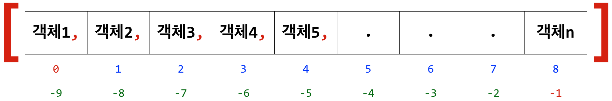
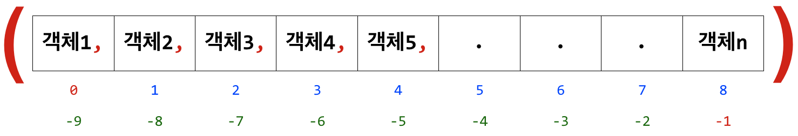
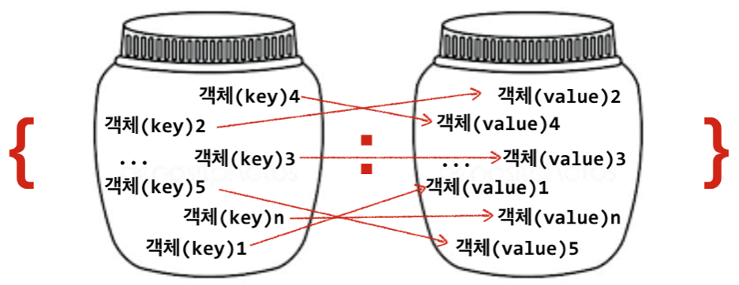
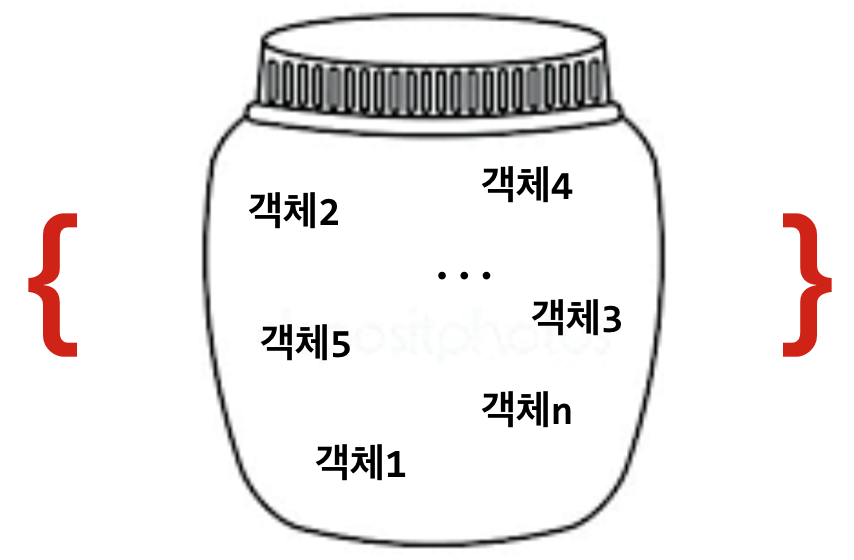

6장: 복합자료형
===

Compound Data Types  

***
***박 진 수*** 교수    
Intelligent Data Semantics Lab  
Seoul National University
***

<h3>Table of Contents<span class="tocSkip"></span></h3>
<div class="toc"><ul class="toc-item"><li><span><a href="#시퀀스-자료형" data-toc-modified-id="시퀀스-자료형-1">시퀀스 자료형</a></span><ul class="toc-item"><li><span><a href="#리스트형(List-Type)" data-toc-modified-id="리스트형(List-Type)-1.1">리스트형(List Type)</a></span><ul class="toc-item"><li><span><a href="#리스트(list)란?" data-toc-modified-id="리스트(list)란?-1.1.1">리스트(<strong>list</strong>)란?</a></span></li><li><span><a href="#리스트-생성" data-toc-modified-id="리스트-생성-1.1.2">리스트 생성</a></span></li><li><span><a href="#리스트-인덱스" data-toc-modified-id="리스트-인덱스-1.1.3">리스트 인덱스</a></span></li><li><span><a href="#리스트-관련-연산자" data-toc-modified-id="리스트-관련-연산자-1.1.4">리스트 관련 연산자</a></span></li><li><span><a href="#리스트-관련-메소드" data-toc-modified-id="리스트-관련-메소드-1.1.5">리스트 관련 메소드</a></span></li><li><span><a href="#정렬-방법:-sort()-메소드-vs.-sorted()-함수" data-toc-modified-id="정렬-방법:-sort()-메소드-vs.-sorted()-함수-1.1.6">정렬 방법: <strong>sort()</strong> 메소드 vs. <strong>sorted()</strong> 함수</a></span></li><li><span><a href="#Lab:-리스트-생성-및-수정" data-toc-modified-id="Lab:-리스트-생성-및-수정-1.1.7">Lab: 리스트 생성 및 수정</a></span></li></ul></li><li><span><a href="#튜플형(Tuple-Type)" data-toc-modified-id="튜플형(Tuple-Type)-1.2">튜플형(Tuple Type)</a></span><ul class="toc-item"><li><span><a href="#튜플(tuple)이란?" data-toc-modified-id="튜플(tuple)이란?-1.2.1">튜플(<strong>tuple</strong>)이란?</a></span></li><li><span><a href="#튜플-생성" data-toc-modified-id="튜플-생성-1.2.2">튜플 생성</a></span><ul class="toc-item"><li><span><a href="#형변환" data-toc-modified-id="형변환-1.2.2.1">형변환</a></span></li></ul></li><li><span><a href="#튜플-인덱스,-연산자,-메소드" data-toc-modified-id="튜플-인덱스,-연산자,-메소드-1.2.3">튜플 인덱스, 연산자, 메소드</a></span></li><li><span><a href="#튜플-메소드" data-toc-modified-id="튜플-메소드-1.2.4">튜플 메소드</a></span></li><li><span><a href="#Lab:-튜플에서-분할-연산자와-멤버십-연산자-사용하기" data-toc-modified-id="Lab:-튜플에서-분할-연산자와-멤버십-연산자-사용하기-1.2.5">Lab: 튜플에서 분할 연산자와 멤버십 연산자 사용하기</a></span></li><li><span><a href="#튜플-할당" data-toc-modified-id="튜플-할당-1.2.6">튜플 할당</a></span><ul class="toc-item"><li><span><a href="#튜플-할당(tuple-assignment)이란?" data-toc-modified-id="튜플-할당(tuple-assignment)이란?-1.2.6.1">튜플 할당(tuple assignment)이란?</a></span></li></ul></li><li><span><a href="#튜플-패킹과-언패킹" data-toc-modified-id="튜플-패킹과-언패킹-1.2.7">튜플 패킹과 언패킹</a></span></li><li><span><a href="#시퀀스형-패킹/언패킹-연산자-*" data-toc-modified-id="시퀀스형-패킹/언패킹-연산자-*-1.2.8">시퀀스형 패킹/언패킹 연산자 <strong>*</strong></a></span></li></ul></li></ul></li><li><span><a href="#매핑-자료형" data-toc-modified-id="매핑-자료형-2">매핑 자료형</a></span><ul class="toc-item"><li><span><a href="#딕셔너리(dict)란?" data-toc-modified-id="딕셔너리(dict)란?-2.1">딕셔너리(<strong>dict</strong>)란?</a></span><ul class="toc-item"><li><ul class="toc-item"><li><span><a href="#딕셔너리와-리스트의-차이" data-toc-modified-id="딕셔너리와-리스트의-차이-2.1.0.1">딕셔너리와 리스트의 차이</a></span></li></ul></li></ul></li><li><span><a href="#딕셔너리-생성" data-toc-modified-id="딕셔너리-생성-2.2">딕셔너리 생성</a></span></li><li><span><a href="#딕셔너리-인덱스" data-toc-modified-id="딕셔너리-인덱스-2.3">딕셔너리 인덱스</a></span><ul class="toc-item"><li><span><a href="#키를-통해-매핑값-추출하기" data-toc-modified-id="키를-통해-매핑값-추출하기-2.3.1">키를 통해 매핑값 추출하기</a></span></li><li><span><a href="#키에-매핑값을-할당하기" data-toc-modified-id="키에-매핑값을-할당하기-2.3.2">키에 매핑값을 할당하기</a></span></li></ul></li><li><span><a href="#딕셔너리-관련-연산자" data-toc-modified-id="딕셔너리-관련-연산자-2.4">딕셔너리 관련 연산자</a></span></li><li><span><a href="#Lab:-딕셔너리-생성-및-수정" data-toc-modified-id="Lab:-딕셔너리-생성-및-수정-2.5">Lab: 딕셔너리 생성 및 수정</a></span></li><li><span><a href="#딕셔너리-관련-메소드" data-toc-modified-id="딕셔너리-관련-메소드-2.6">딕셔너리 관련 메소드</a></span><ul class="toc-item"><li><span><a href="#문자의-출현-횟수-세기" data-toc-modified-id="문자의-출현-횟수-세기-2.6.1">문자의 출현 횟수 세기</a></span></li></ul></li></ul></li><li><span><a href="#집합-자료형" data-toc-modified-id="집합-자료형-3">집합 자료형</a></span><ul class="toc-item"><li><span><a href="#세트(set)란?" data-toc-modified-id="세트(set)란?-3.1">세트(set)란?</a></span></li><li><span><a href="#세트-생성" data-toc-modified-id="세트-생성-3.2">세트 생성</a></span><ul class="toc-item"><li><span><a href="#형변환" data-toc-modified-id="형변환-3.2.1">형변환</a></span></li></ul></li><li><span><a href="#세트-관련-연산자" data-toc-modified-id="세트-관련-연산자-3.3">세트 관련 연산자</a></span></li><li><span><a href="#세트-관련-메소드" data-toc-modified-id="세트-관련-메소드-3.4">세트 관련 메소드</a></span></li><li><span><a href="#Lab:-세트-생성-및-연산" data-toc-modified-id="Lab:-세트-생성-및-연산-3.5">Lab: 세트 생성 및 연산</a></span></li></ul></li></ul></div>

# 시퀀스 자료형

**시퀀스형**(Squence Types)이란?
- 0개 이상의 객체를 배열 형태로 참조하는 자료형을 말한다.
- 따라서 담고 있는 각 객체는 순서를 가지고 있다.

가장 많이 사용하는 시퀀스형
- 문자열(**str**)
- 리스트(**list**)
- 튜플(**tuple**)

기타 시퀀스형
- **bytearray**
- **bytes**
- **collections.namedtuple**

## 리스트형(List Type)

### 리스트(**list**)란?

**가변자료형**(mutable)이다.
- 생성한 후 내용의 변경이 가능하다. 즉, 담고 있는 객체를 삭제, 변경, 삽입하는 것이 가능하다.

**순서를 가지는** 0개 이상의 객체를 참조하는 **시퀀스형**이다.
- 각 객체는 쉼표(,)로 구분한다.

리스트 자신을 포함해 어떠한 자료형도 담을 수 있다.

유연성 높아 파이썬에서 가장 흔히 사용되는 자료형이다.

출력 형식
- 리스트는 항상 **[ ]**(대괄호) 형태로 출력한다.




### 리스트 생성

리스트를 만드는 방법으로는 다음 세 가지가 있다.

1. **[ ]**(대괄호)
1. **list()** 생성자(클래스)
1. 리스트 축약(list comprehension)
    - <바로 쓰는 파이썬: 기초 편>의 [부록 5 - 리스트/딕셔너리/세트 축약](https://github.com/snu-python/pythonbook/blob/master/Appendix5%20List%20Dictionary%20Set%20Comprehension.pdf) 참조
    - <https://github.com/snu-python/pythonbook>

**따라해보기**

대괄호 `[ ]`를 사용해서 리스트를 만들어보자.
- 각 객체는 쉼표(,)로 구분한다.

```python
number_list = [1, 0, -5, -1.23, 27]
print(number_list)
```

`list()` 생성자를 사용해서 리스트를 만들어 보자.
- `list()`의 전달인자로 **순회형**만 올 수 있다. 
- 순회형(iterable)이란 담고 있는 객체들에 하나씩 순서대로 접근할 수 있는 자료형으로 문자열, 리스트, 튜플, 딕셔너리, 세트가 있다. 

```python
string_list= list('가나다라마바사')
print(string_list)
```

모든 복합자료형은 어떠한 자료형도 담을 수 있다.
- 따라서 리스트는 리스트 자신을 포함해 어떠한 자료형도 담을 수 있다.

```python
complex_list = [list(), number_list, ['x', 3, string_list], True, None]
print(complex_list)
```

앞서 만든 리스트의 길이, 즉 각 리스트가 담고 있는 객체의 개수를 확인해보자.
- **len()** 함수는 순회형(**str**, **list**, **tuple**, **dict**, **set**) 객체의 길이(담고 있는 객체의 수)를 반환한다.

```python
# [1, 0, -5, -1.23, 27]
len(number_list)
```

```python
# list('가나다라마바사')
len(string_list)
```

```python
# [list(), number_list, ['x', 3, string_list], True, None]
len(complex_list)
```

문자열은 불변자료형이라 생성한 후 내용의 변경이 불가능하다.

```python
s = 'abcde'
s[0] = 'A'  # a를 A로 바꾼다.
```

리스트는 가변자료형이라 생성한 후 내용의 변경이 가능하다.

```python
L = ['a', 'b', 'c', 'd', 'e']
L[0] = 'A'  # 'a'를 'A'로 바꾼다.
```

```python
print(L)
```

### 리스트 인덱스

문자열 인덱스와 같은 원리로 작동한다.

**따라해보기**

```python
band = ['보컬', ['기타1', '기타2', '베이스'], '드럼', '키보드']
```

```python
# 첫 번째 객체를 추출한다.
band[0]           
```

```python
# --- ['보컬', ['기타1', '기타2', '베이스'], '드럼', '키보드']
# 마지막 객체를 추출한다.
band[-1]          
```

```python
# --- ['보컬', ['기타1', '기타2', '베이스'], '드럼', '키보드']
# 두 번째 객체를 추출한다. 
band[1]
```

```python
# --- ['보컬', ['기타1', '기타2', '베이스'], '드럼', '키보드']
# 두 번째 객체의 두 번째 객체를 추출한다.
band[1][1]
```

```python
# --- ['보컬', ['기타1', '기타2', '베이스'], '드럼', '키보드']
# 두 번째 객체의 마지막 객체(문자열)의 첫 번째 문자를 추출한다.
band[1][-1][0]
```

리스트 범위 밖의 객체를 지정해서는 안 된다.

```python
# --- ['보컬', ['기타1', '기타2', '베이스'], '드럼', '키보드']
band[99]
```

기존 객체를 새로운 객체로 바꿀 수도 있는데 교체하고자 하는 자리의 인덱스 번호를 지정한 후 새로운 객체를 할당하면 된다. 

교체하는 형식은 다음과 같다.

**리스트[인덱스번호] = 새로운-객체**

```python
# --- ['보컬', ['기타1', '기타2', '베이스'], '드럼', '키보드']
# 리스트의 세 번째 객체를 교체한다. 
band[2] = '카혼'
print(band)
```

리스트 안의 리스트에 있는 객체도 바꿀 수 있다.

```python
# --- ['보컬', ['기타1', '기타2', '베이스'], '카혼', '키보드']
# 리스트 두 번째 객체의 첫 객체를 교체한다.
band[1][0] = '통기타'
print(band)
```

### 리스트 관련 연산자

리스트와 관련된 연산자로는 다음과 같은 것이 있다.

결합 연산자 : **+**   
반복 결합 연산자 : __*__   
확장 연산자 : **+=**   

분할 연산자 : **[:]**  
삭제 연산자 : **del**    
멤버십 연산자 : **in**/**not in**  

**따라해보기**

**결합 연산자**

```python
[1, 2, 3] + [4, 5, 6]
```

```python
['a', 'b'] + ['c', 'd']
```

**반복 연산자**

```python
[0] * 5
```

```python
[1, 2, 3] * 3
```

**확장 연산자**

우변의 객체를 병합해서 좌변의 리스트를 확장한다.
- `+=`의 우변에는 순회형이 와야 한다.
- **extend(순회형)** 메소드도 같은 기능을 수행한다.

```python
list1 = ['프로도', '네오']
list2 = ['라이언', '콘']
list1 += list2
```

```python
print(list1)
```

```python
# --- ['프로도', '네오', '라이언', '콘']
# 좌변 리스트에 정수 307을 추가한다.
list1 += 307
```

***왜 오류가 나는 것일까?***

`+=`의 우변에는 순회형이 와야 하는데 정수형이 왔기 때문에 오류가 난다.

***어떻게 하면 307을 좌변의 리스트에 넣을 수 있을까?***

```python
# 우변에 순회형만 올 수 있기 때문에 리스트 안에 추가한 후 좌변으로 병합하면 된다.
list1 += [307]
print(list1)
```

```python
# --- ['프로도', '네오', '라이언', '콘', 307]
# 좌변 리스트에 문자열 '제이지'를 추가한다.
list1 += '제이지'
print(list1)
```

***어떻게 된 일인가?***

`+=`의 우변에 순회형 중 문자열이 왔기 때문에 문자열의 문자를 하나씩 꺼내어 좌변 리스트에 추가하게 된다.

***어떻게 하면 '제이지'를 하나의 문자열로 좌변의 리스트에 넣을 수 있을까?***

```python
# --- ['프로도', '네오', '라이언', '콘', 307, '제', '이', '지']
# 우선 '제이지'를 좌변에 넣기 전에 마지막 3개 객체를 삭제한다.
list1[-3:] = []  
```

```python
# --- ['프로도', '네오', '라이언', '콘', 307]
# 좌변 리스트에 문자열 '제이지'를 추가하려면 
# 먼저 '제이지'를 리스트의 객체로 만든 후 좌변으로 병합하면 된다.
list1 += ['제이지']
print(list1)
```

**분할 연산자**

분할 연산자 `[:]`와 `[::]`는 리스트 분할을 통해 리스트의 객체를 추출한다. 
- 앞서 배운 문자열 분할 연산자와 같은 기능을 한다.

```python
s = ['a', 'b', 'c', 'd', ['x', 'y', 'z'], 'e', 'f']
```

```python
# 전체를 추촐한다. s[0:len(s)]와 같다.
s[:]  
```

```python
# --- ['a', 'b', 'c', 'd', ['x', 'y', 'z'], 'e', 'f']
# 처음 3개를 추출한다.
s[:3]  
```

```python
# --- ['a', 'b', 'c', 'd', ['x', 'y', 'z'], 'e', 'f']
# 마지막 3개를 추출한다.
s[-3:] 
```

```python
# --- ['a', 'b', 'c', 'd', ['x', 'y', 'z'], 'e', 'f']
# 3~4번째 객체 'c'와 'd'를 '가'과 '나'로 교체한다.
s[2:4] = ['가', '나']  
print(s)
```

```python
# --- ['a', 'b', '가', '나', ['x', 'y', 'z'], 'e', 'f']
# 두 번째 객체 'b'를 'l', 'm', 'n'으로 교체한다.
# 이때, 분할 연산자를 사용해서 교체한다.
s[1:2] = ['l', 'm', 'n']  
print(s)
```

```python
# --- ['a', 'l', 'm', 'n', '가', '나', ['x', 'y', 'z'], 'e', 'f']
# 두 번째 객체 'l'을 ['p', 'q']로 교체한다.
# 이때, 인덱스를 사용해서 교체한다.
s[1] = ['p', 'q']  
print(s)
```

```python
# --- ['a', ['p', 'q'], 'm', 'n', '가', '나', ['x', 'y', 'z'], 'e', 'f']
# 두 번째 객체부터 마지막 객체 앞까지를 '다'와 '라'로 교체한다. 
s[1:-1] = ['다', '라'] 
print(s)
```

```python
# --- ['a', '다', '라', 'f']
# 리스트의 모든 객체를 빈 리스트로 교체한다.
s[:] = [] 
print(s)
```

**삭제 연산자**

**del**은 객체의 참조를 삭제하는 연산자다. 
- 따라서 리스트 객체뿐만 아니라 파이썬에서 사용하는 모든 자료형에서 객체 참조를 삭제하는 데 사용할 수 있다. 

형식은 다음과 같다.

**del** ***객체***

```python
L = ['a', 'b', 'c', 'd', ['x', 'y', 'z'], 'e', 'f']
```

```python
# 다섯 번째 객체의 마지막 객체를 삭제한다.
del L[4][-1]
print(L)
```

```python
# --- ['a', 'b', 'c', 'd', ['x', 'y'], 'e', 'f']
# 다섯 번째 객체를 삭제한다.
del L[4]
print(L)
```

```python
# --- ['a', 'b', 'c', 'd', 'e', 'f']
# 두 번째와 세 번쩨 객체를 삭제한다.
del L[1:3]
print(L)
```

```python
# --- ['a', 'd', 'e', 'f']
# 리스트의 모든 객체를 삭제한다.
del L[:]
print(L)
```

**멤버십 연산자**

멤버십 연산은 순회형 값 안에 객체가 존재하는지 여부를 '참(**True**)' 또는 '거짓(**False**)'으로 알려준다.

형식은 다음과 같다.

***객체*** **in** ***순회형***

***객체*** **not in** ***순회형***

```python
L = ['a', 'b', ['c', 'd', 'e']]
```

```python
'a' in L
```

```python
# --- ['a', 'b', ['c', 'd', 'e']]
'c' in L
```

***왜 그럴까?***

```python
# ['a', 'b', ['c', 'd', 'e']]
'c' in L[-1]
```

```python
# ['a', 'b', ['c', 'd', 'e']]
'b' not in L
```

```python
# ['a', 'b', ['c', 'd', 'e']]
'f' not in L
```

참고로 멤버십 연산자는 모든 ***순회형***에 적용할 수 있기 때문에 문자열에 일부 문자가 포함되어 있는지 확인할 때도 사용할 수 있다. 

```python
text = 'Don’t just play on your phone, program it'
```

```python
'j' in text
```

```python
# --- 'Don’t just play on your phone, program it'
'd' in text
```

```python
# --- 'Don’t just play on your phone, program it'
'program' in text
```

### 리스트 관련 메소드

복사 메소드 : **copy()**  
추가 메소드 : **append()**, **extend()**, **insert()**   
삭제 메소드 : **pop()**, **remove()**  
질의 메소드 : **count()**, **index()**   
정렬 메소드 : **reverse()**, **sort()**

**따라해보기**

**복사 메소드**

*L*.**copy()**
- 리스트 *L*의 얕은 복사(shallow copy)를 반환한다.

```python
x = [1, 2, 3, ['x', 'y', 'z']]

# 리스트 x를 얕은 복사해서 변수 y에 할당한다.
y = x.copy()
```

```python
print(y)
```

**추가 메소드**

*L*.**append**(***x***)
- 리스트 *L*의 마지막에 객체 ***x***를 추가한다.

```python
L = []           # 빈 리스트를 초기화 한다.
L.append('a')    # 'a'를 리스트에 추가한다.
L.append('b')    # 'b'를 리스트에 추가한다.
print(L)
```

```python
# --- ['a', 'b']
# ['d', 'e']를 리스트에 추가한다.
L.append(['d', 'e'])
print(L)
```

*L*.**extend**(***m***)
- 순회형 ***m***의 모든 객체를 리스트 *L*의 끝에 추가한다. 
- *L* **+=** ***m***과 같다.

```python
# --- ['a', 'b', ['d', 'e']]
# ['f', 'g']를 리스트에 확장헤서 추가한다.
L.extend(['f', 'g'])
print(L)
```

*L*.**insert**(***i***, ***x***)
- 리스트 *L*의 인덱스 ***i***에 객체 ***x***를 삽입한다.

```python
# --- ['a', 'b', ['d', 'e'], 'f', 'g']
# 리스트의 다섯 번째 위치에 'b'를 추가한다.
L.insert(4, 'b')
print(L)
```

**삭제 메소드**

*L*.**pop()** : 리스트 *L*의 가장 오른쪽에 있는 객체(마지막 객체)를 반환한 후 삭제한다. 
- 빈 리스트거나 설정한 인덱스 번호가 리스트 범위 밖이면 **IndexError**가 발생한다.

```python
# --- ['a', 'b', ['d', 'e'], 'f', 'b', 'g']
# 리스트의 가장 오른쪽에 있는 마지막 객체를 반환한 후 삭제한다.
L.pop()
print(L)
```

*L*.**pop**(***i***) : 리스트 *L*의 인덱스 ***i***에 있는 객체를 반환한 후 삭제한다.
- 빈 리스트거나 설정한 인덱스 번호가 리스트 범위 밖이면 **IndexError**가 발생한다.

```python
# --- ['a', 'b', ['d', 'e'], 'f', 'b']
# 리스트의 세 번쨰 객체를 반환한 후 삭제한다.
L.pop(2)
print(L)
```

```python
# --- ['a', 'b', 'f', 'b']
# 리스트의 다섯 번때 객체를 반환한 후 삭제한다. 
# 하지만 다섯 번째 객체는 존재하지 않기 때문에 오류가 난다.
L.pop(4)
```

*L*.**remove**(***x***)
- 리스트 *L*의 **가장 왼쪽**에 있는 객체(첫 번째 객체) ***x***를 삭제한다. 
- 객체 ***x***가 존재하지 않으면 **ValueError**가 발생한다.

```python
# --- ['a', 'b', 'f', 'b']
# 리스트의 첫 번째 나타나는 'b'를 삭제한다. 
# [주의] 삭제하는 객체를 반환하지는 않는다.
L.remove('b')
print(L)
```

```python
# --- ['a', 'f', 'b']
# 리스트의 첫 번째 'c'를 삭제한다.
# 하지만 'c'는 리스트에 존재하지 않기 때문에 오류가 난다.
L.remove('c')
```

**질의 메소드**

*L*.**count**(***x***)
- 리스트 *L*에서 객체 ***x***의 개수를 반환한다.

```python
L = ['a', 'b', ['c', 'd', 'e'], 'f', 'b', 'c', 'g']
```

```python
# 'b'가 리스트에 몇 개 들어 있는지 확인한다.
L.count('b')
```

```python
# --- ['a', 'b', ['c', 'd', 'e'], 'f', 'b', 'c', 'g']
# 'c'가 리스트에 몇 개 들어 있는지 확인한다.
L.count('c')
```

***왜 'c'가 리스트에 한 개만 들어 있다고 할까?***

세 번째 객체인 리스트는 단일 객체로 보기 때문에 이 리스트 안에 있는 'c'는 확인할 수 없다. 

즉, 리스트에서 다른 복합자료형이 리스트의 객체일 때는 그 복합자료형의 내용을 확인할 수 없다.

```python
# -- ['a', 'b', ['c', 'd', 'e'], 'f', 'b', 'c', 'g']
# 'e'가 리스트에 몇 개 들어 있는지 확인한다.
L.count('e')
```

```python
# 'e'가 리스트의 세 번째 객체 안에 몇 개 들어 있는지 확인한다.
L[2].count('e')
```

*L*.**index**(***x, 시작번호, 끝번호***)
- 리스트 *L*에 있는 객체 ***x*** 중 **가장 왼쪽**에 있는 객체 ***x***의 인덱스를 반환한다. 

- 리스트 *L*의 ***시작번호***와 ***끝번호*** 인덱스가 정해지면 인덱스 범위 안에 있는 객체 ***x*** 중 **가장 왼쪽**에 있는 객체 ***x***의 인덱스를 반환한다.

- 분할 연산자처럼 ***시작번호***부터 ***끝번호*** **바로 앞**까지만 검색한다.

- 객체 ***x***가 없으면 **ValueError**가 발생한다.

```python
# --- ['a', 'b', ['c', 'd', 'e'], 'f', 'b', 'c', 'g']
# 리스트에서 가장 먼저 나타나는 'b'의 인덱스 번호를 확인한다. 
L.index('b')
```

```python
# --- ['a', 'b', ['c', 'd', 'e'], 'f', 'b', 'c', 'g']
# 리스트의 네 번째부터 검색해서 
# 가장 먼저 나타나는 'b'의 인덱스 번호를 확인한다.
L.index('b', 3)  
```

```python
# --- ['a', 'b', ['c', 'd', 'e'], 'f', 'b', 'c', 'g']
# 리스트의 네 번째부터 여섯 번째 사이에서 
# 가장 먼저 나타나는 'a'의 인덱스 번호를 확인한다.
# 'a'가 리스트의 지정한 범위 안에는 없기 때문에 오류가 난다.
L.index('a', 3, 6)  
```

**정렬 메소드**

*L*.**reverse**()
- 리스트 *L*에 있는 객체들의 순서를 거꾸로 뒤집는다.

```python
# --- ['a', 'b', ['c', 'd', 'e'], 'f', 'b', 'c', 'g']
# 리스트에 들어 있는 객체들의 순서를 거꾸로 정렬한다.
L.reverse()
print(L)
```

*L*.**sort**(***key=None, reverse=False***) 
- 리스트 *L*을 정렬한다.
- 기본값으로 오름차순 정렬한다.

```python
# --- ['g', 'c', 'b', 'f', ['c', 'd', 'e'], 'b', 'a']
# 리스트에 들어 있는 객체들을 오름차순 정렬한다.
L.sort()
```

***왜 오류가 날까?***

정렬하는 모든 객체를 비교할 수 있어야 한다. 

따라서, 만약 *L*이 담고 있는 객체 중 **비교가 불가능한 객체**가 있어 정렬을 할 수 없으면 **TypeError**가 발생한다.

```python
# --- ['g', 'c', 'b', 'f', ['c', 'd', 'e'], 'b', 'a']
# 정렬을 가능하게 하기 위해 다섯 번째 객체인 리스트를 삭제하여 문자열만 리스트에 포함되도록 한다.
L.pop(4)  
```

이제 리스트에는 비교가 가능한 객체들만 있기 때문에 정렬을 할 수 있다.

```python
print(L)
```

```python
# --- ['b', 'c', 'f', 'g', 'b', 'a']
# 'M'을 리스트의 세 번째 위치에 추가한다.
L.insert(2, 'M')
print(L)
```

```python
# --- ['b', 'c', 'M', 'f', 'g', 'b', 'a']
# 리스트를 오름차순으로 정렬한다.
L.sort()  
print(L)
```

***왜 대문자 'M'이 정렬한 리스트의 맨 앞에 있을까?***

Unicode에서 영어 대문자는 영어 소문자보다 앞 쪽에 위치하기 때문에 오름차순으로 정렬을 하면 대문자가 소문자보다 먼저 온다.

***그려면 대소문자 구분없이 정렬할 수는 없을까?***

**sort()** 메소드는 키워드 전달인자 ***key***와 ***reverse***를 선택적으로 사용할 수 있다.

***key***의 전달인자로는 함수가 온다.
- 전달인자로 함수의 이름만 오고 함수 뒤에 오는 소괄호 `()`는 생략한다.
- 이 함수를 사용해서 원하는 방식으로 리스트 *L*을 정렬할 수 있다.

```python
# --- ['M', 'a', 'b', 'b', 'c', 'f', 'g']
# 대소문자 구분없이 정렬하기 위해 모든 문자열으로 소문자로 바꾼 후 정렬한다. 
L.sort(key=str.lower)  
print(L)
```

***reverse***의 기본값은 '거짓(**False**)'이라 오름차순이 기본 정렬 방식이다.

하지만 전달인자를 '참(**True**)'으로하면 정렬이 내림차순으로 이루어진다.

```python
# --- ['a', 'b', 'b', 'c', 'f', 'g', 'M']
# reverse=True로 내림차순 정렬을 했기 때문에 소문자가 대문자보다 먼저 온다.
L.sort(reverse=True)
print(L)
```

```python
# --- ['g', 'f', 'c', 'b', 'b', 'a', 'M']
# 대소문자 구분없이 내림차순으로 정렬한다.
L.sort(key=str.lower, reverse=True)
print(L)
```

### 정렬 방법: **sort()** 메소드 vs. **sorted()** 함수

리스트의 **sort()** 매소드는 리스트 자체를 정렬한다. 

따라서, 원본 리스트를 정렬하지 않으려면, **sorted()** 함수를 사용해서 새로운 리스트 객체를 생성하는 것이 좋다.

**따라해보기**

```python
x = ['드럼', '기타', '키보드', '베이스']
```

```python
# 리스트 x를 오름차순으로 정렬해서 변수 y에 할당한다.
y = sorted(x) 
```

```python
# --- x = ['드럼', '기타', '키보드', '베이스']
print(y)
```

```python
# x는 바뀌지 않았다.
print(x)  
```

```python
# --- x = ['드럼', '기타', '키보드', '베이스']
# 리스트 x 자체를 오름차순으로 정렬한다.
x.sort() 
```

```python
# x 자체가 바뀌었다.
print(x)  
```

기본적으로 **sort()** 메소드와 **sorted()** 함수는 값이 작은 것부터 큰 것으로, 즉 **오름차순**으로 담고 있는 객체를 정렬한다. 

만약 반대로 가장 값이 큰 것부터 작은 순, 즉 **내림차순**으로 정렬을 원하면, 매개변수 ***reverse***에 **True** 전달인자를 사용하면 된다. 

또한 기본 정렬 규칙으로 정렬하지 않고 다른 정렬 규칙으로 객체들을 정렬하고자 한다면 ***key*** 매개변수에 정렬 규칙을 구현한 함수(사용자 정의 함수 포함)를 전달인자로 사용하면 된다.
- 사용자 정의 함수는 주로 람다 함수를 많이 사용한다. 

다음 예는 절대값으로 반환된 결과를 내림차순으로 정렬하는 것을 보여준다. 

```python
L = [-5, 0, 9, 1, 3, -12]

# 리스트 L을 절대 값을 기준으로 내림차순으로 정렬하여 변수 z에 할당한다.
z = sorted(L, key=abs, reverse=True)
```


```python
print(z)
```

### Lab: 리스트 생성 및 수정

- 아래 항목(객체)을 포함하는 리스트를 생성한 후 출력한다.
    - **1, 7, [4, 9], 'f', ('a', 'b')**


- **'g'** 항목을 리스트의 마지막에 추가한 후 출력한다.

- 분할 연산자를 사용해서 리스트의 마지막 두 항목만 가지고 있는 리스트를 생성한 후 출력한다.

**실행 예**

```code
> python list_demo.py
[1, 7, [4, 9], 'f', ('a', 'b')]
[1, 7, [4, 9], 'f', ('a', 'b'), 'g']
[('a', 'b'), 'g']
```

## 튜플형(Tuple Type)

### 튜플(**tuple**)이란?

**불변자료형**(immutable)이다.
- 생성한 후 내용의 변경이 불가능하다. 즉, 담고 있는 객체를 삭제, 변경, 삽입하는 것이 불가능하다.

순서를 가지는 0개 이상의 객체를 참조하는 **시퀀스형**이다.
- 각 객체는 쉼표(,)로 구분한다.

튜플 자신을 포함해 어떠한 자료형도 담을 수 있다.

출력 형식
- 튜플은 항상 **( )**(소괄호) 형태로 출력한다.



하지만 튜플을 생성할 때는 소괄호 없이도 생성이 가능하다.

### 튜플 생성

튜플을 만드는 방법으로는 다음 세 가지가 있다.

1. 소괄호 **( )** 안에 쉼표(,)로 구분한 객체

1. 소괄호 없이 쉼표(,)로 구분한 객체

1. **tuple()** 생성자(클래스)

**따라해보기**

소괄호 `( )`를 사용해서 튜플를 만들어보자.
- 각 객체는 쉼표(,)로 구분한다.

```python
t1 = (5, -3, 3.14, 'red', '드럼')
print(t1)
```

소괄호 없이 튜플를 만들어보자.
- 각 객체는 쉼표(,)로 구분한다.

```python
t2 = 5, -3, 3.14, 'red', '드럼'
print(t2)
```

앞서 만든 튜플의 자료형을 확인해보자.

```python
type(t1)
```

```python
type(t2)
```

`tuple()` 생성자를 사용해서 튜플을 만들어 보자.
- `tuple()`의 전달인자로 **순회형**만 올 수 있다. 
- 순회형(iterable)이란 담고 있는 객체들에 하나씩 순서대로 접근할 수 있는 자료형으로 문자열, 리스트, 튜플, 딕셔너리, 세트가 있다. 

```python
string_tuple= tuple('가나다라마바사')
print(string_tuple)
```

모든 복합자료형은 어떠한 자료형도 담을 수 있다.
- 따라서 튜플은 튜플 자신을 포함해 어떠한 자료형도 담을 수 있다.

```python
complex_tuple = False, (), t2, ['x', 3, string_tuple], None
print(complex_tuple)
```

앞서 만든 튜플의 길이, 즉 각 튜플이 담고 있는 객체의 개수를 확인해보자.

```python
# (5, -3, 3.14, 'red', '드럼')
len(t1)
```

```python
# 5, -3, 3.14, 'red', '드럼'
len(t2)
```

```python
# tuple('가나다라마바사')
len(string_tuple)
```

```python
# False, (), tuple2, ['x', 3, string_tuple], None
len(complex_tuple)
```

튜플은 불변자료형이라 생성한 후 내용의 변경이 불가능하다.

```python
# (5, -3, 3.14, 'red', '드럼')
t1[-1] = '기타'   # 수정 불가능
```

#### 형변환

튜플은 불변자료형이기 때문에 객체를 변경할 필요가 있는 경우에는 list() 생성자를 사용하여 튜플을 리스트로 변환해야 한다.

튜플은 리스트로 형변환이 가능하고 리스트도 튜플로 형변환이 가능하다.

**따라해보기**

```python
T = 1, 2, 3
```

```python
type(T)
```

```python
print(T)
```

```python
L = list(T)   # 튜플을 리스트로 형변환한다.
```

```python
type(L)
```

```python
print(L)
```

```python
T = tuple(L)  # 리스트를 튜플로 다시 형변환한다.
```

```python
type(T)
```

```python
print(T)
```

### 튜플 인덱스, 연산자, 메소드

튜플은 일단 생성하면 변경할 수 없기 때문에 튜플이 담은 객체에 영향을 미치지 않는 연산자와 메소드만 지원한다. 

따라서, 리스트 관련 연산자와 메소드 중 객체를 변경하는 연산자와 메소드를 제외한 나머지는 같다. 

구체적으로 `del`, `copy()`, `append()`, `insert()`, `extend()`, `remove()`, `pop()`, `reverse()`, `sort()`를 제외한 나머지 연산자와 메소드는 사용할 수 있다.

**따라해보기**

**인덱스**
- 모든 시퀀스형의 인덱스와 같은 원리로 작동한다.

```python
t1 = tuple(), [-7, 1.23], '드럼', None, ('토', '일', True)
```

```python
# 마지막 객체를 추출한다.
t1[-1]          
```

```python
# --- tuple(), [-7, 1.23], '드럼', None, ('토', '일', True)
# 두 번째 객체의 마지막 객체를 추출한다.
t1[1][-1]
```

**분할 연산자**

```python
# --- tuple(), [-7, 1.23], '드럼', None, ('토', '일', True)
# 튜플 전체를 추출한다.
t1[:]
```

```python
# --- tuple(), [-7, 1.23], '드럼', None, ('토', '일', True)
# 끝에서 두 번째부터 마지막까지 거꾸로 객체를 추출한다.
t1[-2::-1]
```

**멤버십 연산자**

```python
# --- tuple(), [-7, 1.23], '드럼', None, ('토', '일', True)
None in t1
```

```python
# --- tuple(), [-7, 1.23], '드럼', None, ('토', '일', True)
-7 in t1
```

```python
# --- tuple(), [-7, 1.23], '드럼', None, ('토', '일', True)
-7 in t1[1]
```

**결합 연산자**

```python
t2 = 1, 2, [3, 4]
t3 = tuple('abc')
t4 = t2 + t3
print(t4)
```

**반복 결합 연산자**

```python
# --- t3 = 'a', 'b', 'c'
t5 = t3 * 2
print(t5)
```

**확장 연산자**

```python
# --- t2 = 1, 2, [3, 4]
# --- t3 = t3 = 'a', 'b', 'c'
# t2과 t3을 병합해서 t2으로 재할당한다.
# [주의] extend()는 값을 변경하는 메소드라 튜플에서는 지원하지 않는다.
t2 += t3
print(t2)
```

### 튜플 메소드

```python
# --- ('a', 'b', 'c', 'a', 'b', 'c')
# 값을 변경하지 않는 메소드다.
t5.count('b')   
```

```python
# 값을 변경하지 않는 메소드다.
t5.index('b')   
```

### Lab: 튜플에서 분할 연산자와 멤버십 연산자 사용하기

- 아래 객체들을 포함하는 튜플을 생성한 후 출력한다.
    - **1, 5, (2, 3), 'green', ['드럼', '기타']**
    

- 분할 연산자를 사용해서 방금 만든 튜플의 마지막 두 객체만 가지고 있는 새로운 튜플을 생성한 후 출력한다.

- (2, 3)이 처음 만든 튜플에 포함되어 있는지 확인한다.

- 5가 두 번쨰 만든 튜플에 에 들어 있는지 확인한다.

**실행 예**

```code
> python tuple_demo.py
(1, 5, (2, 3), 'green', ['드럼', '기타'])
('green', ['드럼', '기타'])
True
False
```

### 튜플 할당

**`(x, y, z) = (i, j, k)`**

**`x, y, z = i, j, k`**

#### 튜플 할당(tuple assignment)이란?

등호를 기준으로 우변의 값 혹은 표현식 각각을 좌변의 같은 위치에 해당하는 변수로 할당하는 것이다.
- 좌변 : 튜플 변수
- 우변 : 표현식 튜플(문자열과 리스트 같은 시퀀스형 자료도 가능)

**원리**
- 좌변의 변수에 대응하는 우변의 값을 할당한다.
- 우변의 모든 표현식은 좌변으로 할당하기 전에 평가(evaluation) 또는 계산을 해야 한다.
- 좌변의 변수 개수와 우변의 표현식 값의 개수는 반드시 일치해야 한다.

**이점**
- 튜플 할당은 매우 편리하고 유용하게 사용할 수 있다.
- 예를 들어, 한 줄에서 여러 개의 변수를 한꺼번에 할당하는 것이 가능해져 코드가 간소해진다.
- 두 변수 간의 값을 서로 바꿀 때(swap)에도 유용하다.

**따라해보기**

```python
i, j, k = '드럼', '기타', '피아노'
```

```python
print(i, j, k)
```

```python
# --- i, j, k = '드럼', '기타', '피아노'
# 스왑(swap operation)
i, j = j, i
```

```python
print(i, j, k)
```

***튜플 할당 기능이 없었다면?***

```python
# i, j, k = '드럼', '기타', '피아노' 대신 ...
i = '드럼'
j = '기타'
k = '피아노'
```

```python
# --- i, j, k = '드럼', '기타', '피아노'
# i, j = j, i 대신... 
tmp = j
j = i
i = tmp
print(i, j, k)
```

```python
a, b, c = ['엄마', '아빠', ('나', '동생')]
print(a)
print(b)
print(c)
```

```python
email = 'abc@xyz.kr'
user_name, domain = email.split('@')
print(user_name)
print(domain)
```

```python
x, y = 1, 2, 3
```

좌변의 변수 개수와 우변의 객체 개수가 같지 않으면 오류가 발생한다.

이런 경우 우변의 불필요한 객체 값을 좌변에서 더미 변수(dummy variable)인 밑줄(**_**)로 받아 처리하면 된다.

```python
# 2와 4가 불필요한 경우
x, _, y, _ = 1, 2, 3, 4
print(x, y)
```

**[주의]**  
파이썬 셀에서 1개의 밑줄(**_**)은 가장 최근에 반환되었던 결과 값을 담고 있기 때문에 우변에 사용하면 예상치 못한 결과를 가져 올 수 있으니 주의해야 한다.

```python
# x, _, y, _ = 1, 2, 3, 4
print(_)
```

따라서, 다음과 같이 사용하면 예상치 못할 결과가 나올 수 있으니 주의해야 한다.

```python
x, y, z = 'a', _, _
print(x, y, z)
```

### 튜플 패킹과 언패킹

**튜플 패킹**(tuple packing)이란?

- 우변의 객체들을 좌변에 있는 변수 하나에 할당하는 것이다.

이는 마치 박스 하나에 여러 개의 물건을 집어넣는 것과 같다. 

다음과 같은 형식으로 사용한다.

**`t = (x, y, z)`**

**`t = x, y, z`**

**따라해보기**

```python
t = 3.14, [5, -3], 'green', ('드럼', '기타')  # 튜플 패킹
```

```python
type(t)   # t의 자료형은 튜플이다. 
```

```python
print(t)
```

다음 코드를 보면 알 수 있듯이, 튜플을 생성할 때 우리가 이미 했던 일이다.

```python
t1 = (5, -3, 3.14, 'red', '드럼')
t2 = 5, -3, 3.14, 'red', '드럼'
print(t1)
print(t2)
```

**튜플 언패킹**(tuple unpacking)이란?

- 우변의 패킹한 튜플 변수에서 여러 개의 값을 좌변으로 꺼내오는 것이다. 

- 즉, 튜플 안의 객체들을 여러 개의 변수에 한 번에 할당하는 것이라 할 수 있다. 

이는 마치 박스에 들어 있는 여러 개의 물건을 꺼내는 것과 같다. 

이때 좌변의 변수 개수와 우변의 튜플 길이가 같아야 한다.

다음과 같은 형식으로 사용한다. 

**`(x, y, z) = t`**

**`x, y, z = t`**

**따라해보기**

```python
# 튜플 패킹 : t = 3.14, [5, -3], 'green', ('드럼', '기타')
a, b, c, d = t  # 튜플 언패킹

print(a)
print(b)
print(c)
print(d)
```

### 시퀀스형 패킹/언패킹 연산자 __*__

모든 시퀀스 자료형(리스트, 튜플 등)은 __*__를 사용하여 담고 있는 객체들을 패킹(packing) 또는 언패킹(unpacking) 할 수 있다.

여기에서는 시퀀스형 패킹만 살펴보고 __*__를 시퀀스형 언패킹 연산자로 사용하는 경우는 10장에서 다루기로 한다.

**시퀀스형 패킹**

좌변의 변수 중 어느 한 변수 앞에 __*__ 부호를 붙여 다음과 같은 형식으로 사용한다.

<b><pre>x, ..., *y = i, j, k,...</pre></b>

다음과 같은 특징이 있다.

- 좌변의 변수는 반드시 두 개 이상이어야 한다. 

- __*y__는 좌변의 맨 앞이나 맨 뒤, 중간 어디에 와도 상관없다.

- 우변의 객체를 좌변의 변수에 할당할 때
    - 우변의 객체 개수가 좌변의 변수 개수보다 많으면
    - 우변의 객체를 좌변의 변수에 **순서대로 할당**한다. 

- 우변의 남은 객체는 모두 변수 __*y__에 리스트(**list**)로 할당한다.

- 남은 객체는 좌변의 __*y__의 위치에 따라 달라진다.

- 패킹한 ___*y___의 자료형은 리스트(**list**)다.

**따라해보기**

```python
x, y, *z = 3.14, [5, -3], 'green', ('드럼', '기타')

print(x)
print(y)
print(z)  # 리스트다.
```

```python
*x, y, z = 3.14, [5, -3], 'green', ('드럼', '기타')

print(z)
print(y)
print(x)  # 리스트다.
```

```python
x, *y, z = 3.14, [5, -3], 'green', ('드럼', '기타')

print(x)
print(z)
print(y)  # 리스트다.
```

# 매핑 자료형

**매핑형**(mapping types)이란?
- **순서 없이**(unordered) 0개 이상의 키-매핑값(key-value) 쌍으로 된 객체를 참조하는 자료형을 말한다.

**키**(key)

- 해시가능한 객체만 키(key)로 사용할 수 있다.

- 해시가능한(hashable) 객체란?
    - 그 값이 불변성(immutable)인 자료형으로 **int**, **float**, **str**, **tuple**, **frosenset** 등이 있다.

- 해시가능하지 않는 자료형은 딕셔너리의 키로 사용 할 수 없는데 **list**, **dict**, **set**이 여기에 속한다.

**매핑값**(value)
- 매핑값으로는 모든 종류의 자료형을 사용할 수 있다.

순서없는(unordered) 매핑형
- 딕셔너리(**dict**)
- 디폴트 딕셔너리(**collections.defaultdict**)

순서(ordered)가 있는 매핑형
- 순서형 딕셔너리(**collections.OrderedDict**)

## 딕셔너리(**dict**)란?

**가변자료형**(mutable)이다.

- 생성한 후 내용의 변경이 가능하다. 즉, 담고 있는 객체를 삭제, 변경, 삽입하는 것이 가능하다.

**순서 없이**(unordered) 0개 이상의 키-매핑값(key-value) 쌍으로 된 객체를 참조하는 매핑형이다.

- 각 객체 쌍은 쉼표( , )로 구분한다.

- 객체 하나가 **키:매핑값** 형태로 되어 있으며, 키와 매핑값도 객체다.

- **키**(key) : 해시가능한 객체(불변자료형)만 가능하다.

- **매핑값**(value) : 어떠한 자료형의 객체도 가능하다.

출력 형식
- 딕셔너리는 항상 중괄호(**{ }**) 형태로 출력한다.




#### 딕셔너리와 리스트의 차이

- 리스트와 달리 **딕셔너리**가 담고 있는 객체는 순서가 없다.

- **리스트**는 같은 값을 가진 객체를 포함할 수 있지만, **딕셔너리**는 키의 중복을 허락하지 않기 때문에 같은 키를 가진 객체는 포함할 수 없다.
    - 단, 매핑값은 중복이 가능하다.
    - 즉, 키만 다르면 매핑값은 같아도 상관없다.

- 리스트와 달리 **딕셔너리**는 인덱스 개념이 없기 때문에 분할 연산자를 사용해 객체 전체 또는 일부를 추출할 수 없다.

- **리스트**는 인덱스 번호로 객체를 추출하지만, **딕셔너리**는 키로 객체를 추출한다.

## 딕셔너리 생성

딕셔너리를 만드는 방법으로는 다음 세 가지가 있다.

1. **{ }**(중괄호)
1. **dict()** 생성자(클래스)
1. 딕셔너리 축약(dictionary comprehension)
    - <바로 쓰는 파이썬: 기초 편>의 [부록 5 - 리스트/딕셔너리/세트 축약](https://github.com/snu-python/pythonbook/blob/master/Appendix5%20List%20Dictionary%20Set%20Comprehension.pdf) 참조
    - <https://github.com/snu-python/pythonbook>

**따라해보기**

중괄호 `{ }`를 사용해서 딕셔너리를 만들어보자.
- 키:매핑값 쌍으로 된 각 객체는 쉼표(,)로 구분한다.

```python
family = {1: '엄마', 2: '아빠', 3: '동생'}
print(family)
```

딕셔너리를 생성할 때 키와 매핑값을 할당해야 하는데 빈(null) 값도 허용한다.

```python
d1 = {None: None}
type(d1)
len(d1)
```

```python
d2 = {None: '', '': None}
type(d2)
len(d2)
```

```python
# {None: '', '': None}
print(d2[None])
print(d2[''])
```

모든 복합자료형은 어떠한 자료형도 담을 수 있다.
- 따라서 딕셔너리는 매핑값으로 딕셔너리 자신을 포함해 어떠한 자료형도 담을 수 있다.
- 단, 키는 해시가능한(hashable) 불변자료형(immutable)만 가능하다.

```python
mydict = {
    '악기': ['드럼', '기타', '베이스'],  # 매핑값이 리스트다.
    '가족': family,                  # 매핑값이 딕셔너리다.
    (10, 9): '한글날',               # 키가 튜플(불변자료형)이다.
    'RGB': [255, 72, 90],
    'id': (),                      # 매핑값이 빈 튜플이다.
    0: 55,
    -307: None,                    # 매핑값 뿐만 아니라 키에도 None이 올 수 있다
    'fruits': set()                # 매핑값이 세트다.
}
print(mydict)
```

앞서 만든 각 딕셔너리가 담고 있는 객체의 개수를 확인해보자.

```python
len(family)
```

```python
len(mydict)
```

이번에는 **dict()** 생성자를 사용해서 딕셔너리를 만들어보자. 

**dict()** 생성자로 딕셔너리를 만들 때 몇 가지 방법을 사용할 수 있는데 이 중 자주 사용하는 방법을 알아보자.

**dict**(***키워드-전달인자***)

- 불특정 다수의 ***키워드-전달인자***를 사용해서 키워드 식별자를 키로, 키워드의 값을 매핑값으로 하는 딕셔너리를 만든다.

- 이때 키워드 식별자는 유효한 파이썬 식별자여야 한다. 
    - 즉, 키워드 식별자는 공백이 없는 문자와 숫자의 조합으로 이루어져야 하며, 숫자로 시작할 수는 없다.

```python
# 키워드 전달인자
d1 = dict(drum='드럼', guitar='기타', bass='베이스') 
```

```python
type(d1)
```

```python
print(d1)
```

**dict**(***순회형-전달인자***)

- 불특정 다수의 ***순회형 전달인자***를 사용해서 딕셔너리를 생성한다. 

- ***순회형 전달인자***로 리스트, 튜플, 딕셔너리 등이 올 수 있다. 

- 그뿐만 아니라 순회형의 개별 객체로도 리스트, 튜플, 딕셔너리 등이 올 수 있다. 

- 이때 각 객체는 반드시 쌍으로 이루어져 있어야 첫 번째 객체를 키로, 두 번째 객체를 매핑값으로 해서 딕셔너리를 만 들 수 있다.

```python
# 순회형 전달인자로 list of tuples 
d2 = dict([('drum', '드럼'), ('guitar', '기타'), ('bass', '베이스')]) 
```

```python
type(d2)
```

```python
print(d2)
```

```python
# 순회형 전달인자로 list of lists
d3 = dict([['drum', '드럼'], ['guitar', '기타'], ['bass', '베이스']]) 
```

```python
type(d3)
```

```python
print(d3)
```

```python
# 순회형 전달인자로 tuple of tuples
d4 = dict((('drum', '드럼'), ('guitar', '기타'), ('bass', '베이스'))) 
```

```python
type(d4)
```

```python
print(d4)
```

```python
# 순회형 전달인자로 tuple of lists
d5 = dict((['drum', '드럼'], ['guitar', '기타'], ['bass', '베이스'])) 
```

```python
type(d5)
```

```python
print(d5)
```

```python
# 순회형 전달인자로 tuple of dict
d6 = ({'drum': '드럼', 'guitar': '기타', 'bass': '베이스'}) 
```

```python
type(d6)
```

```python
print(d6)
```

**dict**(***매핑형-전달인자***)
- 불특정 다수의 매핑형 객체에 기반해서 딕셔너리를 생성한다.
- **zip()** 함수 등을 사용해서 딕셔너리를 생성할 수 있다.

```python
# 매핑형 전달인자
d7 = dict(zip(('drum', 'guitar', 'bass'), ['드럼', '기타', '베이스']))
```

```python
type(d7)
```

```python
print(d7)
```

```python
# 모두 같은 키:매핑값?
d1 == d2 == d3 == d4 == d5 == d6 == d7             
```

```python
len(d1), len(d2), len(d3), len(d4), len(d5), len(d6), len(d7)
```

## 딕셔너리 인덱스

### 키를 통해 매핑값 추출하기

딕셔너리가 참조하는 객체들은 리스트와는 달리 순서가 없기 때문에 

- 인덱스 번호로 개별 객체를 추출할 수도 없고, 

- 분할 연산자를 사용해서 일부 또는 전체를 가져올 수도 없다. 

다음 형식으로 키를 통해 매핑값을 추출할 수 있다.

**`딕셔너리[키]`**

**따라해보기**

```python
d8 = {None: 'Null value', True: '참', False: 0}
```

```python
# --- {None: 'Null value', True: '참', False: 0}
# None이 키다.
d8[None]
```

```python
# --- {None: 'Null value', True: '참', False: 0}
# False가 키다.
d8[False]        
```

그러면 지금부터는 앞에서 사용한 딕셔너리로 개별 객체를 추출하는 방법을 알아보자.

```python
# --- {'악기': ['드럼', '기타', '베이스'], ...}
mydict['악기']
```

```python
# --- {(10, 9): '한글날', ...}
mydict[(10, 9)]
```

### 키에 매핑값을 할당하기

이번에는 키에 매핑값을 할당해보자. 다음과 같은 형식으로 코드를 작성한다.

**`딕셔너리[키] = 매핑값`**

이 형식으로 

- 새로운 객체 쌍을 딕셔너리에 추가할 수도 있고, 

- 기존의 매핑값을 새로운 매핑값으로 갱신할 수도 있다.

**따라해보기**

**키의 매핑값 갱신하기**

키가 이미 존재하는 경우에는 
- 기존의 매핑값을 새로운 매핑값으로 대체하게 된다.

이는 마치 리스트에서 인덱스를 사용해 인덱스 위치에 있는 객체를 새로운 객체로 **교체**하는 것과 비슷하다. 

그럼 ***family***의 키 3의 매핑값을 '동생'에서 '나'로 바꿔보자.

```python
# --- {1: '엄마', 2: '아빠', 3: '동생'}
family[3] = '나'
print(family)
```

**객체 추가하기**

만약 키가 존재하지 않으면, 
- 새로운 객체를 키와 매핑값 쌍으로 딕셔너리에 추가한다.

이는 리스트에서 **append()** 메소드로 객체를 **추가**하는 것과 비슷하다. 

그럼 ***family***에 없는 키를 추가해보자.

```python
# --- {1: '엄마', 2: '아빠', 3: '나'}
# 키가 4이고 매핑값이 '동생'인 객체를 추가한다.
family[4] = '동생'
print(family)
```

***만약 매핑값의 객체가 복합자료형이면?***

매핑값이 복합자료형이면, 주의할 점은 

- **매핑값의 자료형이 객체를 추가하는 방법**을 사용해야 한다는 것이다.

마찬가지로 매핑값을 수정하는 방법도,

- **매핑값의 자료형이 객체를 수정하는 방법**을 사용해야 한다.

**매핑값이 리스트인 경우**

매핑값이 리스트면 여기에 객체를 추가할 때 

- **append()** 등 리스트 자료형이 객체를 추가하는 메소드를 사용해야 한다. 

**따라해보기**

키가 '악기'인 객체의 매핑값(리스트)으로 '보컬'을 추가해보자.

```python
# --- {'악기': ['드럼', '기타', '베이스'], ...}
# '키보드'를 '악기'에 추가한다.
mydict['악기'].append('키보드')  
print(mydict)
```

이번에는 키가 '악기'인 매핑값 리스트의 값을 수정해보자.

```python
# --- {'악기': ['드럼', '기타', '베이스', '키보드'], ...}
# '악기'의 세 번째 객체를 '베이스 기타'로 교체한다.
mydict['악기'][2] = '베이스 기타'  
print(mydict)
```

**매핑값이 딕셔너리인 경우**

매핑값이 딕셔너리면 앞서 설명했듯이 

- 키가 없을 때 객체를 추가하거나 
- 키가 있을 때 매핑값을 갱신하는 방식인  

**`dict[키] = 매핑값`** 형식을 사용해야 한다.

먼저 키로 해당 매핑값을 부른 후, 딕셔너리에 객체를 추가하거나 매핑값을 갱신해야 한다. 

따라서 다음과 같은 형식이 될 것이다.

**`dict[키][새로운-키] = 새로운-키의-매핑값`**

**따라해보기**

키가 '가족'이고 매핑값이 딕셔너리인 객체에 키가 5고 매핑값이 '퍼피'인 객체를 추가해보자

```python
# --- {'가족': {1: '엄마', 2: '아빠', 3: '나', 4: '동생'}, ...}
# '가족'에 키가 5이고 매핑값이 '퍼피'인 객체를 추가한다.
mydict['가족'][5] = '퍼피'  
print(mydict)
```

이번에는 딕셔너리 매핑값을 수정해보자.

```python
# --- '가족': {1: '엄마', 2: '아빠', 3: '나', 4: '동생', 5: '퍼피'}, ...}
# '가족' 중 키가 2인 객체의 매핑값을 '아버지'로 대체한다.
mydict['가족'][2] = '아버지'  
print(mydict)
```

**매핑값이 세트인 경우**

매핑값이 세트면 

- 객체를 추가할 때 **add()** 메소드를 사용해야 한다. 

**따라해보기**

키가 'fruits'인 객체의 매핑값으로 '블루베리'를 추가해보자.

```python
# --- {'fruits': set(), ...}
# 키가 'fruits'인 객체에 '블루베리'를 추가한다.
mydict['fruits'].add('블루베리')  
print(mydict)
```

## 딕셔너리 관련 연산자

딕셔너리와 관련한 대표적인 연산자로는 다음과 같은 것이 있다.

삭제 연산자 : **del**   
멤버십 연산자 : **in**/**not in**  

**따라해보기**

**삭제 연산자**

리스트에서 사용한 삭제 연산자 **del**은 딕셔너리에도 같은 원리로 사용할 수 있다. 

단지 차이점은 

- 리스트처럼 인덱스 번호나 분할 연산자를 사용하지 않고, 
- 키를 통해 대상 객체를 삭제한다는 점이다.

```python
# --- {'id': (), ...}
# 키가 'id'인 객체를 삭제한다.  
del mydict['id']  
print(mydict)
```

```python
# --- {'악기': ['드럼', '기타', '베이스 기타', '키보드'], ...}
# 키가 '악기'인 객체의 매핑값(리스트) 중 마지막 객체를 삭제한다.
del mydict['악기'][-1]
print(mydict)
```

```python
# --- {'가족': {1: '엄마', 2: '아버지', 3: '나', 4: '동생', 5: '퍼피'}, ...}
# 키가 '가족'인 객체의 매핑값(딕셔너리) 중 키가 5인 객체를 삭제한다.
del mydict['가족'][5]  
print(mydict)
```

```python
# --- {'fruits': {'블루베리'}, ...}
# 키가 'fruits'인 객체의 매핑값(세트) 중 '블루베리'를 삭제한다.
mydict['fruits'].remove('블루베리')  
print(mydict)
```

**멤버십 연산자**

멤버십 연산자 **in**과 **not in**은 딕셔너리에서도 같은 원리로 동작한다. 

즉, 딕셔너리 안에 객체가 존재하는지 확인할 때 사용한다. 

```python
# --- 키가 0인 객체가 딕셔너리에 존재하는지 확인한다.
# {0: 55, ...}
0 in mydict
```

```python
# --- '한글날'이 딕셔너리에 존재하는지 확인한다.
# {(10, 9): '한글날', ...}
'한글날' in mydict
```

'한글날'은 존재하지 않는다고 한다. 

***이유가 뭘까?*** 

딕셔너리에서 **in**과 **not in**은 기본적으로 키(key)가 존재하는지를 확인하기 때문이다.

***그럼 키 대신 매핑값이 존재하는지 확인하려면 어떻게 해야 할까?***

뒤에서 자세히 설명할 딕셔너리 메소드 중 하나인 `values()`를 사용하면 된다.

```python
# --- {(10, 9): '한글날', ...}
# '한글날'이 딕셔너리의 매핑값에 존재하는지 확인한다.
'한글날' in mydict.values()
```

```python
# --- '가족': {1: '엄마', 2: '아버지', 3: '나', 4: '동생'}, ...}
# '가족'이 딕셔너리에 존재하지 않는지 확인한다.
'가족' not in mydict
```

```python
# --- {'악기': ['드럼', '기타', '베이스 기타'], ...}
# '드럼'이 딕셔너리에 존재하는지 확인한다.
'드럼' in mydict
```

```python
# --- {'악기': ['드럼', '기타', '베이스 기타'], ...}
# '드럼'이 딕셔너리의 매핑값에 존재하는지 확인한다.
'드럼' in mydict.values()
```

'드럼'은 매핑값에 존재하지 않는다고 한다. 

***이유가 뭘까?***

'드럼'은 키가 '악기'인 객체의 매핑값이 아니라 매핑값인 리스트 객체가 담고 있는 문자열이기 때문이다.

따라서 '드럼'은 키가 '악기'인 객체의 매핑값인 리스트 안에 들어 있는지를 물어야 한다.

```python
# --- {'악기': ['드럼', '기타', '베이스 기타'], ...}
# '드럼'이 '악기'에 존재하는지 확인한다.
'드럼' in mydict['악기']
```

## Lab: 딕셔너리 생성 및 수정

- 아래 키:매핑값(key:value) 쌍으로 되어있는 딕셔너리를 생성한 후 출력한다.
    - 매핑값은 반드시 튜플로 되어 있어야 한다.

Key|Value
-|-
'even'|(2, 4, 6, 8, 10)
'odd'|(1, 3, 5, 7, 9)
'prime'|(2, 3, 5, 7)

- 아래 키:매핑값 쌍을 방금 만든 딕셔너리의 객체로 추가한 후 이 딕셔너리를 다시 출력한다.
    - 키 : **'all'**
    - 매핑값 : **(1, 2, 3, 4, 5, 6, 7, 8, 9, 10)**   

- 키가 'odd'인 객체를 딕셔너리에서 삭제한 후 이 딕셔너리를 다시 출력한다.

**실행 예**

```code
> python dict_odd_even_prime.py
{'even': (2, 4, 6, 8, 10), 'odd': (1, 3, 5, 7, 9), 'prime': (2, 3, 5, 7)}
{'even': (2, 4, 6, 8, 10), 'odd': (1, 3, 5, 7, 9), 'prime': (2, 3, 5, 7), 'all': (1, 2, 3, 4, 5, 6, 7, 8, 9, 10)}
{'even': (2, 4, 6, 8, 10), 'prime': (2, 3, 5, 7), 'all': (1, 2, 3, 4, 5, 6, 7, 8, 9, 10)}
```


## 딕셔너리 관련 메소드

복사 메소드 : **copy()**   
키 생성 메소드 : **fromkeys()**   
추가 메소드 : **setdefault()**, **update()**  
삭제 메소드 : **popitem()**, **pop()**, **clear()**  
질의 메소드 : **keys()**, **values()**, **items()**, **get()**

**따라해보기**

**복사 메소드**

*d*.**copy()**
- 딕셔너리 *d*의 얕은 복사(shallow copy)를 반환한다.

```python
# 딕셔너리 mydict를 얕은 복사해서 변수 d9에 할당한다.
d9 = mydict.copy()
print(d9)
```

**키 생성 메소드**

**dict**.**fromkeys**(***i***[, ***v***])

- 순회형 ***i***의 모든 객체가 키가 되고, 
    - ***v***가 주어지지 않으면 매핑값이 **None**, 
    - ***v***가 주어지면 매핑값이 ***v***인 새로운 딕셔너리를 반환하는 클래스 메소드다.

- 클래스 메소드이기 때문에 직접 **dict**를 사용해서 메소드를 호출하면 된다.

**fromkeys()** 메소드를 사용하면 키 값만 있는 딕셔너리를 만들 수 있다. 이때 전달인자로 키 값을 지정해줘야 한다. 딕셔너리의 기본 매핑값은 **None**이다. 

**문자열**의 개별 문자로 키만 생성해서 딕셔너리를 만들어 보자. 

이렇게 하면, 문자열의 각 문자가 키로 할당되고, 기본값인 **None**이 모든 키의 매핑값으로 할당된다.

```python
d1 = dict.fromkeys('abcde')   
print(d1)
```

**리스트**의 객체들로 키만 생성해서 딕셔너리를 만들어 보자. 

```python
d2 = dict.fromkeys([1, 2, 3])  
print(d2)
```

기본 매핑값을 **None** 대신 다른 값으로도 생성할 수 있다. 그렇게 하려면, **fromkeys()** 메소드의 **두 번째 전달인자**로 원하는 매핑값을 지정하면 된다. 

다음 코드는 **None** 대신에 '음악'을 키의 기본값으로 해서 딕셔너리를 만든다.

```python
d3 = dict.fromkeys([1, 2, 3], '음악')  
print(d3)
```

중복되는 값을 키로 사용할 수 없기 때문에 중복 키의 경우 다음처럼 하나만 키로 사용된다.

```python
# 키로 2를 두 번 사용하였다.
d4 = dict.fromkeys([1, 2, 2], '음악')  
print(d4)
```

**fromkeys()** 메소드의 첫 번째 전달인자로 순회형이 오기 때문에 **딕셔너리**를 전달인자로 사용해도 된다.

```python
d = {1: '음악', 2: '미술', 3: '체육'}
```

```python
# --- d = {1: '음악', 2: '미술', 3: '체육'}
# 딕셔너리를 첫 번째 전달인자로 사용한다.
d5 = dict.fromkeys(d)
print(d5)
```

```python
# --- d = {1: '음악', 2: '미술', 3: '체육'}
# 딕셔너리를 첫 번째 전달인자로, '음악'을 두 번째 전달인자로 사용한다.
d6 = dict.fromkeys(d, '음악')
print(d6)
```

**추가 메소드**

*d*.**setdefault**(***k***[, ***v***])

- 키 ***k***가 딕셔너리 *d*에 없으면, 
    - 키가 ***k***고, 
        - ***v***가 주어지지 않으면, 매핑값이 **None**
        - ***v***가 주어지면, 매핑값이 ***v***인 객체를 딕셔너리 *d*에 삽입하고 해당 매핑값 ***v***를 반환한다.

- 키 ***k***가 딕셔너리 *d*에 이미 있으면, 
    - 해당 매핑값을 반환한다.

**setdefault()** 메소드로 **키**를 지정하면, 해당 키의 기본 **매핑값**으로는 **None**이 온다.

```python
# --- d4 = {1: '음악', 2: '음악'}
# 키가 3이고 매핑값이 None인 객체를 추가한다.
d4.setdefault(3)    
print(d4)
```

**setdefault()** 메소드로 **키**와 **매핑값**을 동시에 지정하면, 지정한 키와 매핑값으로 객체가 추가된다.

```python
# --- {1: '음악', 2: '음악', 3: None}
# 키가 4이고 매핑값이 '스포츠'인 객체를 추가한다.
d4.setdefault(4, '스포츠')
print(d4)
```

추가하려는 객체의 키가 이미 존재하면, 객체를 추가하지 않고 대신 해당 키의 기존 매핑값이 반환된다.  

```python
# --- {1: '음악', 2: '음악', 3: None, 4: '스포츠'}
# 키가 이미 존재하기 때문에 해당 키의 매핑값을 반환한다.
d4.setdefault(2)           
```

이때 함께 지정한 매핑값은 무시된다.

```python
# --- {1: '음악', 2: '음악', 3: None, 4: '스포츠'}
# 키가 이미 존재하기 때문에 해당 키의 매핑값을 반환한다.
d4.setdefault(2, '스포츠')  
print(d4)
```

*d*.**update**(***x***)

- ***x***의 모든 키와 매핑값 쌍 중에 
    - 딕셔너리 *d*에 없는 키와 매핑값 쌍을 딕셔너리 *d*에 추가한다. 

- 딕셔너리 *d*의 키 중 
    - ***x***와 같은 키가 있는 객체가 있으면 
    - ***x***의 키에 담긴 매핑값으로 대체한다. 

- ***x***는 **딕셔너리**, **키워드 전달인자** 또는 (키, 매핑값) 쌍의 **순회형**일 수도 있다.

`update()`는 **딕셔너리** 뿐만 아니라, 키와 매핑값 쌍의 **키워드 전달인자** 혹은 **순회형**을 사용해서 한꺼번에 여러 객체를 추가할 수도 있다. 

```python
# 빈 딕셔너리를 초기화한다.
eng_kor = {}

# 딕셔너리를 사용해서 객체를 딕셔너리에 추가한다.
eng_kor.update({'apple': '사과'})                    

# 키워드 전달인자를 사용해서 객체를 딕셔너리에 추가한다.
eng_kor.update(strawberry='딸기', raspberry='산딸기')  
words = [('grape', '포도'), ('fig', '무화과'), ('peach', '복숭아')]

# (키, 매핑값) 쌍의 순회형을 사용해서 객체를 딕셔너리에 추가한다.
eng_kor.update(words)   

# 결과를 확인해보자.
print(eng_kor)
```

`setdefault()`와 달리, `update()`는 키가 이미 존재하면, 그 키에 있는 기존 매핑값을 새로운 매핑값으로 교체한다.

```python
colors = dict.fromkeys('abcde', 'white')
print(colors)
```

```python
# --- {'a': 'white', 'b': 'white', 'c': 'white', 'd': 'white', 'e': 'white'}
# 'b'의 기존 매핑값을 반환한다.
colors.setdefault('b', 'blue')  

# setdefault()는 키가 이미 존재하면 존재하면 매핑값을 바꾸지 않는다.
print(colors)
```

```python
# --- {'a': 'white', 'b': 'white', 'c': 'white', 'd': 'white', 'e': 'white'}
x = [('b', 'blue'), ('c', 'red'), ('d', 'green'), ('e','yellow')]

# 'b', 'c', 'd', 'e'의 매핑값을 대체한다.
colors.update(x)  

# update()는 키가 이미 존재하면, 그 키에 있는 기존 매핑값을 새로운 매핑값으로 교체한다.
print(colors)
```

**삭제 메소드**

*d*.**popitem()**

- 딕셔너리 *d*에서 **마지막 객체**를 **(키, 매핑값) 튜플**로 **반환**하고 해당 객체를 딕셔너리 *d*에서 **삭제**한다. 

- 딕셔너리 *d*가 비어 있으면 **KeyError**가 발생한다.

```python
# --- {'a': 'white', 'b': 'blue', 'c': 'red', 'd': 'green', 'e': 'yellow'}
colors.popitem()  
print(colors)
```

*d*.**pop**(***k***[, ***v***])

- 키 ***k***가 딕셔너리 *d*에 있으면, 
    - 그 매핑값을 반환하고 해당 객체를 딕셔너리 *d*에서 삭제한다. 

- 키 ***k***가 딕셔너리 *d*에 없고, 
    - ***v***가 주어지지 않으면 **KeyError**가 발생하고, 
    - ***v***가 주어지면 ***v***를 반환한다.

`pop()`은 삭제하고자 하는 객체의 키를 지정해서 삭제할 수 있다. 이때, 삭제할 객체가 존재하면 해당 객체의 매핑값을 반환한 후 삭제한다.

```python
# --- {'a': 'white', 'b': 'blue', 'c': 'red', 'd': 'green'}
colors.pop('a')  
```

```python
print(colors)
```

`pop()`은 삭제하려는 객체의 키가 존재하지 않으면 **KeyError**가 발생한다. 

```python
# --- {'b': 'blue', 'c': 'red', 'd': 'green'}
# 키가 'a'인 객체가 딕셔너리에 없기 때문에 오류가 난다.
colors.pop('a')  
```

하지만 `pop()`은 삭제하려는 객체의 키가 존재하지 않지만, 삭제하려는 객체의 **키**와 **매핑값** **둘 다를 지정**하면 오류가 나지 않고 대신 **지정한 매핑값을 반환**한다. 

```python
# --- {'b': 'blue', 'c': 'red', 'd': 'green'}
# 키가 'a'인 객체가 없으면 'black'을 반환한다.
colors.pop('a', 'black')    
```

이 경우 삭제하려는 객체가 없기 때문에 실제로 아무것도 삭제되지 않는다.

```python
print(colors)
```

`pop()`은 삭제하려는 객체가 있으면(즉, 키가 있으면), 함께 지정한 매핑값 대신 해당 객체의 **기존 매핑값을 반환**하고 해당 객체를 삭제한다.

```python
# --- {'b': 'blue', 'c': 'red', 'd': 'green'}
# 삭제할 키가 있으면 해당 키의 기존 매핑값을 반환한다.
colors.pop('b', 'black')    
print(colors)
```

***딕셔너리의 pop() 메소드는 왜 이렇게 복잡하게 설계되었나?***

만약 딕셔너리에 해당 키가 있는 객체가 존재하지 않으면, 오류가 발생하므로 예외 처리해야 한다. 

하지만 두 번째 전달인자를 사용하면, 삭제하려는 객체가 없어도 예외 처리하지 않고 미리 지정한 매핑값을 반환하게 할 수 있기 때문에 경우에 따라 다음과 같이 편리하게 사용할 수 있다.

```python
# --- {'c': 'red', 'd': 'green'}
colors.pop('a', '삭제하려는 객체가 존재하지 않습니다')
```

*d*.**clear()**
- 딕셔너리 *d*의 모든 객체를 삭제한다.

```python
# {'c': 'red', 'd': 'green'}
colors.clear()
print(colors)
```

**질의 메소드**

```python
d = {
    '악기': ['드럼', '기타', '베이스', '키보드', '보컬'], 
    '가족': {1: '엄마', 2: '아빠', 3: '나', 4: '동생'}, 
    (10, 9): '한글날', 
    'RGB': [255, 72, 90], 
    0: 55, 
    -307: None, 
    'fruits': {'블루베리'}, 
    'X': '강아지', 
    1: 55, 
    2: 55
}
```

*d*.**keys()**
- 딕셔너리 *d*의 모든 키를 담은 형식(읽기 전용 리스트) **dict_keys**를 반환한다. 

```python
d.keys()
```

*d*.**values()**
- 딕셔너리 *d*의 모든 매핑값을 담은 형식(읽기 전용 리스트) **dict_values**를 반환한다.

```python
d.values()
```

*d*.**items()**
- 딕셔너리 *d*의 모든 (키, 매핑값) 쌍을 담은 형식(읽기 전용 리스트) **dict_items**를 반 환한다.

```python
d.items()
```

`keys()`, `values()`, `items()`는 **읽기 전용 리스트**를 반환하기 때문에, 반환한 값을 받아서 직접 사용할 수는 없다. 

```python
# 자료형이 리스트가 아니다.
type(d.keys())
```

```python
print(d.keys())
```

따라서 직접 사용하려면 읽기 전용 리스트를 일반 리스트나 튜플로 형변환해야 한다.

```python
# 딕셔너리의 모든 키를 튜플로 형변환한다.
tuple(d.keys()) 
```

```python
# 딕셔너리의 모든 키:매핑값 쌍을 
# (키, 매핑값)의 튜플을 객체로 담고 있는 리스트로 형변환한다.
list(d.items())
```

***keys(), values(), items() 이 세 메소드는 왜 처음부터 바로 처리가 가능한 리스트 등의 자료형이 아닌 '읽기 전용' 리스트를 반환할 것일까?*** 

컴퓨터의 자원을 더 효율적으로 사용하기 위해서다.

- 상세한 설명은 <바로 쓰는 파이썬: 기초편>의 226쪽을 참조하세요.

*d*.**get**(***k***[, ***v***])

- 키 ***k***가 딕셔너리 *d*에 있으면, 해당 매핑값을 반환한다. 

- 키 ***k***가 딕셔너리 *d*에 없고, 
    - ***v***가 주어지지 않으면 **None**, 
    - ***v***가 주어지면 ***v***를 반환한다.

다음 예시들을 따라해보면서 각 방법의 차이를 이해하도록 하자.

```python
# --- {'RGB': [255, 72, 90], ...}
# 인덱스에 키를 입력해서 매핑값을 추출한다.
# 해당 키가 존재한다.
d['RGB']
```

```python
# --- {'RGB': [255, 72, 90], ...}
# get() 메소드에 키 값을 전달해서 매핑값을 추출한다.
# 해당 키가 존재한다.
d.get('RGB')
```

***딕셔너리에 존재하지 않는 객체를 추출하면 어떻게 될까?***

```python
# 인덱스에 존재하지 않는 키를 입력해서 매핑값을 추출한다.
# 해당 키가 딕셔너리에 존재하지 않는다.
d['Y']
```

```python
# get() 메소드에 존재하지 않는 키를 입력해서 매핑값을 추출한다.
# 해당 키가 딕셔너리에 존재하지 않는다.
d.get('Y')  
```

오류를 발생하지 않고 None을 반환하기 때문에 아무 것도 화면에 나타나지 않는다.

```python
# --- {'x': '강아지', ...}
# get() 메소드에 키 값을 전달해서 매핑값을 추출한다. 
# 해당 키가 존재한다.
d.get('X') 
```

`get()`도 `pop()`처럼 찾는 객체의 키와 매핑값을 둘 다 지정할 경우, 객체의 키가 존재하면 **해당 객체의 매핑값을 반환**하고, 키가 존재하지 않으면 **지정한 매핑값을 반환**한다.

```python
# --- {'x': '강아지', ...}
# 키가 존재한다.
d.get('X', 12345)
```

```python
# 키가 존재하지 않는다.
d.get('Y', 12345)
```

**get()** 메소드도 **pop()** 메소드와 마찬가지 이유로 상황에 맞춰 유용하게 사용할 수 있다. 

다음 예를 살펴보면 **get()** 메소드의 유용성을 확인할 수 있다.

### 문자의 출현 횟수 세기

'간장공장공장장은 간공장장이고, 공장공장공장장은 공공장장이다.'란 문장에서 각 문자가 몇 번 나타나는지를 세는 코드를 작성한다고 해보자. 

**방법 1 : **get()** 메소드 사용하지 않고 각 문자의 출현 횟수를 세어 보자.**

```python
words = {} 
s = '간장공장공장장은 간공장장이고, 공장공장공장장은 공공장장이다.'

for c in s:        # s에서 문자를 순서대로 꺼내어 c에 할당한다.
    words[c] += 1  # c를 키로 추가하고 출현 횟수를 1 증가시킨다.
```

***왜 오류가 날까? 무엇이 문제인가?***

처음 나오는 문자인 '간'을 1 증가시키려면, '간'이 딕셔너리의 키로 존재하지 않기 때문에 오류가 발생한다.

그 이유는, 프로그램을 시작할 때 빈 딕셔너리로 초기화했기 때문에, 현재 딕셔너리 안에는 아무 것도 없다. 따라서 **KeyError**가 난다.

그렇게 때문에 처음 나온 겍체를 딕셔너리에 추가할 때(i.e., 문자(키)가 처음 나올 때)와 이미 키가 있는 객체의 매핑값을 갱신할 때(i.e., 문자(키)가 두 번 이상 나타날 때)를 구분해서 처리해야 한다.

```python
words = {} 
s = '간장공장공장장은 간공장장이고, 공장공장공장장은 공공장장이다.'

for c in s:             # s에서 문자를 순서대로 꺼내어 c에 할당한다.
    if c not in words:  # 만약 딕셔너리에 문자 c가 없으면,
        words[c] = 1    # 처음 나타나는 문자를 키로 추가하면서 매핑값은 1로 한다
    else:               # 만약 딕셔너리에 문자 c가 있다면,
        words[c] += 1   # 문자 c를 키로 가진 단어의 매핑값을 1 증가시킨다
```


```python
print(words)            # 결과를 출력한다.
```

그런데 각 문자와 각 문자의 출현 횟수를 담은 딕셔너리에는, 불필요한 공백(' '), 쉼표(,), 마침표(.)의 출현 횟수도 함께 포함하고 있다. 

***문장 안에 있는 불필요한 문장 부호 등을 쉽게 제거하는 방법은 없을까?***

간단한 방법이 있다. 

문자열 클래스인 **string**의 속성을 사용하면 편리하다. 

```python
import string

print(string.whitespace)
print(repr(string.whitespace))  # 대표 형식으로 출력해본다.
print(string.punctuation)
```

```python
import string

# 문서에 나타난 문자 중 불필요한 문자들을 참조하는 문자열 변수를 생성한다.
noise = string.whitespace + string.punctuation

words = {} 
s = '간장공장공장장은 간공장장이고, 공장공장공장장은 공공장장이다.'

for c in s:             # s에서 문자를 순서대로 꺼내어 c에 할당한다.
    if c in noise:      # 화이트스페이스나 문장 부호가 있으면
        print(repr(c))  # c의 내용을 대표 형식으로 출력해본다.
```

이제 불필요한 문자의 출현 횟수는 계산하지 않고, 문장 안에서 나타나는 각 문자의 출현 횟수를 계산해보자.

```python
import string

# 문서에 나타난 문자 중 불필요한 문자들을 참조하는 문자열 변수를 생성한다.
noise = string.whitespace + string.punctuation

# 각 문자를 키로 빈도 수를 매핑값으로 담을 딕셔너리를 초기화한다.
words = {} 

# 대상 문서는 문자열형이다.
s = '간장공장공장장은 간공장장이고, 공장공장공장장은 공공장장이다.'

for c in s:            # s에서 문자를 순서대로 꺼내어 c에 할당한다.
    if c in noise:     # 해당 문자가 화이트스페이스나 문장 부호면
        continue       # 아무 것도 하지 않고 앞으로 다시 돌아간다.
    if c not in words: # 만약 c의 문자가 딕셔너리의 키로 존재하지 않으면
        words[c] = 1   # 해당 문자를 키로 출현 횟수를 1로 헤서 사전에 담는다
    else:              # 만약 c의 문자가 딕셔너리에 키로 있다면
        words[c] += 1  # 해당 키의 매핑값을 1 증가시킨다.
```

```python
print(words)           # 결과를 출력한다.
```

이제 코드를 완성해보자.

```python
import string

# 문서에 나타난 문자 중 불필요한 문자들을 참조하는 문자열 변수를 생성한다.
noise = string.whitespace + string.punctuation

# 각 문자를 키로 빈도 수를 매핑값으로 담을 딕셔너리를 초기화한다.
words = {}

s = '간장공장공장장은 간공장장이고, 공장공장공장장은 공공장장이다'

for c in s:             # s에서 문자를 순서대로 꺼내어 c에 할당한다.
    if c in noise:      # c가 화이트스페이스나 문장 부호면 
        continue        # 딕셔너리에 담지 않는다.
    if c not in words:  # 만약 c의 문자가 처음 출현하는 문자면
        words[c] = 1    # 처음 출현하는 문자를 키로 추가하면서 매핑값은 1로 한다.
    else:               # 두 번 이상 출현한 문자면
        words[c] += 1   # 해당 문자의 촐현 횟수를 1 증가시킨다.
else:
    print(words)        # 각 문자의 출현 횟수를 출력하고 순환문을 빠져나간다.
```

***그런데 앞의 코드를 좀 더 간결하게 만들 수는 없을까?***

예를 들어, 딕셔너리를 사용할 때 키 값이 처음 나올 때와 두 번 이상 나올 때를 구분하지 않고 처리할 수 있다면 코드가 더 간결해질 수 있을 것이다.

***어떻게 하면 이 두 경우를 따로 분리하지 않고도 오류 없이 간단하게 처리할 수 있을까?***

**get()** 메소드를 사용하면 된다.

**방법 2 : **get()** 메소드로 각 문자의 출현 횟수를 세어 보자.**

```python
import string
noise = string.whitespace + string.punctuation

words = {} 

s = '간장공장공장장은 간공장장이고, 공장공장공장장은 공공장장이다.'

for c in s:         # s에서 문자를 순서대로 꺼내어 c에 할당한다.
    if c in noise:  # 화이트스페이스나 문장 부호는 처리하지 않는다
        continue
    words[c] = words.get(c, 0) + 1  # 각 문자의 출현 횟수를 셈한다.
else:
    print(words)    # 각 문자의 출현 횟수를 출력하고 순환문을 빠져나간다.
```

이처럼 **get()** 메소드를 사용하면 코드를 훨씬 간결하게 작성할 수 있다.

# 집합 자료형

**집합형**(set types)이란?

**순서 없이**(unordered) 0개 이상의 객체를 참조하는 자료형을 말한다.  
- 순회할 경우 집합형은 임의의 순서대로 객체를 꺼내온다.
    - 집합형은 매핑형처럼 키:매핑값의 자료구조가 아닌 단순히 키(key)만 있는 자료구조라고 생각하면 이해가 쉬울 것이다.


순서가 없이 참조하기 때문에 **중복을 허락하지 않는다**. 
- 집합형에 속한 자료형은 고유한 객체 값만 담는다. 
- 따라서, 해시가능한 객체만 담을 수 있다.
- 해시가능한(hashable) 객체란?
    - 그 값이 불변성(immutable)인 자료형으로 **int**, **float**, **str**, **tuple**, **frosenset** 등이 있다.
- 해시가능하지 않는 자료형은 집합형에 담을 수 없는데 **list**, **dict**, **set**이 여기에 속한다.

집합형 종류
- 세트(**set**) : 가변자료형(mutable)
- 프로즌 세트(**frozenset**, 고정집합) : 불변자료형(immutable )

## 세트(set)란?

**가변자료형**(mutable)이다. 
- 생성한 후 내용의 변경이 가능하다. 즉, 담고 있는 객체를 삭제, 변경, 삽입하는 것이 가능하다.

**순서 없이**(unordered) 0개 이상의 해시가능한 객체를 참조하는 **집합형**이다.
- 각 객체는 쉼표( , )로 구분한다.
- 순서가 없이 참조하기 때문에 중복을 허락하지 않는다.
- 해시가능한 객체(불변자료형)만 담을 수 있다.
- 인덱스의 개념이 없기 때문에 분할(슬라이싱)하거나 구간 이동을 할 수 없다.

출력 형식
- 세트는 항상 중괄호(**{ }**) 형태로 출력한다.



## 세트 생성

세트를 만드는 방법으로는 다음 세 가지가 있다.

- **{ }**(중괄호)
    - 단, 빈 세트는 중괄호(**{ }**)로 생성할 수 없다. 
    - 빈 중괄호(**{ }**)는 빈 딕셔너리를 생성할 때 사용하기 때문이다.
- **set()** 생성자(클래스)
    - 빈 세트는 **set()** 생성자로만 만들 수 있다. 
    
- 세트 축약(set comprehension)
    - <바로 쓰는 파이썬: 기초 편>의 [부록 5 - 리스트/딕셔너리/세트 축약](https://github.com/snu-python/pythonbook/blob/master/Appendix5%20List%20Dictionary%20Set%20Comprehension.pdf) 참조
    - <https://github.com/snu-python/pythonbook>

**따라해보기**

중괄호 `{ }`를 사용해서 세트를 만들어보자.

- 각 객체는 쉼표(,)로 구분한다.

```python
set1 = {'a', 'b', 3}
print(set1)
```

순서가 없이 참조하기 때문에 중복을 허락하지 않는다.

```python
set2 = {'a', 'b', 3, 'a', 3}
print(set2)
```

```python
# 세트가 튜플을 담고 있다.
set3 = {True, 5, '드럼', ('x', 'y'), -3.14, None}
print(set3)
```

```python
len(set3)
```

복합자료형은 어떤 자료형도 담을 수 있지만, 세트는 가변자료형인 리스트와 딕셔너리는 담을 수 없다.

```python
# 세트가 리스트를 담고 있다.
set4 = {True, 5, '드럼', ['x', 'y'], -3.14, None}
```

```python
# 세트가 딕셔너리를 담고 있다.
set5 = {True, 5, {'drum': '드럼'}, -3.14, None}
```

```python
# 세트에 속한 튜플이 리스트를 담고 있다.
set6 = {True, 5, '드럼', ('x', 'y', [1, 2, 3]), -3.14, None}
```

이번에는 **set()** 생성자를 사용해서 세트를 만들어보자. 

빈 세트를 만드는 유일한 방법은 **set()** 생성자를 사용하는 것이다.
- **[주의]** 빈 중괄호(`{ }`)는 빈 딕 셔너리를 생성할 때 사용하기 때문에 빈 세트를 만들려면 `set()` 생성자를 사용해야만 한다.

```python
# 빈 세트를 초기화한다. 
empty_set = set()
```

```python
# 자료형은 세트다.
type(empty_set)    
```

```python
# 비워져 있기 때문에 set()로 출력된다.
# [참고] {}는 빈 딕셔너리를 뜻한다.
print(empty_set)   
```

```python
set7 = set('abcde')
print(set7)
```

```python
set8 = set('바나나')
print(set8)
```

***왜 결과가 이럴까?***

세트는 중복을 허용하지 않는다.

***만약 '바나나'를 세트에 포함시키려면 어떻게 하면 되나?***

두가지 방법이 있다.

**방법 1**:

```python
# 세트를 형변환해서 다시 세트로 바꾼다.
set9 = set({'바나나'})
print(set9)
```

```python
len(set9)
```

더 간단한 방법은 다음과 같다.

**방법 2**:

```python
set10 = {'바나나'}
print(set10)
```

```python
len(set10)
```

### 형변환

세트는 리스트나 튜플로 형변환이 가능하지만 딕셔너리로 형변환 할 수는 없다.

리스트, 튜플, 딕셔너리는 세트로 형변환이 가능하다. 단, 딕셔너리의 경우 키만 세트로 현변환한다.

**따라해보기**

**세트**는 리스트나 튜플로 형변환이 가능하다.

```python
s1 = {1, 2, 3}
s1 = {1, 2, 3}

# 세트를 튜플로 형변환한다.
t1 = tuple(s1)  

# 세트를 리스트로 형변환한다.
L1 = list(s1)   

print(t1)  # 튜플이다.
print(L1)  # 리스트다.
```

**리스트**나 **튜풀**도 세트로 형변환이 가능하다.

```python
# 튜플 (1, 2, 3)을 다시 세트로 형변환한다.
s2 = set(t1)  

# 리스트 [1, 2, 3]을 다시 세트로 형변환한다.
s3 = set(L1)  

print(s2)  # 세트다.
print(s3)  # 세트다.
```

딕셔너리도 세트로 형변환이 가능하다. 이 경우 딕셔너리의 키만 세트의 객체로 형변환하게 된다.

```python
d1 = {(10, 9): '한글날', 0: 55, '악기': ['드럼', '기타', '베이스']}

# 딕셔너리를 세트로 형변환한다.
s4 = set(d1)
print(s4)
```

리스트나 튜풀이 **가변자료형**을 담고 있으면 세트로 형변환할 수 없다.

```python
# 튜플이 가변자료형인 리스트를 담고 있다.
t2 = 'a', (1, 2, [3, 4])

# 세트로 형변환하면 오류가 난다.
s5 = set(t2)
```

```python
# 리스트가 가변자료형인 딕셔너리를 담고 있다.
L2 = [1, 2, 3, {'color': 'green'}]

# 세트로 형변환하면 오류가 난다.
s6 = set(L2)
```

## 세트 관련 연산자

세트와 관련된 연산자로는 다음과 같은 것이 있다.

멤버십 연산자 : **in**/**not in**   
진부분집합인지 확인하는 비교 연산자 : **<**, **>**  
부분집합인지 확인하는 비교 연산자 : **<=**, **>=**   
세트 결합(합집합) 연산자 : **┃**  
세트 교차(교집합) 연산자 : **&**     
세트 빼기(차집합) 연산자 : **-**  
세트 대칭차(대칭차집합) 연산자 : **^** 

**따라해보기**

**멤버십 연산자**

멤버십 연산자는 리스트나 튜플에서처럼 사용할 수 있다.

```python
s = {1, 2, (3, 4), 5}
```

```python
2 in s
```

```python
3 in s
```

```python
(3, 4) in s
```

```python
1 not in s
```

```python
4 not in s
```

**비교 연산자**

비교 연산자 중 `<`, `>`, `<=`, `>=`를 세트에서 사용하면 두 세트 사이의 **진부분집합** 또는 **부분집합** 여부를 확인할 수 있다. 

```python
s = {1, 2, (3, 4), 5}
```

```python
# s의 진부분집합인가?
{1, 2} < s
```

```python
# s의 부분집합인가?
{1, 2, 9} <= s
```

```python
# s의 진부분집합인가?
{1, 2, (3, 4), 5} < s 
```

```python
# s의 부분집합인가?
{1, 2, (3, 4), 5} <= s 
```

**세트 연산 관련 연산자**

먼저 세트를 다음과 같이 정의해보자.

```python
x = {1, 2, 3, 4, 5}
y = {3, 4, 5, 6, 7}
```

세트 결합 연산자 `|`는 수학의 합집합(union)과 같다. 따라서 두 세트의 객체를 모두 합한 세트를 반환한다.

```python
# 세트 결합 : 합집합(union)
x | y               
```

세트 교차 연산자 `&`는 수학의 교집합(intersection)과 같기 때문에 두 세트에 동시에 속하는 객체로 구성한 세트를 반환된다.

```python
# 세트 교차 : 교집합(intersection)
x & y               
```

세트 빼기 연산자 `-`는 수학의 차집합(difference)과 같다. 차집합 *X* - *Y*는 *X*에는 속하지만, *Y*에는 속하지 않는 객체로 구성된 집합이며, 이를 *X*에 대한 *Y*의 차집합이라고 한다.

```python
# x에 대한 y의 차집합
x - y               
```

*X*와 *Y*의 위치가 바뀌면 다른 결과를 가져올 수 있다.

```python
# y에 대한 x의 차집합
y - x               
```

세트 대칭차 연산자 `^`를 수학에서는 대칭차집합(symmetric difference)이라고 한다. 이는 두 집합의 상대 여집합의 합을 말한다. 다시 말해 *X*와 *Y* 두 집합이 있을 때 두 집합 모두의 차집합인 *X* - *Y*와 *Y* - *X*의 합집합을 반환한다. 

```python
# 세트 대칭차 : 대칭차집합은 두 집합의 상대 여집합의 합(symmetric difference)이다.
x ^ y               
```

*X*와 *Y*의 순서와 관계없이 결괏값은 같다.

```python
# 세트 대칭차 : 대칭차집합은 두 집합의 상대 여집합의 합(symmetric difference)이다.
y ^ x               
```

## 세트 관련 메소드

복사 메소드 : **copy()**  

질의 메소드 : **issubset()**, **issuperset()**, **isdisjoint()**  

세트 연산 메소드: 
- **union()**, 
- **intersection()**, **intersection_update()**, 
- **difference()**, **difference_update()**, 
- **symmetric_difference()**, **symmetric_difference_update()**  

추가 메소드 : **add()**  

삭제 메소드 : **pop()**, **remove()**, **discard()**, **clear()**   

**따라해보기**

**복사 메소드**

```python
x = {1, 2, 3}
y = x[:]
```

세트는 담고 있는 객체의 순서가 없기 때문에 인덱스나 분할 연산자를 사용할 수 없다.

따라서 복사나 삭제를 하려면 복사 혹은 삭제 메소드를 사용해야 한다.

*s*.**copy()**

- 세트 *s*의 얕은 복사본(shallow copy)을 반환한다.

```python
x = {1, 2, 3}

# 세트 x를 얕은 복사해서 변수 y에 할당한다.
y = x.copy()     
print(y)
```

**질의 메소드**

```python
x = {1, 2, 3, 4, 5}
y = {3, 4, 5, 6, 7}
z = {4, 5, 6}
```

*s*.**issubset**(*t*) / *s* **<=** *t*
- 세트 *s*가 세트 *t*의 부분집합일 때 참(**True**)을 반환한다.
- 세트 *s*가 세트 *t*의 진부분집합(proper subset)인지 확인할 때는 *s* **<** *t*를 사용한다.

```python
# z가 x의 부분집합인가?  z <= x
z.issubset(x)     
```

```python
# z가 y의 부분집합인가?  z <= y
z.issubset(y)     
```

*s*.**issuperset**(*t*) / *s* **>=** *t*
- 세트 *s*가 세트 *t*의 포함집합일 때 참(**True**)을 반환한다. 
- 세트 *s*가 세트 *t* 의 진포함집합(propersuperset)인지 확인할 때는 *s* **>** *t*를 사용한다.

```python
# x가 y의 포함집합인가?  x >= y
x.issuperset(y)   
```

```python
# y가 z의 포함집합인가?  y >= z
y.issuperset(z)   
```

*s*.**isdisjoint**(*t*)

- 세트 *s*와 *t*에 서로 같은 객체가 하나도 없을 때 참(**True**)을 반환한다.

```python
x.isdisjoint(y)
```

**세트 연산 메소드**

```python
x = {1, 2, 3, 4, 5}
y = {3, 4, 5, 6, 7}
z = {4, 5, 6}
```

*s*.**union**(*t*) / *s* **ᅵ** *t*
- 세트 *s*의 모든 객체와 세트 *t*의 객체 중 세트 *s*에 없는 객체들을 담은 새로운 세트를 반환한다.

```python
# x | y와 같다.
x.union(y)       
print(x)  # x.union(y)는 x의 값을 바꾸지는 않는다.
```

*s*.**update**(*t*) / *s* **ᅵ=** *t*
- 세트 *t*에 있는 객체 중 세트 *s*에 없는 객체들을 세트 *s*에 추가한다.

```python
# x |= y와 같다.
x.update(y)   
print(x)
```

*s*.**intersection**(*t*) / *s* **&** *t*
- 세트 *s*와 *t*에 공통으로 존재하는 객체들(교집합)을 담은 새로운 세트를 반환한다.
    

```python
# --- x = {1, 2, 3, 4, 5, 6, 7}
# --- y = {3, 4, 5, 6, 7}

# x & y와 같다
x.intersection(y)
print(x)  # x의 값을 바꾸지는 않는다.
```

*s*.**intersection_update**(*t*) / *s* **&=** *t*
- 세트 *s* 자신과 세트 *t*에 공통으로 존재하는 객체들만 세트 *s*에 담는다. 

```python
# x &= y와 같다.
x.intersection_update(y)   
print(x)
```

*s*.**difference**(*t*) / *s* **-** *t*
- 세트 *s*에는 있지만 세트 *t*에 없는 객체들을 담은 새로운 세트를 반환한다.

```python
# --- x = {3, 4, 5, 6, 7}
# --- z = {4, 5, 6}
# x - z와 같다.
x.difference(z)     
print(x)  # x의 값을 바꾸지는 않는다.
```

*s*.**difference_update**(*t*) / *s* **-=** *t*
- 세트 *s*의 객체 중 세트 *t*에 있는 모든 객체를 삭제한다.

```python
# x -= z와 같다.
x.difference_update(z)     
print(x)                   
```

*s*.**symmetric_difference**(*t*) / *s* **^** *t*
- 세트 *s*와 *t*의 객체 중 두 세트에 모두 속한 객체를 제외한 나머지를 담은 새로운 세트를 반환한다.

```python
# --- x = {3, 7}
# --- y = {3, 4, 5, 6, 7}
# x ^ y와 같다. 
x.symmetric_difference(y)     
print(x)  # x의 값을 바꾸지는 않는다.
```

*s*.**symmetric_difference_update**(*t*) / *s* **^=** *t*
- 세트 *s* 자신과 세트 *t*의 객체 중 두 세트에 모두 속한 객체를 제외한 나머지를 세트 *s*에 담는다.

```python
# x ^= y와 같다.
x.symmetric_difference_update(y)     
print(x)
```

**추가 메소드**

```python
x = {1, 2, 3, 4, 5}
```

*s*.**add**(***x***) 
- 객체 ***x***가 세트 *s*에 없다면 ***x***를 세트 *s*에 추가한다.

```python
# 같은 객체가 있으면 추가 하지 않는다.
x.add(5)
print(x)
```

```python
# 'a'를 추가한다.
x.add('a')
print(x)
```

**삭제 메소드**

*s*.**pop()**
- 세트 *s*에서 임의(random) 객체를 반환하고 해당 객체를 세트 *s*에서 삭제한다. 
- 세트 *s*가 비어 있으면 **KeyError**가 발생한다.

```python
# --- {1, 2, 3, 4, 5, 'a'}
# 임의(random) 객체를 반환하고 해당 객체를 세트에서 삭제한다.
x.pop()
print(x)
```

*s*.**remove**(***x***)
- 객체 ***x***를 세트 *s*에서 삭제한다. 
- 객체 ***x***가 세트 *s* 안에 없으면 **KeyError**가 발생한다. 
    - **discard()** 참고.

```python
# 4를 삭제한다.
x.remove(4)
print(x)  # 4가 삭제되었다.
```

*s*.**discard**(***x***)
- 객체 ***x***를 세트 *s*에서 삭제한다. 
- 객체 ***x***가 세트 *s* 안에 없어도 오류 메시지를 출력하지 않는다. 
    - **remove()** 참고. 

```python
# 'a'를 삭제한다.
x.discard('a')
print(x)  # 'a'가 삭제되었다.
```

```python
# 방금 삭제한 'a'를 다시 삭제한다. 오류가 발생하지 않는다.
x.discard('a')    
```

```python
# 방금 제거한 'a'를 다시 삭제한다. 오류가 발생한다.
x.remove('a')     
```

*s*.**clear()**
- 세트 *s*의 모든 객체를 삭제한다.

```python
# 세트의 내용을 확인한다.
print(x)
```

```python
# 세트의 모든 객체를 삭제한다.
x.clear()
```

```python
# 세트의 내용을 확인한다.
print(x)
```

## Lab: 세트 생성 및 연산

- 아래 항목(객체)를 포함하는 세트를 생성해서 변수 ***set1***에 할당한 후 ***set1***를 출력한다.
    - **2, 4, 5, 7**
- 아래 항목(객체)를 포함하는 세트를 생성해서 변수 ***set2***에 할당한 후 ***set2***를 출력한다.
    - **1, 2, 7, 9**
- ***set1***과 ***set2***의 세트 결합(합집합) 연산 결과를 출력한다.
- ***set1***과 ***set2***의 세트 교차(교집합) 연산 결과를 출력한다.

**실행 예**

```code
> python set_demo.py
{2, 4, 5, 7}
{1, 2, 9, 7}
{1, 2, 4, 5, 7, 9}
{2, 7}
```

***
**THE END**