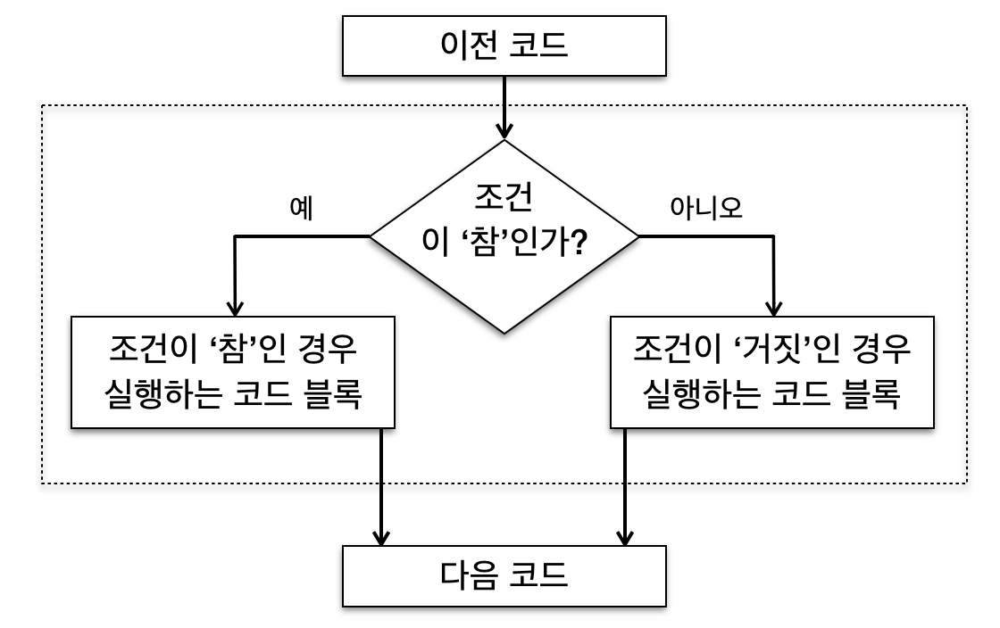
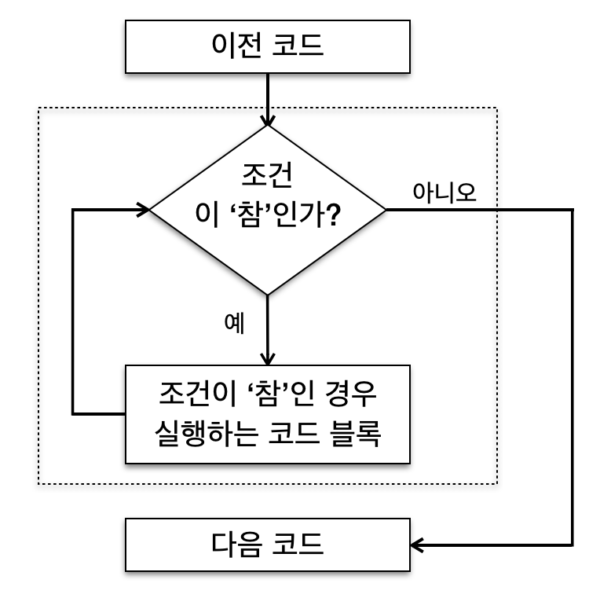
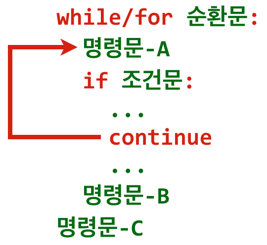

8장: 제어문
===

Control Structures

***

**박 진 수** 교수  
Intelligent Data Semantics Lab  
Seoul National University

***

<h3>Table of Contents<span class="tocSkip"></span></h3>
<div class="toc"><ul class="toc-item"><li><span><a href="#비교-연산자-규칙" data-toc-modified-id="비교-연산자-규칙-1">비교 연산자 규칙</a></span><ul class="toc-item"><li><span><a href="#비교-대상" data-toc-modified-id="비교-대상-1.1">비교 대상</a></span></li><li><span><a href="#연쇄-사용" data-toc-modified-id="연쇄-사용-1.2">연쇄 사용</a></span></li><li><span><a href="#시퀀스-자료형-비교" data-toc-modified-id="시퀀스-자료형-비교-1.3">시퀀스 자료형 비교</a></span></li></ul></li><li><span><a href="#조건문" data-toc-modified-id="조건문-2">조건문</a></span><ul class="toc-item"><li><span><a href="#조건문-개요" data-toc-modified-id="조건문-개요-2.1">조건문 개요</a></span></li><li><span><a href="#조건문-형식" data-toc-modified-id="조건문-형식-2.2">조건문 형식</a></span></li><li><span><a href="#단순-if문" data-toc-modified-id="단순-if문-2.3">단순 <strong>if</strong>문</a></span><ul class="toc-item"><li><span><a href="#Lab:-항목-검색" data-toc-modified-id="Lab:-항목-검색-2.3.1">Lab: 항목 검색</a></span></li></ul></li><li><span><a href="#if-else문" data-toc-modified-id="if-else문-2.4"><strong>if-else</strong>문</a></span><ul class="toc-item"><li><span><a href="#Lab:-if-else문" data-toc-modified-id="Lab:-if-else문-2.4.1">Lab: if-else문</a></span></li></ul></li><li><span><a href="#if-elif-else문" data-toc-modified-id="if-elif-else문-2.5"><strong>if-elif-else</strong>문</a></span><ul class="toc-item"><li><span><a href="#Lab:-if-elif-else문" data-toc-modified-id="Lab:-if-elif-else문-2.5.1">Lab: <strong>if-elif-else</strong>문</a></span></li><li><span><a href="#Lab:-두-정수-비교" data-toc-modified-id="Lab:-두-정수-비교-2.5.2">Lab: 두 정수 비교</a></span></li><li><span><a href="#Lab:-다수의-대안이-주어진-조건문" data-toc-modified-id="Lab:-다수의-대안이-주어진-조건문-2.5.3">Lab: 다수의 대안이 주어진 조건문</a></span></li></ul></li><li><span><a href="#중첩-조건문" data-toc-modified-id="중첩-조건문-2.6">중첩 조건문</a></span><ul class="toc-item"><li><span><a href="#Lab:-나머지-구하기" data-toc-modified-id="Lab:-나머지-구하기-2.6.1">Lab: 나머지 구하기</a></span></li><li><span><a href="#Lab:-많이-쓰는-여러-가지-조건식-작성" data-toc-modified-id="Lab:-많이-쓰는-여러-가지-조건식-작성-2.6.2">Lab: 많이 쓰는 여러 가지 조건식 작성</a></span></li></ul></li><li><span><a href="#간편-조건문" data-toc-modified-id="간편-조건문-2.7">간편 조건문</a></span><ul class="toc-item"><li><span><a href="#Lab:-간편-조건문" data-toc-modified-id="Lab:-간편-조건문-2.7.1">Lab: 간편 조건문</a></span></li><li><span><a href="#Lab:-조건문을-간편-조건문으로-변환" data-toc-modified-id="Lab:-조건문을-간편-조건문으로-변환-2.7.2">Lab: 조건문을 간편 조건문으로 변환</a></span></li></ul></li></ul></li><li><span><a href="#순환문" data-toc-modified-id="순환문-3">순환문</a></span><ul class="toc-item"><li><span><a href="#순환문-개요" data-toc-modified-id="순환문-개요-3.1">순환문 개요</a></span></li><li><span><a href="#while문" data-toc-modified-id="while문-3.2"><strong>while</strong>문</a></span><ul class="toc-item"><li><span><a href="#while문-형식" data-toc-modified-id="while문-형식-3.2.1"><strong>while</strong>문 형식</a></span></li><li><span><a href="#단순-while문" data-toc-modified-id="단순-while문-3.2.2">단순 <strong>while</strong>문</a></span></li><li><span><a href="#while-else문" data-toc-modified-id="while-else문-3.2.3"><strong>while-else</strong>문</a></span></li><li><span><a href="#Lab:-while-else문" data-toc-modified-id="Lab:-while-else문-3.2.4">Lab: <strong>while-else</strong>문</a></span></li><li><span><a href="#Lab:-홀수만-출력하는-while-else문" data-toc-modified-id="Lab:-홀수만-출력하는-while-else문-3.2.5">Lab: 홀수만 출력하는 <strong>while-else</strong>문</a></span></li><li><span><a href="#Lab:-특정-문자열을-출력하는-while-else문" data-toc-modified-id="Lab:-특정-문자열을-출력하는-while-else문-3.2.6">Lab: 특정 문자열을 출력하는 <strong>while-else</strong>문</a></span></li><li><span><a href="#Lab:-최소공배수-구하는-while-else문" data-toc-modified-id="Lab:-최소공배수-구하는-while-else문-3.2.7">Lab: 최소공배수 구하는 <strong>while-else</strong>문</a></span></li></ul></li><li><span><a href="#for문" data-toc-modified-id="for문-3.3"><strong>for</strong>문</a></span><ul class="toc-item"><li><span><a href="#for문-형식" data-toc-modified-id="for문-형식-3.3.1"><strong>for</strong>문 형식</a></span></li><li><span><a href="#단순-for문" data-toc-modified-id="단순-for문-3.3.2">단순 <strong>for</strong>문</a></span><ul class="toc-item"><li><span><a href="#Lab:-for문에서-다양한-순회형-사용" data-toc-modified-id="Lab:-for문에서-다양한-순회형-사용-3.3.2.1">Lab: <strong>for</strong>문에서 다양한 순회형 사용</a></span></li></ul></li><li><span><a href="#range()-클래스" data-toc-modified-id="range()-클래스-3.3.3"><code>range()</code> 클래스</a></span><ul class="toc-item"><li><span><a href="#Lab:-원하는-만큼-for문-반복하기" data-toc-modified-id="Lab:-원하는-만큼-for문-반복하기-3.3.3.1">Lab: 원하는 만큼 <strong>for</strong>문 반복하기</a></span></li></ul></li><li><span><a href="#for-else문" data-toc-modified-id="for-else문-3.3.4"><strong>for-else</strong>문</a></span><ul class="toc-item"><li><span><a href="#Lab:-for-else문과-range()" data-toc-modified-id="Lab:-for-else문과-range()-3.3.4.1">Lab: <strong>for-else</strong>문과 <code>range()</code></a></span></li><li><span><a href="#Lab:-홀수만-출력하는-for-else문" data-toc-modified-id="Lab:-홀수만-출력하는-for-else문-3.3.4.2">Lab: 홀수만 출력하는 <strong>for-else</strong>문</a></span></li><li><span><a href="#Lab:-특정-문자열을-출력하는-for-else문" data-toc-modified-id="Lab:-특정-문자열을-출력하는-for-else문-3.3.4.3">Lab: 특정 문자열을 출력하는 <strong>for-else</strong>문</a></span></li></ul></li><li><span><a href="#Lab:-중첩-for문" data-toc-modified-id="Lab:-중첩-for문-3.3.5">Lab: 중첩 <strong>for</strong>문</a></span></li><li><span><a href="#Lab:-2차원-리스트를-출력하는-중첩-for문" data-toc-modified-id="Lab:-2차원-리스트를-출력하는-중첩-for문-3.3.6">Lab: 2차원 리스트를 출력하는 중첩 <strong>for</strong>문</a></span></li><li><span><a href="#Lab:-구구단-출력" data-toc-modified-id="Lab:-구구단-출력-3.3.7">Lab: 구구단 출력</a></span></li><li><span><a href="#Lab:-윤년-계산기" data-toc-modified-id="Lab:-윤년-계산기-3.3.8">Lab: 윤년 계산기</a></span></li><li><span><a href="#enumerate()-함수" data-toc-modified-id="enumerate()-함수-3.3.9"><code>enumerate()</code> 함수</a></span></li><li><span><a href="#range()-vs.-enumerate()" data-toc-modified-id="range()-vs.-enumerate()-3.3.10"><code>range()</code> vs. <code>enumerate()</code></a></span></li><li><span><a href="#for문과-튜플대입(언패킹)" data-toc-modified-id="for문과-튜플대입(언패킹)-3.3.11"><strong>for</strong>문과 튜플대입(언패킹)</a></span></li><li><span><a href="#for문과-딕셔너리-순회" data-toc-modified-id="for문과-딕셔너리-순회-3.3.12"><strong>for</strong>문과 딕셔너리 순회</a></span><ul class="toc-item"><li><span><a href="#Lab:-딕셔너리-객체-필터링" data-toc-modified-id="Lab:-딕셔너리-객체-필터링-3.3.12.1">Lab: 딕셔너리 객체 필터링</a></span></li></ul></li><li><span><a href="#zip()-함수" data-toc-modified-id="zip()-함수-3.3.13"><code>zip()</code> 함수</a></span></li></ul></li><li><span><a href="#무한-루프" data-toc-modified-id="무한-루프-3.4">무한 루프</a></span></li><li><span><a href="#break와-continue-명령어" data-toc-modified-id="break와-continue-명령어-3.5"><strong>break</strong>와 <strong>continue</strong> 명령어</a></span><ul class="toc-item"><li><span><a href="#break" data-toc-modified-id="break-3.5.1"><strong>break</strong></a></span></li><li><span><a href="#continue" data-toc-modified-id="continue-3.5.2"><strong>continue</strong></a></span></li><li><span><a href="#Lab:-for문-흐름-제어" data-toc-modified-id="Lab:-for문-흐름-제어-3.5.3">Lab: <strong>for</strong>문 흐름 제어</a></span></li><li><span><a href="#Lab:-과일을-검색하는-while-else문(자율-실습-문제)" data-toc-modified-id="Lab:-과일을-검색하는-while-else문(자율-실습-문제)-3.5.4">Lab: 과일을 검색하는 <strong>while-else</strong>문(자율 실습 문제)</a></span></li><li><span><a href="#Lab:-과일을-검색하는-for-else문(자율-실습-문제)" data-toc-modified-id="Lab:-과일을-검색하는-for-else문(자율-실습-문제)-3.5.5">Lab: 과일을 검색하는 <strong>for-else</strong>문(자율 실습 문제)</a></span></li></ul></li></ul></li></ul></div>

# 비교 연산자 규칙

## 비교 대상

비교 연산자는 앞 장에서 설명한 항등 연산자와는 달리 객체의 메모리 주소가 아닌 객체의 **값**을 비교한다. 주로 숫자나 문자열을 비교하는데, 문자열은 유니코드 값을 기준으로 비교하기 때문에 알파벳은 대문자가 소문자보다 먼저 온다.

비교가 불가능한 두 개의 자료형을 비교할 경우, 예를 들어 문자열과 숫자를 비교하면 예외가 발생한다.


```python
'1' > 5
```

하지만 비교 가능한 자료형으로 **형변환**을 할 경우는 예외가 발생하지 않는다.


```python
int('1') > 5
```

## 연쇄 사용 

비교 대상이 어떤 범위 안에 존재하는지 확인할 때, 프로그래밍 언어 대부분은 논리 연산자 **and**(또는 **&**)를 통해 비교 대상을 각각 비교해야 한다. 

예를 들어, **2**가 **1**보다는 크지만 **3**보다는 작은지 확인하기 위해서는 논리 연산자를 최소 한 번 이상 사용해야 한다.


```python
(1 < 2) and (2 < 3)
```

반면 파이썬은 비교 연산자를 여러 개 연결해서 사용할 수 있다. 

이를 '연쇄연결(chaining)'이라 하는데 표현식 하나에 여러 개의 비교 연산자를 연결해서 사용할 수 있어 훨씬 간편하다.


```python
# 한꺼번에 연쇄연결해서 비교할 수 있다.
1 < 2 < 3
```

## 시퀀스 자료형 비교

문자열, 리스트, 튜플과 같은 시퀀스형을 비교하는 규칙은 다음과 같다. 

1. 비교 연산자는 각 시퀀스형의 첫 번째 객체부터 순차로 비교하며, 
1. 첫 번째 객체가 서로 같으면 그 다음 객체를 비교하고, 
1. 그 다음 객체도 같으면 그 다음 객체를 비교해서, 
1. 서로 다른 객체를 발견할 때까지 순서대로 비교한다. 
1. 만약 서로 다른 객체를 발견하면 비교를 멈추고 그 결과를 반환한다. 
1. 그 이후에 있는 객체들은 비교하지 않는다.

**문자열 비교**


```python
'abc' > 'abca'                                
```

**리스트 비교**


```python
[1, 2, 3, 4, 99] > [1, 2, 3, 5]
```


```python
[1, 2, 3, 4, 1] > [1, 2, 3, 4]
```


```python
[1, 2, 3, 4, 5] <= [1, 2, 3, 2, 99]
```


```python
[1, 2, 3, 4, 5] < [1, 2, 3, 99, 2]
```


```python
['apple', 'banana', 'pineapple'] <= ['apple', 'Blueberry', 'plum']
```

**튜플 비교**


```python
('나', '다', '라', '가', '마') >= ('나', '다', '라')
```


```python
('가', '나', '다', '나', '프') > ('가', '너', '다', '나', '프')
```


```python
('아', '야', '어', '여', '오') <= ('아', '야', '어', '나', '흐')
```


```python
('ㄱ', 'ㄴ', 'ㄷ', 'ㄹ', 'ㅁ') < ('ㄱ', 'ㄴ', 'ㄷ', 'ㅁ', 'ㄹ' )
```

# 조건문

## 조건문 개요

조건문은 어떤 조건에 따라 프로그램의 논리가 특정한 방향으로 진행되어야 하는 경우에 사용한다. 주로 두 개 또는 그 이상의 대안이 주어지고 컴퓨터는 조건문의 결과에 따라 이 중 한 개의 명령문을 선택하여 실행한다. 파이썬에서 사용하는 조건문 형태는 **if**문 한 종류뿐이다.

조건문의 기본적인 흐름도는 다음 그림과 같다.




## 조건문 형식

**if**문의 일반 형식은 다음과 같다.  

```code
if 불린-표현식-1: 
    명령문-1
elif 불린-표현식-2: 
    명령문-2
...  
elif 불린-표현식-N:
    명령문-N
else:
    else-명령문
```    

다음과 같은 특징이 있다.
- **if**문은 반드시 있어야 하지만, **elif**문과 **else**문 모두 선택 사항이라 생략할 수 있다.
- **elif**문의 개수는 제한이 없기 때문에 여러 개 작성할 수 있다.
- **else**문은 하나만 올 수 있고 항상 마지막에 와야 한다. 
- **if**문, **elif**문, **else**문의 마지막에는 항상 쌍점(**:**)이 온다. 
- **불린-표현식**인 ***불린-표현식-1***, ..., ***불린-표현식-N***의 값은 '참(**True**)'과 '거짓(**False**)' 둘 중 하나만 갖는다. 
    - 조건문은 위에서부터 아래로 순서로 실행되면서 **불린-표현식**의 값을 평가한다. 
        - **불린-표현식**의 값이 '참'이면 해당 명령문(***명령문-1***, ..., ***명령문-N***)을 실행한다. 
        - **불린-표현식** 모두가 '거짓'이면 마지막에 있는 **else**-명령문을 실행한다.

## 단순 **if**문

**if**문만 있고 **elif**문과 **else**문이 없는 조건문을 작성해보자.


```python
if True:
    print('참')
```


```python
if False:
    print('거짓')
```


```python
i = input('숫자(정수)를 입력하세요: ')
if int(i) > 0:
    print('입력한 숫자는 양의 정수입니다.')
```

### Lab: 항목 검색

아래와 같은 튜플을 생성하여 변수 ***t***에 할당한 후 ***t***를 출력한다.
- **1, 3, 5, 7, 'a', 'b', 'c'**


**5**가 ***t***에 있으면 '5 is in t'를 출력한다.

'**d**'가 ***t***에 있으면 'd is in t'를 출력한다.

**실행 예**

```code
> python in.py
(1, 3, 5, 7, 'a', 'b', 'c')
5 is in t
```

## **if-else**문

다음 코드는 **if-else**문을 사용한 예다.


```python
i = int(input('숫자(정수)를 입력하세요: '))
if i > 0:
    print('입력한 숫자는 양의 정수입니다.')
else:
    print('입력한 숫자는 양의 정수가 아닙니다.')
```

### Lab: if-else문

**input()** 함수를 사용해 사용자로부터 어떤 값을 입력받는다. 입력 값이 **on**이면 숫자 **1**을 출력하고 그 이외의 경우에는 항상 숫자 **0**을 출력하는 코드를 작성한다. 

**실행 예**

```code
> python onoff.py
조건(on/off)을 입력하세요...: on
1

> python onoff.py
조건(on/off)을 입력하세요...: off
0

> python onoff.py
조건(on/off)을 입력하세요...: 59
0
```

## **if-elif-else**문

이번에는 **if-elif-else**문을 작성해보자.


```python
prompt = '정수를 입력하세요: '
result = '둘 중 더 큰 수는 {}입니다.'

x = input(prompt)
y = input(prompt)

if int(x) > int(y):
    print(result.format(x))
elif int(x) < int(y):
    print(result.format(y))
else:
    print('같은 숫자군요.')
```

### Lab: **if-elif-else**문

**input()** 함수를 사용해 사용자로부터 어떤 값을 입력받는다. 입력 값이 **on**이면 숫자 **1**을, **off**이면 **-1**을, 그 이외에는 항상 **0**을 출력하는 코드를 작성한다. 

**실행 예**

```code
> python onoff2.py
조건(on/off)을 입력하세요...: on
1

> python onoff2.py
조건(on/off)을 입력하세요...: off
-1

> python onoff2.py
조건(on/off)을 입력하세요...: hi
0

> python onoff2.py
조건(on/off)을 입력하세요...: 파이썬
0
```

### Lab: 두 정수 비교

**input()** 함수를 사용해 사용자로부터 두 정수 값을 입력받아 변수 ***x***와 ***y***에 할당한다.

입력받은 두 변수의 값을 비교하여 그 결과를 다음과 같이 출력한다.
- 만약 ***x***가 ***y***보다 크면 'x가 y보다 큽니다.'를 출력한다.
- 만약 ***x***가 ***y***보다 작다면 'x가 y보다 작습니다.'를 출력한다.
- 만약 ***x***와 ***y***가 같다면 'x와 y가 같습니다'를 출력한다.    

**실행 예**

```code
> python compare_integer.py
x를 입력하세요:  7
y를 입력하세요:  5
x가 y보다 큽니다.

> python compare_integer.py
x를 입력하세요:  -11
y를 입력하세요:  2
x가 y보다 작습니다.

> python compare_integer.py
x를 입력하세요:  9
y를 입력하세요:  9
x와 y가 같습니다.
```

### Lab: 다수의 대안이 주어진 조건문

**input()** 함수를 사용해 사용자로부터 색깔과 관련된 영어 단어를 입력받아 한글로 번역하는 조건문을 작성한다.

이 조건문은 다음 영어 단어에 대한 한글 번역만 가능하다.
- red -> 빨강, blue -> 파랑, green -> 초록, white -> 하양, black -> 검정

그 이외, 즉 위 다섯 색깔에 포함되지 않으면 '번역할 수 없습니다.'를 출력한다.

조건문을 빠져나온 후 '조건문을 빠져나왔습니다.'를 출력한다.


**NOTE**  
- **if/elif/else**로 구성된 코드에서 한 개 이상의 조건문을 만족하면, 전체 조건문 밖으로 빠져나가게 된다.
    - 즉, 만족하는 조건문이 여러 개가 존재해도, 가장 처음 마주치는 단 한 개의 조건문만 실행할 수 있다.
- **elif** 구문이 하나에 조건문에 들어갈 수 있는 개수의 제한은 없다.  
- 그러나 **if**와 **else**는 하나의 조건문에 1개 이상 들어갈 수 없다. 

**실행 예**

```code
> python pickcolor.py 
Choose a color: red
빨강
조건문을 빠져나왔습니다.

> python pickcolor.py 
Choose a color: green
초록
조건문을 빠져나왔습니다.

> python pickcolor.py 
Choose a color: gray
번역할 수 없습니다.
조건문을 빠져나왔습니다.
```

## 중첩 조건문

조건문 안에 조건문을 넣아 작성할 수 있다.


```python
prompt = '정수를 입력하세요: '
result = '둘 중 더 큰 수는 {}입니다.'

x = input(prompt)
y = input(prompt)

if x == y:
    print('같은 숫자군요.')
else:
    if x > y:
        print(result.format(x))
    else:
        print(result.format(y))
```

### Lab: 나머지 구하기

**input()** 함수를 사용해 사용자로부터 두 정수 값을 입력받아 변수 ***x***와 ***y***에 할당한다.

***x***를 ***y***로 나눈 후
- 만약 나머지가 **0**이면 'zero'를 출력한다.
- 만약 나머지가 **0**이 아니고
    - 짝수이면 'even'을 출력한다.
    - 홀수이면 'odd'를 출력한다.

**실행 예**

```code
> python modulus_odd_even.py
x를 입력하세요:  20
y를 입력하세요:  5
zero

> python modulus_odd_even.py
x를 입력하세요:  20
y를 입력하세요:  7
even

> python modulus_odd_even.py
x를 입력하세요:  15
y를 입력하세요:  7
odd
```

### Lab: 많이 쓰는 여러 가지 조건식 작성

임의의 lectures = ['math', 'sports', 'english', 'science', 'economics', ... ]를 만들어 변수 ***lectures***를 출력한다.

그리고 다음 조건을 만족하는 코드를 작성하고 결과를 출력한다.
- (조건 1) 배우는 과목의 숫자가 4개 이하일 경우 'fail', 5개일 경우 'pass', 그리고 5개 이상일 경우 'liar'를 출력한다.
- (조건 2) science와 math가 모두 ***lectures***에 존재하면 '이과', 그렇지 않으면 '문과'를 출력한다.
- (조건 3) sports 또는 music 중 하나 이상이 ***lectures***에 존재하면 '예체능', 그렇지 않으면 '일반'을 출력한다.

**Note: 조건식 표현법**
- ***a***와 ***b***가 같다 :  *a* **==** *b*   
- ***a***가 ***b***보다 크거나(작거나) 같다 : *a* **>=**(**<=**) *b*   
- ***x***가 ***a***에 포함된다 : *x* **in** *a*  
- ***a*** 또는 ***b*** :  *a* **or** *b*   
- ***a*** 그리고 ***b*** : *a* **and** *b*  

**실행 예**

```code
> python multiconditions.py 
['math', 'sports', 'english', 'science', 'economics']
pass
이과
예체능
```

## 간편 조건문

**간편 조건문**이란?  
- 간편하게 한 줄로 작성할 수 있는 조건문을 말한다.

간편 조건문을 작성하는 일반적인 형식은 다음과 같다.

**`표현식-1 if 불린-표현식 else 표현식-2`**  

***불린-표현식***이 '참(**True**)'이면 ***표현식-1***을 실행하고 '거짓(**False**)'이면 ***표현식-2***를 실행한다. 

예를 들어 특정 점수를 넘기면 통과(pass) 점수인 'P'를 부여하고, 그 점수를 넘기지 못하면 실패(fail) 점수인 'F'를 부여하는 코드가 있다고 하자.


```python
score = 72

if score > 60:
    grade = 'P'
else:
    grade = 'F'
    
print(grade)    
```

같은 내용의 코드를 간편 조건문으로 작성하면 다음과 같다.


```python
score = 55
grade = 'P' if score > 60 else 'F'
print(grade)
```

**따라해보기**

아직 **for**문을 배우지는 않았지만 다음 코드를 따라해보고 간편 조건문이 어떯게 작동하는지 반드시 이해하도록 하자.


```python
for count in range(5):
    print('{} file{}'.format((count if count != 0 else 'No'),
                             ('s' if count != 1 else '')))
```

### Lab: 간편 조건문

두 수를 입력받아 두 수가 같은 값이면 '둘은 같은 숫자입니다.'를, 다른 값이면 '둘은 다른 숫자입니다.'를 출력하는 조건문을 간편 조건문으로 작성해보자.

**실행 예**

```code
> python simple_if.py
숫자를 입력하세요: 5
숫자를 입력하세요: 9
둘은 다른 숫자입니다.
```

### Lab: 조건문을 간편 조건문으로 변환

다음 코드를 간편 조건문으로 바꿔보자.


```python
margin = False

if margin:
    width = 100 + 10
else:
    width = 100 + 0

print(width)
```

# 순환문

## 순환문 개요

**순환문**(loop)이란?
- 특정 조건을 충족하는 동안 작업을 계속 반복 실행하는 일련의 명령이다. 
- '반복문 이라고도 부른다.

일반적으로 순환문은 미리 정해 놓은 조건을 만족하면 일련의 명령문들을 실행한다. 그리고 다시 돌아가서 조건을 만족하는지 검사한다. 조건을 만족하면 다시 같은 작업을 반복 실행한다. 만약 더 이상 조건을 만족하지 않으면 순환문을 빠져나가게 된다.


파이썬에서 사용하는 순환문 형태로는 두 가지가 있다.

**while**문
- 주어진 조건이 '참'인 동안 **while**문에 속한 명령문을 반복적으로 실행한다.

**for**문
- 주어진 조건이 '참'인 동안 **for**문에 속한 명령문을 반복적으로 실행한다.


순환문의 기본적인 흐름도는 다음 그림과 같다.


## **while**문

### **while**문 형식

**while**문의 일반 형식은 다음과 같다.

```code
while 불린-표현식: 
    while-명령문
else:
    else-명령문</pre></b>
```    

다음과 같은 특징이 있다.
- **while**문에 있는 ***불린-표현식***이 '참(**True**)'이면, ***while-명령문***을 실행한다. 
    - ***불린-표현식***이 '거짓(**False**)'일 때 까지 ***while-명령문***을 반복해서 실행한다.
- **while**문에 있는 ***불린-표현식***이 '거짓(**False**)'이면, **while**문을 종료하고 **else**문의 ***else-명령문***을 실행한다.
    - 즉, **while**문을 정상적으로 종료했다면 **else**문은 반드시 실행된다.     
- ***else-명령문***을 실행한 후, **while**문이 종료된다.
- 다음 두 가지 경우에는 **else**문이 실행되지 않는다.
    - **while**문이 **break** 또는 **return**에 의해 종료된다.
    - **while**문 실행 중 **예외**(exception)가 발생한다.    
- **else**문 실행 규칙은 아래 명령문에 모두 적용된다.
    - **while**문
    - **for**문
    - **try-except**문
- **else**문은 선택 사항이다.
- **while**과 **else**의 마지막에는 쌍점(**:**)이 온다. 

### 단순 **while**문

**while**문만 있고 **else**문이 없는 순환문을 작성해보자.

다음 예는 **while**문을 사용해 '안녕 파이썬'을 다섯 번 출력한다.


```python
i = 0
while i < 5:
    print('안녕 파이썬')
    i += 1
```

**[따라해보기]** 다음 예는 **while**문을 10번 반복해서 실행하면서 숫자를 출력한다.


```python
i = 0          # 센티널 변수를 0으로 초기화한다.  
while i < 10:
    print(i)
    i += 1     # 센티널 값을 1 증가시킨다.
```

**while**문을 이용해 시퀀스형이 담고 있는 객체들을 꺼집어 내어 처리할 수도 있다. 

**[따라해보기]** 다음 예는 튜플을 순회하면서 객체를 하나씩 꺼내어 출력한다.


```python
t = tuple('abcdefg')
print(t)
```


```python
i = 0  # 센티널 변수로 리스트의 인덱스로 사용한다.
while i < len(t):
    print(t[i])
    i += 1
```

### **while-else**문

이번에는 **while-else**문을 작성해보자.

다음 예는 **while**문을 이용해 1부터 10까지 숫자를 더한 후 그 결과를 출력하는 코드다.


```python
total = 0
i = 0
while i < 10:  # 명령문을 10회 반복해서 수행한 후 종료한다.
    i += 1
    total += i
else:          # 결과를 출력한다.
    print('1부터 10까지의 합은 {}입니다.'.format(total))
```

다음 예는 튜플에 들어있는 정수들의 합을 구해 출력한다.


```python
integers = 2, 8, 3, 5, 10, 27
total = 0
i = 0
while i < len(integers):     # 리스트의 모든 항목을 처리한 후 종료한다.
    total += integers[i]     # 리스트 인데스 0부터 len(integers) - 1, 즉 전체 객체의 합을 구한다.
    i += 1                   # 리스트 인덱스 번호를 1 증가시킨다.
else:                        # 결과를 출력한다.
    print('튜플에 들어있는 숫자의 합은 {}입니다.'.format(total))
```

다음 예는 **while**문을 이용해 메뉴를 선택해서 실행할 수 있게 한다.


```python
menu = '''1. 학생 추가
2. 학생 삭제
3. 학생 목록 보기
4. 종료'''

number = ''
while number != '4':
    print(menu)
    number = input('메뉴 번호를 입력하세요: ')
    if number in '1234':
        print('{}번 메뉴를 선택했습니다.\n'.format(number))
    else:
        print('{}번은 없는 메뉴 번호입니다.\n'.format(number))
else:              
    print('Bye~~')
```

**[따라해보기]** 지금까지의 예는 특정 횟수까지 **while**문을 반복한 후 종료했다면, 이번에는 횟수에 상관없이 조건이 '거짓'이면 실행을 중단하고 **while**문을 빠져 나가는 프로그램을 작성해보자.


```python
import random
fruits = ['사과', '딸기', '바나나', '블루베리', '포도']
fruit = ''
while fruit != '블루베리':
    # 리스트가 담고 있는 객체 중 하나를 무작위로 선택한다.
    fruit = random.choice(fruits)  
    print(fruit)
else:
    print('블루베리가 선택되어 프로그램을 종료합니다.')
```

**[따라해보기]** 이번에는 **break** 명령어를 사용해서 임의로 선택한 항목이 '블루베리'인 경우 이것을 출력하지 않고 바로 **while**문을 종료하는 프로그램을 작성해보자. 이 경우 **while**문이 **break**에 의해 종료되기 때문에 **else**문은 실행되지 않는다.


```python
import random
fruits = ['사과', '딸기', '바나나', '블루베리', '포도']
fruit = ''
while fruit != '블루베리':
    fruit = random.choice(fruits)
    print(fruit)
    if fruit == '블루베리':
        break
else:  # else문은 절대 실행되지 않는다.
    print('블루베리가 선택되어 프로그램을 종료합니다.')  
```

### Lab: **while-else**문

변수 ***number***를 **0**으로 초기화한다.

***number***가  **10**보다 작으면 '10보다 작습니다.'를 출력하면서, ***number***를 **1**씩 증가시킨다. 

***number***가 **10** 이상이 되면 '종료'를 출력하면서 **while**문을 빠져나간다. 

**실행 예**

```code
> python simple_while.py 
10보다 작습니다.
10보다 작습니다.
10보다 작습니다.
10보다 작습니다.
10보다 작습니다.
10보다 작습니다.
10보다 작습니다.
10보다 작습니다.
10보다 작습니다.
10보다 작습니다.
종료
```

### Lab: 홀수만 출력하는 **while-else**문

정수 **1**부터 **10**까지 포함하고 있는 튜플(또는 리스트)를 생성한 후 변수 ***integers***에 할당한다.

**while**문으로 튜플(또는 리스트)를 순환해서 홀수만 출력한다.
- 홀수는 **x % 2**로 구할 수 있다.

튜플(또는 리스트)의 객체를 모두 순회한 후 '종료'를 출력하면서 **while**문을 빠져나간다.

**실행 예**

```code
> python while_odd.py 
1
3
5
7
9
종료
```

### Lab: 특정 문자열을 출력하는 **while-else**문 

아래 문자열을 담고 있는 튜플(또는 리스트)를 생성한다.  
- **'red', 'blue', 'pink', 'green', 'yellow', 'purple'**

튜플(또는 리스트)가 담고 있는 문자 중 'p'로 시작하는 문자열만 출력한다. 튜플(또는 리스트)의 객체를 모두 순회한 후 "더 이상 'p'로 시작하는 문자열이 없습니다."를 출력하면서 **while**문을 빠져나간다.

**실행 예**

```code
> python while_if.py
pink
purple
더 이상 'p'로 시작하는 문자열이 없습니다.
```

### Lab: 최소공배수 구하는 **while-else**문

서로 다른 임의의 정수 3개를 입력 받는다.

이 세 정수의 최소공배수를 찾아내고, '최소공배수는 ***X***입니다.'를 출력하면서 종료한다.
- ***X***는 여기서 찾아낸 최소공배수를 의미한다.

최소공배수(least common multiple)란 2개 이상의 수의 공배수 가운데서 최소인 것을 말한다.
- 공배수란 두 개 이상의 자연수의 공통인 배수를 말한다.
- 예) **2**, **3**, **9**의 최소공배수는 **18**이다. 
    
**힌트** 
- ***i***를 입력받은 세 수로 각각 나누어 나머지가 모두 **0**이 될 때까지 연산한다.

**실행 예**  

```code
> python lcm.py 
첫번째 숫자를 입력하세요: 2
두번째 숫자를 입력하세요: 3
세번째 숫자를 입력하세요: 9
최소공배수는 18입니다.
```

## **for**문

### **for**문 형식

**for**문의 일반 형식은 다음과 같다.

```code
for 변수 in 순회형: 
    for-명령문
else:
    else-명령문</pre></b>
```

다음과 같은 특징이 있다.
- ***순회형***에 들어 있는 객체들을 처음부터 마지막까지 추출해서 차례로 ***변수***에 할당한 후 ***for-명령문***을 실행한다.
- ***변수***는 ***순회형***에서 가져온 객체를 참조하는 하나의 변수일 수도 있고, 복합 변수일 수도 있다. 복합 변수면 주로 튜플을 사용한다.
- **for**문을 종료한 후 **else**문의 ***else-명령문***을 실행한다.
    - 즉, **for**문이 정상적으로 종료되었다면 **else**문은 반드시 실행된다. 
- ***else-명령문***을 실행한 후, **for**문이 종료된다.
- 다음 두 가지 경우에는 **else**문이 실행되지 않는다.
    - **for**문이 **break** 또는 **return**에 의해 종료될 때
    - **for**문 실행 중 **예외**(exception)가 발생할 때    
- **else**문은 선택 사항이다.
- **for**와 **else**의 마지막에는 쌍점(**:**)이 온다. 

**for**문의 실행 순서는 다음과 같다.

1. ***변수***는 ***순회형*** 자료의 제일 앞에 있는 객체를 할당 받는다.
1. ***for-명령문***을 실행한다.
1. ***변수***는 이전에 받은 객체의 바로 다음 객체를 할당 받는다.
1. ***for-명령문***을 실행한다.
1. ... 반복 ...
1. 최종적으로 ***순회형***의 마지막 객체까지 ***변수***에 할당되면, **for**문을 종료하고 **else**문의 ***else-명령문***을 실행한다.
1. ***else-명령문***을 실행한 후, **for**문이 종료한다.  

### 단순 **for**문

**for**문만 있고 **else**문이 없는 순환문을 작성해보자.

다음 예는 리스트를 순회하면서 문자열을 하나씩 꺼내어 출력한다.


```python
for i in ['a', 'b', 'c', 'd', 'e']:
    print(i)
```

**NOTE**  
- **for 변수 in 순회형:** 구문에서 ***변수***는 ***순회형***에 들어있는 객체의 실제 값(value)을 가져온다. 
- ***변수***가 인덱스 값을 가져오는 것이 아님을 명심하자.  

#### Lab: **for**문에서 다양한 순회형 사용

다음과 같은 6가지 자료형을 생성한다.  

```code
t = 0, 1, 2, 3, 4
L = [5, 6, 7, 8, 9]
s = set('가나다라마')
d = {'a': 1,'b': 2,'c': 3, 'd': 4, 'e': 5}
text = 'Hello Python!'
num = 10</pre></b>
```

각 자료형을 **for**문에 적용하여, **for**문의 전달인자를 출력해보자.
- **for**문의 전달인자는 **for** ***변수*** **in** ***순회형***:에서 ***변수***를 의미한다.
- 출력 형식은 자유롭게 선택한다.

자료형에 따라 어떠한 전달인자가 선택되는지 비교해 본다. 

**튜플**

다음 자료형을 생성한 후 **for**문으로 모든 객체를 출력한다.

```code
t = 0, 1, 2, 3, 4
```

**실행 예**

```code
> python for_iterables.py 
0
1
2
3
4
```

**리스트**

다음 자료형을 생성한 후 **for**문으로 모든 객체를 출력한다.

```code
L = [5, 6, 7, 8, 9]
```


**실행 예**

```code
> python for_iterables.py 
5
6
7
8
9
```

**세트**

다음 자료형을 생성한 후 **for**문으로 모든 객체를 출력한다.

```code
s = set('가나다라마')
```


**실행 예**

```code
> python for_iterables.py 
나
가
마
라
다
```

**딕셔너리**

다음 자료형을 생성한 후 **for**문으로 사용해 모든 객체를 다음 순서대로 출력한다.

```code
d = {'a': 1,'b': 2,'c': 3, 'd': 4, 'e': 5}
```

'키'만 출력한다.

**실행 예**

```code
> python for_iterables.py 
a
b
c
d
e
``` 

'매핑값'만 출력한다.

**실행 예**

```code
> python for_iterables.py 
1
2
3
4
5
```
    
'키'와 '매핑값' 쌍을 출력한다.

**실행 예**

```code
> python for_iterables.py 
('a', 1)
('b', 2)
('c', 3)
('d', 4)
('e', 5)
```

**문자열**

다음 자료형을 생성한 후 **for**문으로 모든 객체를 출력한다.

```code
text = 'Hello Python!'
```


**실행 예**

```code
> python for_iterables.py 
H
e
l
l
o
      
P
y
t
h
o
n
!
```

**숫자**

다음 자료형을 생성한 후 **for**문으로 모든 객체를 출력한다.

```code
num = 10
```


**실행 예**

```code
> python for_iterables.py
?
```

### `range()` 클래스

`range()`는 **for**문에서 흔히 사용하는 클래스다. 특히 특정 횟수만큼 **for**문을 반복해서 실행할 때 매우 유용하게 쓰인다. 

`range()`는 다음과 같은 경우에 많이 사용한다. 􏰅
- 정수를 담은 리스트 또는 튜플을 생성할 때
- **􏰅for**  순환문에서 순회할 횟수를 정해야 할 때

`range()`는 지정한 범위 안에서 정수를 생성할 수 있는 순회자(iterator)를 반환한다. 


```python
range(10)       # 10개의 정수를 담은 순회자(iterator)를 반환한다.
```

따라서 `range()`의 전달인자는 반드시 정수여야 하며, 전달인자 개수에 따라 처리하는 정수의 범위도 달라 진다.

**`range(끝번호􏰆􏰇􏰈)`**

- 하나의 정수를 지정하면, **0**부터 ***끝번호***􏰆􏰇􏰈 **- 1**까지의 정수를 담은 순회자를 반환한다. 
- 즉, 0, 1, 2, 3, ..., ***끝번호*** **- 1**을 반환한다.


```python
# 순회자를 반환하기 때문에 생성한 정수를 사용하려면 형변환을 해야 한다.
list(range(10))  # 0부터 10 - 1까지
```

**`􏰅range(시작번호, 끝번호)`**

- 두 개의 정수를 지정하면, ***시작번호***부터 ***끝번호*** **- 1**까지의 정수를 담은 순회자를 반환한다. 
- 즉, ***시작번호***, ***시작번호*** **+ 1**, ..., ***끝번호*** **- 1**을 반환한다.


```python
list(range(1, 10))  # 1부터 10 - 1까지
```

**`range(시작번호, 끝번호, 폭)`**

- 세 개의 정수를 지정하면, ***시작번호***부터 ***끝번호*** **- 1**까지 ***폭***만큼 간격으로 생성한 정수를 담은 순회자를 반환한다. 
- 즉, ***시작번호***, ***시작번호*** **+** ***폭***, ..., ***끝번호*** **- 1**을 반환한다. 
    - 이때 ***폭***􏰊의 크기에 따라 ***끝번호*** **- 1**은 포함하지 않을 수도 있다.


```python
list(range(1, 10, 2))
```


```python
list(range(9, 0, -1))
```


```python
tuple(range(15, -21, -5))
```

**for**문에서 순회형 값을 처리할 때 `range()`를 사용하면 코드가 훨씬 간결해진다.


다음 예는 **for**문을 사용해 '안녕 파이썬'을 다섯 번 출력한다.


```python
for i in range(5):
    print('안녕 파이썬')
```


```python
# --- while문
i = 0
while i < 5:
    print('안녕 파이썬')
    i += 1
```

#### Lab: 원하는 만큼 **for**문 반복하기

임의의 정수 ***n***을 입력받는다. 

`print()` 함수로 높이와 밑변을 ***n***으로 갖는 직각 삼각형을 그려보자. 


**힌트**
- `range()` 함수를 활용하자.
- `print('#' * 정수)` 형식으로 출력하자. 

**실행 예**

```code
> python right_triangle.py 
반복 횟수를 입력하세요: 5
#
# #
# # #    
# # # #   
# # # # #
```

### **for-else**문

다음 코드는 **for-else**문을 사용한 예다.

**따라해보기**

**for**문을 이용해 1부터 10까지 숫자를 더한 후 그 결과를 출력해보자.


```python
total = 0
for i in range(1, 11): # 1부터 10까지 정수를 생성해서 차례로 i에 할당한다.
    total += i         # i를 차례로 합산한다.
else:                  # 결과를 출력한다.
    print('1부터 10까지의 합은 {}입니다.'.format(total))
```


```python
# --- while문
total = 0
i = 0
while i < 10:  # 명령문을 10회 반복해서 수행한 후 종료한다.
    i += 1
    total += i
else:          # 결과를 출력한다.
    print('1부터 10까지의 합은 {}입니다.'.format(total))
```

다음 예는 튜플에 들어있는 정수들의 합을 구해 출력한다.


```python
integers = 2, 8, 3, 5, 10, 27
total = 0
for item in integers:  # 리스트의 모든 객체를 처음부터 끝까지 하나씩 꺼내 item에 할당한다.
    total += item
else:                  # 결과를 출력한다.
    print('튜플에 들어있는 숫자의 합은 {}입니다.'.format(total))
```


```python
# --- while문
integers = 2, 8, 3, 5, 10, 27
total = 0
i = 0
while i < len(integers):     # 리스트의 모든 항목을 처리한 후 종료한다.
    total += integers[i]     # 리스트 인데스 0부터 len(integers) - 1, 즉 전체 객체의 합을 구한다.
    i += 1                   # 리스트 인덱스 번호를 1 증가시킨다.
else:                        # 결과를 출력한다.
    print('튜플에 들어있는 숫자의 합은 {}입니다.'.format(total))
```

#### Lab: **for-else**문과 `range()`

**for**문에서 `range()`를 사용해서 0~9까지 정수를 하나씩 가져와 10을 곱한 결괏값을 출력한다.

생성한 값을 모두 순회한 후 '종료'를 출력하면서 **for**문을 종료한다.

**실행 예시**

```code
> python for_range.py 
0
10
20
30
40
50
60
70
80
90
종료
```

#### Lab: 홀수만 출력하는 **for-else**문

**while**문 대신 **for**문을 사용해서 <Lab: 홀수만 출력하는 **while-else**문>를 구현해보자.

정수 **1~10**까지 포함하고 있는 튜플(또는 리스트)를 생성한 후 변수 ***integers***에 할당한다.

**for**문으로 튜플(또는 리스트)를 순회하면서 홀수만 출력한다.
- 홀수는 `i % 2`로 구할 수 있다.

튜플(또는 리스트)의 객체를 모두 순회한 후 '종료'를 출력하면서 **for**문을 빠져나간다.

**실행 예**

```code
> python for_odd.py 
1
3
5
7
9
종료
```

#### Lab: 특정 문자열을 출력하는 **for-else**문

**while**문 대신 **for**문을 사용해서 <Lab: 특정 문자열을 출력하는 **while-else**문>을 구현해보자.

아래 문자열을 담고 있는 튜플(또는 리스트)를 생성한다.  
- 'red', 'blue', 'pink', 'green', 'yellow', 'purple'

튜플(또는 리스트)가 담고 있는 문자 중 'p'로 시작하는 문자열만 출력한다. 튜플(또는 리스트)의 객체를 모두 순회한 후 "더 이상 'p'로 시작하는 문자열이 없습니다."를 출력하면서 **for**문을 빠져나간다.

**실행 예**

```code
> python for_if.py
pink
purple
더 이상 'p'로 시작하는 문자열이 없습니다.
```

### Lab: 중첩 **for**문

다음과 같이 자료형을 구성한다.

```code
color = ['하얗고', '까맣고', '빨갛고', '노랗고']
taste = ['달콤한', '짭짤한', '매콤한', '고소한']
food = ['라면', '피자', '치킨', '햄버거']
```

`color + taste + food` 형식으로 표현 가능한 모든 음식을 출력해보자.
- 예) 빨갛고 달콤한 햄버거, 까맣고 고소한 치킨 ... 등

**실행 예**

```code
> python for_nested.py 
하얗고 달콤한 라면
하얗고 달콤한 피자
하얗고 달콤한 치킨
하얗고 달콤한 햄버거
하얗고 짭짤한 라면
하얗고 짭짤한 피자
...
노랗고 매콤한 치킨
노랗고 매콤한 햄버거
노랗고 고소한 라면
노랗고 고소한 피자
노랗고 고소한 치킨
노랗고 고소한 햄버거
```

### Lab: 2차원 리스트를 출력하는 중첩 **for**문

알파벳 대문자(**A~O**)로 이루어진 3행(row) 5열(column)의 2차원 리스트를 생성한 후 출력한다.
- 3 by 5(3, 5)의 2차원 리스트란 각 행(리스트)이 5개의 데이터를 가지고 있는 중첩리스트다.

2차원 리스트 각 행의 대문자를 모두 소문자로 바꾸어 출력한다.

이 때 행 별로 한 줄씩 출력한다.

    
**실행 예**

```code
> python list-2d.py
[['A', 'B', 'C', 'D', 'E'], ['F', 'G', 'H', 'I', 'J'], ['K', 'L', 'M', 'N', 'O']]

a b c d e   
f g h i j   
k l m n o
```

### Lab: 구구단 출력

**for**문과 `range()`, `format()`을 사용하여 구구단을 출력한다.

**실행 예**

```code
> python multiplication_table.py
1 × 1 = 1
1 × 2 = 2
...
1 × 9 = 9

2 × 1 = 2
2 × 2 = 4
...
2 × 9 = 18

...

9 × 1 = 9
9 × 2 = 18
...
9 × 9 = 81
```

### Lab: 윤년 계산기

**for**문에서 **range()** 클래스를 사용하여 윤년 계산을 한 후 그 결과를 리스트에 담아 출력한다.

윤년 계산 규칙은 다음과 같다.(<https://ko.wikipedia.org/wiki/윤년>)
- 그 해의 숫자가 **4**로 나누어 떨어지는 해는 윤년으로 한다.
    - 예) 1988년, 1992년, 1996년, 2004년, 2008년, 2012년, ...
- 그 해의 숫자가 **4**로 나누어지지만 **100**으로도 나누어지면 평년으로 한다.
    - 예) 1900년, 2100년, 2200년, 2300년, 2500년, ...
- 그 해의 숫자가 **100**으로 나누어지지만 **400**으로도 나누어지면 윤년으로 한다.
    - 예) 1600년, 2000년, 2400년, ...

**실행 예**

2000년에서 3000년 사이(둘 다 포함)

```code
> python leap_year.py
[2000, 2004, 2008, 2012, 2016, 2020, 2024, 2028, 2032, 2036, 2040, 2044, 2048, 2052, 2056, 2060, 2064, 2068, 2072, 2076, 2080, 2084, 2088, 2092, 2096, 2104, 2108, 2112, 2116, 2120, 2124, 2128, 2132, 2136, 2140, 2144, 2148, 2152, 2156, 2160, 2164, 2168, 2172, 2176, 2180, 2184, 2188, 2192, 2196, 2204, 2208, 2212, 2216, 2220, 2224, 2228, 2232, 2236, 2240, 2244, 2248, 2252, 2256, 2260, 2264, 2268, 2272, 2276, 2280, 2284, 2288, 2292, 2296, 2304, 2308, 2312, 2316, 2320, 2324, 2328, 2332, 2336, 2340, 2344, 2348, 2352, 2356, 2360, 2364, 2368, 2372, 2376, 2380, 2384, 2388, 2392, 2396, 2400, 2404, 2408, 2412, 2416, 2420, 2424, 2428, 2432, 2436, 2440, 2444, 2448, 2452, 2456, 2460, 2464, 2468, 2472, 2476, 2480, 2484, 2488, 2492, 2496, 2504, 2508, 2512, 2516, 2520, 2524, 2528, 2532, 2536, 2540, 2544, 2548, 2552, 2556, 2560, 2564, 2568, 2572, 2576, 2580, 2584, 2588, 2592, 2596, 2604, 2608, 2612, 2616, 2620, 2624, 2628, 2632, 2636, 2640, 2644, 2648, 2652, 2656, 2660, 2664, 2668, 2672, 2676, 2680, 2684, 2688, 2692, 2696, 2704, 2708, 2712, 2716, 2720, 2724, 2728, 2732, 2736, 2740, 2744, 2748, 2752, 2756, 2760, 2764, 2768, 2772, 2776, 2780, 2784, 2788, 2792, 2796, 2800, 2804, 2808, 2812, 2816, 2820, 2824, 2828, 2832, 2836, 2840, 2844, 2848, 2852, 2856, 2860, 2864, 2868, 2872, 2876, 2880, 2884, 2888, 2892, 2896, 2904, 2908, 2912, 2916, 2920, 2924, 2928, 2932, 2936, 2940, 2944, 2948, 2952, 2956, 2960, 2964, 2968, 2972, 2976, 2980, 2984, 2988, 2992, 2996]
```

### `enumerate()` 함수

`enumerate()` 함수를 사용하는 형식은 다음과 같다.

**`enumerate(순회형, start=0)`**

다음과 같은 특징이 있다.

- ***순회형*** 자료를 전달인자로 받아, ***순회형***이 담은 개별 객체와 각 객체의 순서(인덱스 번호)를 `(순번, 객체)`􏳆􏲍 형식의 쌍으로 순회할 수 있는 열거형(enumerate) 객체를 반환한다.

- ***start***는 첫 번째 객체의 **시작 번호**다. 선택해서 사용할 수 있는 ***start***의 기본값은 **0**이지만 다른 값으로 대체할 수 있다.

**따라해보기**


```python
L = ['a', 'b', 'c']
for i, k in enumerate(L):
    print(i, k)
```


```python
items = tuple('abcdefg')
print(items)
```


```python
x = enumerate(items)  # 열거형 객체(순회자)를 반환한다.
type(x)
```


```python
# --- items = 'a', 'b', 'c', 'd', 'e', 'f', 'g'
for i in enumerate(items):  # 시작 번호는 기본값인 0으로 한다.
    print(i)                # (인덱스, 객체)의 튜플 쌍으로 순화한다.
```


```python
# --- items = 'a', 'b', 'c', 'd', 'e', 'f', 'g'
for index, item in enumerate(items):  # 튜플 언패킹
    print(index, ':', item)
```


```python
# --- items = 'a', 'b', 'c', 'd', 'e', 'f', 'g'
for index, item in enumerate(items, start=11):  # enumerate(items, 11)
    print(index, item)
```


```python
# --- items = 'a', 'b', 'c', 'd', 'e', 'f', 'g'
L = list(enumerate(items, 101))
print(L)
```


```python
# --- items = 'a', 'b', 'c', 'd', 'e', 'f', 'g'
d = dict(enumerate(items, 101))
print(d)
```

### `range()` vs. `enumerate()`

**따라해보기**


```python
# range() 함수 사용
L = [45, -12, 7, 0, -38, -8]
for i in range(len(L)):       # 리스트의 모든 객체를 하나씩 i에 할당한다.
    L[i] = abs(L[i])          # 리스트의 각 정수를 절댓값으로 바꾼 후 대체한다.
else:
    print(L)
```


```python
# --- L = [45, -12, 7, 0, -38, -8]
# enumerate() 함수 사용
for i, _ in enumerate(L):  # Pythonic way(더미변수 사용)
    L[i] = abs(L[i])
else:
    print(L)
```


```python
# --- L = [45, -12, 7, 0, -38, -8]
# enumerate() 함수 사용
for i, k in enumerate(L):  # Pythonic way
    L[i] = abs(k)
else:
    print(L)
```

### **for**문과 튜플대입(언패킹)

**따라해보기**


```python
display_stand = [
    ('사과', 21),
    ('바나나', 27),
    ('블루베리', 35), 
    ('딸기', 29),
    ('포도', 38)
]
```


```python
# 과일 진열대의 개별 객체(튜플)를 출력한다.
for i in display_stand:
    print(i)
```


```python
# 튜플 언패킹해서 원하는 형식으로 출력한다.
for fruit, number in display_stand:
    print('진열대 번호:', number, '==> 과일명:', fruit)
```


```python
# for문과 if문
k = [('a', 1), ('b', 2), ('c', 3), ('d', 4), ('e', 5)]

for x, y in k:
    if y % 2 == 1:
        print(x)    # 번호가 홀수인 튜플의 첫 번째 객체를 출력한다.
```

### **for**문과 딕셔너리 순회

**따라해보기**


```python
koreng = {
    '사과': 'apple', 
    '블루베리': 'blueberry', 
    '딸기': 'strawberry', 
    '키위':'kiwi', 
    '바나나': 'banana', 
    '포도': 'grape', 
    '자두': 'plum'
}
```


```python
for i in koreng:
    print(i)
```


```python
for i in koreng.items():
    print(i)
```


```python
for k, v in koreng.items():
    print(k, ':', v)
```

#### Lab: 딕셔너리 객체 필터링

아래 직원들 중 연봉이 50,000이상인 직원들의 이름을 딕셔너리를 활용해 출력한다.

직원 연봉 정보
- David : 30000
- James : 50000
- Andrew : 45000
- Rita : 70000
- Michael : 10000

**실행 예**

```code
> python dict_filtering.py
John's salary is 50,000
Rita's salary is 70,000
```

### `zip()` 함수

`zip()` 함수를 사용하는 형식은 다음과 같다.

**`zip(*순회형)`**

다음과 같은 특징이 있다.

- 두 개 이상의 ***순회형*** 객체를 받아 각 ***순회형***의 개별 객체가 튜플인 순회자를 반환한다. ***i***번째 튜플은 각 ***순회형*** 전달인자의 ***i***번째 객체를 담고 있다.

- ***순회형*** 앞의 `*`는 **0** 또는 그 이상 불특정 다수의 위치 전달인자를 받아서 처리하는 위치 전달인자 패킹 연산자다. 10장에서 자세히 다룬다.

- 전달인자가 하나면, 한 개의 객체만 있는 튜플 순회자를 반환한다.  􏱳

- 만약 전달인자가 없으면(**0**개면), 빈 순회자를 반환한다.

- ***순회형*** 전달인자 중 가장 길이가 짧은 전달인자의 객체 전부 사용하면 순회자는 멈춘다.
    - 즉, 가장 적은 개수를 담은 ***순회형***을 기준으로 묶음 처리를 한다.

**따라해보기**


```python
x = ('a', 'b', 'c')       # 튜플(길이=3)
y = ['i', 'j', 'k', 'l']  # 리스트(길이=4)
z = '12345'               # 문자열(길이=5)

k = zip(x, y, z)
type(k)   # zip() 함수가 반환한 객체의 자료형은 zip 순회자다.
print(k)  # zip() 함수가 반환한 객체의 값을 확인한다.
```


```python
# --- x = ('a', 'b', 'c')       # 튜플(길이=3)
# --- y = ['i', 'j', 'k', 'l']  # 리스트(길이=4)
# --- z = '12345'               # 문자열(길이=5)
# 리스트로 형변환한다.
list(zip(x, y, z))  # zip() 함수는 튜플 형식으로 반환한다.
```


```python
# 튜플로 형변환한다.
tuple(zip(x, z))    # zip() 함수는 튜플 형식으로 반환한다.
```


```python
# --- x = ('a', 'b', 'c')       # 튜플(길이=3)
# --- y = ['i', 'j', 'k', 'l']  # 리스트(길이=4)
# --- z = '12345'               # 문자열(길이=5)
# zip() 함수는 튜플 형식으로 반환한다.
for t in zip(x, y, z):   
    print(t)
```


```python
# zip() 함수가 반환한 객체의 자료형은 zip 순회자다.
type(zip(x, y, z))

# zip() 함수가 반환한 zip 순회자는 사실상 튜플 형식이다.
type(t)  
```

시퀀스형 언패킹 연산자 __*__를 사용하면 묶은 것(zip)을 반대로 풀(unzip) 수도 있다.


```python
k = [('a', 1), ('b', 2), ('c', 3)]
x, y = zip(*k)  # 시퀀스형 전달인자 언패킹

print(x)
print(y)
```

## 무한 루프

**무한 루프**(infinite loop)란 
- 순환 작업을 끝없이 반복하는 것을 말한다. 

일반적인 무한 루프란 컴퓨터에서 프로그램이 끝없이 동작하는 것으로, 주로 순환문의 논리적 오류로 종료 조건을 충족할 수 없거나 종료 조건이 없는 경우에 발생한다. 

**while**문 무한 루프를 실행해보자. 무한 루프를 빠져나오려면 `Ctrl + C` 를 눌러야 한다.


```python
while True:
    print('안녕 파이썬')
```

**따라해보기**

다음 **while**문은 처음에는 일반적인 무한 루프처럼 계속 실행되지만 **10**회 후에 멈추고 **while**문을 빠져나온다.


```python
status = True
stamina = 10
while status:
    print('운동을 시킵시다. 체력이 1 감소합니다.')
    stamina -= 1
    if stamina == 0:
        status = False
else:
    print('체력이 고갈되었습니다. 더 이상 운동을 할 수 없습니다.')
```

순환문의 흐름을 제어하는 **break** 명령어를 사용하면 앞의 코드를 좀 더 간단하게 작성할 수 있다. 


```python
stamina = 10
while True:
    print('운동을 시킵시다. 체력이 1 감소합니다.')
    stamina -= 1
    if not stamina:
        print('체력이 고갈되었습니다. 더 이상 운동을 할 수 없습니다.')
        break
```

## **break**와 **continue** 명령어

**break**와 **continue**는 순환문의 흐름을 제어하는데 사용한다.

### **break**

- **break**문을 만나면 이후의 모든 코드를 건너뛰고 현재 **break**문이 속한 순환문을 종료하고 빠져나간다.
- **break**문이 중첩 순환문(순환문 안의 또 다른 순환문) 안에 있으면 **break**문이 속한 **가장 안쪽 순환문**을 종료하고 빠져나와서 통제권을 상위 순환문으로 넘긴다.


**따라해보기**

**break**문을 이용해서 **while**문을 빠져나가보자.


```python
L = list(range(10))
print(L)

i = 0
while True:
    print(L[i])
    i += 1
    if i == 5:    # i가 5면 while 순환문을 빠져나간다
        break
else:
    print('종료')  # 절대로 실행되지 않는다.
```


```python
# --- 특정 값을 입력하면 무한 루프를 빠져나간다.
while True:
    answer = input("아무거나 입력하시오(마치려면 -1을 입력): ")
    if answer == '-1':    # answwer 가 '-1'이면 while문을 빠져나간다.
        print('종료합니다...')
        break
    print(answer)
```


```python
# --- 그냥 <enter> 키를 누르면 종료한다.
while True:
    answer = input('무언가를 입력하세요(마치려면 <ENTER> 키를 누르세요): ')
    if not answer:
        print('종료합니다...')
        break
    print(answer)
```

**break** 명령어를 사용하여 무한 루프에 빠지지 않고 정상적으로 작동할 수 있도록 **while**문 흐름 제어해보자. 

다음 예는 **0~10** 사이의 정수를 무작위로 생성한 후 정수가 **9** 이하면 **while**문을 계속해서 순환하고, **9**보다 크면 **while**문을 빠져나간다.


```python
# --- while문 흐름 제어(while_break_continue.py)
import random

i = 0
while True:
    i = random.randint(0, 10)
    if i > 9:
        print('{}: 무한 루프를 빠져나갑니다.'.format(i))
        break     # 여기 break 명령어가 없으면 무한루프가 된다.
    else:
        print('{}: 무한 루프에 빠져있습니다.'.format(i))
```

### **continue**

- **continue**문을 만나면 **continue** 이후의 모든 코드를 건너뛰고 순환문의 첫 명령문으로 되돌아가 다음 반복 처리를 실행한다.

<!--  -->


**따라해보기**

**continue**문을 이용해서 **1~100** 사이 정수 중 홀수만 더해보자.


```python
total = 0
for i in range(1, 101):
    if i % 2 == 0:  # 짝수면 건너뛴다.
        continue
    total += i
else:
    print(total)
```


```python
# --- 홀수만 더해서 합하고, 짝수면 건너뛰고, 음수면 즉시 for문을 종료한다.
data = [1, 4, 7, 3, 8, 6, 9, 5, 0, 2, 7, -1, 22, 31]
total = 0
for i in data:
    if i < 0:
        print('음수(i = {})라 cbreak문을 실행합니다.'.format(i))
        break
    elif i % 2 == 0:
        print('짝수(i = {})라 continue문을 실행합니다.'.format(i))
        continue
    else:
        print(i)
        total += i
print('-' * 35)
print('홀수의 합:', total)
```

### Lab: **for**문 흐름 제어

임의의 정수로 구성된 튜플(또는 리스트)을 만들어 변수 ***data***에 할당한 후 ***data***를 출력한다.
- 예) **1, 4, 7, 3, 4, 6, 0, 1, 4, 11, 10, 5, ...**

**for**문을 활용하여 ***data***의 값을 순서대로 출력한다. 이때, 숫자가 **5** 이상이면 출력을 하고, 그렇지 않으면 출력하지 않는다. 그런데 숫자가 **0**이면, 즉시 **for**문을 종료한다.

반드시 **break**와 **continue** 명령어 둘 다를 사용해야 한다.

**실행 예**

```code
> python for_break_continue.py 
[1, 4, 7, 3, 4, 6, 0, 1, 4, 11, 10, 5]

7
6
0 : for문을 빠져나갑니다.
```

### Lab: 과일을 검색하는 **while-else**문(자율 실습 문제)

**while-else**문으로 특정 과일을 검색하는 프로그램을 구현해보자.

- 사용자로부터 과일 이름을 입력 받은 후 그 과일이 존재하는지 여부를 판단한다.
- 입력한 과일이 존재하면 아래 과일 목록에서 몇 번째 존재하는지 알려준다.
    - **'사과', '딸기', '바나나', '블루베리', '포도'**
- 입력한 과일이 존재하지 않으면 해당 과일이 목록에 없다고 알려준다.

**힌트**  
- **break** 명령어를 사용하면 편리하다.

**실행 예**

```code
> python while_fruits.py
과일 이름을 입력하세요...: 사과
과일 목록의 1번째에 존재합니다.

> python while_fruits.py
과일 이름을 입력하세요...: 체리
과일 목록에 존재하지 않습니다.
```

### Lab: 과일을 검색하는 **for-else**문(자율 실습 문제)

**while-else**문<Lab: 과일을 검색하는 **while-else**문>으로 과일 검색을 한 것과 같은 결과를 가져오는 프로그램을 **for-else**문을 사용해서 구현해보자.

- 사용자로부터 과일 이름을 입력 받은 후 그 과일이 존재하는지 여부를 판단한다.
- 입력한 과일이 존재하면 아래 과일 목록에서 몇 번째 존재하는지 알려준다.
    - **'사과', '딸기', '바나나', '블루베리', '포도'**
- 입력한 과일이 존재하지 않으면 해당 과일이 목록에 없다고 알려준다.
    
**힌트**  
- **break** 명령어를 사용하면 편리하다.

**실행 예**

```code
> python for_fruits.py
과일 이름을 입력하세요...: 포도
과일 목록의 5번째에 존재합니다.

> python fruits_for.py
과일 이름을 입력하세요...: 감
과일 목록에 존재하지 않습니다.
```

***
**THE END**