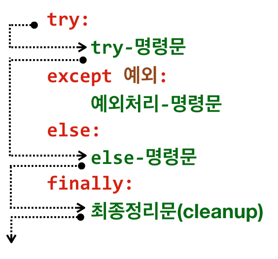
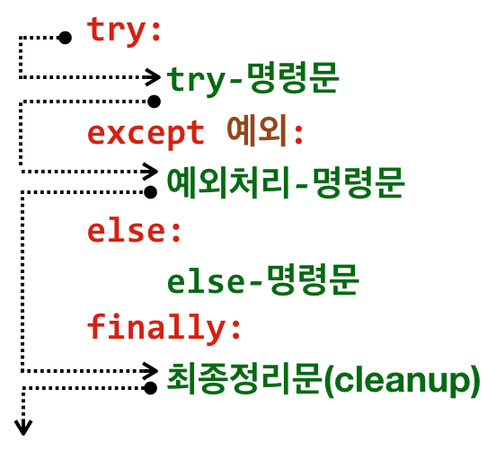
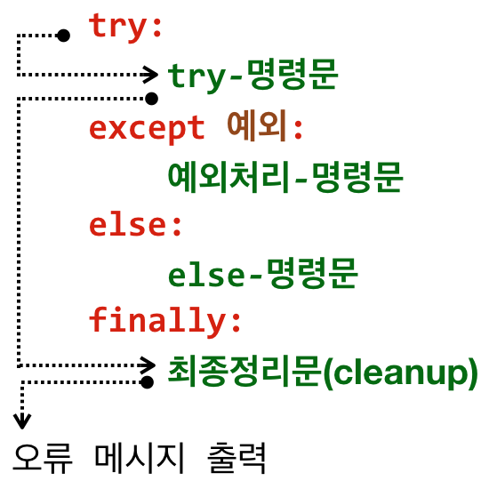
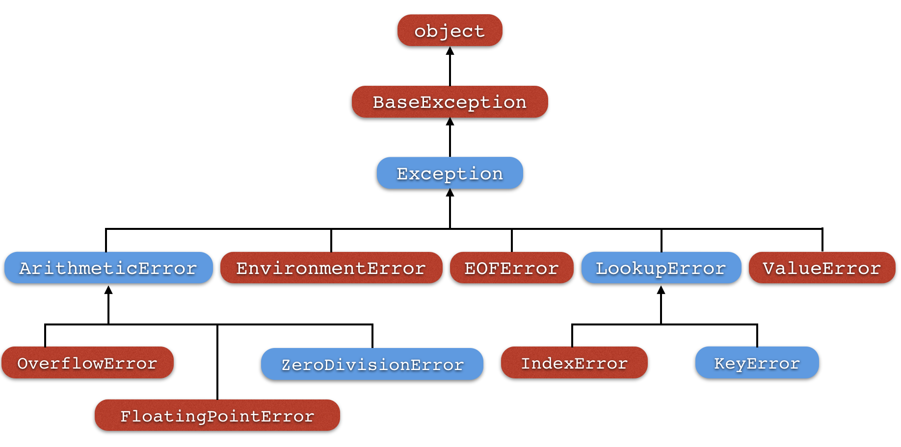

9장: 예외 처리
===

Exception Handling

***
**박 진 수** 교수  
Intelligent Data Semantics Lab  
Seoul National University
***

<h3>Table of Contents<span class="tocSkip"></span></h3>
<div class="toc"><ul class="toc-item"><li><span><a href="#오류와-예외-처리" data-toc-modified-id="오류와-예외-처리-1">오류와 예외 처리</a></span><ul class="toc-item"><li><span><a href="#프로그램-오류의-종류" data-toc-modified-id="프로그램-오류의-종류-1.1">프로그램 오류의 종류</a></span><ul class="toc-item"><li><span><a href="#따라해보기" data-toc-modified-id="따라해보기-1.1.1">따라해보기</a></span></li></ul></li><li><span><a href="#몰라도-우선-따라해보기" data-toc-modified-id="몰라도-우선-따라해보기-1.2">몰라도 우선 따라해보기</a></span></li></ul></li><li><span><a href="#try-except-else-finally문" data-toc-modified-id="try-except-else-finally문-2"><strong>try-except-else-finally</strong>문</a></span><ul class="toc-item"><li><span><a href="#try-except-else-finally문-처리-순서" data-toc-modified-id="try-except-else-finally문-처리-순서-2.1"><strong>try-except-else-finally</strong>문 처리 순서</a></span></li><li><span><a href="#예외처리" data-toc-modified-id="예외처리-2.2">예외처리</a></span></li><li><span><a href="#except:문" data-toc-modified-id="except:문-2.3"><strong>except:</strong>문</a></span></li><li><span><a href="#Lab:-try-except-else문-직접-사용해보기" data-toc-modified-id="Lab:-try-except-else문-직접-사용해보기-2.4">Lab: <strong>try-except-else문</strong> 직접 사용해보기</a></span></li><li><span><a href="#Lab:-과일을-검색하는-try-except-else문(자율-실습-문제)" data-toc-modified-id="Lab:-과일을-검색하는-try-except-else문(자율-실습-문제)-2.5">Lab: 과일을 검색하는 <strong>try-except-else</strong>문(자율 실습 문제)</a></span></li><li><span><a href="#except문-작성-순서" data-toc-modified-id="except문-작성-순서-2.6">except문 작성 순서</a></span><ul class="toc-item"><li><span><a href="#따라해보기" data-toc-modified-id="따라해보기-2.6.1">따라해보기</a></span></li></ul></li><li><span><a href="#예외-회피" data-toc-modified-id="예외-회피-2.7">예외 회피</a></span></li></ul></li><li><span><a href="#try-finally문" data-toc-modified-id="try-finally문-3"><strong>try-finally</strong>문</a></span><ul class="toc-item"><li><span><a href="#따라해보기" data-toc-modified-id="따라해보기-3.1">따라해보기</a></span></li></ul></li><li><span><a href="#raise문-:-예외-생성" data-toc-modified-id="raise문-:-예외-생성-4"><strong>raise</strong>문 : 예외 생성</a></span></li><li><span><a href="#Lab:-무한루프와-예외처리" data-toc-modified-id="Lab:-무한루프와-예외처리-5">Lab: 무한루프와 예외처리</a></span></li><li><span><a href="#Lab:-소수-판별(자율-실습-문제)" data-toc-modified-id="Lab:-소수-판별(자율-실습-문제)-6">Lab: 소수 판별(자율 실습 문제)</a></span></li><li><span><a href="#가정-설정문(강의에서-다루지-않는-내용)" data-toc-modified-id="가정-설정문(강의에서-다루지-않는-내용)-7">가정 설정문(강의에서 다루지 않는 내용)</a></span><ul class="toc-item"><li><span><a href="#가정-설정문-비활성화" data-toc-modified-id="가정-설정문-비활성화-7.1">가정 설정문 비활성화</a></span></li></ul></li></ul></div>

# 오류와 예외 처리

## 프로그램 오류의 종류

**문법 오류**(syntax error)
- 대부분 오타나 잘못된 문법을 사용해서 발생하는 오류다. 
- 오류가 발생한 코드 줄 번호와 오류 종류를 즉시 출력 하기 때문에 오류를 발견하기도 수정하기도 쉽다.

**논리 오류**(logical error)
- 프로그램은 아무 문제없이 잘 실행되지만 예상한 결과가 나오지 않는 등 프로그램 작성 당시 논리적으로 잘못 설계되어 나타나는 오류다.
- 오류 없이 프로그램이 실행되지만 예상한 결과가 나오지 않는 예
    - **1 / 2 \* 3**
- 논리 오류를 사전에 발견하는 것은 쉽지 않다. 
- 논리 오류를 방지하기 위해서는 오류가 발생할 수 있는 다양한 경우의 수와 시나리오로 프로그램을 테스트해보는 습관을 갖는 것이 중요하다.

**실행 오류**(runtime error)
- 프로그램을 실행하는 동안 발생하는 오류다. 
- 예를 들어, 사용자가 잘못된 값을 입력할 때, 존재하지 않는 파일을 불러올 때, 파일을 저장하면서 디스크 용량이 부족할 때 등 발생하는 오류다.
- 예외 처리(exception handling)만 잘하면 피할 수 있는 오류다.

문법 오류는 컴파일 단계에서, 논리 오류와 실행 오류는 실행 단계에서 발생한다.

실행 오류가 발생하는 예를 살펴보자.

### 따라해보기


```python
# 숫자를 0으로 나눠서 오류가 난다.
15 / 0
```


```python
# 폴더에 없는 파일을 열려고 해서 오류가 난다. 
f = open('hw1.py')
```

앞의 예처럼 예외 처리를 하지 않거나 예외 처리에 실패하면 프로그램을 실행하는 중 갑작스럽게 종료하게 된다. 예외가 발생하면 오류 메시지를 통해 예외가 발생한 줄의 번호를 확인할 수 있다. 뿐만 아니라 발생한 예외의 종류와 예외가 발생한 이유에 대한 간략한 설명을 화면으로 출력하기 때문에 그 원인을 확인할 수 있다. 따라서 프로그램 작성할 때 주의만 잘 기울이면 대부분의 예외 발생을 막을 수 있다. 예를 들어, 사용자가 입력한 값이 유효한 입력 값인지 확인하는 등의 예외 처리 코드만 미리 작성해 놓아도 많은 실행 오류를 방지할 수 있다.

## 몰라도 우선 따라해보기

오류가 발생하면 예외 객체(exception object)가 생성된다. 예외 객체는 주로 해당 오류와 관련된 기본 오류 메시지를 담고 있다. 

다음 프로그램을 작성해서 실행해보자. 먼저 **3**을 입력해서 실행해보고 그 다음에는 **0**을 입력해서 실행해보자.


```python
i = int(input('정수를 입력하세요: ')) 
print('15 / {} = {}'.format(i, 15 / i))
```

**0**을 입력하면 **ZeroDivisionError** 예외 객체를 생성한 것을 알 수 있다. 

따라서, 사용자가 **0**을 입력하면 **ZeroDivisionError**로 예외 처리를 하는 프로그램을 작성해보자.


```python
i = int(input('정수를 입력하세요: ')) 

try:  # 오류가 발생할 가능성이 있는 코드를 try문 안에 넣는다.
    print('15 / {} = {}'.format(i, 15 / i))  
except ZeroDivisionError: 
    print('{0}을 입력했습니다. 다른 숫자를 입력하세요.'.format(i))
```

예외가 발생하지 않았다. **0**을 입력하면 **ZeroDivisionError**로 예외 처리를 했기 때문이다.  하지만 프로그램이 종료되었기 때문에 다시 프로그램을 실행해야 한다.

***프로그램을 중단하지 않고 예외 처리를 할 수는 없을까?***

무한 루프를 사용하면 된다.

이번에는 무한 루프를 사용해 사용자가 **0**을 입력하면 예외 처리를 하고, 다른 숫자를 입력할 때까지 다시 입력을 요구하는 프로그램을 작성해보자.


```python
while True:
    try:  # 오류가 발생할 가능성이 있는 코드를 try문 안에 넣는다.
        i = int(input('정수를 입력하세요: ')) 
        print('15 / {} = {}'.format(i, 15 / i))
        break  # 유효한 값을 입력했으므로 처리한 후 무한 루프를 빠저나간다.
    except ZeroDivisionError: 
        print('{}을 입력했습니다. 다른 숫자를 입력하세요.'.format(i))
```

***그런데 만약 숫자가 아닌 문자를 입력하면 어떻게 될까?***

이번에는 앞서 작성한 프로그램을 실행하고 문자 **a**를 입력해보자. 이번에는 숫자를 입력하지 않았기 때문에 **ValueError** 오류가 났다.

***여러 종류의 예외를 한번에 처리할 수 없을까?***

여러 개의 예외를 한번에 처리할 수 있다.

이번에는 **ZeroDivisionError**와 **ValueError**를 한꺼번에 처리하는 프로그램을 작성해보자.


```python
# --- 복수의 except문
while True:
    try:  # 오류가 발생할 가능성이 있는 코드를 try문 안에 넣는다.
        i = int(input('정수를 입력하세요: ')) 
        print('15 / {} = {}'.format(i, 15 / i))
        break  # 유효한 값을 입력했으므로 처리한 후 무한 루프를 빠저나간다.
    except ZeroDivisionError: 
        print('{}을 입력했습니다. 다른 숫자를 입력하세요.'.format(i))
    except ValueError:
        print('쑷자를 입력해야 합니다.')
```

여러 개의 예외를 하나의 그룹으로 묶어 처리할 수도 있다. 다음 프로그램을 작성해서 실행해보자.


```python
# --- 예외 그룹
while True:
    try:  # 오류가 발생할 가능성이 있는 코드를 try문 안에 넣는다.
        i = int(input('정수를 입력하세요: ')) 
        print('15 / {} = {}'.format(i, 15 / i))
        break  # 유효한 값을 입력했으므로 처리한 후 무한 루프를 빠저나간다.
    except (ZeroDivisionError, ValueError):  # 반드시 괄호로 묶어야 한다.
        print('잘못된 값이 입력되었습니다. 다시 입력하세요.')
```

예외 객체는 해당 오류와 관련된 기본 오류 메시지를 담고 있다. 따라서 예외 객체를 변수로 참조하면 해당 오류가 무엇인지 확인할 수 있다.

다음 프로그램은 예외 그룹에 변수를 지정해서 무슨 오류가 났는지를 확인 할 수 있도록 했다.


```python
# --- as 변수
while True:
    try:  # 오류가 발생할 가능성이 있는 코드를 try문 안에 넣는다.
        i = int(input('정수를 입력하세요: ')) 
        print('15 / {} = {}'.format(i, 15 / i))
        break  # 유효한 값을 입력했으므로 처리한 후 무한 루프를 빠저나간다.
    except (ZeroDivisionError, ValueError) as err:  # 반드시 괄호로 묶어야 한다.
        print('다음과 같은 예외가 발생했습니다:', err) 
        print('다시 입력하세요.')
```

# **try-except-else-finally**문

**try-except-else-finally**문은 파이썬에서 제기하는 예외(exception)를 통해 흐름을 제어하는 일종의 조건문이다. **if**문과 달리 오직 '예외 발생'만을 조건으로 설정할 수 있다. 

예외 처리를 하려면 **try**문 블록 안에 오류가 발생할 가능성이 있는 코드를 넣고 실행하면 된다. 

예외를 처리하는 코드의 일반적인 형식은 다음과 같다.

```code
try:
    try-명령문
except 예외그룹-1 [as 변수-1]:
    예외처리-명령문-1
except 예외그룹-2 [as 변수-2]:
    예외처리-명령문-2
...
except 예외그룹-N [as 변수-N]:
    예외처리-명령문-N
else:
    else-명령문
finally:
    finally-명령문
```    
    
특징은 다음과 같다.

- **try**문이 오면 최소한 한 개 이상의 **except**문이 와야 한다. 
    - 단, 나중에 **try ... finally**문에서는 **except**문을 사용하지 않는다.
- **except**문은 **try**문 안의 코드에서 오류가 발생할 때 예외를 처리하는 코드를 포함한다. 
- **as** ***변수-N***는 선택 사항으로 ***예외그룹-N***을 ***변수***로 참조할 수 있게 한다.
- **try**문 안의 코드에서 오류가 발생하지 않고 정상적으로 종료되었다면 **else**문이 반드시 실행된다. 
- 하지만 **try**문 안의 코드에서 오류가 발생하면 **else** 문은 실행되지 않는다.
- **else**문은 마지막 **except**문 다음에 와야 한다.
    - **else**문은 선택 사항이라 **try-except**문 다음에 반드시 사용할 필요는 없다. 
- **finally**문은 예외 처리 블록의 맨 마지막에 와야 한다.
    - **finally**문도 선택 사항이라 **try-except**문 다음에 반드시 사용할 필요는 없다. 
    - **finally**문이 있다면 **try**문 안의 코드에서 오류가 발생했는지 여부와 상관없이 항상 마지막에 실행된다.


**except**문의 실행 순서는 다음과 같다.
1. **try**문에서 오류가 발생하면 각 **except**문은 **순서대로 실행**된다.
1. 만약 발생한 오류가 ***예외그룹-N***에 지정한 **except**문에 도달하면 해당 **except**문의 ***예외처리-명령문-N***􏱪􏱬􏰭􏰈􏰉􏰊􏰋이 실행된다.
3. 발생한 오류와 **except**문에 지정한 ***예외그룹-N***의 오류가 일치하는 경우는 두 가지가 있다. 
    - 발생한 오류가 ***예외그룹-N***에 있는 오류와 같은 클래스일 때
    - 발생한 오류가 ***예외그룹-N***에 있는 오류의 하위 클래스일 때
    

## **try-except-else-finally**문 처리 순서

**예외가 발생하지 않고 프로그램이 정상적으로 종료하는 경우**


**예외가 발생하고 해당 예외를 처리하는 경우**


**예외가 발생했지만 해당 예외를 지정하지 않아 예외 처리를 실패한 경우**


## 예외처리

각 **except**문의 ***예외그룹***은 하나의 예외를 처리할 수도 있고, 튜플 형태의 예외 목록을 한번에 처리하는 것도 가능하다.


```python
# --- 한 개의 예외만 처리한다.
try:
    15 / 0
except ZeroDivisionError:                              
    print('0으로 나눌 수 없습니다.') 
```


```python
# --- 복수의 예외를 처리한다.
try:
    15 / 'a'   # 0외 다른 문자도 입력해본다.
except (ZeroDivisionError, ValueError, TypeError, RuntimeError): 
    print('뭔가 잘못되었습니다.') 
```

선택사항인 **as** ***변수***를 사용하면 발생한 예외 객체를 참조하기 때문에 해당 오류와 관련된 기본 오류 메시지를 확인할 수 있다.


```python
# --- 한 개의 예외만 변수로 참조해서 처리한다.
try:
    15 / 0
except ZeroDivisionError as err:
    print('다음과 같은 예외가 발생했습니다:', err) 
```

**as** ***변수***를 사용하면 튜플 형태의 ***예외그룹***도 하나의 **변수**로 참조할 수 있다.


```python
# --- 복수의 예외를 변수로 참조해서 처리한다.
try:
    15 / '0'
except (ZeroDivisionError, TypeError) as err:
    print('다음과 같은 예외가 발생했습니다:', err) 
```

## `except:`문 

처리할 ***예외그룹***을 다음 예처럼 `except:`만 사용할 수 있다.


```python
try:
    15 / 0
except:  # 모든 예외를 처리하기 때문에 권장하지 않는 방법이다.
    print('뭔가 잘못된 것 같아요 ㅠㅠ')
```


```python
try:
    15 / 0
except Exception as err:  # ZeroDivisionError가 더 바람직하다.
    print(e)
```

발생하는 모든 오류를 처리하지만 이것은 좋은 방법이 아니니 권장하지 않는다. 가급적이면 발생 가능한 모든 오류를 구체적으로 지정할 것을 권장한다. 발생 가능한 오류가 무엇 무엇인지 모를 때만 어쩔 수 없이 이 방법을 사용해야 한다.

## Lab: **try-except-else문** 직접 사용해보기

사용자가 입력한 값을 정수로 형변환을 시도한다. 이때 예외가 발생하면 '형식이 올바르지 않습니다'라는 문구를 출력하고, 예외가 발생하지 않으면 입력한 값을 출력한다.


**실행 예**

```code
> python exception_simple.py 
숫자나 문자를 입력하세요...: a
형식이 올바르지 않습니다.

> python exception_simple.py 
숫자나 문자를 입력하세요...: 5.0
형식이 올바르지 않습니다.

> python exception_simple.py 
숫자나 문자를 입력하세요...: 5
형식이 올바르지 않습니다.
```

## Lab: 과일을 검색하는 **try-except-else**문(자율 실습 문제)

**while-else**문<Lab: 과일을 검색하는 **while-else**문>과 **for-else**문<Lab: 과일을 검색하는 **for-else**문>으로 과일 검색을 한 것과 같은 결과를 가져오는 프로그램을 **try-except-else**문을 사용해서 구현해보자.

- 사용자로부터 과일 이름을 입력 받은 후 그 과일이 존재하는지 여부를 판단한다.
    - 입력한 과일이 존재하면 아래 과일 튜플(또는 리스트)에서 몇 번째 존재하는지 알려준다.
    - 입력한 과일이 존재하지 않으면 해당 과일이 리스트에 없다고 알려준다.

- 과일 목록은 다음과 같은 순서로 튜플(또는 리스트)에 저장한다.
    - **'사과', '딸기', '바나나', '블루베리', '포도'**
    
**실행 예**

```code
> python fruits_exception.py
과일 이름을 입력하세요...: 블루베리
과일 목록의 4번째에 존재합니다.

> python fruits_exception.py
과일 이름을 입력하세요...: 수박
과일 목록에 존재하지 않습니다.
```

## except문 작성 순서

### 따라해보기


```python
try:
    15 / 0
except ArithmeticError as err:
    print('산술 예외가 발생했습니다. =>', err)
except ZeroDivisionError:  # 절대 실행되지 않는 except문이다
    print('0으로 나눌 수 없습니다. =>', err) 
```

***0으로 나눴는데 왜 ZeroDivisionError가 아니라 ArithmeticError가 예외 처리를 할까?***

**except**문을 작성할 때 주의할 점은 오류가 발생하면 각 **except**문이 순서대로 실행된다는 것이다. 뿐만 아니라  **except**문에 지정한 ***얘외그룹***에 속한 예외 뿐만 아니라 그 하위 예외를 모두 처리한다. 이처럼 예외는 위계 관게가 존재하기 때문에 범위가 더 넓고 포괄적인 상위 예외를 먼저 선언하면, 하위 예외는 절대로 실행되지 않는다. 따라서 프로그램을 작성할 때 다음과 같이 좀 더 세부적인 하위 예외를 먼저 작성해야 한다. 


```python
try:
    15 / 0
except ZeroDivisionError as err:
    print('0으로 나눌 수 없습니다. =>', err)
except ArithmeticError as err:
    print('산술 예외가 발생했습니다. =>', err) 
```

**결론 : 따라서 항상 하위 예외가 상위 예외보다 먼저 선언되어야 한다!!!**

이처럼 예외는 상위 예외와 하위 예외로 이루어진 계층 구조를 가지고 있다. 

다음 그림은 예외 계층 구조의 일부를 보여준다.

<!--  -->


하위 예외로 갈수록 오류의 종류가 보다 구체적이며 상위 예외는 자신의 아래에 있는 모든 하위 예외를 처리할 수 있다. 하지만 예외 처리를 할 때 해당 오류에 맞는 구체적인 예외 처리를 하는 것이 좋기 때문에 가급적인면 상위 예외보다는 해당 예외를 지정해서 처리하는 것이 좋다.


파이썬이 다루는 모든 예외 종류와 계증 구조는 [파이썬 문서](https://docs.python.org/3/library/exceptions.html)를 확인하면 된다. 
- <https://docs.python.org/3/library/exceptions.html>

## 예외 회피

오류가 발생해도 처리하지 않고 그냥 통과시켜야 할 때도 종종 있다. 이런 상황에서는 **except**문에 예외 처리 코드를 넣지 않고 그냥 **pass**문을 추가하면 된다. 

숫자를 **0**으로 나누었을 때 예외를 처리하지 않고 그냥 통과시켜보자.


```python
try:
    15 / 0
except ZeroDivisionError:
    pass
```

# **try-finally**문

오류가 발생해 작업을 처리하지 못하는 경우에도, **반드시 실행해야 하는 코드**가 있을 때 사용한다. 컴퓨터나 프로그램이 충돌이 일어나 갑자기 멈추지 않는 한, **try**문 안의 오류 발생과 상관없이 **finally**문은 마지막에 반드시 실행된다. 

**try-finally**문을 작성하는 형식은 다음과 같다.

```code
try:
    try-명령문
finally:
    finally-명령문
```    

## 따라해보기

숫자를 0으로 나누었을 때 예외 처리를 하지 않아도 **finally**문이 실행되는지 확인해보자.


```python
try:
    15 / 0
finally: # 반드시 처리해야 하는 코드는 finally문에 넣고 처리하면 된다.
    print('예외가 발생해도 finally문은 반드시 실행된다!!!')
```

**try-finally**문은 주로 **try**문을 종료한 후, 웹 사이트나 데이터베이스 연결을 끊거나 현재 처리 중인 파일을 닫는 등 최종 정리(clean-up)를 위한 명령문을 작성할 때 유용하다.

# **raise**문 : 예외 생성

프로그래밍을 하다보면 종종 일부러 예외를 발생시켜야 할 때도 있다. 예를 들어 꼭 구현해야 할 함수가 있지만 아직 구현하지 못했을 때, **NotImplementedError**라는 예외 클래스를 사용해서 고의로 예외를 발생시킬 수도 있다. 의도적으로 예외를 만들기 위해서는 **raise**문을 이용해서 예외를 강제로 발생시키면 된다. 


```python
def marry(girl, boy):  # 결혼 함수를 정의한다.
    raise NotImplementedError('marry() 함수는 다음 버전에서 구현할 예정입니다!!!')
```


```python
# 예외 처리를 하지 않고 함수를 호출한다.
marry('네오', '프로도')
```


```python
# 함수를 호출할 때 예외 처리를 한다.
try:
    marry('네오', '프로도')
except NotImplementedError as err:
    print(err)
```

**raise**문을 사용하는 형식은 다음과 같다.

<b><pre>raise  예외클래스[(전달인자)] [from 근원예외객체]</pre></b>

특징은 다음과 같다.

- ***예외클래스***로는 파이썬에서 기본적으로 제공하는 예외 클래스와 사용자가 필요해서 직접 정의한 예외 클래스 두 가지가 있다. 
    - 사용자 정의 예외 클래스는 반드시 **Exception** 클래스를 상속해야 한다. 
    - 클래스 상속에 관한 설명은 12장에서 자세히 다룬다.

- ***전달인자***􏰺가 주어지면 예외를 처리할 때 ***전달인자***의 값을 출력한다. 
    - 따라서 주로 해당 예외 클래스와 관련된 오류 메시지를 ***전달인자***􏰺􏰺로 사용한다. ***전달인자***􏰺􏰺는 선택 사항이라 생략할 수 있다.
    
- ***근원예외객체***를 지정하면 ***근원예외객체***부터 􏰏􏰐􏰶􏰷􏰸까지 연결된 연쇄 예외 객체 를 생성한다. ***근원예외객체*** 또한 선택 사항이라 생략할 수 있다.

- **raise ... fro**m문은 주로 **except**문 안에서 사용한다.

**[따라해보기]** **raise**문을 사용해서 예외를 생성해보자. 


```python
i = 0
if (i == 0):
    raise ValueError   # ValueError()와 같다.
```

**[따라해보기]** 이번에는 ***예외클래스***에 ***전달인자***룰 지정해보자. ***전달인자***의 값이 예외 클래스의 이름과 함께 출력된다.


```python
i = 0
if (i == 0):
    raise ValueError('0이 입력되었습니다.')
```

**[따라해보기]** ***전달인자***의 값을 문자열이 아닌 숫자로 해도 그 값 자체를 출력한다.


```python
i = 0
if (i == 0):
    raise ValueError(-3.14)
```

**raise**문 다음에 예외 클래스를 지정하지 않고 **raise**문만 사용하면, 현재 발생한 오류의 예외를 처리하지 않고 호출한 상위 명령문으로 그 오류를 넘길 때 사용한다. 


```python
numbers = [7, -5, 8, 3, 'a', 9]
total = 0
try:
    for i in numbers:
        try:
            total += i
        except TypeError:
            print('예외가 발생했으니, 호출한 명령문에서 처리해주세요.')
            raise    # 예외 처리를 여기서 하지 않고 호출한 명령문으로 예외를 넘긴다.
except Exception as err:
    print(err)
else:
    print(total)    
```

만약 오류가 없으면 **raise**문은 실행되지 않는다.


```python
numbers = [7, -5, 8, 3, 1, 9]
total = 0
try:
    for i in numbers:
        try:
            total += i
        except TypeError:
            print('예외가 발생했으니, 호출한 명령문에서 처리해주세요')
            raise    # 예외 처리를 여기서 하지 않고 호출한 명령문으로 예외를 넘긴다.
except Exception as err:
    print(err)
else:
    print(total)
```

현재 발생한 예외가 없으면 **RuntimeError**로 예외를 발생시킨다. 따라서, **raise**문을 일반 명령문에 사용하면 오류가 발생하지 않아도(현재 발생한 오류가 없어도), 프로그램 실행 도중 **raise**문에서 **RuntimeError**를 생성해서 오류를 발생시키기 때문에 주의해서 사용해야 한다.


```python
total = 0
for i in range(1, 11):  # 1에서 10까지 합을 구한다.
    total += i
    if total > 30:
        print(total)
        raise           # 현재 발생한 예외가 없어도 RuntimeError 예외를 발생시킨다.
```

# Lab: 무한루프와 예외처리

예외 처리를 통해 원하는 값의 범위를 입력하지 않으면 계속해서 입력을 요청하는 프로그램을 작성한다.

- **input()** 함수를 사용해서 사용자가 입력한 값이 **1~9** 사이의 정수가 아니면 계속해서 입력을 요청한다.

- 정확한 범위의 값을 입력하면 '통과하셨습니다.'라는 문자열을 출력하고 프로그램을 종료한다.

**실행 예**

```code
> python infinite_loop_exception_handling.py
1-9 사이의 숫자를 입력하세요...: apple
ValueError: 1-9 사이의 숫자를 입력하세요!!!
1-9 사이의 숫자를 입력하세요...: 블루베리
ValueError: 1-9 사이의 숫자를 입력하세요!!!
1-9 사이의 숫자를 입력하세요...: 0
ValueError: 1-9 사이의 숫자를 입력하세요!!!
1-9 사이의 숫자를 입력하세요...: 10
ValueError: 1-9 사이의 숫자를 입력하세요!!!
1-9 사이의 숫자를 입력하세요...: -1
ValueError: 1-9 사이의 숫자를 입력하세요!!!
1-9 사이의 숫자를 입력하세요...: 1.234
ValueError: 1-9 사이의 숫자를 입력하세요!!!
1-9 사이의 숫자를 입력하세요...: 5.0
ValueError: 1-9 사이의 숫자를 입력하세요!!!
1-9 사이의 숫자를 입력하세요...: 5
통과하셨습니다.
```

# Lab: 소수 판별(자율 실습 문제)

사용자가 입력한 값이 양의 정수면 그 수가 소수인지를 판별하는 프로그램을 구현해보자. 

- 입력한 값이 양의 정수가 아니면, 예를 들어 음수나 실수 또는 문자열 등을 입력하면 **ValueError** 예외를 발생시키고 이를 받아서 처리해야한다.

- 입력한 값이 양의 정수면서 소수면 '이 숫자는 소수입니다.'라는 메시지를 출력하고, 소수가 아니면 소수가 아닌 이유와 함께 '이 숫자는 소수가 아닙니다.'라는 메시지를 출력한다.

- 양의 정수를 입력할 때까지 사용자로부터 입력을 받아서 처리하기 위해 무한 루프를 사용한다.

**소수**(prime numbers)란?
- **1**과 그 수 자신 이외의 수로는 똑 떨어지게 나눌 수 없는 정수를 말한다.
- **1**은 양수이지만 소수는 아니다.


**실행 예**

```code
> python is_prime_number.py
임의의 양의 정수를 입력하세요: a
ValueError: 1보다 큰 양의 정수를 입력하세요.
임의의 양의 정수를 입력하세요: -1
ValueError: 1보다 큰 양의 정수를 입력하세요.
임의의 양의 정수를 입력하세요: 1.0
ValueError: 1보다 큰 양의 정수를 입력하세요.
임의의 양의 정수를 입력하세요:  1
ValueError: 1보다 큰 양의 정수를 입력하세요.
임의의 양의 정수를 입력하세요: 125
이 숫자는 소수가 아닙니다.
5 x 25 = 125

> python is_prime_number.py
임의의 양의 정수를 입력하세요: 2
이 숫자는 소수입니다.

> python is_prime_number.py
임의의 양의 정수를 입력하세요: 19
이 숫자는 소수입니다.
```

# 가정 설정문(강의에서 다루지 않는 내용)

사전 조건(precondition)이나 사후 조건(postcondition)을 확인할 때 가정 설정문을 사용할 수 있다.

가정 설정문을 작성하는 일반적인 형식은 다음과 같다.

<b><pre>assert 불린-표현식, [추가-표현식]</pre></b>

특징은 다음과 같다.

- ***불린-표현식***이 **False**면 **AssertionError** 예외를 발생시킨다.
- ***추가-표현식***은 선택사항이며 **AssertionError** 예외의 전달인자로 사용한다.
    - ***추가-표현식***은 오류 메시지를 출력할 때 유용하다.

**assert**문은 주로 코드를 테스트하거나 디버깅할 때 유용하다.
- 예) 함수가 잘못된 전달인자를 넘겨 받았을 때
- 예) 잘못된 계산식을 포함하고 있는지 확인 할 때

## 가정 설정문 비활성화

가정 설정문은 주로 테스트나 디버깅 때 사용하기 때문에 이러한 작업이 끝난 production 코드에서는 가정 설정문을 주로 비활성화한다.

방법 1
- 명령어 셸(CLI) 창에서 **-O** (영문 대문자 **O**)를 입력한다.
    - 예) **python -O program.py**

방법 2
- 환경변수 **PYTHONOPTIMIZE**를 **0**(숫자 **0**)으로 설정한다.

방법 3
- 모든 **assert**문을 주석 처리한다.

**예시 : 가정 설정문**


```python
# --- PESSIMISTIC approach
def product(*args):
    assert all(args), '0(zero) 전달인자'
    result = 1
    for arg in args:
        result *= arg
    return result
```


```python
product(2, 3, 0, 5)
```


```python
# --- OPTIMISTIC approach
def product(*args):
    result = 1
    for arg in args:
        result *= arg
    assert all(args), '0(zero) 전달인자'
    return result
```


```python
product(2, 3, 0, 5)
```

***
**THE END**