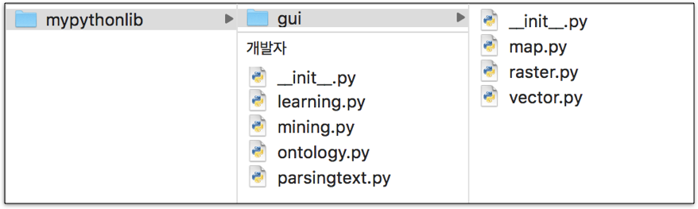

10장: 파이썬의 조립 블록 구성 요소
===

Assembly Block Components: Introduction to Functions and Their Types

***

**박 진 수** 교수  
Intelligent Data Semantics Lab  
Seoul National University

***

<h3>Table of Contents<span class="tocSkip"></span></h3>
<div class="toc"><ul class="toc-item"><li><span><a href="#함수의-기초-개념" data-toc-modified-id="함수의-기초-개념-1">함수의 기초 개념</a></span><ul class="toc-item"><li><span><a href="#함수" data-toc-modified-id="함수-1.1">함수</a></span></li><li><span><a href="#함수-사용법" data-toc-modified-id="함수-사용법-1.2">함수 사용법</a></span><ul class="toc-item"><li><span><a href="#함수-호출" data-toc-modified-id="함수-호출-1.2.1">함수 호출</a></span></li><li><span><a href="#중첩-함수-호출" data-toc-modified-id="중첩-함수-호출-1.2.2">중첩 함수 호출</a></span></li><li><span><a href="#함수-호출과-전달인자" data-toc-modified-id="함수-호출과-전달인자-1.2.3">함수 호출과 전달인자</a></span></li><li><span><a href="#Lab:-함수-호출과-전달인자" data-toc-modified-id="Lab:-함수-호출과-전달인자-1.2.4">Lab: 함수 호출과 전달인자</a></span></li></ul></li><li><span><a href="#내장-함수" data-toc-modified-id="내장-함수-1.3">내장 함수</a></span><ul class="toc-item"><li><span><a href="#Lab:-내장-함수-다루기" data-toc-modified-id="Lab:-내장-함수-다루기-1.3.1">Lab: 내장 함수 다루기</a></span></li></ul></li><li><span><a href="#사용자-함수-정의" data-toc-modified-id="사용자-함수-정의-1.4">사용자 함수 정의</a></span><ul class="toc-item"><li><span><a href="#매개변수-vs.-전달인자" data-toc-modified-id="매개변수-vs.-전달인자-1.4.1">매개변수 vs. 전달인자</a></span></li><li><span><a href="#함수-일반화" data-toc-modified-id="함수-일반화-1.4.2">함수 일반화</a></span></li><li><span><a href="#사용자-함수-만들기-따라해보기" data-toc-modified-id="사용자-함수-만들기-따라해보기-1.4.3">사용자 함수 만들기 따라해보기</a></span></li></ul></li><li><span><a href="#재귀-함수" data-toc-modified-id="재귀-함수-1.5">재귀 함수</a></span></li></ul></li><li><span><a href="#함수의-종류" data-toc-modified-id="함수의-종류-2">함수의 종류</a></span><ul class="toc-item"><li><span><a href="#전역-함수" data-toc-modified-id="전역-함수-2.1">전역 함수</a></span></li><li><span><a href="#지역-함수" data-toc-modified-id="지역-함수-2.2">지역 함수</a></span></li><li><span><a href="#메소드" data-toc-modified-id="메소드-2.3">메소드</a></span></li><li><span><a href="#람다-함수" data-toc-modified-id="람다-함수-2.4">람다 함수</a></span><ul class="toc-item"><li><span><a href="#Lab:-일반-함수를-람다-함수로-변환" data-toc-modified-id="Lab:-일반-함수를-람다-함수로-변환-2.4.1">Lab: 일반 함수를 람다 함수로 변환</a></span></li><li><span><a href="#람다-함수를-전달인자로-사용" data-toc-modified-id="람다-함수를-전달인자로-사용-2.4.2">람다 함수를 전달인자로 사용</a></span></li><li><span><a href="#Lab:-람다-함수" data-toc-modified-id="Lab:-람다-함수-2.4.3">Lab: 람다 함수</a></span></li></ul></li></ul></li><li><span><a href="#함수의-특성" data-toc-modified-id="함수의-특성-3">함수의 특성</a></span><ul class="toc-item"><li><span><a href="#값-반환-함수와-보이드(void)-함수" data-toc-modified-id="값-반환-함수와-보이드(void)-함수-3.1">값 반환 함수와 보이드(void) 함수</a></span><ul class="toc-item"><li><span><a href="#값-반환-함수" data-toc-modified-id="값-반환-함수-3.1.1">값 반환 함수</a></span></li><li><span><a href="#보이드-함수" data-toc-modified-id="보이드-함수-3.1.2">보이드 함수</a></span></li><li><span><a href="#튜플-반환" data-toc-modified-id="튜플-반환-3.1.3">튜플 반환</a></span></li><li><span><a href="#값-반환-외-return문의-용도" data-toc-modified-id="값-반환-외-return문의-용도-3.1.4">값 반환 외 <strong>return</strong>문의 용도</a></span></li><li><span><a href="#Lab:-출력과-값-반환을-동시에-하는-함수" data-toc-modified-id="Lab:-출력과-값-반환을-동시에-하는-함수-3.1.5">Lab: 출력과 값 반환을 동시에 하는 함수</a></span></li><li><span><a href="#Lab:-두-직사각형-면적의-비율을-계산하는-함수" data-toc-modified-id="Lab:-두-직사각형-면적의-비율을-계산하는-함수-3.1.6">Lab: 두 직사각형 면적의 비율을 계산하는 함수</a></span></li><li><span><a href="#Lab:-XOR-연산-함수" data-toc-modified-id="Lab:-XOR-연산-함수-3.1.7">Lab: XOR 연산 함수</a></span></li><li><span><a href="#Lab:-계산기" data-toc-modified-id="Lab:-계산기-3.1.8">Lab: 계산기</a></span></li><li><span><a href="#Lab:-영어-모음-개수를-계산하는-함수" data-toc-modified-id="Lab:-영어-모음-개수를-계산하는-함수-3.1.9">Lab: 영어 모음 개수를 계산하는 함수</a></span></li><li><span><a href="#Lab:-문자열-위치-검색-함수" data-toc-modified-id="Lab:-문자열-위치-검색-함수-3.1.10">Lab: 문자열 위치 검색 함수</a></span></li><li><span><a href="#Lab:-리스트나-튜플-내의-객체-위치-검색-함수" data-toc-modified-id="Lab:-리스트나-튜플-내의-객체-위치-검색-함수-3.1.11">Lab: 리스트나 튜플 내의 객체 위치 검색 함수</a></span></li><li><span><a href="#Lab:-숫자만-골라-합과-평균을-구하는-함수" data-toc-modified-id="Lab:-숫자만-골라-합과-평균을-구하는-함수-3.1.12">Lab: 숫자만 골라 합과 평균을 구하는 함수</a></span></li><li><span><a href="#Lab:-단어-길이로-정렬하는-함수" data-toc-modified-id="Lab:-단어-길이로-정렬하는-함수-3.1.13">Lab: 단어 길이로 정렬하는 함수</a></span></li></ul></li><li><span><a href="#전달인자와-매개변수" data-toc-modified-id="전달인자와-매개변수-3.2">전달인자와 매개변수</a></span><ul class="toc-item"><li><span><a href="#전달인자" data-toc-modified-id="전달인자-3.2.1">전달인자</a></span><ul class="toc-item"><li><span><a href="#전달인자의-종류" data-toc-modified-id="전달인자의-종류-3.2.1.1">전달인자의 종류</a></span></li></ul></li><li><span><a href="#매개변수" data-toc-modified-id="매개변수-3.2.2">매개변수</a></span><ul class="toc-item"><li><span><a href="#매개변수의-종류" data-toc-modified-id="매개변수의-종류-3.2.2.1">매개변수의 종류</a></span></li><li><span><a href="#필수-매개변수와-선택-매개변수" data-toc-modified-id="필수-매개변수와-선택-매개변수-3.2.2.2">필수 매개변수와 선택 매개변수</a></span></li></ul></li><li><span><a href="#*-연산자와-전달인자의-위치" data-toc-modified-id="*-연산자와-전달인자의-위치-3.2.3"><strong>*</strong> 연산자와 전달인자의 위치</a></span></li><li><span><a href="#시퀀스형-패킹-및-언패킹-연산자-*" data-toc-modified-id="시퀀스형-패킹-및-언패킹-연산자-*-3.2.4">시퀀스형 패킹 및 언패킹 연산자 <strong>*</strong></a></span><ul class="toc-item"><li><span><a href="#시퀀스형-패킹" data-toc-modified-id="시퀀스형-패킹-3.2.4.1">시퀀스형 패킹</a></span></li><li><span><a href="#시퀀스형-언패킹" data-toc-modified-id="시퀀스형-언패킹-3.2.4.2">시퀀스형 언패킹</a></span></li><li><span><a href="#Lab:-점수를-정렬하는-함수" data-toc-modified-id="Lab:-점수를-정렬하는-함수-3.2.4.3">Lab: 점수를 정렬하는 함수</a></span></li><li><span><a href="#Lab:-정수의-합과-평균을-동시에-계산하는-함수" data-toc-modified-id="Lab:-정수의-합과-평균을-동시에-계산하는-함수-3.2.4.4">Lab: 정수의 합과 평균을 동시에 계산하는 함수</a></span></li><li><span><a href="#Lab:-기술통계-함수" data-toc-modified-id="Lab:-기술통계-함수-3.2.4.5">Lab: 기술통계 함수</a></span></li><li><span><a href="#Lab:--선택적으로-문자열-뒤집어-출력하는-함수" data-toc-modified-id="Lab:--선택적으로-문자열-뒤집어-출력하는-함수-3.2.4.6">Lab:  선택적으로 문자열 뒤집어 출력하는 함수</a></span></li></ul></li><li><span><a href="#매핑형-패킹/언패킹-연산자-**" data-toc-modified-id="매핑형-패킹/언패킹-연산자-**-3.2.5">매핑형 패킹/언패킹 연산자 <strong>**</strong></a></span><ul class="toc-item"><li><span><a href="#매핑형-패킹" data-toc-modified-id="매핑형-패킹-3.2.5.1">매핑형 패킹</a></span></li><li><span><a href="#매핑형-언패킹" data-toc-modified-id="매핑형-언패킹-3.2.5.2">매핑형 언패킹</a></span></li></ul></li><li><span><a href="#패킹-연산자로-함수-정의" data-toc-modified-id="패킹-연산자로-함수-정의-3.2.6">패킹 연산자로 함수 정의</a></span></li></ul></li><li><span><a href="#범위와-가시성" data-toc-modified-id="범위와-가시성-3.3">범위와 가시성</a></span><ul class="toc-item"><li><span><a href="#범위" data-toc-modified-id="범위-3.3.1">범위</a></span></li><li><span><a href="#가시성" data-toc-modified-id="가시성-3.3.2">가시성</a></span></li><li><span><a href="#global문" data-toc-modified-id="global문-3.3.3"><strong>global</strong>문</a></span></li><li><span><a href="#nonlocal-문" data-toc-modified-id="nonlocal-문-3.3.4"><strong>nonlocal</strong> 문</a></span></li></ul></li></ul></li><li><span><a href="#설명문자열(docstrings)" data-toc-modified-id="설명문자열(docstrings)-4">설명문자열(docstrings)</a></span></li><li><span><a href="#모듈과-패키지" data-toc-modified-id="모듈과-패키지-5">모듈과 패키지</a></span><ul class="toc-item"><li><span><a href="#모듈" data-toc-modified-id="모듈-5.1">모듈</a></span></li><li><span><a href="#패키지" data-toc-modified-id="패키지-5.2">패키지</a></span></li><li><span><a href="#모듈과-패키지-불러오기" data-toc-modified-id="모듈과-패키지-불러오기-5.3">모듈과 패키지 불러오기</a></span><ul class="toc-item"><li><span><a href="#import문" data-toc-modified-id="import문-5.3.1"><strong>import</strong>문</a></span><ul class="toc-item"><li><span><a href="#단일-모듈-불러오기" data-toc-modified-id="단일-모듈-불러오기-5.3.1.1">단일 모듈 불러오기</a></span></li><li><span><a href="#복수의-모듈-불러오기" data-toc-modified-id="복수의-모듈-불러오기-5.3.1.2">복수의 모듈 불러오기</a></span></li></ul></li><li><span><a href="#from-...-import문" data-toc-modified-id="from-...-import문-5.3.2"><strong>from ... import</strong>문</a></span><ul class="toc-item"><li><span><a href="#단일-모듈/함수(클래스)-불러오기" data-toc-modified-id="단일-모듈/함수(클래스)-불러오기-5.3.2.1">단일 모듈/함수(클래스) 불러오기</a></span></li><li><span><a href="#복수의-모듈/함수(클래스)-불러오기" data-toc-modified-id="복수의-모듈/함수(클래스)-불러오기-5.3.2.2">복수의 모듈/함수(클래스) 불러오기</a></span></li></ul></li></ul></li></ul></li><li><span><a href="#파이썬-표준-라이브러리" data-toc-modified-id="파이썬-표준-라이브러리-6">파이썬 표준 라이브러리</a></span><ul class="toc-item"><li><span><a href="#random-모듈" data-toc-modified-id="random-모듈-6.1"><strong>random</strong> 모듈</a></span></li></ul></li></ul></div>

# 함수의 기초 개념

## 함수

**함수**(function)란?
- **재사용**이 가능한 일련의 명령문 묶음이다.

함수는 함수 이름과 일련의 명령문 묶음으로 구성되어 있다. 특정 작업을 함수로 정의함으로써 언제든 불러와서 사용할 수 있게 해준다. 따라서 코드의 재활용성을 높일 수 있다. 프로시져(procedure), 메소드(method), 서브루틴(subroutine) 등의 이름으로 불리기도 한다.

## 함수 사용법

함수를 사용할 때 필요한 정보는 다음과 같다.
- 함수 이름
- 함수를 실행할 때 필요한 전달인자 개수와 각각의 자료형
    - 전달인자란 함수를 호출할 때 전달하는 값을 말한다. 
    - 전달인자는 없을 수도 있다.
- 함수가 반환하는 값의 자료형(return type)
    - 함수는 값을 반환하지 않을 수도 있다.

예를 들어, 문자열의 길이를 구하기 위해서는 다음 정보가 필요할 것이다.
- 문자열 길이를 구하는 함수 이름은 `len()`이다.
- `len()` 함수를 실행할 때 필요한 전달인자 개수는 한 개고, 전달인자의 자료형은 문자열이다. 􏱑
- `len()` 함수가 반환하는 값의 자료형은 정수다.


**len()** 함수에 문자열 '􏱜파이썬􏱝'을 전달하고 결괏값을 확인해보자.


```python
x = len('파이썬')
print(x)
```

### 함수 호출

**함수 호출**(function call)이란?
- 함수를 불러와서 실행하는 것을 말한다.

함수를 호출하면
- 인터프리터가 해당 함수 코드로 건너가서 명령어들을 실행한다.
- 해당 함수에 있는 명령어들의 실행이 끝나면 함수를 호출한 코드로 다시 돌아간다.
    - 이를 '**함수반환**'(function return)이라 부른다.

함수 호출에 필요한 것은
- 함수 이름
- 전달인자(arguments)
    - 전달인자는 필요 없을 수도 있다.

함수는 
- 전달인자를 받아와서 특정한 작업을 실행한 후 
- 결괏값을 반환하고 종료하든지 결괏값이 없는 작업을 실행한 후 호출한 코드로 실행 권한을 넘긴다.

**함수 호출 예시**


```python
num = len('apple')  # (step 1) 'apple' 문자열의 길이를 알기 위해 len() 함수를 호출한다.
                    # (step 2) len() 함수를 호출하면서 전달인자 'apple'을 넘겨준다.
                    # (step 3) len() 함수는 결괏값으로 정수형 5를 반환하는데 이 값을 num에 할당한다.
print(num)          # (step 4) num 값을 출력하기 위해 print() 함수를 호출한다.
                    # (step 5) print() 함수를 호출하면서 전달인자 num을 넘겨준다.
                    # (step 6) print() 함수는 정수 5를 출력한다.
```

**따라해보기**


```python
# print() 함수 호출하기
print('How are you?')          
```


```python
# len() 함수 호출하기
t = 1, 2, 3, 4, 5
len(t)                        
```


```python
# --- t = 1, 2, 3, 4, 5
# range() 클래스 호출하기
for i in range(0, len(t), 2):  
    print(t[i])
```

### 중첩 함수 호출

함수를 호출할 때 함수가 반환한 값을 다른 함수의 전달인자로 사용할 수 있다. 이처럼 함수를 호출할 때 전달인자로 다른 함수를 사용하는 것을 **중첩 함수 호출**(nested function call)이라 한다. 

중첩 함수 호출의 일반적인 형식은 다음과 같다.

**`􏰹􏰺함수1(함수2(...함수N-1(함수N([전달인자]􏰐􏰐􏰐􏰐􏰐􏰐􏰐))))`**

***함수N***에서 반환한 값을 ***함수N-1***에 전달인자로 넘겨주고, ***함수N-1***에서 반환한 값 ***함수N-2***에 전달인자로 넘겨주는 방식이다. 최종적으로 가장 바깥에 있는 ***함수1***에서 ***함수2***로부터 반환받은 값을 처리한다.

**따라해보기**

다음 예는 가격에 부과가치세 10%를 합산한 금액을 출력하는데 함수를 중첩해서 호출한다.


```python
price = 100
print('총 금액이 ' + str(round(price * 1.1)) + '입니다.')  # 중첩 함수 호출
```

다음 예는 중첨 함수 호출을 통해 입력받은 금액에서 부가가치세가 얼마인지 알려준다.


```python
price = eval(input('제품의 가격을 입력하세요: '))  # 중첨 함수 호출
print('이 제품의 부가가치세는 {:,.0f}원입니다.'.format(price / 11))
```

함수 호출은 네 가지 경우로 나뉘어 지는데 이 네 가지 함수 호출의 형식은 아래 표로 구분할 수 있다.

|  |  |  전달인자 유무 |  |
|:-:|:-:|:-:|:-:|
| | | 전달인자가 없는 경우|전달인자가 있는 경우|
|반환 값 유무 | 반환 값이 없는 경우 | 함수이름() | 함수이름(전달인자-1, ..., 전달인자-N)|
|     |반환 값이 있는 경우  |  변수 = 함수이름()  |      변수 = 함수이름(전달인자-1, ..., 전달인자-N)|


### 함수 호출과 전달인자

대부분의 파이썬 함수는 값을 전달인자로 받아서 작업을 수행한다.

전달인자(arguments)는 소괄호(**( )**) 안에 할당한다.
- 어떤 전달인자는 선택 사항이며 함수 정의에서 대괄호(**[ ]**)로 표시한다.
- 어떤 전달인자는 반드시 값을 전달해야 하며 그렇지 않으면 오류가 발생한다.

예를 들어 `range()`를 살펴보자.

**range**([***시작번호***,] ***끝번호***[, ***폭***])

- ***시작번호*** : 순서 열의 시작 번호다.
- ***끝번호*** : 순서 열의 최댓값으로 이 값은 포함하지 않는다. 
- ***폭*** : 순서 열에서 서로 붙어 있는 번호 간의 간격이다.

**따라해보기**


```python
# 필수 전달인자 한 개를 사용한다.
for i in range(10):
    print(i, end='/')
```


```python
# 전달인자 두 개를 사용한다.
for i in range(1, 10):
    print(i, end='/')
```


```python
# 전달인자가 세 개를 사용한다.
for i in range(1, 10, 2):
    print(i, end='/')
```


```python
# 폭이 음수다.
for i in range(5, 1, -1):
    print(i, end='/')
```

### Lab: 함수 호출과 전달인자

정수 **1**부터 **100**까지 포함하는 리스트를 생성한 후 출력한다.

`range()`와 `tuple()` 클래스 그리고 `len()` 함수를 사용해서 리스트가 담고 있는 모든 정수를 1씩 증가시킨 후 튜플 자료형을 형변환 한 후 출력한다.

**힌트**  
- `range()`와 `tuple()`만 사용해도 되고 `len()` 함수를 함께 활용해도 된다.

**실행 예**

```code
> python arguments.py
[1, 2, 3, 4, 5, ...(중략)..., 96, 97, 98, 99, 100]
(2, 3, 4, 5, 6, ...(중략)..., 97, 98, 99, 100, 101)
```

## 내장 함수

파이썬은 기본적으로 다양하고 강력한 표준 내장 함수(built-in functions)를 제공하고 있다. 

항상 다음을 기억하자.
- **"Do not reinvent the wheel!"**

흔히 사용하는 내장 함수
- **print()**
- **len()**
- **range()**


데이터 분석에 흔히 사용하는 내장 함수와 클래스는 다음과 같다.
- **type()**
- **range()**
- **enumerate()**
- **len()**
- **max()**, **min()**
- **abs()**
- **int()**, **float()**, **str()**
- **list()**, **tuple()**, **dict()**, **set()**
- **sorted()**
- **open()**

### Lab: 내장 함수 다루기

앞서 언급한 내장 함수들을 활용해서 다음 작업을 실행한다.

- 아래 정수들을 포함하는 튜플을 생성한 후 변수에 할당하고 출력한다.
    - **1, 3, 5, 7, 9**
- 앞에서 생성한 튜플을 리스트로 형변환한 후 출력한다.
- 리스트에 속한 모든 객체를 문자열로 형변환한다.
- 리스트에 'x', 'y', 'z'를 추가한다.
- 리스트에 속한 모든 객체와 객체의 자료형을 함께 출력한다.
    - 자료형은 **type()** 클래스를 사용해 출력하면 된다.
    
**실행 예**

```code
> python builtins.py
(1, 3, 5, 7, 9)
[1, 3, 5, 7, 9]
1 <class 'str'>
3 <class 'str'>
5 <class 'str'>
7 <class 'str'>
9 <class 'str'>
x <class 'str'>
y <class 'str'>
z <class 'str'>
```

## 사용자 함수 정의

**사용자 함수**(custom function)란?
- 사용자(프로그래머)가 직접 만든 함수를 말한다.

사용자 함수를 작성하는 일반적인 형식은 다음과 같다.

<b><pre>def 함수이름([매개변수,...]):
    함수-명령문
    [return 객체]</pre></b>
    
특징은 다음과 같다.

- ***함수이름***은 유효한 식별자여야 한다.
    - 4장의 102p 식별자 구성 규칙 참고
- 함수에 포함할 수 있는 ***매개변수***의 개수는 제한이 없다. 
    - 즉, **0**개부터 ***n***개의 ***매개변수***를 선언할 수 있다. 
    - 따라서 ***매개변수***는 선택 사항이다.
- 함수 정의 부분(첫 번째 줄)의 마지막에 쌍점(**:**)이 온다.
- ***함수-명령문*** 블록은 들여쓰기로 구분한다.
- **return**문은 선택 사항이다. 
    - ***함수-명령문*** 블록을 실행한 후 결괏값을 ***객체***로 반환할 수도 있고, 하지 않을 수도 있다. 
    - 반환 값이 있으면 **return**문을 사용해 값을 반환하면 된다. 
    - 결괏값을 반환하지 않는 함수는 **None**을 반환한다. 
        - 따라서 반환 값이 없으면 **return**문을 생략할 수 있다. 

### 매개변수 vs. 전달인자

**매개변수**(parameter)란?
- 함수를 실행할 때 함수 내부에서 사용되는 식별자다.

**전달인자**(argument)란?
- 함수를 호출할 때 넣어주는 값이다.

***다음 코드에서 매개변수와 전달인자를 무엇인가요?***


```python
def say_anything(anything):
    print('안녕', anything)

say_anything('파이썬')
```

매개변수: anything  
전달인자: '파이썬'    

### 함수 일반화

함수가 왜 필요한지를 이해하기 위해 다음과 같은 내용을 출력하는 함수를 작성해보자. 

```code
안녕하세요 교수님!
제 이름은 Emily입니다.
제 이름은 John입니다.
제 이름은 Amy입니다.
```

**따라해보기**

각 줄의 내용을 출력하는 함수 네 개를 만들어보자. 


```python
def hi():
    print('안녕하세요 교수님!')
    
def john():
    print('제 이름은 John입니다.')
    
def emily():
    print('제 이름은 Emily입니다.')
          
def amy():
    print('제 이름은 Amy입니다.')
          
```


```python
hi()
emily()
john()
amy()
```

그런데 **john()**, **emily()**, **amy()** 함수는 사람의 이름만 다르지 나머지 내용이 같다.

***이처럼 비슷한 기능을 가진 함수들을 하나로 합칠 수는 없을까?*** 

이 세 함수는 사람의 이름만 다르게 출력하기 때문에 이름을 전달받는 매개변수를 사용하면 간단히 해결할 수 있다. 이렇게 일반화한 함수 이름을 `person()`이라 하자.


```python
def person(name):
    print('제 이름은 {}입니다.'.format(name))
    
```


```python
hi()
person('Emily')
person('John')
person('Amy')
```

이제 전달인자의 값만 다르게 해서 **person()** 함수를 호출할 수 있다. 이제부터는 함수 하나만으로도 다양한 결괏값을 얻을 수 있다. 이처럼 매개변수를 사용하면 함수가 처리하는 값이 다를 때마다 굳이 새로운 함수를 만들 필요가 없다. 

지금까지 매개변수를 사용해서 함수를 '일반화(generalization)'하는 방법을 알아보았다.

이번에는 함수가 함수 자신을 호출하는 경우를 알아보자.

### 사용자 함수 만들기 따라해보기


```python
# --- 매개변수와 반환 값이 없는 함수 정의
def my_function1():
    print('I love Python')
```


```python
# 함수 호출
my_function1()     
```


```python
# --- 매개변수와 반환 값이 있는 함수 정의
def my_function2(language):
    return 'I love ' + language
```


```python
# --- 함수에 전달인자를 사용함으로써, 함수의 재사용성을 높일 수 있다.
x = my_function2('Python')
print(x)
```


```python
y = my_function2('Java')
print(y)
```


```python
z = my_function2('C++')
print(z)
```


```python
# --- if-else문을 사용하는 함수 정의
def my_function3(language):
    if language in ['Python', 'Java', 'Ruby']:
        return 'I love ' + language
    elif language in ['C++', 'C']:
        return 'I like ' + language
    else:
        return 'I do not know ' + language
```


```python
# --- 함수 안에 조건문을 사용해 전달인자의 값에 따라 다른 결괏값을 반환할 수도 있다.
x = my_function3('Ruby')
print(x)
```


```python
y = my_function3('C++')
print(y)
```


```python
z = my_function3('Scala')
print(z)
```


```python
# --- for문을 사용하는 함수 정의
def my_function4(languages):
    for language in languages:
        if language in ['Python', 'Java', 'Ruby']:
            print('I love ' + language)
        elif language in ['C++', 'C']:
            print('I like ' + language)
        else:
            print('I do not know ' + language)
```


```python
# 함수 안에 for문을 사용해 순회형 전달인자를 처리한다.
my_function4(['Ruby', 'Python', 'Fortran', 'C'])
```


```python
# 함수 안에 for문을 사용해 순회형 전달인자를 처리한다.
my_function4(('Java', 'C++', 'C#'))
```

__주의__


```python
# 순회형 전달인자가 하나가 아니다.
my_function4('Java', 'C++', 'C#')
```

## 재귀 함수

**재귀 함수**(recursion function)란?
- 자기 자신을 호출하는 함수다.

함수가 자기 스스로를 호출하기 때문에 마치 프로그램이 끝없이 동작하는 순환문인 무한 루프와 비슷하다. 따라서 재귀 함수는 종료 조건을 주어서 함수 호출을 중단하고 빠져나오게 해야 한다.

대표적인 재귀 함수로 '계승 함수'가 있다. 

**계승 함수**(factorial function)란?
- 음이 아닌 정수 ***n***의 계승은 `n!`로 표현하며 계승은 **1**부터 ***n***까지의 정수를 모두 곱한 것을 의미한다.
    - 예) **5! = 5 x 4 x 3 x 2 x 1 = 120**
- `0!`의 값은 **1**이다.

**따라해보기**


```python
def factorial(n):
    if n == 0:
        return 1
    return n * factorial(n - 1)
```


```python
factorial(5)
```

# 함수의 종류

## 전역 함수

**전역 함수**(global function)란?

- 가장 흔히 사용하는 **일반 함수**로 같은 모듈, 즉 같은 파이썬 파일(.py) 안 어디서든 사용할 수 있는 함수다. 


다른 모듈에서도 사용 할 수 있는데, 불러오기(`import`)한 후 사용하면 된다. `print()`나 `len()` 등도 전역 함수다. 파이썬이 자체적으로 제공하는 내장 함수기 때문에 같은 파일 안에 없지만 불러오기를 하지 않아도 파이썬 프로그램 어디서나 사용할 수 있다. 


```python
# --- 매개변수와 반환 값이 없는 함수다.
def say_hello():
    print('안녕~~~!')
```


```python
say_hello()
```


```python
# --- 매개변수는 있지만 반환 값은 없는 함수다.
def say_anything(anything):
    print('안녕', anything)
```


```python
say_anything('파이썬')
```


```python
# --- 매개변수와 반환 값이 있는 함수다.
def rectangle_area(width, height):
    return width * height
```


```python
rectangle_area(2, 5)
rectangle_area(7.5, 10)
```

## 지역 함수

**지역 함수**(local function)란?

- 어떤 함수 안에서 정의된 함수로서 **내재 함수**라고도 한다.
- 지역 함수를 정의한 해당 함수 안에서만 사용이 가능하다.
- 지역 함수를 정의한 해당 함수 외 다른 함수나 프로그램에서 호출하여 사용할 수 없다.

주로 특정 함수 안에서 필요한 기능을 여러 번 불러 사용해야 하는 경우 등 도우미 함수로 가끔 사용한다.

**따라해보기**


```python
def display_stand(product):                       
    def display_num():                            
        import random
        return random.randint(1, 99)
    print('{} : {}번 진열대에 배치하세요.'.format(
        product, display_num())) 
```


```python
display_stand('연필')     # 전역함수를 호출한다.
```


```python
display_stand('지우개')   # 전역함수를 호출한다.
```


```python
display_num()           # 지역함수를 호출한다.
```

## 메소드

**메소드**(method)란?
- 클래스 내부에서 구현한 함수다. 

클래스와 관련 있는 함수이기 때문에 해당 클래스와 함께 사용해야 한다. 대표적인 예로는 문자열과 함께 이미 자주 사용한 ***문자열***.`format()`이 있다.


```python
class myclass:
    def say_anything(self, anything):
        print('안녕', anything) 
```


```python
myinstance = myclass()
myinstance.say_anything('파이썬')
```

## 람다 함수

**람다 함수**(lambda function)란?

- 함수를 사용하는 시점에 표현식 형태로 정의하여 바로 사용하는 함수다.

일반적인 함수보다 구현할 수 있는 기능이 제한적이지만 다른 장점이 있다.

람다 함수를 정의하는 일반적인 형식은 다음과 같다.

**`lambda [매개변수]: 표현식`**

특징은 다음과 같다.

- ***매개변수***를 설정하면 일반적으로 위치 ***매개변수*** 형태며 한 개 이상 사용할 수 있다.
    - ***매개변수***는 선택 사항이다.
- ***표현식***은 계산한 값을 반환한다.
- 람다 함수의 ***표현식***􏱀􏱿은 몇 가지 제약이있다. 
    - ***표현식***에는 **return**문 또는 **yield**문을 사용할 수 없다.
    - 조건문이나 순환문을 사용할 수 없다. 
        - 단, 간편 조건문은 사용할 수 있다.
    - ***표현식***이 튜플이면 ***표현식***을 반드시 괄호 안에 넣어야 한다.
- 람다 함수는 함수 이름이 없기 때문에 익명 함수(anonymous function)라고도 한다.

람다 함수는 일반 함수보다 구현할 수 있는 기능은 제한적이지만 일반 함수를 정의하는 것보다 간결할 뿐만 아니라 일반 함수를 사용할 수 없는 곳에서도 사용이 가능하다.

앞서 정의한 **say_anything()** 함수를 이번에는 람다 함수로 재정의해보자.


```python
def say_anything(anything):
    print('안녕', anything)
```


```python
say_anything('파이썬')
```

**따라해보기**


```python
talk = lambda anything: print('안녕', anything)
```


```python
talk('파이썬')
```


```python
talk('초콜릿')
```

***익명 함수인 람수 함수를 변수에 할당하는 이유는 뭘까?***

우리는 이미 숫자 **3**을 아래와 같이 함수 **print**에 할당해 보았고 이것의 문제점도 다루었다.

```python
print = 3
```

이번에는 반대로 함수 이름을 변수에 할당해보자.


```python
x = print         # print() 함수 이름을 x에 할당한다.
```


```python
type(x)           # x는 print() 함수를 참조한다.
```


```python
x('{} * {} = {}'.format(2, 3, 2 * 3))
```

이제부터 변수 **x**를 **print** 함수처럼 사용할 수 있게 되었다.

다른 함수도 변수에 할당해보자.


```python
i = len              # len() 함수 이름을 i에 할당한다.
```


```python
type(i)              # i는 len() 함수를 참조한다.
```


```python
i('파이썬')            # len('파이썬')과 같다.
```


```python
i('drum')            # len('drum')과 같다.
```

함수 이름을 변수에 할당하면 해당 변수가 할당한 함수를 참조하기 때문에 변수를 마치 함수처럼 사용할 수 있다. 이러한 파이썬의 특징을 이용하면 익명 함수인 람다 함수도 변수에 할당해서 나중에 다시 불러서 사용할 수 있기 때문에 편리하다. 물론 람다 함수는 주로 즉석에서 사용하기 때문에 나중에 다시 불러 사용하는 경우가 많지는 않다. 

**따라해보기**


```python
# 람다 함수를 정의해서 변수 c에 할당한다.
c = lambda i: '' if i == 1 else 's'
```


```python
for i in range(10):
    print('{} file{} processed.'.format(i, c(i)))
```

### Lab: 일반 함수를 람다 함수로 변환

다음 함수를 람다함수로 바꿔보자.


```python
# --- 삼각형의 넓이를 구하는 함수
def area(b, h):
    """밑변과 높이를 전달받아서 삼각형의 넓이를 구하는 함수다.

    Args:
        b (int | float): 밑변
        h (int | float): 높이

    Returns:
        float: 삼각형의 넓이
    """
    return 0.5 * b * h

x = area(4, 5)
print(x)
```

### 람다 함수를 전달인자로 사용

람다 함수는 **sorted()** 함수나 **list.sort()** 메소드 등에서 매개변수 ***key***의 전달인자로 사용되듯이 주로 함수의 전달인자로 사용된다.

**따라해보기** 


```python
pair = [(2, 'a', 'Pineapple'), (1, 'b', 'Orange'), (1, 'a', 'Banana'), (1, 'b', 'grape'), (2, 'a', 'apple')]

pair.sort()
print(pair)
```


```python
# --- [(1, 'a', 'Banana'), (1, 'b', 'Orange'), (1, 'b', 'grape'), (2, 'a', 'Pineapple'), (2, 'a', 'apple')]
pair.sort(reverse=True)
print(pair)
```


```python
# --- [(2, 'a', 'apple'), (2, 'a', 'Pineapple'), (1, 'b', 'grape'), (1, 'b', 'Orange'), (1, 'a', 'Banana')]
pair.sort(key=lambda e: (e[1], e[2]))
print(pair)
```


```python
# --- [(1, 'a', 'Banana'), (2, 'a', 'Pineapple'), (2, 'a', 'apple'), (1, 'b', 'Orange'), (1, 'b', 'grape')]
# 위와 같은 표현식을 분할 연산으로 하면서 내림차순 정렬을 한다.
pair.sort(key=lambda e: e[1:3], reverse=True)
print(pair)
```


```python
# --- [(1, 'b', 'grape'), (1, 'b', 'Orange'), (2, 'a', 'apple'), (2, 'a', 'Pineapple'), (1, 'a', 'Banana')]
# 대소문자 구분없이 소문자로 정렬
pair.sort(key=lambda e: (e[1], e[2].lower())) 
print(pair)
```

### Lab: 람다 함수

임의의 두 실수를 비교하여, ***x***가 ***y***보다 크거나 같으면 ***x***를 출력하고, 그렇지 않으면 ***y***를 출력하는 함수를 **lambda**를 이용해 구현해보자.

**실행 예**  

```python
>>> g(1, 2)  # 람다 함수를 정의해서 변수 g로 할당한 후 g를 실행한다.
2
>>>
```

# 함수의 특성

## 값 반환 함수와 보이드(void) 함수

### 값 반환 함수

**값 반환 함수**(value-returning function)란?
- 함수의 명령문을 실행한 후 함수를 호출한 코드에 결괏값을 **return**문을 통해 돌려준다.

따라서, 호출한 코드는 함수가 반환하는 결괏값을 변수에 저장(할당)할 수가 있다.

값 반환 함수를 호출하는 일반적인 형식은 다음과 같다.

**`변수 = 함수이름([전달인자-1, ..., 전달인자-N])`**

대표적인 값 반환 함수로는 **input()**, **len()** 등이 있다.

**따라해보기**


```python
x = len('파이썬')
```


```python
x         # x 값을 확인한다.
```


```python
print(x)  # x 값을 확인한다.
```

***값 반환 함수의 결괏값을 변수에 저장(할당)하지 않으면 어떻게 될까?***


```python
len('파이썬')
```

대화형 모드에서 값 반환 함수를 실행할 때 함수가 반환한 값을 변수로 받지 않으면 파이썬 셸로 반환(출력)한다. 


```python
def value_returning_product(i, j):
    """값 반환 함수는 return문을 사용해 값을 반환한다."""
    return i * j
```


```python
x = value_returning_product(3, 5)
```


```python
x
```


```python
print(x)
```


```python
value_returning_product(3, 5)
```

### 보이드 함수

**보이드 함수**(void function)란?
- 함수의 명령문을 실행한 후 함수를 호출한 코드에 결괏값을 반환하지 않고 종료한다.
- **return**문이 없어 **None**을 반환한다.

보이드 함수를 호출하는 일반적인 형식은 다음과 같다.

**`함수이름([전달인자-1, ..., 전달인자-N])`**

대표적인 보이드 함수로는 `print()`가 있다.

**따라해보기**


```python
print('안녕 파이썬')
```

값 반환 함수를 호출한 것처럼 보이드 함수를 호출한 후 변수로 결괏값을 받아보자.


```python
x = print('안녕 파이썬')
```


```python
x         # x 값을 확인한다.
```


```python
print(x)  # x 값을 확인한다.
```

***x에는 아무 값도 없다. 왜 그럴까?***

**print()** 함수는 값을 반환하지 않는 보이드 함수이기 때문이다.


```python
# --- return문이 없는 함수다.
def void_product(i, j):
    print('{} x {} = {}'.format(i, j, i * j))
```


```python
void_product(3, 5)
```


```python
x = void_product(3, 5)
```


```python
x 
```


```python
print(x)
```

***만약 함수가 두 개 이상의 값을 반환하면 어떻게 될까?*** 

다음 함수는 **return**문이 두 개다.


```python
def value_returning_fn(i, j):
    """return문이 두 개(이상) 있다."""
    return i - j
    return i * j
```

**3**과 **5**를 전달인자로 해서 이 함수를 호출해보자.


```python
x = value_returning_fn(3, 5)
```

***결괏값이 두 개인가? 첫 번째 return문인가? 두 번째 return문인가?***


```python
print(x)
```

모든 프로그래밍 언어는 **return**문을 만나면 거기서 실행을 중지하고 결괏값을 반환한 후 호출한 명령문으로 돌아간다. 

***그렇다면 return문을 한 번만 사용하면서도 두 개 이상의 값을 반환할 수 있는 방법은 없을까?***

파이썬에서는 가능하다.

반환하는 값으로 튜플을 사용하면 된다.

### 튜플 반환

**튜플 반환**이란?
- 함수는 항상 단일 값만 반환할 수 있지만 반환 값으로 튜플을 사용하면 복수의 값을 반환하는 것과 같은 결과를 얻을 수 있다.

파이썬이 제공하는 대표적인 내장 함수로 `divmod(x, y)`가 있다.


```python
# 튜플 패킹
i = divmod(13, 7)
print(i)
```


```python
# 튜플 할당
quot, rem = divmod(13, 7)
print(quot)
print(rem)
```

**따라해보기**


```python
def value_returning_fn2(i, j):
    """전달받은 두 정수의 사칙연산 결과를 튜플로 반환하는 함수다."""
    return i + j, i - j, i * j, i / j
```


```python
# 튜플 패킹
x = value_returning_fn2(3, 5)
print(x)
```


```python
# 튜플 할당
i, j, k, l = value_returning_fn2(3, 5) 
print(i)
print(j)
print(k)
print(l)
```

리스트나 튜플을 전달인자로 받아서 이 자료형이 담고 있는 객체 중 최솟값과 최댓값을 반환하는 함수를 정의해보자.


```python
def min_max(k):
    """리스트나 튜플을 전달인자로 받는 함수다."""
    return min(k), max(k)
```


```python
min, max = min_max((12, 45, 98, 38, 85, 7, 49))
```


```python
print(min)
print(max)
```

### 값 반환 외 **return**문의 용도

**return**문은 값을 반환하는 역활 외 특정 조건을 만족하거나 만족하지 않으면 즉시 함수를 빠져나갈 때도 사용할 수 있다.


```python
def positive_product(i, j):
    """전달인자 둘 중 하나라도 음수면 함수를 빠져나간다."""
    if i < 0 or j < 0:
        return
    print('{} x {} = {}'.format(i, j, i * j))
```


```python
positive_product(-5, 7)
```


```python
positive_product(5, -7)
```


```python
positive_product(5, 7)
```

### Lab: 출력과 값 반환을 동시에 하는 함수

실행 시 `'=== 나는 함수다 ==='`라는 문장을 출력한 후, `'나는 함수다!'`라는 문장을 반환하는 함수 `i_am_function( )`을 구현해보자. 

이때,  

```python
>>> x = i_am_function( )
```

처럼 실행했을 때, ***x***에 `'나는 함수다!'`라는 문장이 저장되어야 한다. 

**실행 예**

```python
>>> i_am_function()
=== 나는 함수다 ===
'나는 함수다!'

>>> x = i_am_function()
=== 나는 함수다 ===

>>> print(x)
나는 함수다!
```

### Lab: 두 직사각형 면적의 비율을 계산하는 함수

직사각형의 가로와 세로의 길이를 정수(integer)로 입력받아 직사각형 넓이를 계산한 후, 가로의 길이는 5 증가시키고 세로의 길이는 2배로 확장한 직사각형의 넓이를 계산한 후에 원래 넓이에서 확장한 후의 넓이를 나눈 값을 소수점 2자리까지 출력하는 함수 `expand_rectangle()`을 구현해보자.

원래 입력한 직사각형 넓이를 확장한 직사각형 넓이로 나눈 비율을 출력하기 전에 확장한 가로와 세로 길이를 먼저 출력해야 한다.

가로 길이 = 7, 세로 길이 = 10을 넣고 결과를 테스트해보자.

**실행 예**  

```python
>>> expand_rectangle(7, 10)
Width = 12
Length = 20
Area Ratio = 0.29
```

### Lab: XOR 연산 함수

XOR 연산을 하는 함수 `xor()`을 구현해보자. XOR 연산이란 배타적 논리합(exclusive OR)이라고도 부르며, 두 값이 상호 배타적이면(즉, 서로 다르면) '참(또는 1)'을 서로 같으면 '거짓(또는 0)'을 반환한다. 이는 두 개의 피연산자 중 하나만이 '참(또는 1)'일 때 '참(또는 1)'을 반환한다.

`xor()` 함수는 두 개의 전달인자를 받아서 XOR 연산을 실행한 후 결과를 반환한다.

**실행 예**

```python
>>> xor(True, True)
False

>>> xor(True, False)
True

>>> xor(0, 1)
True

>>> xor(0, False)
False
```

### Lab: 계산기

연산자와 정수 두 개를 입력받아 간단한 수치 연산을 수행한 후 결괏값을 반환하는 함수 `calculator()`를 구현해보자.

함수를 정의할 때 세 개의 매개함수를 아래 순서로 정의한다.

***operator***, ***integer1***, ***integer2***

- 만약 ***operator***가 '**add**'이면, 두 정수에 더하기 연산을 수행한 후 결괏값을 반환한다
    - ***integer1*** + ***integer2***
- 만약 ***operator***가 '**sub**'이면, 두 정수에 빼기 연산을 수행한 후 결괏값을 반환한다.
    - ***integer1*** - ***integer2***
- 만약 ***operator***가 '**mul**'이면, 두 정수에 곱하기 연산을 수행한 후 결괏값을 반환한다.
    - ***integer1*** * ***integer2***
- 만약 ***operator***가 '**div**'이면, 두 정수에 나누기 연산을 수행한 후 결괏값을 반환한다.
    - ***integer1*** / ***integer2***

'**add**', '**sub**', '**mul**', '**div**' 이외의 ***operator***가 오면 '***operator*** is not supported.'라는 오류 메시지를 출력한다.             

**실행 예**

```python
>>> calculator('addition', 3, 5)
addition is not supported.

>>> calculator('add', 3, 5)
8

>>> calculator('sub', 7, 8)
-1

>>> calculator('mul', 11, 2)
22

>>> calculator('div', 7, 3)
2.3333333333333335

>>> calculator('add', '3', '5')        # 문자열 더하기
'35'

>>> calculator('add', [1, 2], [3, 4])  # 리스트 더하기  
[1, 2, 3, 4]
```

### Lab: 영어 모음 개수를 계산하는 함수

영어 단어(또는 문장) 한 개를 입력받아 단어(또는 문장) 내에 속한 모음 알파벳(a, e, i, o, u)의 개수를 출력하는 함수 `vowel()`을 구현해보자.

**실행 예**

```python
>>> vowel('Apples')
2

>>> vowel('I love Python')
4
```

### Lab: 문자열 위치 검색 함수

문장(혹은 단어)과 문자를 입력받은 후 입력받은 문자와 같은 문자를 문장(혹은 단어)에서 (좌에서 우로) 찾아서 첫 번째 검색한 문자의 위치(인덱스)를 반환하는 함수 `search_char()`를 구현해보자.

이 함수는 다음과 같이 두 개의 매개변수를 전달인자로 받아들인다.

- 첫 번째 매개변수 : 문장 혹은 단어
- 두 번째 매개변수 : 검색할 문자

문자가 문장 내에 있으면 그 인덱스를 반환하고 발견하지 못하면 **-1**을 반환한다.

**실행 예**

```python
>>> search_char('python', 'o')
4

>>> search_char('I love Python', 'o')
3

>>> search_char('python', 'P')
-1

>>> search_char('안녕 파이썬', '파이썬')
3

>>> search_char('바나나', '나')
1
```

### Lab: 리스트나 튜플 내의 객체 위치 검색 함수

리스트나 튜플 내에 특정 객체가 들어 있는지를 확인하는 함수 `search()`를 구현해보자.

이 함수는 다음과 같이 두 개의 매개변수를 전달인자로 받아들인다.

- 첫 번째 매개변수 : 리스트 혹은 튜플
- 두 번째 매개변수 : 찾고자 하는 객체

리스트나 튜플 내에 특정 객체가 있으면 그 인덱스를 반환하고, 들어 있지 않으면 `False`를 반환한다.

**실행 예**

```python
>>> mylist = [1, 2, 3]
>>> mytuple = ('a', 'b', 'c')

>>>> search(mylist, 2)
1

>>> search(mylist, 10)
False

>>> search(mytuple, 'c')
2

>>> search(mytuple, '1')
False
```

### Lab: 숫자만 골라 합과 평균을 구하는 함수

리스트나 튜플로 구성되어 있는 데이터를 전달인자로 받아서 이 데이터가 담고 있는 객체가 숫자면 따로 추출하여 자유롭게 정한 자료형에 담은 후 이들의 합과 평균을 튜플 형태로 반환하는 함수 `pick_numbers()`를 구현해보자. 이때 평균은 소수점 2자리로 반올림한다.


**실행 예**

```python
>>> data = [1, 2.5, 3, '4', 5, 6, 'seven', (8, 9.9), -2, 11]
>>> pick_numbers(data)
(26.5, 3.79)
```


### Lab: 단어 길이로 정렬하는 함수

한 개 이상의 단어를 담고 있는 리스트나 튜플을 전달받아서 단어의 길이가 긴 순서부터 정렬해서 리스트로 반환하는 함수 `sort_by_length()`를 구현해보자. 만약 단어의 길이가 같다면 단어를 내림차순으로 정렬한다.

**실행 예**   

```python
>>> colors = 'red', 'blue', 'green', 'brown', 'gray'
>>> sort_by_word_length(colors)
['green', 'brown', 'gray', 'blue', 'red']

>>> instruments = ['피아노', '바이올린', '첼로', '기타', '드럼']
>>> sort_by_word_length(instruments)
['바이올린', '피아노', '첼로', '드럼', '기타']
```

## 전달인자와 매개변수

### 전달인자

**전달인자**(argument)란?
- 함수(또는 메소드)를 호출할 때 함수(또는 메소드)의 이름 바로 다음에 오는 소괄호 '()' 안에 할당해서 함수 안으로 전달하는 값이다.


대부분의 파이썬 함수(또는 메소드)는 값을 전달인자로 받아서 작업을 수행한다. 전달인자는 '필수 전달인자'와 '선택 전달인자' 두 종류로 구분할 수 있다.

**필수 전달인자**
- 반드시 값을 전달해야 하며 그렇지 않은 경우 오류가 발생한다.

**선택 전달인자**
- 선택 사항이라 값을 전달하지 않아도 되며 함수(메소드)정의 문서에서 일반적으로 대괄호(**[ ]**)로 표시한다.
- 값을 전달하지 않으면 기본 값을 적용한다.

다시 `range()`를 예로 들어보자.

**range**([***시작번호***,] ***끝번호***[, ***폭***])
- ***시작번호*** : 순서 열의 시작 번호다.
    - 값을 전달하지 않으면 기본 값인 **0**이 주어진다.
- ***끝번호*** : 순서 열의 최댓값으로 이 값은 반드시 전달해야 한다.
    - 값을 전달하지 않으면 **TypeError** 오류가 발생한다.
- ***폭*** : 순서 열에서 서로 붙어 있는 번호 간의 간격이다.
    - 값을 전달하지 않으면 기본 값인 **1**이 주어진다.

**따라해보기**

[**range**(*stop*)](https://docs.python.org/3/library/functions.html?highlight=float#func-range)
- ***stop***은 필수 전달인자다.


```python
range()
```

[*class* **float**([*x*])](https://docs.python.org/3/library/functions.html?highlight=float#float)
- ***x***는 선택 전달인자다. 


```python
d1 = float()

print(d1)
```


```python
d2 = float('12')

print(d2)
```

#### 전달인자의 종류

전달인자는 형식에 따라 '위치 전달인자'와 '키워드 전달인자' 두 종류로 구분할 수 있다.

􏰎**위치 전달인자**(positional argument)
- 함수의 괄호 안에 쉼표로 구분하는 한 개 또는 여러 개의 값을 말한다.
- 예) **print_setup('A4', 1, False)**

􏰎**키워드 전달인자**(keyword argument)
- 앞에 키워드 식별자가 오는 전달인자를 말한다.
- 예) **print_setup(paper='A4', copies=1, color=False)**


필요한 전달인자보다 적거나 많은 전달인자를 사용하면 **TypeError**가 발생한다.

[**len**(*s*)](https://docs.python.org/3/library/functions.html?highlight=float#len)


```python
len()      # len() 함수에 전달인자가 0개다.
```


```python
a = [1, 2, 3]
b = [4, 5, 6]
len(a, b)  # len() 함수에 전달인자가 2개다.
```

위치 전달인자가 키워드 전달인자보다 항상 먼저 와야한다.
- 그렇지 않을 경우 **SyntaxError**가 발생한다.


```python
L = ['c', 'b', 'd', 'a']
sorted(L, reverse=True)  # 위치 전달인자, 키워드 전달인자 순서다.
```


```python
# --- L = ['c', 'b', 'd', 'a']
sorted(reverse=True, L)  # 키워드 전달인자, 위치 전달인자 순서다.
```

### 매개변수

**매개변수**(parameter)란?
- 함수를 정의할 때 괄호 안에 선언한 식별자(변수)이며, 전달인자를 함수 내부로 가져와 처리할 목적으로 사용한다.


#### 매개변수의 종류

함수를 정의할 때 매개변수는 크게 세 가지 종류로 나눌 수 있다.

1) 매개변수가 없다. 
- 전달인자 없이 함수의 기능을 실행한다. 
- 매개변수가 **0**개다.
- 예) `def myfunction():` 

2) **위치 매개변수**(positional parameter)
- 쉼표로 구분하는 한 개 이상의 식별자로 정의하는 매개변수다.
- 예) `def myfunction(length, weight):`


3) **키워드 매개변수**(keyword parameter)는 
- 쉼표로 구분하는 한 개 이상의 **식별자=기본값** 형태의 쌍으로 정의하는 매개변수다.
- 예) `def myfunction(copies=1, color=None):`

앞서 전달인자를 설명할 때 위치 전달인자가 키워드 전달인자보다 항상 먼저 와야 한다고 했다. 따라서 함수를 정의할 때도 모든 위치 매개변수(필수 매개변수)를 키워드 매개변수(선택 매개변수)보다 먼저 선언해야 한다.

- `def ok(x, y, z=1):` (**O**)
- `def bad(x, y=1, z):` (**X**)


```python
def ok_function(x, y, z=1):
    print(x, y, z)
```


```python
ok_function(1, 2)
```


```python
def bad_function(x, y=1, z):
    print(x, y, z)
```

#### 필수 매개변수와 선택 매개변수

**필수 매개변수**

- 기본값이 설정되지 않은 매개변수다.
- 기본값이 미리 설정되어 있지 않기 때문에 함수를 호출할 때 반드시 전달인자를 지정해야 하며, 지정하지 않으면 오류가 발생한다.
- 예) **myfunction(*length, weight*)**

**선택 매개변수**

- 기본값이 미리 설정되어 있는 매개변수다.
- 기본값이 미리 설정되어 있기 때문에 전달인자를 지정하지 않으면 해당 함수가 기본 값으로 명령문을 실행한다. 
- 기본값이 아닌 다른 값을 사용하고자 할 때만 지정하면 된다.
- 예) **myfunction(*copies=1, color=None*)**

**따라해보기**


```python
def string_format(text, length=10, fills=' '):
    if len(text) < length:
        text = text + fills * (length - len(text))
    return text
```


```python
# s의 길이는 12
s = '파이썬과 빅데이터 분석'            
```


```python
# --- s = '파이썬과 빅데이터 분석'/len(s) = 12
# 필수 전달인자만 사용한다.
string_format(s)                  
```


```python
# --- s = '파이썬과 빅데이터 분석'/len(s) = 12
# 위치 전달인자로 length에 15를 전달한다.
string_format(s, 15)              
```


```python
# --- s = '파이썬과 빅데이터 분석'/len(s) = 12
# 위치 전달인자로 length에 5, fills에 '*'를 전달한다.
# s보다 length가 짧다.
string_format(s, 5, '*')          
```


```python
# --- s = '파이썬과 빅데이터 분석'/len(s) = 12
# 위치 전달인자로 length에 15, fills에 '!'를 전달한다.
string_format(s, 15, '!')         
```


```python
# --- s = '파이썬과 빅데이터 분석'/len(s) = 12
# 위치 전달인자로 length에 25, fills에 '~'를 전달한다.
string_format(s, 25, '~')         
```


```python
# --- s = '파이썬과 빅데이터 분석'/len(s) = 12
# 두 번째 위치 전달인자로 문자열이 왔다.
string_format(s, '~')               
```


```python
# --- s = '파이썬과 빅데이터 분석'/len(s) = 12
# 키워드 전달인자가 위치 전달인자 앞에 있다.
string_format(s, length=25, '~')    
```


```python
# --- s = '파이썬과 빅데이터 분석'/len(s) = 12
# 키워드 전달인자를 사용한다. 
# 키워드 전달인자를 사용하면 순서는 중요하지 않다.
# fills와 length의 순서를 바꿔 값을 전달한다.
string_format(s, fills='$', length=15)    
```


```python
# --- s = '파이썬과 빅데이터 분석'/len(s) = 12
# 키워드 전달인자를 필수 매개변수에도 사용할 수 있다.
# 나머지 전달인자는 기본값을 사용한다. 
# length가 s보다 짧기 때문에 fills는 무시한다.
string_format(text=s)
```


```python
# --- s = '파이썬과 빅데이터 분석'/len(s) = 12
# length는 기본값인 10을 사용한다. 따라서 fills는 무시한다.
string_format(fills='@', text=s)              
```


```python
# --- s = '파이썬과 빅데이터 분석'/len(s) = 12
# fills는 기본값인 ' '를 사용한다. 
# length가 s보다 짧기 때문에 fills는 무시한다.
string_format(length=1, text=s)               
```


```python
# --- s = '파이썬과 빅데이터 분석'/len(s) = 12
# 모든 값에 키워드 전달인자를 사용한다.
string_format(fills='%!', text=s, length=20)  
```


```python
# --- s = '파이썬과 빅데이터 분석'/len(s) = 12
# 키워드 전달인자가 위치 전달인자 앞에 있다.
string_format(s, length=15, '$')          
```


```python
# --- s = '파이썬과 빅데이터 분석'/len(s) = 12
# 이제는 오류 없이 실행된다.
string_format(s, length=15, fills='$')    
```


```python
# --- s = '파이썬과 빅데이터 분석'/len(s) = 12
# 키워드 전달인자가 위치 전달인자 앞에 있다.
string_format(text=s, 15, '$') 
```

### `*` 연산자와 전달인자의 위치

함수 정의 부분에 `*`를 선언하면 전달인자들의 위치를 지정하는 역할을 한다. `*` 뒤에는 위치 전달인자가 올 수 없고 키워드 전달인자만 올 수 있다.

자주 사용하는 **sorted()** 함수를 살펴보자.

[**sorted**(_*iterable, *, key=None, reverse=False_)](https://docs.python.org/3/library/functions.html?highlight=float#sorted)


```python
L = ['a', 'd', 'C', 'E', 'b']

# 유니코드에서 영어 대문자가 소문자보다 먼저 온다.
sorted(L)  

# --- L = ['a', 'd', 'C', 'E', 'b']
# 키워드 전달인자로 기본값을 전달한다.
sorted(L, key=None, reverse=False)

# --- L = ['a', 'd', 'C', 'E', 'b']
# 위치 전달인자로 기본값을 전달한다.
sorted(L, None, False)
```

**따라해보기**


```python
def product_in_units(i, j, k, *, units='square meters'):
    return'{} {}'.format(i * j * k, units)
```


```python
# 첫 세 개 위치 전달인자만 사용한다.
product_in_units(2, 3, 4)
```


```python
# 마지막 선택 매개변수에 키워드 전달인자 값으로 함수를 호출한다.
product_in_units(2, 3, 4, units='square inches')
```


```python
# 마지막 선택 매개변수에 위치 전달인자 값으로 함수를 호출한다.
product_in_units(2, 3, 4, 'square inches')
```

***`*`가 매개변수 처음에 위치한다면 어떻게 될까?***

함수의 매개변수로 위치 전달인자를 사용할 수 없고, 키워드 전달인자만 사용할 수 있다. 


```python
# --- *를 매개변수 맨 앞에 선언한다.
def print_setup(*, paper='A4', copies=1, color=False):
    print("프린터 셋팅: paper='{}', copies={}, color={}".format(
        paper, copies, color))
```


```python
# 전달인자 없이 모두 선택 매개변수의 기본값을 사용한다.
print_setup()
```


```python
# 키워드 전달인자를 사용하여 기본값 중 일부를 변경한다.
print_setup(paper='Letter', color=True) 
```


```python
# 키워드 전달인자를 사용하여 기본값 모두 변경하고 순서도 섞어 호출한다.
print_setup(copies=5, paper='Letter', color=True)
```


```python
# 위치 전달인자를 사용하여 기본값 모두 변경한다.
print_setup('Letter', 5, True)                   
```


```python
# 위치 전달인자를 사용하여 기본값 중 첫 번째 매개변수의 값을 변경한다.
print_setup('Letter')
```

지금까지의 예는 함수를 호출할 때 전달인자의 개수가 정해져 있었다. 그런데 우리가 잘 알고 있는 **print()** 함수는 **불특정 다수의 전달인자**를 입력해도 처리가 가능하다.


```python
# 전달인자가 없다.
print()
```


```python
# 전달인자가 한 개다.
print(1)
```


```python
# 전달인자가 세 개다.
print('a', 'b', 'c')
```


```python
# 전달인자가 다섯 개다.
print(1, 2, 3, 'a', '가')
```

***__print()__ 함수처럼 임의의 전달인자를 처리할 수 있는 함수는 어떻게 만들 수 있을까?***

`*` 연산자를 사용하면 된다.

### 시퀀스형 패킹 및 언패킹 연산자 `*`

먼저 **print()** 함수의 정의를 살펴보자.

[**print**(_*objects, sep=' ', end='\n', file=sys.stdout, flush=False_)](https://docs.python.org/3/library/functions.html#print)

이 함수 정의에서 첫 번째 매개변수를 보면 ***objects*** 앞에 `*` 연산자가 있음을 알 수 있다. 

#### 시퀀스형 패킹

`*` 연산자를 변수 이름 바로 앞에 붙여 사용하면 시퀀스형 객체의 패킹 연산자라고 이미 6장(튜플)에서 다루었다.

함수를 정의할 때 `*` 연산자를 매개변수 앞에 두면, **시퀀스형 패킹 연산자**다. 이 연산자를 사용하면 콤마로 구분되는 튜플 형태인 불특정 다수의 위치 전달인자를 하나의 필수 매개변수로 패킹해서 받아 처리하는 함수를 만들 수 있다. 따라서, 시퀀스형 패킹 연산자 `*`는 몇 개의 위치 전달인자를 넘겨 받을지 모르는 함수를 정의할 때 유용하다.

**따라해보기**

임의의 숫자를 전달받은 후 모두 곱한 결괏값을 반환하는 함수를 만들어보자.


```python
def product(*args):
    result = 1
    for arg in args:
        result *= arg
    return result
```


```python
# 전달인자가 한 개다.
x = product(15)
print(x)
```


```python
# 전달인자가 세 개다.
x = product(2, 3, 4)
print(x)
```


```python
# 전달인자가 네 개다.
x = product(5, 6, 7, 8)
print(x)
```

임의의 숫자를 전달받은 후 그 숫자를 지정한 수의 거듭제곱으로 계산한 값들을 모두 합해서 반환하는 함수를 만들어보자.


```python
def sum_of_powers(*args, power=1):
    result = 0
    for arg in args:
        result += arg ** power
    return result
```


```python
# 위치 전달인자는 세 개와 선택 매개변수의 기본값을 사용해서 함수를 호출한다.
x = sum_of_powers(1, 3, 5)
print(x)
```


```python
# 위치 전달인자는 두 개와 선택매개 변수에 키워드 전달인자 값을 2로 해서 함수를 호출한다.
x = sum_of_powers(2, 3, power=2)
print(x)
```


```python
# 위치 전달인자는 네 개와 선택매개 변수에 키워드 전달인자 값을 3으로 해서 함수를 호출한다.
x = sum_of_powers(1, 3, 5, 7, power=3)
print(x)
```

#### 시퀀스형 언패킹

함수의 전달인자 앞에 `*`를 붙이면 **시퀀스형 언패킹 연산자**가 된다. 
- 이를 '위치 전달인자 언패킹(potisional argument unpacking)'이라고 한다. 
- `*` 패킹은 리스트로 할당을 하지만, `*` 언패킹은 튜플 형태로 할당되었기 때문에 '가변길이 전달인자 튜플(variable-length argument tuples)'이라고도 한다.

특징은 다음과 같다.

- 전달인자가 두 개 이상이면 `*` 연산자의 위치는 어디든 상관없다. 
- 단, `*` 연산자가 앞에 붙어 있는 전달인자가 언패킹되었을 때 총 객체 개수는 반드시 해당 함수의 전달인자 개수와 일치해야 한다. 


```python
def add5(i, j, k, l, m):
    """5개의 전달인자를 받아 모두 합한 결괏값을 반환하는 함수다."""
    return i + j + k + l + m
```


```python
# --- def add5(i, j, k, l, m):
# 위치 전달인자가 다섯 개다.
x = add5(1, 2, 3, 4, 5)
print(x)
```


```python
# --- def add5(i, j, k, l, m):
args = [1, 2, 3, 4, 5]

# args의 다섯 개 모두 언패킹한다. 
x = add5(*args)
print(x)
```


```python
# --- def add5(i, j, k, l, m):
# --- args = [1, 2, 3, 4, 5]
# arg의 첫 세 개만 언패킹한다.
x = add5(1, *args[:3], 1)
print(x)
```


```python
# --- def add5(i, j, k, l, m):
# --- args = [1, 2, 3, 4, 5]
# arg의 마지막 두 개만 언패킹한다.
x = add5(*args[-2:], 1, 2, 3)
print(x)
```

#### Lab: 점수를 정렬하는 함수

한 개 이상의 점수(**0**점 이상 **100**점 이하)를 받아 가장 높은 점수부터 가장 낮은 점수까지 차례대로 출력하는 함수 `sort_scores()`를 구현해보자.

**실행 예**

```python
>>> sort_scores(100, 27, 65, 88, 46, 97, 75, 53)
100
97
88
75
65
53
46
27
```

####  Lab: 정수의 합과 평균을 동시에 계산하는 함수

한 개 이상의 임의의 정수를 전달받아 그 합과 평균을 반환하는 함수 `calculator_int()`를 구현해보자. 이 함수는 전달받은 모든 정수의 합과 평균을 구한 후 `(합, 평균)`의 튜플로 결괏값을 반환한다.

그리고 다음과 같은 규칙을 따라야 한다.

- 평균은 소수점을 반올림한 후 정수만 출력한다. 예를 들어 만약 평균이 **3.45678**이면 소수점을 반올림한 정수 **3**을 출력하고 평균이 **3.51234**이면 소수점을 반올림한 정수 **4**를 출력한다.
- 전달받은 정수 중 **0**이 입력되면 **0** 앞까지 입력된 합과 평균만 구해서 결괏값을 반환한다. 즉, **0** 이후의 값은 계산하지 않는다.

**[힌트]** 조건문을 활용한다.

**실행 예**

```python
>>> calculator_int(1, 2, 3, 4, 9)
(19, 4)

>>> calculator_int(1, 3, 5, 7, 9, 10, 1)
(36, 5)

>>> calculator_int(-10, 3, 0, 4, 5)
(-7, -4)
```

#### Lab: 기술통계 함수

한 개 이상의 임의의 정수나 실수를 전달받아 이들 숫자의 총 개수, 합, 평균, 최댓값, 최솟값을 튜플로 반환하는 함수 `stat_summary()`를 구현해보자. 이 때, 정수나 실수가 아닌 다른 형태의 자료형을 전달받으면, '잘못된 자료형입니다.'를 출력하면서 **None**을 반환하도록 한다. 

**실행 예**

```python
>>> result = stat_summary(1, 3, 5.5, 7, 9, -2)
>>> result
(6, 23.5, 3.9166666666666665, 9, -2)</pre></b>

>>> result = stat_summary(1.1, '3', 12, -100)
잘못된 자료형입니다.
>>> result

>>> result = stat_summary(1, 2, 3, 4, 5, 'a')
잘못된 자료형입니다.
>>> print(result)
None
```

#### Lab: 선택적으로 문자열 뒤집어 출력하는 함수

임의의 단어(또는 문장)을 전달받아 만약 해당 단어(또는 문장)의 길이가 홀수면 거꾸로 뒤집어 출력하는 함수 `reverse_text()`를 구현해보자. 이때 문자열의 길이가 짝수이면 그대로 출력한다. 그리고 전달받은 모든 단어(또는 문장)을 출력한 후, 거꾸로 뒤집은 횟수(즉, 홀수 길이 문자열의 개수)를 반환한다.

**실행 예**

```python
>>> odd_count = reverse_odd_text()
>>> odd_count
0

>>> odd_count = reverse_odd_text('red', 'blue', 'green', 'yellow', 'purple', 'black', 'white')
der
blue
neerg
yellow
purple
kcalb
etihw
>>> odd_count
4

>>> odd_count = reverse_odd_text('나는 드러머입니다', '베이스', '기타', '키보드', '보컬')
다니입머러드 는나
스이베
기타
드보키
보컬
>>> odd_count
3
```

### 매핑형 패킹/언패킹 연산자 `**`

#### 매핑형 패킹

함수를 정의할 때 `**` 연산자를 매개변수 앞에 두면, **매핑형 패킹 연산자**다. 이 연산자를 사용하면 콤마로 구분되는 튜플 형태인 불특정 다수의 키워드 전달인자를 하나의 선택 매개변수로 패킹해서 받아 처리하는 함수를 만들 수 있다. 따라서, **매핑형 패킹 연산자** `**`는 몇 개의 키워드 전달인자를 넘겨 받을지 모르는 함수를 정의할 때 유용하다.

**따라해보기**

위치 전달인자 두 개와 **0**개 이상의 불특정 다수의 매개변수를 키워드 전달인자로 받아 처리하는 함수를 만들어보자.


```python
def add_fruit_detail(fruit_name, date_produced, **kwargs):
    print('과일종류 =', fruit_name)
    print('생산일자 =', date_produced)
    for key in sorted(kwargs):
        print('{} = {}'.format(key, kwargs[key]))
```


```python
# 위치 전달인자 두 개와 키워드 전달인자는 0개를 사용해서 함수를 호출한다.
add_fruit_detail('블루베리', '9일')
```


```python
# 위치 전달인자 두 개와 키워드 전달인자 한 개를 사용해서 함수를 호출한다.
add_fruit_detail('바나나', '11일', 원산지='필리핀')
```


```python
# 위치 전달인자 두 개와 키워드 전달인자도 두 개를 사용해서 함수를 호출한다.
# 키워드 전달인자의 키 값으로 오름차순 정렬해서 출력한다.
add_fruit_detail('오랜지', '11일', 유통기간='60일', 원산지='제주도', 수량=55)
```

#### 매핑형 언패킹

함수의 전달인자 앞에 `**`를 붙이면 **매핑형 언패킹 연산자**가 된다. 

**따라해보기**

앞서 정의한 **print_setup()** 함수를 다시 사용하자. 


```python
def print_setup(*, paper='A4', copies=1, color=False):
    print("프린터 셋팅: paper='{}', copies={}, color={}".format(
        paper, copies, color))
```

`**`를 **매핑형 언패킹 연산자**로 사용하려면, 딕셔너리 형태의 객체를 참조하는 변수를 하나의 전달인자로 받아 언패킹해서 사용할 수 있다.


```python
opt1 = dict(copies=35, color=True, paper='Letter')

# 매핑형 ** 연산자를 사용해 딕셔너리를 언패킹한다.
print_setup(**opt1) 
```

일부 전달인자의 값만 지정하고 나머지는 기본값을 사용하면 변경할 값만 딕셔너리로 만들어 전달할 수도 있다. 


```python
opt2 = {'copies': 5}

# 매핑형 ** 연산자를 사용해 딕셔너리를 언패킹한다.
print_setup(**opt2) 
```

### 패킹 연산자로 함수 정의

`*`와 `**` 연산자를 매개변수로 함께 사용하여 임의의 위치 전달인자와 임의의 키워드 전달인자를 받아서 처리하는 함수도 만들 수 있다.


```python
def print_args(*args, **kwargs):
    """먼저 위치 전달인자를 순서대로 출력하고, 그 다음에 키워드 전달인자를 순서대로 출력하는 함수다."""
    for i, arg in enumerate(args):
        print('위치 전달인자 {} = {}'.format(i, arg))
    for key in kwargs:
        print('키워드 전달인자 {} = {}'.format(key, kwargs[key])) 
```


```python
# 위치 전달인자 세 개와 키워드 전달인자 두 개로 함수를 호출한다.
print_args('라이언', -7, 2.5, age=19, email='ryan@korea.kr')
```


```python
# 위치 전달인자 한 개와 키워드 전달인자 세 개를 사용해서 함수를 호출한다.
print_args('포도', 유통기한='30일', 원산지='김해', 수량=100)
```

## 범위와 가시성

### 범위

**범위**(scope)란?
- 변수나 함수의 가시성을 나타낸다. 
- 범위를 벗어난 변수나 함수는 다른 코드에서 사용할 수 없기 때문에 호출할 수도 없다. 

모든 변수와 함수는 만들어진 위치에 따라 범위가 정해진다.   

프로그램 최상위 레벨에서 변수를 정의하면 모든 함수에서 접근할 수 있는데, 이런 변수를 **전역 변수**라고 한다. 반면에 함수 안에 정의한 변수인 **지역 변수**는 그 함수 외 다른 함수에서 사용할 수 없도록 범위가 제한되어 있다.

**전역 변수**(global variable)
- 다른 함수를 포함해서 **프로그램 전체**에서 사용 가능하다.

**지역 변수**(local variable)
- **해당 함수**에서만 사용 가능하며 타 함수에서는 사용할 수 없다.
- 지역 변수란 특정 함수 내에서 생성한 변수를 지칭한다.

예를 통해 변수에 접근 가능한 범위를 알아보자.


```python
x = '나는 전역 변수 x다.'      # 전역 변수를 선언한다.

def myfn1():
    y = '나는 지역 변수 y다.'  # 지역 변수를 선언한다.
    print(y)               # 지역 변수를 출력한다. <= in scope
    print(x)               # 전역 변수를 출력한다. <= in scope
```


```python
myfn1()
```


```python
print(x)                   # 젼역 변수에 접근한다. <= in scope 
```


```python
print(y)                   # 지역 변수에 접근한다. <= not in scope
```

### 가시성

**가시성**(visibility)이란?
- 변수나 함수를 프로그램의 어느 부분에서 볼 수 있는지, 즉 변수나 함수에 합법적으로 접근할 수 있는 프로그램 영역을 말한다.

가시성은 어떤 변수나 함수를 호출해서 사용할 수 있는지 여부를 결정한다. 가시성이 없으면 그 변수나 함수를 사용할 수 없다.

이처럼 범위와 가시성은 주로 일치하지만, 같은 범위 안에 같은 이름의 변수나 함수가 함께 있다면 이 중에 하나를 일시적으로 볼 수 없는 상황이 존재할 수도 있다. 즉, 같은 범위에 있는 변수나 함수라도 가시성이 없을 수 있다. 예를 들어, 같은 이름의 전역 변수와 지역 변수가 같은 범위(예를 들어 함수 안)에 있을 때, 전역 변수의 가시성은 해당 범위에서 일시적으로 사라진다. 

코드 예를 통해 범위와 가시성을 알아보자.


```python
x = '나는 전역 변수 x다.'  # 전역 변수를 선언한다.

def myfn2():
    x = 'Hi Python'    # 같은 이름의 지역 변수를 선언한다.
    print(x)               
```

***myfn2() 함수를 실행한 결과는?***


```python
myfn2()
```

**myfn2()** 함수 안에서 전역 변수 ***x***와 **같은 이름의 변수**를 지역 변수로 재선언했기 때문에 이 함수 안에서는 비록 전역 변수 ***x***가 접근 가능한 범위에 있긴 하지만 가시성이 사라진다. 대신 같은 이름의 지역 변수 ***x***의 가시성만 있기 때문에 지역 변수 ***x***의 값을 출력하게 된다.

이번에는 전역 변수 ***x***를 호출해보자. ***x***의 값이 무엇일까?


```python
print(x)  # 전역 변수 x의 값을 출력한다.         
```

원래 그대로다.

***왜 이런 결과를 가져올까? 이유가 뭘까?***

정리하자면 전역 변수와 지역 변수의 이름이 같다면 지역 변수를 정의한 함수 안에서 전역 변수와 지역 변수 둘 다 접근 가능한 범위에 있다. 하지만 함수 안에서는 같은 이름의 전역 변수가 일시적으로 보이지 않기 때문에 사실상 접근을 할 수 없다. 따라서 이 함수 안에서는 같은 이름을 가진 지역 변수만 가시성을 가진다. 반면에 이 함수 바깥에서는 전역 변수만 가시성이 있기 때문에 함수 안의 지역 변수에는 접근을 할 수 없고 전역 변수에만 접근이 가능하다. 이는 해당 함수가 전역 변수를 마음대로 조작했을 때 그 함수 내부에서는 영향을 줄 수 있지만, 이 함수를 호출한 프로그램에는 영향을 주지 못한다. 따라서 사용자가 코드를 작성할 때 안전하게 전역 변수를 함수에 넘길 수 있다. 

***그런데 만약 함수 안에서 전역 변수를 직접 조작해 이 함수의 범위 바깥에도 영향을 주려면 어떻게 해야 할까?***

함수 내에서 직접 전역 변수를 조작하려면 **global**문을 사용하면 된다.

### **global**문


```python
x = '나는 전역 변수 x다.'  # 전역 변수를 선언한다.

def myfn3():
    global x           # 함수 안에서 x를 global문으로 선언한다.
    x = 'Hi Python'    # 이제 x는 같은 이름의 지역 변수가 아니라 전역 변수 x다.
    print(x)               
```


```python
myfn3()
```


```python
print(x)
```

이제 함수 안에서 변경한 내용이 함수 바깥에서도 반영되었다. 이처럼 **global**문은 지역 범위 안에서 전역 변수를 변경할 때 사용하기 때문에 현재 범위 밖의 변수까지 수정할 수 있다.

### **nonlocal** 문

**nonlocal**문은 전역 범위는 아니지만 현재 속한 범위의 바로 하위 범위에서 상위 변수에 접근할 수 있도록 한다. 코드를 보면서 **nonlocal**문의 역할을 살펴보자. 


```python
# 같은 이름의 변수 x값에 세 번에 거쳐 다른 값을 할당한 후 출력한 결과를 보여준다.
x = '나는 전역 변수 x다.'      # 전역 변수를 선언한다.
def myfn4():
    x = '나는 지역 변수 x다.'  # 같은 이름의 지역 변수를 선언한다.
    def localfn():         # 지역 함수를 정의한다.
        nonlocal x         # 지역 함수 내에서 x를 nonlocal로 선언한다.
        x = '코딩을 즐기자.'  # x은 같은 이름의 localfn() 안의 지역 변수가 아니라 myfn4()의 지역 변수 x다.
        print('2:', x)     # x의 값을 출력한다.
    print('1:', x)         # myfn4()의 범위에서 x를 출력한다.
    localfn()              # 지역 함수 localfn()을 호출해서 실행한다.
    print('3:', x)         # myfn4()의 범위에서 x를 출력한다.
```


```python
myfn4()
```


```python
print(x)
```

# 설명문자열(docstrings)

**설명문자열**(document string 또는 줄여서 docstrings)이란?
- 함수가 하는 기능을 요약해서 문서 형태로 설명해 놓은 것을 말한다.

**작성 방법**. 
- 주석처럼 **#** 기호를 사용하지 않고, 
- **삼중 따옴표**(triple quotes)로 함수를 정의한 첫 줄 바로 아래에 작성한다.
- 즉, **def**문 바로 아래 줄부터 함수 명령문 전까지 작성한다.

설명문자열은 함수뿐만 아니라 모듈, 패키지, 클래스에서도 같은 방식으로 작성할 수 있다.

설명문자열을 사용해서 문서를 작성하면 소스 코드를 보지 않고도 이 문서를 확인할 수 있다. 사실 주석은 소스 코드를 봐야만 내용을 알 수 있다. 하지만 설명문자열로 작성하면 소스 코드를 보지 않아도 확인할 수 있다.

예를 들어, `sorted()` 함수의 기능을 알고 싶으면 소스 코드를 보지 않고도 모든 함수(사용자 함수 포함)에 기본적으로 포함되어 있는 특별한 속성인 `__doc__`이나 `help()`를 통해 확인할 수 있다.


```python
print(sorted.__doc__)
```


```python
help(sorted)
```

이번에는 직접 사용자가 만든 함수 정의에 설명문자열을 추가해보자. 다음 예는 앞서 만든 **string_format()** 함수에 설명문자열을 추가한 결과를 보여준다.


```python
def string_format(text, length=10, fills=' '):
    """Returns text or a truncated copy with the indicator added.
    
    Args:
        text (str): any string
        length (int): maximum length of the text with indicator
        indicator (str): indicator added at the end of shortened text
        
    Returns:
        str: truncated text with the indicator 
    """
    if len(text) < length:
        text = text + fills * (length - len(text))
    return text
```

마찬가지로 `__doc__`이나 `help()`를 통해 설명문자열의 내용을 확인할 수 있다.


```python
print(string_format.__doc__)
```


```python
help(string_format)
```

# 모듈과 패키지

## 모듈

**모듈**(module)이란?
- 서로 연관된 함수들이나 클래스를 담고 있는 '**.py**'라는 확장자를 가진 파이썬 파일이다.

그러나...
- 프로그램 역시 '**.py**'라는 확장자를 가진 파이썬 파일에 담겨져 있는 형태다.

**모듈과 프로그램의 가장 중요한 차이점**
- **프로그램** : 어떤 문제를 해결하기 위해 파이썬 인터프리터 모드에서 특정 작업을 실행하는 파일이다.
- **모듈** : 프로그램이 특정 작업을 실행하는 데 필요한 함수나 클래스 등을 불러와서 사용하기 위해 존재한다.
    - 따라서 프로그램이 모듈을 사용하려면 먼저 **import**나 **from ... import**문으로 불러와야 한다.

**모듈에 접근하기**
- 모듈 이름과 함수 이름 또는 변수(속성) 이름을 점(**.**)으로 구분해서 호출(실행)한다.
    - 예) **math.pi**, **math.factorial()**
- 이처럼 점 연산자(**.**)로 모듈의 함수나 클래스의 메소드 또는 변수(속성)에 접근하는 방법을 '**점 표기법(dot notation)**'이라고 한다. 

## 패키지

**패키지**(package)란?
- 모듈들을 모아놓은 디렉토리(폴드)다. 
- 해당 디렉토리(폴더)에 **\_\_init\_\_.py** 파일이 있다.
    - **\_\_init\_\_.py** 파일의 내용은 비어 있어도 상관없다.

위의 두 조건을 만족하면 디렉토리 이름이 패키지 이름이 된다.
- directory(folder) name = package name

다음 그림은 사용자가 만든 모듈들을 담아 놓은 패키지 구조를 보여준다.



## 모듈과 패키지 불러오기

모듈이나 패키지 또는 모듈의 함수를 불러오는 방법
1. **import**문
1. **from ... import**

### **import**문

#### 단일 모듈 불러오기

**import**문으로 하나의 모듈을 불러오는 형식은 다음과 같다.


<b><pre>import X [as 식별자]</pre></b>

특징은 다음과 같다.
- ***X***는 **모듈 이름** 또는 **패키지 안의 모듈 이름**이다. 
    - 예) 모듈 이름 : **import collections**
    - 예) 패키지 안의 모듈 이름(패키지이름.모듈이름) : **import os.path**
    - 패키지 이름만 사용할 수도 있지만 별다른 쓰임새가 없다.
- **import**문을 사용하면 항상 패키지 또는 모듈 이름과 함께 함수나 클래스 이름 전부를 사용하기 때문에 잠재적인 명칭 오류를 피할 수 있다.
- **as** ***식별자*** 는 선택 사항이다. 
    - 불러오는 ***X*** 에 ***식별자*** (변수)를 지정해서 별칭으로 사용할 수 있다.
    - 이때 ***식별자*** 로 기존의 변수나 모듈 또는 패키지 이름을 사용하면 명칭 오류가 발생할 수 있으니 주의해야 한다.
        - 이론상으로는 명칭 오류가 발생할 수 있지만 실제로는 **as**문을 통해 명칭 오류를 피할 수 있다.

**따라해보기**


```python
import math        # math 모듈을 불러온다.
```


```python
math.pi            # 점 표기법으로 math 모듈의 pi에 접근한다.
```


```python
math.factorial(5)  # 점 표기법으로 math 모듈의 factorial() 함수를 호출한다.
```

**import**문을 사용하면 점 연산자(**.**)로 모듈 이름과 함께 함수 이름을 모두 불러야 한다. 따라서 이름이 길어져 번거로울 수 있지만 잠재적인 명칭 오류를 피할 수 있다. 

**명칭 오류**(name conflict)란?
- 같은 이름의 모듈이나 함수들 중복 사용해 발생하는 오류를 말한다.

이번에는 **as**문을 사용해보자.


```python
import math as m  # math 모듈을 식별자(별칭) m으로 지정해서 불러온다.
```


```python
m.pi              # 점 표기법으로 math 모듈의 pi에 접근한다.
```


```python
m.factorial(5)    # 점 표기법으로 math 모듈의 factorial() 함수를 호출한다.
```

단, 프로그램 어딘가에서 ***m***을 변수로 사용한다면 중복 식별자로 명칭 오류가 날 수 있으니 주의해야 한다.

#### 복수의 모듈 불러오기

**import**문으로 한꺼번에 여러 개의 모듈을 불러오는 형식은 다음과 같다.

<b><pre>import X1, X2, ..., Xn</pre></b>
    
특징은 다음과 같다.

- 여러 개의 모듈 이름 또는 패키지 안의 모듈 이름을 한 줄에 작성해서 한꺼번에 불러오기 할 때 사용하는 방법이다.
- ***X***는 **모듈 이름** 또는 **패키지 안의 모듈 이름**이다. 패키지 이름만 사용할 수도 있지만 별다른 쓰임새가 없다.
- 여러 줄로 작성해야 할 때는 '\(역슬래시)'를 사용할 수 있지만 권장하지 않는다.
- **import**문을 사용하면 항상 패키지 또는 모듈 이름과 함께 함수나 클래스 이름 전부를 사용하기 때문에 잠재적인 명칭 오류를 피할 수 있다.

**따라해보기**


```python
import math, random, datetime, os, os.path  # 여러 개의 모듈을 한꺼번에 불러온다.
```


```python
math.sqrt(2)                                # 2의 제곱근을 구한다.
```


```python
random.randint(1, 99)                       # 1~99 사이 임의의 정수를 생성한다.
```


```python
datetime.datetime.now().month               # 현재 몇 월인지 알아본다.
```


```python
os.environ['LOGNAME']                       # 현재 로그인 사용자의 ID를 알아본다.
```


```python
os.path.exists('고향의봄.txt')                # 현재 폴더에 지정한 파일이 있는지 확인한다.
```

### **from ... import**문

#### 단일 모듈/함수(클래스) 불러오기

**from ... import**문으로 하나의 모듈이나 함수 또는 클래스를 불러오는 형식은 다음과 같다.

<b><pre>from X import Y [as 식별자]</pre></b>

특징은 다음과 같다.

- ***X***는 **모듈 이름** 또는 **패키지 이름**이거나 **패키지 안의 모듈 이름**이다.
- ***Y***는 **모듈 이름** 또는 **모듈 안 함수 이름**(괄호는 생략) 또는 **클래스 이름**(괄호는 생략)이다.
- **as** ***식별자*** 는 선택 사항이다. 
    - 불러오는 모듈이나 함수에 ***식별자*** (변수)를 지정해서 별칭으로 사용할 수 있다.
    - ***식별자*** 로 기존 모듈이나 함수 이름을 사용하면 명칭 오류가 나니 주의해야 한다.

**from ... import**은 점 연산자(**.**)로 패키지와 모듈 이름을 불러오지 않고 직접 함수 이름 등을 불러 사용하기 때문에 명칭 오류가 생길 수 있다. 예를 들어 `numpy` 모듈의 `sum()` 함수를 `from numpy import sum`으로 불러왔다면, `numpy.sum()`이 아니라 `sum()`으로 사용하기 때문에, 코드에서 파이썬 표준 라이브러리의 `sum()` 함수를 호출한 것인지 `numpy` 모듈의 `sum()` 함수를 호출한 것인지 구분하기 어려워진다.

**따라해보기**


```python
from math import pi         # math 모듈에서 pi를 불러온다.
pi                          # math.pi 대신 바로 pi로 호출이 가능하다.
```


```python
from math import factorial  # math 모듈에서 factorial() 함수를 불러온다.
factorial(5)                # math.factorial() 대신 바로 factorial()로 호출이 가능하다.
```

이번에는 **as**문을 사용해보자.


```python
from math import pi as mp         # math 모듈의 pi를 mp로 지정해서 불러온다.
mp                                # math.pi
```


```python
from math import factorial as mf  # math 모듈의 함수 factorial()을 mf로 지정해서 불러온다.
mf(5)                             # math.factorial(5)
```

#### 복수의 모듈/함수(클래스) 불러오기

**from ... import**문으로 여러 개의 모듈이나 함수 또는 클래스를 한꺼번에 불러오는 형식으로는 다음 세 가지가 있다.

**(1)** <b><pre>from X import Y1, Y2, ..., Yn</pre></b>

**(2)** <b><pre>from X import (Y1, Y2, Y3, Y4,
               Y5, ..., Yn)</pre></b>
  
**(3)** <b><pre>from X import *</pre></b>

특징은 다음과 같다.

- ***X***는 **모듈 이름** 또는 **패키지 이름**이거나 **패키지 안의 모듈 이름**이다. 
- ***Yn***는 **모듈 이름** 또는 **모듈 안 함수 이름**(괄호는 생략) 또는 **클래스 이름**(괄호는 생략)이다.

- (**1**)은 여러 개의 모듈이나 함수 또는 클래스를 **한 줄**에 작성해서 **한꺼번**에 불러올 때 사용하는 방법이다.


```python
# math 모듈에서 여러 개의 함수를 불러온다.
from math import factorial, isnan, exp, log, sqrt
```

- (**2**)는 (**1**)과 같지만 **여러 줄**에 걸쳐 다수의 모듈을 불러올 때 사용하는 방법이다. 
    - 시작과 끝을 괄호로 묶어 작성한다.


```python
# math 모듈에서 여러 개의 함수를 여러 줄에 걸쳐 불러온다.
from math import (factorial, isnan, exp, log, sqrt,
                  sin, tan, cos, degrees, radians)
```

- (**3**)은 모듈 안의 **모든 함수**를 불러올 때 사용하는 방법이다. 
    - 주로 GUI 라이브러리처럼 패키지 안에 불러올 객체가 많은 경우에 사용할 수 있다. 
    - 하지만 명칭 오류가 발생하지 않도록 주의해야 한다.
    - 사용자가 만든 패키지나 모듈이 있고, 패키지 폴더에 저장한 **\_\_init\_\_.py
    ** 파일에 모듈의 객체 이름 목록을 담은 `__all__` 전역 변수를 지정했다면 `__all__`에 있는 객체들만 불러온다.
    - 단, **private** 접근 제어자 객체는 제외되기 때문에 다른 프로그램에서 불러 사용하기 원치 않는 변수나 함수 이름은 밑줄(**_**)로 시작하면 된다.


```python
from math import *
```

**따라해보기**


```python
from math import factorial, isnan, exp, log, sqrt  # math 모듈에서 여러 개의 함수를 불러온다.
```


```python
factorial(5)                                       # math.factorial 계승 함수 
```


```python
isnan(1)                                           # math.factorial 숫자인지 아닌지 확인한다.
```


```python
exp(2)                                             # math.exp() 지수 함수(e ** 2)
```


```python
log(2)                                             # math.log() 로그 함수
```


```python
sqrt(2)                                            # math.sqrt() 제곱근 함수
```

# 파이썬 표준 라이브러리

## **random** 모듈

**따라해보기**

**random.random**() 
- **0**에서 **1** 사이(**1**은 포함하지 않는다) **[0.0, 1.0)** 난수 값 실수를 반환한다.


```python
import random
```


```python
random.random()
```

**random.randint**(***x, y***) 
- ***x***와 ***y*** 사이(***y***를 포함한다) **(x, y)** 난수 값 정수를 반환한다.
- **randrange**(***x, y + 1***)와 같다.


```python
random.randint(1, 99)
```

**random.randrange**(***stop***), **random.randrange**(***start, stop[, step]***) 
- **range**()로부터 받은 정수 값 중 무작위로 하나를 선택해서 반환한다.
- **choice**(**range**())와 같지만 실제로 **range** 객체를 생성하지는 않는다.
- **range**()와 마찬가지로 ***stop***은 포함하지 않는다.


```python
random.randrange(1, 100)
```

**random.choice**(***seq***) 
- 시퀀스형(***seq***, sequence data type)으로부터 받은 객체 중 무작위로 하나를 선택해서 반환한다.
- 만약 ***seq***가 빈(empty) 자료형이면 **IndexError**가 난다.


```python
random.choice(range(1, 100))
```


```python
t = 1, 2, 3, 4, 5, 6, 7, 8, 9
random.choice(t)
```


```python
import string
random.choice(string.ascii_letters)
```

**random.shuffle**(***x[, random]***) 
- 리스트 ***x*** 의 객체들을 무작위로 섞는다.
- 선택 매개변수 **random**의 디폴트는 **random**() 함수다.


```python
L = list(range(30))
random.shuffle(L)
print(L)
```

***
**THE END**