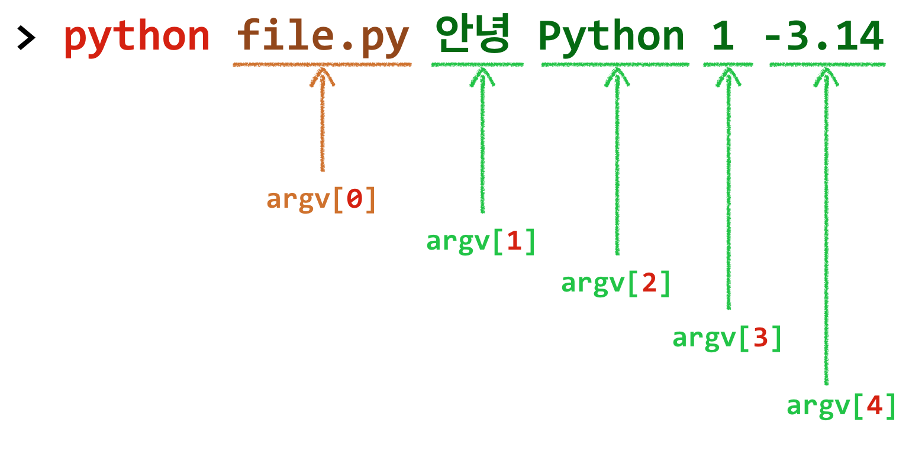

11장: 파일 처리</span>
===

File Handling

***

**박 진 수** 교수  
Intelligent Data Semantics Lab  
Seoul National University

***

<h3>Table of Contents<span class="tocSkip"></span></h3>
<div class="toc"><ul class="toc-item"><li><span><a href="#파일-종류" data-toc-modified-id="파일-종류-1">파일 종류</a></span><ul class="toc-item"><li><span><a href="#파일" data-toc-modified-id="파일-1.1">파일</a></span></li><li><span><a href="#파일-종류" data-toc-modified-id="파일-종류-1.2">파일 종류</a></span></li></ul></li><li><span><a href="#파일-쓰기와-읽기" data-toc-modified-id="파일-쓰기와-읽기-2">파일 쓰기와 읽기</a></span><ul class="toc-item"><li><span><a href="#파일-열기" data-toc-modified-id="파일-열기-2.1">파일 열기</a></span></li><li><span><a href="#파일-인코딩" data-toc-modified-id="파일-인코딩-2.2">파일 인코딩</a></span><ul class="toc-item"><li><span><a href="#운영체제와-인코딩" data-toc-modified-id="운영체제와-인코딩-2.2.1">운영체제와 인코딩</a></span></li><li><span><a href="#파일-인코딩-예시" data-toc-modified-id="파일-인코딩-예시-2.2.2">파일 인코딩 예시</a></span></li></ul></li><li><span><a href="#파일-쓰기" data-toc-modified-id="파일-쓰기-2.3">파일 쓰기</a></span><ul class="toc-item"><li><span><a href="#쓰기-모드로-텍스트-파일-열기" data-toc-modified-id="쓰기-모드로-텍스트-파일-열기-2.3.1">쓰기 모드로 텍스트 파일 열기</a></span></li><li><span><a href="#텍스트-파일-쓰기" data-toc-modified-id="텍스트-파일-쓰기-2.3.2">텍스트 파일 쓰기</a></span></li><li><span><a href="#Lab:-파이썬-선(禪)(The-Zen-of-Python)" data-toc-modified-id="Lab:-파이썬-선(禪)(The-Zen-of-Python)-2.3.3">Lab: 파이썬 선(禪)(The Zen of Python)</a></span></li><li><span><a href="#리스트의-객체를-파일에-쓰기" data-toc-modified-id="리스트의-객체를-파일에-쓰기-2.3.4">리스트의 객체를 파일에 쓰기</a></span></li><li><span><a href="#Lab:-파이썬-선(禪)(The-Zen-of-Python)-완성" data-toc-modified-id="Lab:-파이썬-선(禪)(The-Zen-of-Python)-완성-2.3.5">Lab: 파이썬 선(禪)(The Zen of Python) 완성</a></span></li><li><span><a href="#숫자를-파일에-쓰기" data-toc-modified-id="숫자를-파일에-쓰기-2.3.6">숫자를 파일에 쓰기</a></span></li><li><span><a href="#Lab:-리스트의-내용을-파일로-저장" data-toc-modified-id="Lab:-리스트의-내용을-파일로-저장-2.3.7">Lab: 리스트의 내용을 파일로 저장</a></span></li></ul></li><li><span><a href="#파일-읽기" data-toc-modified-id="파일-읽기-2.4">파일 읽기</a></span><ul class="toc-item"><li><span><a href="#read()-메소드" data-toc-modified-id="read()-메소드-2.4.1"><code>read()</code> 메소드</a></span></li><li><span><a href="#readline()-메소드" data-toc-modified-id="readline()-메소드-2.4.2"><code>readline()</code> 메소드</a></span><ul class="toc-item"><li><span><a href="#while()문으로-파일-전체-읽기" data-toc-modified-id="while()문으로-파일-전체-읽기-2.4.2.1"><code>while()</code>문으로 파일 전체 읽기</a></span></li><li><span><a href="#for()문으로-파일-전체-읽기" data-toc-modified-id="for()문으로-파일-전체-읽기-2.4.2.2"><code>for()</code>문으로 파일 전체 읽기</a></span></li><li><span><a href="#with문으로-파일-전체-읽기" data-toc-modified-id="with문으로-파일-전체-읽기-2.4.2.3"><code>with</code>문으로 파일 전체 읽기</a></span></li></ul></li><li><span><a href="#readlines()-메소드" data-toc-modified-id="readlines()-메소드-2.4.3"><code>readlines()</code> 메소드</a></span><ul class="toc-item"><li><span><a href="#readlines()-vs.-readline()" data-toc-modified-id="readlines()-vs.-readline()-2.4.3.1"><code>readlines()</code> vs. <code>readline()</code></a></span></li><li><span><a href="#readlines()-vs.-splitlines()" data-toc-modified-id="readlines()-vs.-splitlines()-2.4.3.2"><code>readlines()</code> vs. <code>splitlines()</code></a></span></li></ul></li><li><span><a href="#Lab:--파일의-각-줄-번호-출력" data-toc-modified-id="Lab:--파일의-각-줄-번호-출력-2.4.4">Lab:  파일의 각 줄 번호 출력</a></span></li><li><span><a href="#Lab:-파일-안의-영어를-대문자로-변환해서-출력" data-toc-modified-id="Lab:-파일-안의-영어를-대문자로-변환해서-출력-2.4.5">Lab: 파일 안의 영어를 대문자로 변환해서 출력</a></span></li><li><span><a href="#Lab:-파일-안의-영어를-대문자로-변환-후-다른-파일로-저장" data-toc-modified-id="Lab:-파일-안의-영어를-대문자로-변환-후-다른-파일로-저장-2.4.6">Lab: 파일 안의 영어를 대문자로 변환 후 다른 파일로 저장</a></span></li><li><span><a href="#Lab:-파일-안에-특정-단어가-있는지-검색" data-toc-modified-id="Lab:-파일-안에-특정-단어가-있는지-검색-2.4.7">Lab: 파일 안에 특정 단어가 있는지 검색</a></span></li><li><span><a href="#Lab:-텍스트-파일-기본-통계-분석" data-toc-modified-id="Lab:-텍스트-파일-기본-통계-분석-2.4.8">Lab: 텍스트 파일 기본 통계 분석</a></span></li><li><span><a href="#Lab:-딕셔너리로-각-단어의-출현-횟수-계산" data-toc-modified-id="Lab:-딕셔너리로-각-단어의-출현-횟수-계산-2.4.9">Lab: 딕셔너리로 각 단어의 출현 횟수 계산</a></span></li><li><span><a href="#Lab:-디폴트-딕셔너리로-각-단어의-출현-횟수-계산" data-toc-modified-id="Lab:-디폴트-딕셔너리로-각-단어의-출현-횟수-계산-2.4.10">Lab: 디폴트 딕셔너리로 각 단어의 출현 횟수 계산</a></span></li></ul></li><li><span><a href="#텍스트-파싱" data-toc-modified-id="텍스트-파싱-2.5">텍스트 파싱</a></span><ul class="toc-item"><li><span><a href="#따라해보기" data-toc-modified-id="따라해보기-2.5.1">따라해보기</a></span><ul class="toc-item"><li><span><a href="#파싱-1단계" data-toc-modified-id="파싱-1단계-2.5.1.1">파싱 1단계</a></span></li><li><span><a href="#파싱-2단계" data-toc-modified-id="파싱-2단계-2.5.1.2">파싱 2단계</a></span></li><li><span><a href="#파싱-3단계" data-toc-modified-id="파싱-3단계-2.5.1.3">파싱 3단계</a></span></li><li><span><a href="#파싱-4단계" data-toc-modified-id="파싱-4단계-2.5.1.4">파싱 4단계</a></span></li></ul></li><li><span><a href="#Lab:-투수-통계-데이터-파싱" data-toc-modified-id="Lab:-투수-통계-데이터-파싱-2.5.2">Lab: 투수 통계 데이터 파싱</a></span></li><li><span><a href="#Lab:-투수-통계-데이터를-파싱한-후-저장" data-toc-modified-id="Lab:-투수-통계-데이터를-파싱한-후-저장-2.5.3">Lab: 투수 통계 데이터를 파싱한 후 저장</a></span></li></ul></li></ul></li><li><span><a href="#명령어-옵션" data-toc-modified-id="명령어-옵션-3">명령어 옵션</a></span><ul class="toc-item"><li><span><a href="#sys.argv" data-toc-modified-id="sys.argv-3.1"><code>sys.argv</code></a></span></li><li><span><a href="#sys.argv의-구조" data-toc-modified-id="sys.argv의-구조-3.2"><code>sys.argv</code>의 구조</a></span></li><li><span><a href="#Lab:-파일의-첫-몇-줄-읽고-출력" data-toc-modified-id="Lab:-파일의-첫-몇-줄-읽고-출력-3.3">Lab: 파일의 첫 몇 줄 읽고 출력</a></span></li><li><span><a href="#Lab:-파일의-마지막-몇-줄-읽고-출력" data-toc-modified-id="Lab:-파일의-마지막-몇-줄-읽고-출력-3.4">Lab: 파일의 마지막 몇 줄 읽고 출력</a></span></li><li><span><a href="#Lab:-파일에-지정한-몇-줄-읽고-출력" data-toc-modified-id="Lab:-파일에-지정한-몇-줄-읽고-출력-3.5">Lab: 파일에 지정한 몇 줄 읽고 출력</a></span></li><li><span><a href="#Lab:-명령어-옵션으로-파일-안에-특정-단어가-있는지-검색" data-toc-modified-id="Lab:-명령어-옵션으로-파일-안에-특정-단어가-있는지-검색-3.6">Lab: 명령어 옵션으로 파일 안에 특정 단어가 있는지 검색</a></span></li></ul></li></ul></div>

# 파일 종류

## 파일

**파일**(file)이란?
- 컴퓨터 프로그램이 접근해서 사용할 수 있는 정보들의 모음을 담고 있는 컨테이너다.

파일은 주로 내구성이 뛰어난 저장소에 저장되기 때문에 파일에 저장된 데이터는 **지속성**을 가진다. 따라서 여러 프로그램이 안정적으로 사용할 수 있다.

**파일 처리**란?
- 파일 또는 파일에 저장된 데이터를 조작하는 것을 말한다.


## 파일 종류

파이썬이 다루는 파일의 종류
1. 텍스트 형식
1. 마크업 형식
1. 이진 형식

**텍스트 형식**(text format)
- 파이썬에서 가장 흔히 사용하는 파일 형식이다. 
- 파일의 내용으로 텍스트만 포함한다.
- 사람이 읽거나 편집할 수 있으며 텍스트 편집기나 툴(tool)을 사용하여 간편하게 처리하거나 변경하는 것이 쉽다.
- 모든 텍스트는 문자열로 처리되기 때문에 쓰기는 쉽지만 읽기(e.g., 숫자 및 날짜)는 까다롭다.
- 따라서 목적에 따라 **파싱**(parsing)이 필요하다.

**마크업 형식**(markup format)
- 문자 또는 부호 등 특별한 텍스트 코드로 이루어져 있다. 
- 텍스트의 특정 위치에 일종의 태그(tag)를 삽입하여 파일 내용을 어떤 방식으로 스크린에 나타내거나 인쇄해야 하는지 정하는 파일 형식이다.
- 사람이 읽거나 편집할 수 있으며 텍스트 편집기나 툴(tool)을 사용하여 간편하게 처리하거나 변경할 수 있다.
- 태그를 사용하게 때문에 내용이 장황하고 파일의 크기가 텍스트 형식보다는 큰 편이다.
- 텍스트 데이터 또는 이진(binary) 형식 데이터를 불러오거나 내보낼 때 징검다리 역할로 많이 사용한다.

**이진 형식**(binary format)
- 텍스트 형식이 아닌 이진 형태로 저장된 파일 형식이다. 
- 이진 형식의 정확한 포맷 규칙으로 모르면 이진 데이터를 처리할 수 없다.
- 이진 형식으로 저장된 파일은 외부에서 식별할 수 없을 뿐만 아니라 사람이 바로 인지할 수 있는 문자 형태로 저장되지 않기 때문에 파일 형식을 미리 정확히 이해하는 소프트웨어에서만 파일을 읽어들일 수 있다.
- 이진 형식의 파일은 용량이 상대적으로 작기 때문에 파일을 저장하거나 읽어들이는 속도가 빠르다.
- 사람이 직접 읽거나 편집할 수 없기 때문에 텍스트 파일이나 마크업 파일처럼 파싱(parsing)할 필요가 없다.

# 파일 쓰기와 읽기

## 파일 열기


프로그램이 파일을 사용하기 위한 필수 3 단계
1. 파일 열기
1. 파일 처리
1. 파일 닫기

**파일 객체**(file object)란?

- 특정 파일과 연결된 객체를 말한다.

파일 객체는 프로그램이 파일 처리와 관련된 모든 작업을 할 수 있는 방법을 제공한다. 그리고 파일 객체는 일반적으로 변수를 통해 참조한다.


```python
# 입력 파일 객체를 생성한 후 변수에 할당한다.
my_file = open('고향의봄.txt', mode='r')
```

이렇게 파일 객체를 변수에 할당한 후에는 다음 예처럼 파일에 저장한 내용을 줄 단위로 모두 읽어 들여서 한 줄씩 출력할 수 있다.


```python
lines = my_file.readlines()
for line in lines:
    print(line.strip())
```

**open()** 함수를 사용하면 파일 내용을 읽어 들일 수도 있고, 쓰기 작업을 통해 데이터를 파일로 저장할 수도 있다. **open()** 함수의 형식은 다음과 같다.

[**open**(***file, mode='r', buffering=-1, encoding=None, errors=None, newline=None, closefd=True, opener=None***)](https://docs.python.org/3/library/functions.html?highlight=open#open)

특징은 다음과 같다.
- ***file*** 과 연결된 파일 객체를 반환한다. 
    - 만약 파일을 열 수 없으면 **OSError**가 발생한다.
- ***file*** 은 열려는 파일의 경로 이름(현재 작업 폴더의 절대경로 또는 상대경로)과 파일 이름을 합한 문자열이다.
- ***mode*** 는 선택 사항으로 열려는 파일의 모드를 지정한다.
- ***mode*** 의 종류는 다음과 같다.
    - `'r'` : **읽기**용으로 파일을 연다.
        - 기본값이 텍스트 읽기 모드이기 때문에 설정하지 않으면 `'rt'` 모드로 파일을 연다.
    - `'w'` : **쓰기**용으로 파일을 연다. 
        - 만약 파일이 이미 존재하면 **기존의 데이터를 삭제**하고 새로 작성하므로 매우 조심해서 사용해야 한다.
    - `'x'` : `'w'`와 같지만 파일이 이미 존재하면 오류가 발생한다.
    - `'a'` : `'w'`와 같지만 파일이 이미 존재하면 파일의 마지막에 내용을 추가한다.
    - `'t'` : 텍스트 모드로 파일을 연다. 
        - 기본값이기 때문에 텍스트 모드로 파일을 열 때는 `'t'`를 생략해도 된다.
        - 텍스트 모드에서 ***encoding*** 을 지정하지 않으면 파이썬 개발 환경을 설치한 운영체제의 기본 인코딩이 적용된다.
    - `'b'` : 이진(binary) 모드로 파일을 연다. 
        - 이진 모드로 파일을 열 때는 ***encoding*** 을 지정하지 않는다. 
        - `'w+b'` 모드로 파일을 열 때 파일이 존재하면 기존의 데이터를 삭제하
고 새로 작성한다.
        - `'r+b'` 모드로 파일을 열 때는 기존의 데이터를 삭제하지 않고 연다.
    - `'+'` : 업데이트(읽기와 쓰기)용으로 파일을 연다.
- ***encoding*** 은 파이썬이 지원하는 텍스트 인코딩의 이름을 정할 수 있다. 
    - 텍스트 모드에서만 사용할 수 있다.
    - ***encoding*** 을 지정하지 않으면 파이썬 개발 환경을 설치한 운영체제의 기본 인코딩을 적용한다. 
    - ***encoding*** 을 지정하면 파일을 열 때 지정한 인코딩으로 파일을 인코딩하거나 디코딩한다.
- 나머지 매개변수 대부분은 기본값을 사용하기 때문에 이 책에서는 설명을 생략한다.
    - 구체적인 내용을 알고 싶으면 [파이썬 문서](https://docs.python.org/3/library/functions.html?highlight=open#open)를 참고하면 된다.

## 파일 인코딩

### 운영체제와 인코딩

**디폴트 인코딩**(default encoding)
- **Windows** : ANSI(e.g., cp1252, cp949 등과 같은 윈도우 코드 페이지)
    - 'latin-1'은 윈도우 코드 페이지와 대부분 호환 가능한 보편적인 인코딩 방식이다.
    - '**cp949**'는 한글을 지원하는 인코딩 방식이다.
    - 더 많은 정보는 다음 URL을 참고 
        - https://en.wikipedia.org/wiki/Windows_code_page
- **macOS** : Unicode
    - '**utf-8**'은 영어 외의 언어를 지원한다.
    - 'cp1252'('latin-1')는 라틴 알파벳(e.g., 영어)을 지원한다.


**국제 표준은 Unicode**
- 최근에는 Unicode를 주된 인코딩 방식으로 사용하는 추세다.
- 한글 인코딩을 위해서는 'utf-8' 사용을 권장한다.

**참고**
- 영어로 쓰인 파일은 대부분 윈도우와 맥 OS 환경에서 잘 작동한다.
- 한국어 단독이나 한국어와 영어가 함께 쓰인 파일은 윈도우나 맥 OS와 무관하게 UTF-8 인코딩 방식을 사용하는 것이 바람직하다.

https://en.wikipedia.org/wiki/Code_page 

### 파일 인코딩 예시


```python
# 윈도우, 맥 OS, 리눅스에서 만든 영어 파일을 읽을 경우 아래 코드를 사용한다.
file = open('input.txt') # 대부분의 경우 작동한다.

# 윈도우에서 만든 한글 파일을 윈도우에서 읽을 경우 아래 코드를 사용한다.
file = open('input.txt') # 대부분의 경우 작동한다

# 맥 OS, 리눅스에서 만든 한글 파일을 맥 OS, 리눅스에서 읽을 경우 아래 코드를 사용한다.
file = open('input.txt') # 대부분의 경우 작동한다.

# 맥 OS, 리눅스에서 만든 한글 파일을 윈도우에서 읽을 경우 아래 코드를 사용한다.
file = open('input.txt', encoding='utf-8') # 대부분의 경우 작동한다.

# 윈도우에서 만든 한글 파일을 맥 OS, 리눅스에서 읽을 경우 아래 코드를 사용한다.
file = open('input.txt', encoding='cp949')  # 대부분의 경우 작동한다.
file = open('input.txt', encoding='euc-kr') # 'cp949'가 안 되면 이 인코딩을 시도해본다.

# 운영체제 기본 값으로 파일을 쓸 경우는 아래 코드를 사용한다.
file = open('output.txt', mode='w') # 또는 간단히 open('output.txt', 'w')

# 모든 언어에서 인코딩 방식으로 UTF-8을 사용하도록 권장하고 있기 때문에 파일 쓰기를 할 때 아래 코드처럼 사용할 것을 권장한다.
file = open('output.txt', mode='w', encoding='utf-8')  
```

## 파일 쓰기

### 쓰기 모드로 텍스트 파일 열기

**따라해보기**

```python
file = open('고향의봄.txt', mode='w', encoding='utf-8')
```

```python
print(file)      # 파일 객체의 내용을 알아본다.
```

```python
file.name        # 파일 이름을 알려준다.
```

```python
file.mode        # 파일이 무슨 모드로 열렸는지 알려준다.
```

```python
file.encoding    # 파일의 인코딩 방식을 알려준다. 
```

```python
file.closed      # 파일이 닫혔으면 참(True)을 반환한다.
```

```python
file.close()     # 불러온 파일 객체를 닫는다.
```

```python
file.closed      # 파일이 닫혔는지 확인한다.
```

`close()` 메소드를 사용하는 형식은 다음과 같다.

**`파일객체.close()`**

특징은 다음과 같다.

- ***파일객체*** 를 **쓰기 모드**로 열었을 때는 
    - 모든 쓰기 작업을 완료한 후에 이 메소드를 **반드시 호출**해야 한다. 
    - 작업을 완료한 후에 해당 파일의 제어 권한을 다른 프로그램에 양도하는 역할을 하기 때문이다. 
    - 만약 작업이 끝난 뒤에 불러온 파일 객체를 닫아주지 않으면 파일 쓰기 작업을 제대로 마무리하지 못하고 종료하는 경우가 가끔 발생한다. 
    - 따라서 파일 쓰기 작업을 종료할 때 반드시 ***파일객체*** 를 닫아주는 것이 좋다.


- ***파일객체*** 를 **읽기 모드**로 열었을 때는
    - 읽기 작업을 완료한 후에 이 메소드를 반드시 호출 할 필요는 없다.
    - 하지만 만약 같은 프로그램을 실행하는 동안 같은 ***파일객체*** 를 다시 읽으려면 파일을 닫았다가 다시 열어야 한다. 

### 텍스트 파일 쓰기 

텍스트 파일을 쓸 때는 `write()` 메소드를 사용한다. `write()` 메소드를 사용하는 형식은 다음과 같다.

**`파일객체.write(객체)`**

다음과 같은 특징이 있다.

- 전달인자에 명시된 특정 ***객체*** 를 ***파일객체*** 에 쓴 후 쓰여진 문자의 개수를 반환한다.
- 텍스트 모드에서 ***객체*** 는 **문자열**이다. 
    - 텍스트 파일을 쓸 때는 문자열에서 주어진대로 쓰기 때문에 문자열 끝에 새줄바꿈(`\n`)을 자동으로 추가하지 않는다.
- 이진 모드에서 ***객체*** 는 바이트 형식의 텍스트나 객체다.

**따라해보기**

```python
file = open('고향의봄.txt', mode='w', encoding='utf-8')
```

```python
file.write('나의 살던 고향은 꽃피는 산골')  # 파일에 문자열을 쓴다.
```

```python
file.close()
```

```python
file = open('고향의봄.txt')
```

```python
file.read()
```

앞서 고향의 봄 노래 가사 중 첫 줄을 작성했는데, 나머지 가사를 추가하기 위해 `open()` 함수로 파일을 열 때 추가 모드인 `'a'`를 사용한다. 

```python
# mode='a'는 파일이 이미 존재하는 경우 파일의 마지막에 내용을 추가한다.
file = open('고향의봄.txt', mode='a', encoding='utf-8')
```

`write()` 메소드는 앞서 설명했듯이 문자열 그대로를 파일에 쓰기 때문에 줄 바꿈을 원하면 반드시 명시적으로 입력해주어야 한다. 앞서 노래 가사의 첫 줄을 작성해서 저장할 때 새줄바꿈(`\n`)을 줄의 끝에 추가하지 않았기 때문에 새줄바꿈 부호를 추가해야 한다.


```python
# 앞서 작성한 가사 첫 줄의 마지막에 새줄바꿈을 추가한다.
file.write('\n')     
```

```python
file.write('복숭아꽃 살구꽃 아기 진달래\n')
```

```python
file.write('울긋불긋 꽃대궐 차리인 동네\n')
```

```python
file.write('그 속에서 놀던 때가 그립습니다\n')
```

```python
# 2절 가사 쓰기 전에 새줄바꿈을 한다.
file.write('\n꽃동네 새동네 나의 옛고향\n')  
```

```python
# 한 번에 가사를 두 줄 쓴다.
file.write('파란 들 남쪽에서 바람이 불면\n냇가에 수양버들 춤추는 동네\n')  
```

```python
# 가사의 마지막 줄에는 새줄바꿈 의도적으로 추가하지 않는다.
file.write('그 속에서 놀던 때가 그립습니다') 
```

```python
# 파일에 내용을 다 쓴 후에 파일을 닫는다.
file.close()                
```

```python
file = open('고향의봄.txt', mode='r', encoding='utf-8')
print(file.read())  # 텍스트 형식으로 출력한다.
```

```python
# mode='r'는 기본값이라 생략해도 된다.
file = open('고향의봄.txt', encoding='utf-8')  
file.read()  # 대표 형식으로 출력한다.
```

### Lab: 파이썬 선(禪)(The Zen of Python)

다음 문자열을 파싱해서 파이썬 언어 설계 철학인 The Zen of Python 19개 문구 중 첫 10개를 **zen_of_python.txt** 파일로 저장해보자. 각 문구를 파일에서 한 줄씩 저장해야 한다. 

"Beautiful is better than ugly. Explicit is better than implicit. Simple is better than complex. Complex is better than complicated. Flat is better than nested. Sparse is better than dense. Readability counts. Special cases aren't special enough to break the rules. Although practicality beats purity. Errors should never pass silently."

**힌트** 
- 각 줄을 마침표(**.**)로 구분해서 분할한 후 한 줄씩 텍스트 파일에 저장하면 된다. 
- 문자열의 마지막 마침표 다음에는 빈 칸이 없다는 점에 유의하자. 
- 파이썬 셸에서 `import this`를 실행하면 The Zen of Python의 19개 문구 모두를 확인할 수 있다.

**실행 예**

**Windows 명령 프롬프트: type** 또는 **more**  
```code
> python zen_of_python.py
=== Job completed! =======

> type zen_of_python.txt
Beautiful is better than ugly.
Explicit is better than implicit.
Simple is better than complex.
Complex is better than complicated.
Flat is better than nested.
Sparse is better than dense.
Readability counts.
Special cases aren't special enough to break the rules.
Although practicality beats purity.
Errors should never pass silently.
```

**macOS 터미널: cat** 또는 **more**  
```code
> python zen_of_python.py
=== Job completed! =======

> cat zen_of_python.txt
Beautiful is better than ugly.
Explicit is better than implicit.
Simple is better than complex.
Complex is better than complicated.
Flat is better than nested.
Sparse is better than dense.
Readability counts.
Special cases aren't special enough to break the rules.
Although practicality beats purity.
Errors should never pass silently.
```

### 리스트의 객체를 파일에 쓰기

**따라해보기**


```python
# 리스트의 각 객체를 새줄바꿈으로 분리해서 한 줄에 하나씩 파일로 쓴 후 저장한다.
L = ['to', 'be', 'or', 'not', 'to', 'be']

file = open('list.txt', mode='w', encoding='utf-8')

for word in L:
    file.write(word + '\n')   # 각 객체 뒤에 새줄바꿈을 추가해서 쓴다.
else:
    file.close()
```


```python
file = open('list.txt', mode='a', encoding='utf-8')

# 각 객체를 역순으로 쉼표와 공백으로 분리해서 파일에 추가한다.
file.write(', '.join(reversed(L)) + '\n')
file.close()
```

### Lab: 파이썬 선(禪)(The Zen of Python) 완성

**zen_of_python.txt** 파일을 열어서 The Zen of Python 19개 문구 중 나머지 9개를 파싱해서 **zen_of_python.txt** 파일에 추가해보자. 각 문구를 파일에서 한 줄씩 저장해야 한다. 이번에는 문자열이 아닌 다음 **리스트**가 담고 있는 각 객체를 한 줄씩 추가해서 저장해야 한다.

```python
zen = [
    "Unless explicitly silenced.", 
    "In the face of ambiguity, refuse the temptation to guess.", 
    "There should be one-- and preferably only one --obvious way to do it.",
    "Although that way may not be obvious at first unless you're Dutch.", 
    "Now is better than never.",  
    "Although never is often better than *right* now.", 
    "If the implementation is hard to explain, it's a bad idea.", 
    "If the implementation is easy to explain, it may be a good idea.", 
    "Namespaces are one honking great idea -- let's do more of those!"
]
```

**실행 예**

**Windows 명령 프롬프트: type** 또는 **more**  
```code
> python zen_of_python_append.py
=== Job completed! =======

> type zen_of_python.txt
Beautiful is better than ugly.
Explicit is better than implicit.
Simple is better than complex.
Complex is better than complicated.
Flat is better than nested.
Sparse is better than dense.
Readability counts.
Special cases aren't special enough to break the rules.
Although practicality beats purity.
Errors should never pass silently.
Unless explicitly silenced.
In the face of ambiguity, refuse the temptation to guess.
There should be one-- and preferably only one --obvious way to do it.
Although that way may not be obvious at first unless you're Dutch.
Now is better than never.
Although never is often better than *right* now.
If the implementation is hard to explain, it's a bad idea.
If the implementation is easy to explain, it may be a good idea.
Namespaces are one honking great idea -- let's do more of those!
```

**macOS 터미널: cat** 또는 **more**  
```code
> python zen_of_python_append.py
=== Job completed! =======

> cat zen_of_python.txt
Beautiful is better than ugly.
Explicit is better than implicit.
Simple is better than complex.
Complex is better than complicated.
Flat is better than nested.
Sparse is better than dense.
Readability counts.
Special cases aren't special enough to break the rules.
Although practicality beats purity.
Errors should never pass silently.
Unless explicitly silenced.
In the face of ambiguity, refuse the temptation to guess.
There should be one-- and preferably only one --obvious way to do it.
Although that way may not be obvious at first unless you're Dutch.
Now is better than never.
Although never is often better than *right* now.
If the implementation is hard to explain, it's a bad idea.
If the implementation is easy to explain, it may be a good idea.
Namespaces are one honking great idea -- let's do more of those!
```

### 숫자를 파일에 쓰기

**따라해보기**


```python
# 튜플의 각 숫자(정수 또는 실수)를 새줄바꿈으로 분리해서 한 줄에 하나씩 파일로 쓴 후 저장한다.
numbers = 2, 3.1, -7, -1.4, 5

file = open('numbers.txt', mode='w', encoding='utf-8')

for number in numbers:
    file.write(str(number) + '\n')  # 문자열로 형변환해서 파일로 쓴다.
else:
    file.close()
```

### Lab: 리스트의 내용을 파일로 저장

다음 문자열을 **pitcher_stats.txt** 파일로 저장한다.

```code
'Kershaw/18/4/2.31,Jansen/5/0/1.32,Wood/16/3/2.72,Hill/12/8/3.32'
```

**pitcher_stats.txt** 파일에 다음과 같은 형식으로 저장되어야 한다.

```code
Kershaw/18/4/2.31
Jansen/5/0/1.32
Wood/16/3/2.72
Hill/12/8/3.32
```


**실행 예**

**Windows 명령 프롬프트: type** 또는 **more**  

```code
> python pitcher_stats.py
=== Job completed! =======

> type pitcher_stats.txt
Kershaw/18/4/2.31
Jansen/5/0/1.32
Wood/16/3/2.72
Hill/12/8/3.32
```

**macOS 터미널: cat** 또는 **more**  
```code
> python pitcher_stats.py
=== Job completed! =======

> cat pitcher_stats.txt
Kershaw/18/4/2.31
Jansen/5/0/1.32
Wood/16/3/2.72
Hill/12/8/3.32
```

## 파일 읽기

텍스트 파일을 읽기 모드로 열어서 파일의 내용을 읽을 때 사용하는 메소드는 다음 세 가지다.
- `read()`
- `readline()`
- `readlines()`

무슨 메소드를 사용할지는 상황에 따라 다르다.


```python
# 읽기 모드로 파일을 연다.
file = open('고향의봄.txt', mode='r', encoding='utf-8')
```


```python
file         # 파일 객체의 내용을 대표 형식으로 출력한다.
```


```python
print(file)  # 파일 객체의 내용을 텍스트 형식으로 출력한다.
```

### `read()` 메소드

`read()` 메소드는 텍스트 파일의 **모든 내용을 하나의 문자열**로 반환한다. `read()` 메소드의 형식은 다음과 같다.

**`파일객체.read(size=-1)`**

특징은 다음과 같다.

- 텍스트 파일인 ***파일객체*** 에서 **커서의 현재 위치부터** 최대 `size` 크기의 문자를 읽은 후, 새줄바꿈(`\n`)을 포함해서 **읽어 들인 문자 모두를 문자열 하나로 반환**한다.
- `size`의 값이 음수거나 지정하지 않으면 파일 끝(end-of-file, EOF)까지 읽어 들인다.
- 파일을 읽을 때마다 `size`만큼 커서가 이동한다. 
- 커서가 파일의 끝(EOF)에 있으면 **빈 문자열**(`''`)을 반환한다.

**따라해보기**


```python
# --- 방법 1
# 읽기 모드로 파일을 연다.
file = open('고향의봄.txt', mode='r', encoding='utf-8')
```


```python
data = file.read()     # 파일 내용을 읽어 변수에 할당한다.
```


```python
type(data)             # read()가 반환한 객체의 자료형을 확인한다.
```


```python
data                   # 대표 형식으로 출력한다.
```


```python
print(data)            # 텍스트 형식으로 출력한다.
```


```python
# --- 방법 2
# 읽기 모드로 파일을 열고 read() 메소드로 파일의 내용을 읽어 변수에 할당한다.
data = open('고향의봄.txt', mode='r', encoding='utf-8').read()
```


```python
type(data)     # read()가 반환한 객체의 자료형을 확인한다.
```


```python
data           # 대표 형식으로 출력한다.
```


```python
print(data)    # 텍스트 형식으로 출력한다.
```

파일 전체를 읽고 난 후 파일의 끝에서 파일을 다시 읽어보자.


```python
# --- EOF
file = open('고향의봄.txt', encoding='utf=8')
```


```python
file.read()
```


```python
file.read()  # EOF
```

`read()` 메소드로 파일의 일부만 읽어보자.


```python
# --- read()로 부분 읽기
file = open('고향의봄.txt', encoding='utf=8')
```


```python
print(file.read(9))
```


```python
print(file.read())
```


```python
file.read()  # EOF
```

### `readline()` 메소드


`readline()` 메소드는 텍스트 파일에서 **한 줄의 내용을 하나의 문자열**로 반환한다. `readline()` 메소드의 형식은 다음과 같다.

**`파일객체.readline(size=-1)`**

특징은 다음과 같다.

- ***파일객체*** (텍스트 파일)에서 **커서의 현재 위치부터** 새줄바꿈(`\n`)까지 또는 파일의 끝(EOF)까지 읽은 후, 새줄바꿈(`\n`) 부호를 포함한 **텍스트 한 줄을 문자열로 반환**한다.
- 즉, 파일 **한 줄의 내용을 문자열 하나로 반환**하는 메소드다.
- `size`의 값이 주어졌을 때는 최대 `size` 크기의 문자만 읽는다. 
- 커서가 파일의 끝(EOF)에 있으면 **빈 문자열**(`''`)을 반환한다.

**따라해보기**


```python
# 읽기 모드로 파일을 열고 readline() 메소드로 파일의 내용을 읽어 변수에 할당한다.
data = open('고향의봄.txt', mode='r', encoding='utf-8').readline()
```


```python
type(data)            # readline()이 반환한 객체의 자료형을 확인한다.
```


```python
data                  # 대표 형식으로 출력한다.
```


```python
print(data)           # 텍스트 형식으로 출력한다.
```

파일을 한 줄씩 읽어보자.


```python
file = open('고향의봄.txt', encoding='utf=8')
```


```python
file.readline()
```


```python
file.readline()
```


```python
print(file.readline())
```

`readline()` 메소드로 파일의 일부만 읽어보자.


```python
print(file.readline(5))
```


```python
for line in file:        # 커서의 현재 위치부터 나머지를 모두 읽어 처리한다.
    print(line, end='')  # print(line.rstrip())와 비슷한 효과를 가져온다.
```


```python
file.readline()          # EOF
```

#### `while()`문으로 파일 전체 읽기


```python
file = open('고향의봄.txt', mode='r', encoding='utf=8')
while True:
    line = file.readline()
    if not line:   # EOF이면 빈 문자열('')을 반환한다
        break      
    print(line.rstrip())
```


```python
file.readline()
```

#### `for()`문으로 파일 전체 읽기


```python
file = open('고향의봄.txt', encoding='utf=8')
for line in file:         # readline()을 호출할 필요가 없다.
    print(line.rstrip())  # print(line, end='')와 같다.
```


```python
file.readline()           # EOF
```


```python
file.closed
```


```python
file.close()
```


```python
file.closed
```

#### `with`문으로 파일 전체 읽기


```python
with open('고향의봄.txt', encoding='utf=8') as file:
    for line in file:
        print(line.rstrip())  # print(line, end='')와 같다  
```


```python
file.readline()
```


```python
file.closed
```

### `readlines()` 메소드

`readlines()` 메소드는 텍스트 파일의 내용을 **한 줄 단위로 읽어서 리스트**로 반환한다. `readlines()` 메소드의 형식은 다음과 같다.

**`파일객체.readlines(hint=-1)`**

특징은 다음과 같다.

- ***파일객체*** (텍스트 파일)에서 **커서의 현재 위치부터** 각 줄을 모두 읽은 후, 새줄 바꿈(`\n`) 부호를 포함한 **각 줄을 객체로 갖는 리스트**를 반환한다.
- 즉, 리스트의 개별 객체는 새줄바꿈 부호까지 포함한 텍스트 한 줄의 문자열이다.
- `hint` 는 읽어 들인 줄의 개수를 제어할 때 사용할 수 있다. 
    - 만약 지금까지 읽어 들인 모든 줄의 총 크기(문자)가 `hint` 를 초과하면 더 이상 줄을 읽지 않는다.
- 커서가 파일의 끝(EOF)에 있으면 빈 리스트(`[ ]`)를 반환한다.

**따라해보기**


```python
# --- 방법 1
# with문을 사용해 읽기 모드로 파일을 연다.
with open('고향의봄.txt', mode='r', encoding='utf-8') as file:
    data = file.readlines()  # 파일 내용을 읽어 변수에 할당한다.
```


```python
type(data)   # readlines()가 반환한 객체의 자료형을 확인한다.
```


```python
print(data)  # 출력한다.
```


```python
# --- 방법 2
# 읽기 모드로 파일을 열고 readlines() 메소드로 파일의 내용을 읽어 변수에 할당한다.
data = open('고향의봄.txt', mode='r', encoding='utf-8').readlines()
```


```python
type(data)   # readlines()가 반환한 객체의 자료형을 확인한다.
```


```python
print(data)  # 출력한다.
```

#### `readlines()` vs. `readline()`


```python
# --- readlines()
file = open('고향의봄.txt', mode='r', encoding='utf=8')
lines = file.readlines()
print(lines)
```


```python
# --- readline()
file = open('고향의봄.txt', mode='r', encoding='utf=8')
lines = []
for line in file:
    lines.append(line)
else:
    print(lines)
```

#### `readlines()` vs. `splitlines()`

***다음 두 코드의 차이는 뭘까?***

*file*.`readlines()`


```python
# --- readlines()
file = open('고향의봄.txt', mode='r', encoding='utf=8')
data = file.readlines()
```


```python
type(data)   # readlines()가 반환한 객체의 자료형을 확인한다.
```


```python
print(data)  # 출력한다.
```

*str*.`splitlines()`


```python
# --- read().splitlines()
file = open('고향의봄.txt', mode='r', encoding='utf-8')
data = file.read().splitlines()
```


```python
type(data)   # splitlines()가 반환한 객체의 자료형을 확인한다.
```


```python
print(data)  # 출력한다.
```

`readlines()`는 파일 메소드이고 `splitlines()`는 문자열 메소드다.

**참고**

*str*.`split()`


```python
# --- read().split('\n')
file = open('고향의봄.txt', mode='r', encoding='utf-8')
data = file.read().split('\n')  # 참고: splitlines()
```


```python
type(data)   # split()가 반환한 객체의 자료형을 확인한다.
```


```python
print(data)  # 출력한다.
```

### Lab:  파일의 각 줄 번호 출력

사용자로부터 텍스트 파일 이름을 입력받아 해당 파일을 읽은 후 각 줄에 줄 번호를 붙여서 그 줄의 내용을 출력하는 프로그램을 구현해보자.

**실행 예**

```code
> python line_numbering.py
파일 이름을 입력하세요...: 고향의봄.txt
   1: 나의 살던 고향은 꽃피는 산골
   2: 복숭아꽃 살구꽃 아기 진달래
   3: 울긋불긋 꽃대궐 차리인 동네
   4: 그 속에서 놀던 때가 그립습니다
   5: 
   6: 꽃동네 새동네 나의 옛고향
   7: 파란 들 남쪽에서 바람이 불면
   8: 냇가에 수양버들 춤추는 동네
   9: 그 속에서 놀던 때가 그립습니다
```

### Lab: 파일 안의 영어를 대문자로 변환해서 출력

사용자로부터 텍스트 파일 이름을 입력받아 해당 파일을 읽은 후 영어 단어가 있는 경우 모두 대문자로 변환해서 출력하는 프로그램을 구현해보자.

만약 텍스트 파일이 없으면 **The Zen of Python**(<https://www.python.org/dev/peps/pep-0020/#id3>)을 방문해서 19문장으로 된 문서를 전체 복사하여 메모장에 붙여놓은 후, 파일 이름을 **zen_of_python.txt**로 해서 이 문서를 사용한다.

**실행 예**
```code
> python convert_to_uppercase.py
파일 이름을 입력하세요...: zen_of_python.txt
BEAUTIFUL IS BETTER THAN UGLY.
EXPLICIT IS BETTER THAN IMPLICIT.
SIMPLE IS BETTER THAN COMPLEX.
COMPLEX IS BETTER THAN COMPLICATED.
FLAT IS BETTER THAN NESTED.
SPARSE IS BETTER THAN DENSE.
READABILITY COUNTS.
SPECIAL CASES AREN'T SPECIAL ENOUGH TO BREAK THE RULES.
ALTHOUGH PRACTICALITY BEATS PURITY.
ERRORS SHOULD NEVER PASS SILENTLY.
UNLESS EXPLICITLY SILENCED.
IN THE FACE OF AMBIGUITY, REFUSE THE TEMPTATION TO GUESS.
THERE SHOULD BE ONE-- AND PREFERABLY ONLY ONE --OBVIOUS WAY TO DO IT.
ALTHOUGH THAT WAY MAY NOT BE OBVIOUS AT FIRST UNLESS YOU'RE DUTCH.
NOW IS BETTER THAN NEVER.
ALTHOUGH NEVER IS OFTEN BETTER THAN *RIGHT* NOW.
IF THE IMPLEMENTATION IS HARD TO EXPLAIN, IT'S A BAD IDEA.
IF THE IMPLEMENTATION IS EASY TO EXPLAIN, IT MAY BE A GOOD IDEA.
NAMESPACES ARE ONE HONKING GREAT IDEA -- LET'S DO MORE OF THOSE!
```

### Lab: 파일 안의 영어를 대문자로 변환 후 다른 파일로 저장

바로 앞에서 실습한 <Lab: 파일 안의 영어를 대문자로 변환해서 출력>과 같은 작업을 실행하지만 이번에는 결괏값을 출력하지 않고 새로운 텍스트 파일로 생성하는 프로그램을 구현해보자. 새로운 파일의 이름은 기존 파일명 앞에 **UPPER**를 추가해서 기존 파일과 같은 디렉토리에 저장한다. 예를 들어, 원본 파일의 이름이 **zen_of_python.txt**면 영어를 대문자로 변환해서 새로 저장하는 파일의 이름은 **UPPERzen_of_python.txt**가 된다.

**힌트**
- 현재 작업 디렉토리가 아닌 다른 디렉토리에서 파일을 불러왔다면 그 파일과 같은 디렉토리에 저장하기 위해서는 `os.path` 모듈의 `abspath()` 함수를 사용하면 된다.


**실행 예**
```code
> python convert_write_to_uppercase.py
파일 이름을 입력하세요...: zen_of_python.txt
'UPPERzen_of_python.txt' 파일을 /Users/jinsoopark/Documents/data 디렉토리에 저장했습니다.
```

### Lab: 파일 안에 특정 단어가 있는지 검색

검색하고자 하는 텍스트 파일 이름과 검색 단어를 입력받아 대상 파일에서 특정 단어가 있으면 몇 번째 줄에 그 단어가 있는지 해당 줄 번호와 그 줄의 내용을 출력하는 프로그램을 구현해보자.

**실행 예**  
```code
> python findword.py
파일 이름을 입력하세요...: 고향의봄.txt
검색 단어를 입력하세요...: 꽃
   1: 나의 살던 고향은 꽃피는 산골
   2: 복숭아꽃 살구꽃 아기 진달래
   3: 울긋불긋 꽃대궐 차리인 동네
   6: 꽃동네 새동네 나의 옛고향
```   

### Lab: 텍스트 파일 기본 통계 분석

사용자로부터 텍스트 파일 이름을 입력받아 해당 파일을 읽은 후 그 파일 전체가 **몇 줄**로 되어 있는지(빈 줄 포함), **몇 개의 단어**로 구성되어 있는지, 그리고 **몇 개의 글자**로 구성되어 있는지 분석해서 그 결괏값을 출력하는 프로그램을 구현해보자.

분석할 떄 고려할 사항은 다음과 같다.
- **단어**의 구분은 빈 칸으로 한다.
- **글자**의 수를 계산할 때 부호나 기호를 생략한 알파벳 또는 한글만으로 한다.

**실행 예**
```code
> python doc_stats.py
파일 이름을 입력하세요...: 고향의봄.txt
=> 고향의봄.txt 파일은 9 줄, 36 단어, 97 문자로 구성되어 있습니다.
```

### Lab: 딕셔너리로 각 단어의 출현 횟수 계산

딕셔너리(`dict`)를 사용하여 각 단어의 출현 횟수를 계산하는 프로그램을 구현해보자. 딕셔너리를 사용하면 개별 객체들의 출현 횟수를 저장하기가 쉽다. 

이 프로그램은 사용자로부터 텍스트 파일 이름을 입력받아 그 파일 안에 들어 있는 **모든 단어**와 **각 단어의 출현 횟수**를 **알파벳(또는 가나다) 순으로 나열해서 출력**해야 한다. 

영어와 한국어 둘 다 처리할 수 있어야 하며, 프로그램을 간단히 작성하기 위해 한국어인 경우 형태소 분석은 하지 않고 각 단어를 구분 짓는 기준으로 띄어쓰기를 사용한다.

**힌트**
- 딕셔너리의 *dict*.`get()` 메소드를 사용하면 코드가 간결해진다.

**실행 예**  
```code
> python count_uniquewords.py
파일 이름을 입력하세요...: 고향의봄.txt
<고향은> : 1번 출현
<그> : 2번 출현
<그립습니다> : 2번 출현
<꽃대궐> : 1번 출현
<꽃동네> : 1번 출현
<꽃피는> : 1번 출현
<나의> : 2번 출현
<남쪽에서> : 1번 출현
<냇가에> : 1번 출현
<놀던> : 2번 출현
<동네> : 2번 출현
<들> : 1번 출현
<때가> : 2번 출현
<바람이> : 1번 출현
<복숭아꽃> : 1번 출현
<불면> : 1번 출현
<산골> : 1번 출현
<살구꽃> : 1번 출현
<살던> : 1번 출현
<새동네> : 1번 출현
<속에서> : 2번 출현
<수양버들> : 1번 출현
<아기> : 1번 출현
<옛고향> : 1번 출현
<울긋불긋> : 1번 출현
<진달래> : 1번 출현
<차리인> : 1번 출현
<춤추는> : 1번 출현
<파란> : 1번 출현
```

### Lab: 디폴트 딕셔너리로 각 단어의 출현 횟수 계산

디폴트 딕셔너리(`collections.defaultdict`)로 각 단어의 출현 횟수를 계산하는 프로그램을 구현해보자. 

앞서 <Lab: 딕셔너리로 각 단어의 출현 횟수 계산>와 같은 방식으로 사용자로부터 텍스트 파일 이름을 입력받아 그 파일 안에 들어 있는 **모든 단어**와 **각 단어의 출현 횟수**를 **알파벳(또는 가나다) 순으로 나열해서 출력**해야 한다.

영어와 한국어 둘 다 처리할 수 있어야 하며, 프로그램을 간단히 작성하기 위해 한국어인 경우 형태소 분석은 하지 않고 각 단어를 구분 짓는 기준으로 띄어쓰기를 사용한다.

**실행 예**
```code
> python count_uniquewords_dd.py
파일 이름을 입력하세요...: 고향의봄.txt
<고향은> : 1번 출현
<그> : 2번 출현
<그립습니다> : 2번 출현
<꽃대궐> : 1번 출현
<꽃동네> : 1번 출현
<꽃피는> : 1번 출현
<나의> : 2번 출현
<남쪽에서> : 1번 출현
<냇가에> : 1번 출현
<놀던> : 2번 출현
<동네> : 2번 출현
<들> : 1번 출현
<때가> : 2번 출현
<바람이> : 1번 출현
<복숭아꽃> : 1번 출현
<불면> : 1번 출현
<산골> : 1번 출현
<살구꽃> : 1번 출현
<살던> : 1번 출현
<새동네> : 1번 출현
<속에서> : 2번 출현
<수양버들> : 1번 출현
<아기> : 1번 출현
<옛고향> : 1번 출현
<울긋불긋> : 1번 출현
<진달래> : 1번 출현
<차리인> : 1번 출현
<춤추는> : 1번 출현
<파란> : 1번 출현
```

## 텍스트 파싱

텍스트 파일을 읽기 모드로 열면 모든 내용을 **문자열**로 읽기 때문에 수학 연산을 실행하기 위해서는 문자열로 된 숫자를 반드시 **숫자형**으로 변환해야 한다.

### 따라해보기

먼저 다음과 같은 성적 데이터를 메모장으로 작성해서 **grades.txt**라는 파일로 저장하자.

```code
제이지,97,A+
어피치,80,B+
무지,60,C-
튜브,95,A0
```

**[주의]** 콤마 뒤에 공백이 없이 바로 숫자나 문자가 온다.

#### 파싱 1단계

**파일의 각 행을 리스트의 객체로 담기**
- 파일을 읽기 모드로 연다.
- 개별 학생의 성적 정보를 행 단위로 리스트에 담는다.


```python
data = open('grades.txt', mode='r', encoding='utf-8').read().splitlines() 

# 각 줄(열)이 리스트에 문자열 객체로 저장되었음을 확인할 수 있다.
print(data)    
```

#### 파싱 2단계

**문자열을 리스트로 변환하기**
- 리스트가 담고 있는 각 객체(문자열)를 리스트로 변환한다.
- 이때, 문자열을 콤마 기준으로 분할한 리스트로 만든 후 리스트에 다시 담는다.


```python
for index, student in enumerate(data):
    data[index] = student.split(',')
```


```python
# 각 줄(열)이 콤마로 분리된 리스트로 변환되어 기존 리스트의 객체로 파싱되었음을 확인할 수 있다.
print(data)
```

#### 파싱 3단계

**계산에 필요한 데이터를 숫자로 형변환하기**
- 리스트의 두 번째 값을 문자열에서 정수로 변환한다.


```python
for student in data:
    student[1] = int(student[1])
```


```python
# 각 객체의 두 번째 열을 문자열에서 정수형으로 바꿨다.
print(data)
```

#### 파싱 4단계

**평균 점수 구하기**
- 리스트의 두 번째 값들의 **합**을 구한다.
- 전체 점수의 합을 **전체 학생 수**로 나눈다.


```python
total = 0
for student in data:
    total += student[1]       # 각 줄(열)의 두 번째 컬럼 점수의 합을 구한다.
else:                    
    print(total / len(data))  # 평균을 구해 출력한다.
```

**[참고]** 3단계와 4단계를 한꺼번에 처리하기


```python
total = 0
for student in data:
     total += int(student[1])
else:
    print(total / len(data))
```

**[참고]** 1~4 단계 한꺼번에 처리하기


```python
with open('grades.txt', mode='r', encoding='utf-8') as file:
    data = [int(i.split(',')[1]) for i in file.read().splitlines()]

print(sum(data) / len(data))
```

### Lab: 투수 통계 데이터 파싱

앞서 < Lab: 리스트의 내용을 파일로 저장 >에서 만든 **pitcher_stats.txt
** 파일로부터 투수 통계 데이터를 읽어와 아래와 같이 텍스트 데이터를 파싱한다. 

이때 **Name**은 문자열로, **W**와 **L**은 정수로, **ERA**은 실수로 처리한다.

| Name | W  | L   |  ERA|
|------|--------|---------|--------|
|Kershaw  | 18     | 4      |2.31 |
|Jansen  | 5     | 0     |1.32|
|Wood  | 16    | 3     |2.72|
|Hill  | 12     | 8      |3.32|

**참고**
- 텍스트 파일의 단락을 슬래시 `/`로 구분(delimited)하고 있다.
- **pitcher_stats.txt** 파일에 다음과 같은 형식으로 저장되어있다.
```code
Kershaw/18/4/2.31
Jansen/5/0/1.32
Wood/16/3/2.72
Hill/12/8/3.32
```

**실행 예**

 ```code
> python parsing_pitcher.py
[['Kershaw', 18, 4, 2.31], ['Jansen', 5, 0, 1.32], ['Wood', 16, 3, 2.72], ['Hill', 12, 8, 3.32]]
```

### Lab: 투수 통계 데이터를 파싱한 후 저장

< Lab: 투수 통계 데이터 파싱 >과 같은 방식으로 **pitcher_stats.txt
** 파일을 파싱해서 읽어들인 후 **pitcher_stats_new.txt**라는 새로운 파일 이름으로 저장하는 프로그램을 구현해보자. 

최종 처리한 파일은 **pitcher_stats.txt**와 같다.

**실행 예**

다음 실행 예는 파싱 과정을 출력해서 보여주고 있는데 이 부분은 생략해도 된다.

```code
> python parsing_writing_pitcher.py
=== 파일을 읽어들인 후 각 줄을 리스트로 저장한 결과 =======
['Kershaw/18/4/2.31', 'Jansen/5/0/1.32', 'Wood/16/3/2.72', 'Hill/12/8/3.32']
분할 전 : Kershaw/18/4/2.31
분할 후 : ['Kershaw', '18', '4', '2.31']
분할 전 : Jansen/5/0/1.32
분할 후 : ['Jansen', '5', '0', '1.32']
분할 전 : Wood/16/3/2.72
분할 후 : ['Wood', '16', '3', '2.72']
분할 전 : Hill/12/8/3.32
분할 후 : ['Hill', '12', '8', '3.32']
'/'로 결합 후 : Kershaw/18/4/2.31
'/'로 결합 후 : Jansen/5/0/1.32
'/'로 결합 후 : Wood/16/3/2.72
'/'로 결합 후 : Hill/12/8/3.32
=== pitcher_stats_new.txt =======
Kershaw/18/4/2.31
Jansen/5/0/1.32
Wood/16/3/2.72
Hill/12/8/3.32
```

# 명령어 옵션

**명령어 옵션**(command-line option)이란?
- 명령어 셸에서 프로그램을 실행할 때 **선택 사항**으로 사용하는 전달인자다. 
- 명령 줄 전달인자(command-line arguments)라고도 한다.

명령어 옵션은 특정 명령을 실행할 때 명령어의 기본값 대신에 다양한 실행 선택 옵션을 제공할 수 있기 때문에 프로그램의 유연성을 높일 수 있다. 

**디렉토리 목록 열람 명령어 옵션 예**  

윈도우의 셸 명령어 `dir` 옵션
```code
dir [drive:][path][file name] [/a[[:]attributes]] [/b] [/c] [/d] [/l] [/n] [/o[[:]sortorder]] 
    [/p] [/q] [/r] [/s] [/t[[:]timefield]] [/w] [/x] [/4]
```

`dir` 옵션을 확인하려면 <명령 프롬프트>에서 다음과 같이 입력하고 실행하면 된다.

```code
> dir /?
```

macOS와 리눅스 셸 명령어 `ls` 옵션
```code
ls [-ABCFGHLOPRSTUW@abcdefghiklmnopqrstuwx1][path][file name ...]
```

`man ls` 옵션을 확인하려면 <터미널>에서 다음과 같이 입력하고 실행하면 된다.
```code
> man ls
```

## `sys.argv`

`sys` 모듈의 `argv`는 
- 명령어 셸에서 파이썬 프로그램 파일을 실행하면 명령어 옵션 전달인자를 **리스트** 형태로 담고 있다.
- `sys.argv[0]`는 파이썬 프로그램 파일 이름을 담고 있다.

다음 코드를 작성한 후 **show_argv.py**라는 파일 이름으로 저장해보자.


```python
import sys
print(sys.argv)
```

이 파일을 명령어 셸에서 실행하면 다음과 같은 결과를 보여준다.

```code
> python show_argv.py
['show_argv.py']
```

**show_argv.py** 파일 뒤에 전 달인자를 몇 개 더 추가해서 실행해보자.

```code
> python show_argv.py option1 option2 5 -3.14
['show_argv.py', 'option1', 'option2', '5', '-3.14']
```

## `sys.argv`의 구조



**따라해보기**

다음 코드를 작성한 후 **lineno.py**라는 파일 이름으로 저장해보자.


```python
import sys

# 명령어 옵션으로 텍스트 파일 이름을 지정하지 않거나 '--help'를 사용해서 실행하면 프로그램 사용 방법을 알려준다.
if len(sys.argv) != 2 or sys.argv[1] == '--help':
    print('사용법 : python lineno.py filename') 
    sys.exit()

# [주의] 플랫폼 기본 인코딩 방식으로 파일 읽기를 할 때는 encoding='utf-8'를 생략한다.
with open(sys.argv[1], encoding='utf-8') as file:
    for no, line in enumerate(file, start=1):
        print('{:4}: {}'.format(no, line.rstrip()))
```

아무런 옵션을 지정하지 않고 파이썬 파일을 실행해보자.

```code
> python lineno.py
사용법 : python lineno.py filename
```

`--help`를 명령어 옵션으로 실행해보자.

```code
> python lineno.py --help
사용법 : python lineno.py filename
```

이번에는 텍스트 파일 이름을 명령어 옵션으로 지정해서 실행해보자.

```code
> python lineno.py 고향의봄.txt
   1: 나의 살던 고향은 꽃피는 산골
   2: 복숭아꽃 살구꽃 아기 진달래
   3: 울긋불긋 꽃대궐 차리인 동네
   4: 그 속에서 놀던 때가 그립습니다
   5: 
   6: 꽃동네 새동네 나의 옛고향
   7: 파란 들 남쪽에서 바람이 불면
   8: 냇가에 수양버들 춤추는 동네
   9: 그 속에서 놀던 때가 그립습니다
```   

## Lab: 파일의 첫 몇 줄 읽고 출력

대상 파일의 처음 몇 줄만 출력하는 프로그램을 다음과 같은 형식으로 구현해보자.

**`> python head.py 숫자 파일이름`**

- 파일의 첫 행(줄)부터 시작해서 출력할 행을 ***숫자*** 만큼 읽고 출력한다.

잘못된 입력값에 대한 예외 처리는 하지 않는다.

**실행 예**
```code
> python head.py 3 고향의봄.txt
나의 살던 고향은 꽃피는 산골
복숭아꽃 살구꽃 아기 진달래
울긋불긋 꽃대궐 차리인 동네
```

## Lab: 파일의 마지막 몇 줄 읽고 출력

대상 파일의 마지막 몇 줄만 출력하는 프로그램을 다음과 같은 형식으로 구현해보자.

**`> python tail.py 숫자 파일이름`**

- 파일의 마지막 부분의 출력할 행 ***숫자*** 만큼 읽고 출력한다.

잘못된 입력값에 대한 예외 처리는 하지 않는다.

**실행 예**  
```code
> python tail.py 2 고향의봄.txt
냇가에 수양버들 춤추는 동네
그 속에서 놀던 때가 그립습니다
```

## Lab: 파일에 지정한 몇 줄 읽고 출력

대상 파일에서 지정한 몇 줄만 출력하는 프로그램을 다음과 같은 형식으로 구현해보자.

**`> python body.py 시작줄 마지막줄 파일이름`**

- 파일의 일부 중 지정한 ***시작줄*** 부터 ***마지막줄*** 까지 읽고 출력한다.

잘못된 입력값에 대한 예외 처리는 하지 않는다.

**실행 예**
```code
> python body.py 3 6 고향의봄.txt
울긋불긋 꽃대궐 차리인 동네
그 속에서 놀던 때가 그립습니다

꽃동네 새동네 나의 옛고향
```

## Lab: 명령어 옵션으로 파일 안에 특정 단어가 있는지 검색

명령어 옵션을 사용해서 앞서 구현한 <Lab: 파일 안에 특정 단어가 있는지 검색>을 구현해보자.

검색 단어와 검색하고자 하는 텍스트 파일 이름을 명령어 옵션으로 전달하여 대상 파일에서 특정 단어가 있으면 몇 번째 줄에 그 단어가 있는지 해당 줄 번호와 그 줄의 내용을 출력하는 프로그램을 다음과 같은 형식으로 구현해보자.

**`> python grepword.py 검색단어 파일이름`**

**실행 예**
```code
> python grepword.py 꽃 고향의봄.txt
   1: 나의 살던 고향은 꽃피는 산골
   2: 복숭아꽃 살구꽃 아기 진달래
   3: 울긋불긋 꽃대궐 차리인 동네
   6: 꽃동네 새동네 나의 옛고향
```   

***
**THE END**