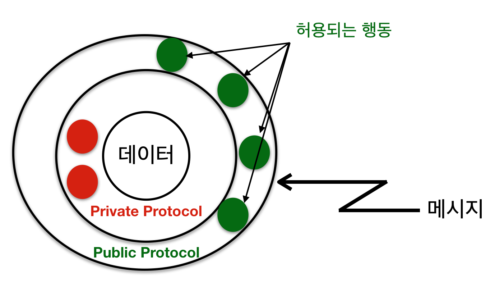

12장: 클래스와 객체
===

Classes and Objects

***

**박 진 수** 교수  
Intelligent Data Semantics Lab  
Seoul National University

***

<h3>Table of Contents<span class="tocSkip"></span></h3>
<div class="toc"><ul class="toc-item"><li><span><a href="#객체지향-프로그래밍-언어의-핵심-개념" data-toc-modified-id="객체지향-프로그래밍-언어의-핵심-개념-1">객체지향 프로그래밍 언어의 핵심 개념</a></span><ul class="toc-item"><li><span><a href="#추상화" data-toc-modified-id="추상화-1.1">추상화</a></span></li><li><span><a href="#캡슐화" data-toc-modified-id="캡슐화-1.2">캡슐화</a></span></li><li><span><a href="#클래스-간의-관계" data-toc-modified-id="클래스-간의-관계-1.3">클래스 간의 관계</a></span><ul class="toc-item"><li><span><a href="#연관-관계" data-toc-modified-id="연관-관계-1.3.1">연관 관계</a></span></li><li><span><a href="#상속-관계" data-toc-modified-id="상속-관계-1.3.2">상속 관계</a></span></li><li><span><a href="#부분-전체-관계" data-toc-modified-id="부분-전체-관계-1.3.3">부분-전체 관계</a></span></li></ul></li><li><span><a href="#다형성" data-toc-modified-id="다형성-1.4">다형성</a></span></li></ul></li><li><span><a href="#클래스와-객체-만들기" data-toc-modified-id="클래스와-객체-만들기-2">클래스와 객체 만들기</a></span><ul class="toc-item"><li><span><a href="#클래스와-객체의-개념" data-toc-modified-id="클래스와-객체의-개념-2.1">클래스와 객체의 개념</a></span><ul class="toc-item"><li><span><a href="#사용자-클래스" data-toc-modified-id="사용자-클래스-2.1.1">사용자 클래스</a></span></li><li><span><a href="#클래스와-객체-만들기" data-toc-modified-id="클래스와-객체-만들기-2.1.2">클래스와 객체 만들기</a></span></li></ul></li><li><span><a href="#클래스-속성" data-toc-modified-id="클래스-속성-2.2">클래스 속성</a></span><ul class="toc-item"><li><span><a href="#인스턴스에서-속성에-접근하기" data-toc-modified-id="인스턴스에서-속성에-접근하기-2.2.1">인스턴스에서 속성에 접근하기</a></span></li><li><span><a href="#클래스에서-속성에-접근하기" data-toc-modified-id="클래스에서-속성에-접근하기-2.2.2">클래스에서 속성에 접근하기</a></span></li><li><span><a href="#인스턴스에서-속성-값-수정하기" data-toc-modified-id="인스턴스에서-속성-값-수정하기-2.2.3">인스턴스에서 속성 값 수정하기</a></span></li><li><span><a href="#클래스와-인스턴스의-속성" data-toc-modified-id="클래스와-인스턴스의-속성-2.2.4">클래스와 인스턴스의 속성</a></span></li><li><span><a href="#클래스-속성-추가하기" data-toc-modified-id="클래스-속성-추가하기-2.2.5">클래스 속성 추가하기</a></span></li></ul></li><li><span><a href="#인스턴스-속성과-초기화-메소드" data-toc-modified-id="인스턴스-속성과-초기화-메소드-2.3">인스턴스 속성과 초기화 메소드</a></span><ul class="toc-item"><li><span><a href="#초기화-메소드-__init__()" data-toc-modified-id="초기화-메소드-__init__()-2.3.1">초기화 메소드 <code>__init__()</code></a></span></li><li><span><a href="#클래스에-인스턴스-속성-추가하기" data-toc-modified-id="클래스에-인스턴스-속성-추가하기-2.3.2">클래스에 인스턴스 속성 추가하기</a></span></li><li><span><a href="#객체에-인스턴스-속성-추가하기" data-toc-modified-id="객체에-인스턴스-속성-추가하기-2.3.3">객체에 인스턴스 속성 추가하기</a></span></li></ul></li><li><span><a href="#클래스-속성과-인스턴스-속성의-차이" data-toc-modified-id="클래스-속성과-인스턴스-속성의-차이-2.4">클래스 속성과 인스턴스 속성의 차이</a></span><ul class="toc-item"><li><span><a href="#클래스-속성" data-toc-modified-id="클래스-속성-2.4.1">클래스 속성</a></span></li><li><span><a href="#인스턴스-속성" data-toc-modified-id="인스턴스-속성-2.4.2">인스턴스 속성</a></span></li></ul></li><li><span><a href="#캡슐화와-속내용-감추기" data-toc-modified-id="캡슐화와-속내용-감추기-2.5">캡슐화와 속내용 감추기</a></span><ul class="toc-item"><li><span><a href="#네임-맹글링" data-toc-modified-id="네임-맹글링-2.5.1">네임 맹글링</a></span></li></ul></li><li><span><a href="#메소드" data-toc-modified-id="메소드-2.6">메소드</a></span></li><li><span><a href="#설명문자열(docstrings)" data-toc-modified-id="설명문자열(docstrings)-2.7">설명문자열(<strong>docstrings</strong>)</a></span></li><li><span><a href="#Lab:-아르바이트생-클래스-완성" data-toc-modified-id="Lab:-아르바이트생-클래스-완성-2.8">Lab: 아르바이트생 클래스 완성</a></span></li></ul></li><li><span><a href="#클래스-상속" data-toc-modified-id="클래스-상속-3">클래스 상속</a></span><ul class="toc-item"><li><span><a href="#isinstance()와-issubclass()-함수" data-toc-modified-id="isinstance()와-issubclass()-함수-3.1"><code>isinstance()</code>와 <code>issubclass()</code> 함수</a></span><ul class="toc-item"><li><span><a href="#isinstance()" data-toc-modified-id="isinstance()-3.1.1"><code>isinstance()</code></a></span></li><li><span><a href="#issubclass()" data-toc-modified-id="issubclass()-3.1.2"><code>issubclass()</code></a></span></li></ul></li><li><span><a href="#클래스-상속과-하위-클래스-만들기" data-toc-modified-id="클래스-상속과-하위-클래스-만들기-3.2">클래스 상속과 하위 클래스 만들기</a></span></li></ul></li></ul></div>

# 객체지향 프로그래밍 언어의 핵심 개념

객체지향 프로그래밍 언어의 핵심 개념으로는 다음 네 가지가 있다.

- 추상화
- 캡슐화 
- 클래스 간의 관계
- 다형성

## 추상화

**추상화**(abstraction)란?
- 복잡한 현실 세계의 상황을 단순화한 모델을 통해 표현할 수 있는 메커니즘이다.

추상화의 핵심은 객체를 설계하는 사람의 관점에서 객체의 가장 중요하고 본질적인 특성을 규정하는 것이다. 객체의 가장 중요한 '속성'과 '행위'를 정의하는 것을 추상화라고 한다. 

**속성과 행위**
- **속성**(attribute)은 객체의 현재 상태(state)를 설명할 수 있는 데이터의 모임이다. 
    - 상태(state) : 특정 객체가 가진 모든 속성의 현재 값(current value)을 나타내며 시간의 흐름에 따라 객체가 행동을 한 결과이다.

- **행위**(behavior)는 객체가 어떻게 동작(operation)해야 하는지 정의하는 것이다. 즉, 행위는 객체의 내부 특성이 아닌 외부 세계에서 하는 활동이다.
    - 동작(operation) : 객체가 제공하는 서비스를 말한다. 객체는 자신이 무엇을 어떻게 하는지 알고 있다.
    

## 캡슐화

**캡슐화**(encapsulation)란?
- 외부 세계로부터 객체 안의 세부적인 내용을 숨기는 것을 말한다. 

다음 그림처럼 캡슐화를 통해 객체 내부에서 일어나는 작업 내용(실제 내부에서 처리하는 상태와 행동)을 최소한만 보여줌으로서 외부 세계가 의도치 않게 객체의 속성(데이터)을 변경하거나 손상하는 것을 방지할 수 있다. 



캡슐화를 잘하면 객체를 재사용하기 쉽다. 

자바는 객체의 대부분 또는 모든 속성을 사적 속성(private attribute)으로 정의해서 객체의 데이터를 보호한다. 하지만 파이썬에서는 사적 속성이 존재하지 않기 때문에 네임 맹글링(name mangling)을 통해 외부에서 객체의 내부 속성에 의도적으로 직접 접근하는 것을 어렵게 한다.
- 네임 맹글링(name mangling) : 프로그래밍 언어 자체적으로 일정한 규칙에 따라 변수나 함수의 이름을 변경하는 것을 말한다.

## 클래스 간의 관계

클래스 간의 관계(relationship)는 다음과 같이 크게 세 가지로 구분한다.

- 연관 관계(association)
- 상속 관계(inheritance)
- 부분-전체 관계(part-whole)

연관 관계는 동등한 관계에 기반을 두고 있으며, 상속 관계와 부분-전체 관계는 클래스의 계층 구조(class hierarchy)에 기반을 두고 있다. 클래스 계층 구조(class hierarchy)는 클래스 사이의 상하 순서 관계를 규정한다.

### 연관 관계

**연관 관계**(association)란?
- 두 클래스 간의 동등한 관계를 나타내며 P2P(peer-to-peer) 관계라고도 부른다.


### 상속 관계

**상속 관계**(inheritance relationship)란?
- 상위 클래스(superclass)와 하위 클래스(subclass)의 수직 관계를 나타낸다.
- **is-a** 관계라고도 부른다.
    - 예) Bus is a Motor Vehicle
- 일반화 vs. 특수화
    - **일반화**(generalization) : 하위 클래스들의 특성 중 공통 특징을 추상화해서 상위 클래스를 만드는 과정
    - **특수화**(specialization) : 상위 클래스에 속하지 않는 특별한 특성을 추출해서 하위 클래스를 만드는 과정

하위 클래스는 상위 클래스에서 정의한 속성, 행동, 관계 및 제약 조건 등을 모두 상속 받기 때문에 둘의 관계를 '상속 관계'라고 한다. 상속을 통해 하위 클래스(자식 클래스)는 상위 클래스(부모 클래스)의 행동과 속성을 상속받을 수 있기 때문에 공유(share)와 재사용(reuse)이 가능하다. 따라서 상속 관계의 최대 장점은 기존 클래스를 불러와서 재사용하거나 기존 클래스를 토대로 내용을 변경(특수화)할 수 있다는 점이다. 

**다중 상속**(multiple inheritance)이란?
- 한 클래스가 복수의 상위 클래스로부터 상속받는 것을 말한다.

다중 상속의 예로는 다용도 트럭(sport utility vehicle, SUV)이 있다. 다용도 트럭은 승용차(car)와 트럭(truck) 둘의 특징을 상속받은 클래스다.

파이썬은 다중 상속을 지원하는 언어다.

### 부분-전체 관계

**부분-전체 관계**(part-whole)란?
- 하나의 클래스가 다른 클레스를 포함하는 관계를 나타낸다.

부분-전체 관계는 다음 두 종류로 구분할 수 있다.
- **집합 관계**(aggregation) : 둘의 관계가 독립적이다.
    - 예) 학생과 박사과정 위원회 관계
- **포함 관계**(composition) : 둘의 관계가 종속적이다.
    - 예) 엔진과 자동차 관계


## 다형성

**다형성**(polymorphism)이란?
- 많은 형태(many forms)를 뜻하는 그리스어다.

서로 다른 클래스에 속해 있는 객체들이 같은 이름의 메소드를 사용하더라도 각기 다른 방식으로 행동할 수 있도록 해주는 메카니즘이다. 이를 통해 우리는 서로 다른 클래스에 속한 객체들에게 같은 메시지를 보내지만 각 객체가 자신에게 맞는 행동으로 적절하게 응답하도록 할 수 있게 한다.
- 예) 도형(**Shape.draw()**)의 하위 클래스인 원(**Circle.draw()**), 삼각형(**Circle.draw()**), 사각형(**Rectangle.draw()**) 등 

# 클래스와 객체 만들기

## 클래스와 객체의 개념

**클래스**(class)란?
- 같은 종류의 집단에 속하는 객체(object)들의 속성(attribute)과 행동(behavior)을 정의한다. 

**객체**(object)란?
- 클래스의 인스턴스(instance)다.
- 객체는 자신 고유의 속성(attribute) 값을 가지고 있으며 클래스에서 정의한 행동(behavior)을 실행한다.

**예시 : 쿠키틀과 쿠키**

쿠키를 만들 때 사용하는 쿠키틀(cookie cutter)과 쿠키(cookie)의 관계를 생각해보자. 쿠키는 쿠키의 모양을 잡아주는 '틀'이 있기 때문에 우리는 일정한 모양의 쿠키를 특별한 노력 없이도 즐길 수 있다.

**쿠키틀**(cookie cutter)
- 쿠키의 형태인 크기나 모양 등의 특징을 결정한다.

같은 쿠키틀에서 만들어지는 쿠키의 형태는 같으므로 쿠키틀은 '같은 종류의 집단'을 만들어 주는 역할을 한다. 즉, 같은 종류의 집단에 속한 쿠키들의 특징(속성과 행동)을 정의한다.

**쿠키**(cookie)
- 쿠키틀을 이용해 만들어진 쿠키를 '객체(object)'라고 부른다.

### 사용자 클래스

**사용자 클래스**(custom class)란?
- 사용자가 직접 만든 클래스를 말한다.

사용자 클래스를 작성하는 일반적인 형식은 다음과 같다.

<b><pre>class 클래스이름:
    클래스-명령문</pre></b>
    
특징은 다음과 같다.

- 클래스를 정의할 때 **클래스이름** 다음에 바로 '쌍점(:)'이 온다. 
- 다음 두 가지 방법은 파이썬 2에서 클래스를 정의할 때 사용하는 방법이기 때문에 권장하지 않는다.
    - **`class 클래스이름( ):`** 은 최상위 클래스인 `object`를 상속할 때는 `object`를 생략하고, 빈 괄호를 사용해서 정의한다.
    - **`class 클래스이름(object):`** 일 때 파이썬에서 최상위 클래스는 `object`다. 
        - 만약 다른 클래스를 상속할 때는 괄호 안에 다른 클래스의 이름을 적어 넣으면 되지만, 최상위 클래스인 `object`를 상속하면 이를 생략해도 된다. 
        - 사용자 정의 함수는 기본적으로 `object`로부터 자동으로 상속된 클래스를 생성하기 때문에 요즘은 이렇게 사용하지 않는다.
- ***클래스-명령문*** 에는 클래스의 속성과 메소드들이 온다.
    - 속성의 종류로는 **클래스 속성**과 **인스턴스 속성**이 있다. 
        - **클래스 변수**와 **인스턴스 변수**라고도 부른다.
- 메소드는 파이썬이 제공하는 메소드와 사용자가 정의한 메소드로 나눈다. 
    - 파이썬이 제공하는 특별한 메소드들은 주로 메소드 이름이 밑줄 두 개로 시작해서 밑줄 두 개로 끝난다. (예, `__init__()` 등)

### 클래스와 객체 만들기


먼저, 클래스와 객체의 자료형을 확인해보자.


```python
class MyClass: pass
```


```python
type(MyClass)  # MyClass의 자료형이 클래스다.
```


```python
type(int)      # int의 자료형이 클래스다.
```


```python
type(list)     # list의 자료형이 클래스다.
```


```python
c = MyClass()  
type(c)        # 자료형이 MyClass다.
```


```python
x = int()
type(x)        # 자료형이 int다.
```


```python
y = list() 
type(y)        # 자료형이 list다
```

서울대학교 느티나무 아르바이트생(**PartTimer**) 클래스를 정의하고 자료형을 확인해보자. 


```python
# --- PartTimer 클래스 정의하기
class PartTimer:  
    pass
```


```python
type(PartTimer)  # PartTimer 클래스 자료형 확인하기
```

이번에는 방금 정의한 **PartTimer** 클래스의 객체를 생성하고 자료형을 확인해보자.


```python
# --- PartTimer 클래스의 객체(인스턴스) 생성하기
kim = PartTimer()
lee = PartTimer()
```


```python
# PartTimer 인스턴스 자료형 확인하기
type(kim), type(lee)
```

**PartTimer** 클래스의 특성을 가진(물론 아직은 아무것도 없지만) ***kim***과 ***lee*** 객체를 생성했다. 두 객체 모두 **PartTimer** 클래스라는 '틀'을 이용해 만들어었기 때문에 같은 특징을 가진다. 이처럼 클래스를 한 번 정의해 놓으면 이후에 다시 정의하지 않고도 같은 특성을 가진 객체를 반복적으로 생성할 수 있다.

## 클래스 속성

앞의 예에서는 클래스의 이름만 정의했지만 클래스의 속성과 메소드를 정의하기 위해서는 함수를 정의할 때와 마찬가지로 **들여쓰기**(indentation)를 해서 내용을 작성해야 한다.

***그럼 먼저 `PartTimer` 클래스에 필요한 속성이 무엇인지 생각해보자.***

**시급**
- 느티나무 카페 아르바이트생의 시급은 시간 당 9,500원이라 가정한다. 
- 모든 아르바이트생의 시급을 기본적으로 9,500원으로 했기 때문에 클래스를 정의할 때 시급의 기본값으로 9,500원을 지정할 수가 있다.

클래스 속성을 정의하는 방식은 초깃값을 할당해서 변수를 선언하는 것과 같다.

\_\_TODO\_\_를 채워 다음 코드를 완성해보자.


```python
class PartTimer:
    __TODO__  # 클래스 속성 : 시급이 9500이다.
```

클래스에 속성을 정의했으니 이번에는 이 클래스의 객체를 다시 생성해보자. 느티나무 카페에 필요한 아르바이트생은 현재 두 명이라고 가정하자.

\_\_TODO\_\_를 채워 다음 코드를 완성해보자.


```python
kim = __TODO__  # PartTimer 클래스의 객체를 생성해서 변수 kim에 할당한다.
lee = __TODO__  # PartTimer 클래스의 객체를 생성해서 변수 lee에 할당한다.
```

### 인스턴스에서 속성에 접근하기

객체를 통해 속성에 접근하기 위해서는 도트 연산자(**.**)를 사용하며 형식은 다음과 같다. 

**`객체이름.속성이름`**

위에서 생성한 두 객체의 속성 값을 확인해보자. 

**힌트**
- 속성 이름은 ***hour_rate***이다.

\_\_TODO\_\_를 채워 다음 코드를 완성해보자.


```python
kim.__TODO__  # 인스턴스를 통해 클래스 속성에 접근한다.
```


```python
lee.__TODO__  # 인스턴스를 통해 클래스 속성에 접근한다.
```

### 클래스에서 속성에 접근하기

이 결과 둘 다 ***hour_rate***의 기본값인 '9500'(시급 9,500원)을 가지고 있다. ***hour_rate***은 **PartTimer** 클래스의 모든 객체에 적용이 되는 속성이다.  

**클래스 속성**(class attribute)이란?
- 클래스 내 모든 인스턴스에 동일하게 적용되는 속성이다.
- 해당 클래 스의 모든 인스턴스가 공유하는 데이터를 저장(참조)하기 때문에 **클래스 변수**(class variable)라고도 한다.

클래스 속성은 앞서 한 것 처럼 객체를 통해 접근할 수도 있지만 클래스를 통해서도 접근할 수 있으며 형식은 다음과 같다.

**`클래스이름.속성이름**

사실 이렇게 접근하는 것이 의미론적으로는 더 명확하다고 볼 수 있다.

\_\_TODO\_\_를 채워 다음 코드를 완성해보자.


```python
__TODO__.hour_rate  # 클래스를 통해 클래스 속성에 접근한다.
```

### 인스턴스에서 속성 값 수정하기

인스턴스의 값은 **`객체이름.속성이름 = 속성값`** 으로 수정 또는 추가가 가능하다.  

무경험자인 ***lee***의 시급을 7,000원으로 변경해보자.

\_\_TODO\_\_를 채워 다음 코드를 완성해보자.


```python
# 무경험자인 lee의 시급을 7,000원으로 변경한다.
__TODO__ = __TODO__
```

이제 변경한 내용이 어떻게 반영되었는지 모든 인스턴스와 클래스의 속성 값을 확인해보자.


```python
# lee의 시급이 변경되었는지 확인한다.
lee.hour_rate          # lee의 시급은 7000이다.
```


```python
# kim의 시급도 확인한다.
kim.hour_rate         # kim의 시급은 변하지 않았았다.
```


```python
# 클래스 속성인 hour_rate의 값도 확인한다.
PartTimer.hour_rate   # 클래스 속성 값도 여전히 9500이다.
```

### 클래스와 인스턴스의 속성

커피 가게에 손님이 많이 찾아와 아르바이트생 한 명을 더 고용했다. 

변수 이름이 ***park***인 객체를 하나 더 생성해보자.

\_\_TODO\_\_를 채워 다음 코드를 완성해보자.


```python
__TODO__ = __TODO__  # park 인스턴스를 생성한다.
```

***park***의 시급이 얼마인지 확인해보자.

\_\_TODO\_\_를 채워 다음 코드를 완성해보자.


```python
__TODO__.hour_rate  # park의 시급은 얼마일까?
```

최근 열심히 일한 아르바이트생 덕분에 느티나무 카페의 수입이 많이 늘어나서 아르바이트생의 기본 시급을 10,000원으로 올려주기로 결정했다. 따라서 클래스 속성인 시급 ***hour_rate***의 값을 10,000으로 수정하자.

***클래스의 속성 값을 변경하려면 어떻게 하면 될까?***

\_\_TODO\_\_를 채워 다음 코드를 완성해보자.


```python
# 클래스 속성을 수정하려면 '클래스이름.속성이름'으로 접근한다.
__TODO__ = 10_000    
```

클래스 속성 값을 수정했는데, 인스턴스 속성 값도 변경되었는지 확인해보자.


```python
# kim의 시급을 확인한다.
kim.hour_rate                   
```


```python
# park의 시급을 확인한다.
park.hour_rate
```


```python
# lee의 시급을 확인한다.
lee.hour_rate
```

***lee***의 경우는 **`객체이름.속성이름`** 으로 접근해서 값을 수정했기 때문에 사실상 클래스 속성이라기 보다는 ***lee***에만 한정된 인스턴스 속성으로 바뀌었다. 따라서 더 이상 클래스 속성이 아니기 때문에 클래스 속성의 값을 변경해도 반영되지 않는다.

### 클래스 속성 추가하기

대부분의 객체지향형 언어들은 클래스에 속성을 추가하려면 클래스를 재정의해야 한다. 하지만 파이썬은 클래스 정의할 때 선언하지 않았던 속성이더라도 나중에 만들어 값을 할당하면 그 클래스의 속성이 된다.

클래스 속성을 하나 더 만들어 추가해보자. 
- **cafe_name = '느티나무 카페'**

\_\_TODO\_\_를 채워 다음 코드를 완성해보자.


```python
# 새로운 클래스 속성을 만들어 추가한다.
__TODO__.cafe_name = '느티나무 카페'        
```

나중에 만든 클래스 속성이 이미 만든 인스턴스에 반영이 되었는 지 확인해보자. 그리고 기존의 클래스 속성도 그대로 있는지 확인해보자.


```python
# 새로운 클래스 속성이 추가되었는지 확인하기 위해 kim으로 새로 추가한 속성과 기존 속성을 호출한다.
kim.cafe_name, kim.hour_rate
```


```python
# 새로운 클래스 속성이 추가되었는지 확인하기 위해 park으로 새로 추가한 속성과 기존 속성을 호출한다.
park.cafe_name, park.hour_rate
```


```python
# 새로운 클래스 속성이 추가되었는지 확인하기 위해 lee로 새로 추가한 속성과 기존 속성을 호출한다.
lee.cafe_name, lee.hour_rate
```

인스턴스를 생성한 뒤 나중에 추가한 클래스 속성도 기존 인스턴스에 모두 반영되었음을 알 수 있다.

## 인스턴스 속성과 초기화 메소드

***개별 아르바이트생의 근무 시간은 어떻게 기록해야 할까?***

이 데이터는 각 아르바이트생마다 다르기 때문에 객체마다 다르게 기록해야 한다. 따라서 이 경우에는 클래스에 속한 모든 인스턴스에 동일하게 적용하는 클래스 속성을 사용할 수 없다.

***그렇다면 객체마다 자신의 값을 가질 수 있도록 하는 방법은 없을까?***

인스턴스 속성을 사용하면 된다.

**인스턴스 속성**(instance attribute)이란?
- 개별 인스턴스가 각자의 고유한 값을 가져야 할 때 사용하는 속성이다.
- 각 인스턴스의 고유한 데이터를 저장(참조)하기 때문에 **인스턴스 변수**(instance variable)라고도 한다.

인스턴스 속성은 클래스가 인스턴스를 생성하는 시점에 만들기 때문에 주로 초기화 메소드 안에 정의한다.

### 초기화 메소드 `__init__()`

초기화 메소드의 형식은 다음과 같다.

**`__init__(self[, 매개변수, ...])`**

다음과 같은 특징이 있다.
- 클래스가 인스턴스를 생성할 때 초기화 할 수 있도록 하는 특별한 메소드이다.
- 어떤 객체가 클래스로부터 만들어질 때 저절로 호출되며 그 객체가 갖게 될 여러 가지 기본적인 초깃값을 설정해주는 역할을 한다.  
- 첫 번째 매개변수로 ***self***가 온다.

이처럼 클래스 메소드를 정의하는 방법은 아래 한 가지만 제외하고 일반 함수를 정의하는 것과 같다. 

- 첫 번째 매개변수로 ***self***가 온다. 

다른 이름을 사용해도 되지만 관례에 따라 이 매개변수의 이름을 ***self***라고 명한다. 자세한 설명은 '바로 쓰는 파이썬: 기초편'의 491p를 참조하면 된다.

### 클래스에 인스턴스 속성 추가하기

아르바이트생의 근무 시간을 기록할 ***whours***란 인스턴스 속성을 초기화 메소드 안에 정의해보자. 그리고 아르바이트생의 수가 늘어날 것을 대비해 아르바이생마다 닉네임을 만들어 주도록 하자.

- 인스턴스 속성
    - ***nickname***
    - ***whours***
    
인스턴스 속성은 주로 `__init__()` 메소드 안에 정의한다. 인스턴스 속성은 `__init__()` 메소드 안에서 **`self.속성이름`** 형식으로 정의하면 된다.

\_\_TODO\_\_를 채워 다음 코드를 완성해보자.


```python
class PartTimer:
    cafe_name = '느티나무 카페'   # 클래스 속성 : 아르바이트생이 근무하는 커피 가게 이름
    hour_rate = 9500           # 클래스 속성 : 시급
    def __init__(self, name):  # 초기화 메소드
        __TODO__               # 인스턴스 속성 : 아르바이트생 닉네임
        __TODO__               # 인스턴스 속성 : 근무한 시간
```

다음 코드를 실행해보자.


```python
lee = PartTimer()
```

***왜 오류가 날까?***

***오류가 나지 않으려면?***

다음 코드처럼 인스턴스 생성시 반드시 닉네임을 지정해야 한다.


```python
lee = PartTimer('네오')         
```

방금 생성한 ***lee***의 속성 값들을 학인해보자.


```python
lee.cafe_name   # 클래스 속성
lee.hour_rate   # 클래스 속성
lee.nickname    # 인스턴스 속성
lee.whours      # 인스턴스 속성
```

### 객체에 인스턴스 속성 추가하기

조금 전에 생성한 닉네임이 '네오'인 객체 ***lee***에 새로운 속성인 ***email***을 추가해보자.

\_\_TODO\_\_를 채워 다음 코드를 완성해보자.

```python
# 새로운 속성 email을 PartTimer 인스턴스 lee에 추가한다.
# email 값는 'neo@kfriends.kr' 
__TODO__ = 'neo@kfriends.kr'      
```

***email*** 속성이 추가 되었는 지 ***lee***를 통해 확인해보자.

```python
lee.email
```

***email*** 속성이 클래스에도 추가 되었는 지 확인해보자.

```python
PartTimer.email
```

클래스에는 추가되지 않았다. 

***이유는?***

## 클래스 속성과 인스턴스 속성의 차이

### 클래스 속성

```python
class MyClass:
    counter = 0                # 클래스 속성을 초기화한다.
    def __init__(self, name):  # 인스턴스를 생성할 때 닉네임은 반드시 지정해야 한다.
        self.nickname = name   # 인스턴스 속성을 초기화한다.
        MyClass.counter += 1   # 객체 한 개를 생성할 때마다 클래스 속성 값이 1씩 증가한다. 
```


```python
# 인스턴스 x를 생성한다. 닉네임은 '네오'다.
x = MyClass('네오')      
```


```python
# 인스턴스 x의 속성 nickname의 값을 확인한다.
x.nickname              
```


```python
# 클래스 속성 counter의 값을 확인한다.
# MyClass가 생성한 인스턴스는 현재 1개다.
x.counter    
```


```python
# 인스턴스 y를 생성한다. 닉네임은 '프로도'다.
y = MyClass('프로도')     
```


```python
# 인스턴스 y의 속성 nickname의 값을 확인한다.
y.nickname              
```


```python
# 클래스 속성 counter의 값을 확인한다.
# MyClass가 생성한 인스턴스는 현재 2개다.
y.counter 
```


```python
# 인스턴스 z를 생성한다. 닉네임은 '라이언'이다.
z = MyClass('라이언')     
```


```python
# 인스턴스 z의 속성 nickname의 값을 확인한다.
z.nickname
```


```python
# 클래스 속성 counter의 값을 확인한다.
# MyClass가 생성한 인스턴스는 현재 3개다.
z.counter
```


```python
# 인스턴스 x로 클래스 속성 counter의 값을 다시 확인한다.
x.counter
```


```python
# 인스턴스 y로 클래스 속성 counter의 값을 다시 확인한다.
y.counter
```


```python
# 클래스 이름으로 클래스 속성 counter 값을 확인한다
MyClass.counter
```

### 인스턴스 속성


```python
class MyClass:
    counter = 0                # 클래스 속성을 초기화한다.
    def __init__(self, name):  # 인스턴스를 생성할 때 닉네임은 반드시 지정해야 한다.
        self.nickname = name   # 인스턴스 속성을 초기화한다.
        self.counter += 1      # self로 접근 : 인스턴스 속성으로 바뀐다.
```


```python
# 인스턴스 x를 생성한다. 닉네임은 '네오'다.
x = MyClass('네오')      
```


```python
# 인스턴스 x의 속성 nickname의 값을 확인한다.
x.nickname              
```


```python
# 인스턴스 속성 counter의 값을 확인한다.
# 인스턴스 x는 현재 1개다.
x.counter               
```


```python
# 인스턴스 y를 생성한다. 닉네임은 '프로도'다
y = MyClass('프로도')     
```


```python
# 인스턴스 y의 속성 nickname의 값을 확인한다.
y.nickname                      
```


```python
# 인스턴스 속성 counter의 값을 확인한다.
# 인스턴스 y는 현재 1개다.
y.counter
```


```python
# 인스턴스 z를 생성한다. 닉네임은 '라이언'이다.
z = MyClass('라이언')     
```


```python
# 인스턴스 z의 속성 nickname의 값을 확인한다.
z.nickname
```


```python
# 인스턴스 속성 counter의 값을 확인한다.
# 인스턴스 z는 현재 1개다.
z.counter
```


```python
# 인스턴스 x로 인스턴스 속성 counter 값을 다시 확인한다.
x.counter
```


```python
# 인스턴스 y로 인스턴스 속성 counter 값을 다시 확인한다.
y.counter
```


```python
# 클래스 이름으로 클래스 속성 counter 값을 확인한다.
# 클래스 속성을 단 한번도 변경한 적이 없다.
MyClass.counter         
```

## 캡슐화와 속내용 감추기

**캡슐화**(encapsulation)란? - *revisited*
- 외부 세계로부터 객체 안의 세부적인 내용을 숨기는 것(data hiding)을 말한다.

캡슐화가 잘된 클래스는 데이터 손상을 방지한다. 클래스에서 정의한 객체의 속성은 객체 내부에 존재하며, 다른 객체가 접근하거나 변경하기 쉽지 않도록 설계하기 때문이다. 데이터의 손상을 방지하기 위해서 주로 속성을 사적(private) 속성으로 정의해서 외부로부터 데이터가 변경되거나 손상되는 것을 방지한다. 이를 **속내용 감추기** 또는 **데이터 숨기기**(data hiding)이라 한다.

**사적 속성**(private attribute)이란?
- 해당 속성을 생성한 객체를 외부의 다른 객체가 접근할 수 없도록 만든 속성을 말한다. 
- 즉, 객체 자신만이 접근 가능한 속성을 말한다. 

***그렇다면 외부 세계에서 객체의 속성(데이터)에 어떻게 접근할까?***

클래스는 객체의 내부 상태, 즉 정보에 접근하려는 외부의 다른 객체들이 사용할 수 있는 인터페이스(interface)를 제공한다. 이는 메소드를 통해 구현한다. 문제는 파이썬에서는 순수한 사적 속성이 존재하지 않는다는 것이다.

***그렇다면 파이썬에서는 어떻게 데이터를 외부 세계로부터 보호할 수 있을까?***

완벽하지는 않지만 네임 맹글링 등의 방법을 통해 인스턴스 속성에 직접 접근하는 것을 어렵게 할 수 있다.

### 네임 맹글링

**네임 맹글링**(name mangling)이란?
- 속성 이름을 쉽게 알아보지 못하게 함으로써 외부에서 의도적으로 속성에 직접 접근하는 것을 어렵게 하는 기법이다.
- 속성 이름 앞에 밑줄 두 개(`__`)를 붙여서 사용하면 된다.

**따라해보기**


```python
class MyClass:
    def __init__(self, attr):
        self.__attr = attr  # 인스턴스 속성 __attr를 초기화한다.
        
c = MyClass('속성')
```


```python
c.__attr
```

이처럼 직접 속성에 접근하려면 오류가 난다. 속성 이름이 없다는 것이다. 그렇다고 속성에 접근하는 것이 불가능한 것은 아니다. 다음과 같은 형식으로 접근이 가능하다.

**`객체이름._클래스이름__속성이름`**


```python
c._MyClass__attr
```

파이썬 기본 철학에 따르면 모든 것을 비공개로 하는 것을 강조하지는 않는다. 하지만 만약 클래스나 인스턴스 속성에 아무나 접근하는 것이 부담스럽다면 완벽하게 객체의 내부 데이터를 보호할 수는 없지만 네임 맹글링을 통해서 이 문제를 어느 정도 해결할 수 있다.

앞서 정의한 인스턴스 속성인 ***nickname***과 ***whours***를 네임 맹글링해보자.

\_\_TODO\_\_를 채워 다음 코드를 완성해보자.


```python
class PartTimer:
    cafe_name = '느티나무 카페'   # 클래스 속성 : 아르바이트생이 근무하는 커피 가게 이름
    hour_rate = 9500           # 클래스 속성 : 시급
    def __init__(self, name):  # 초기화 메소드
        __TODO__ = name        # 인스턴스 속성 : 아르바이트생 닉네임
        __TODO__ = 0           # 인스턴스 속성 : 근무한 시간
```

## 메소드

**메소드**(method)란?
- 인스턴스의 행동(behavior)을 정의하기 위해 클래스에 구현한 일종의 함수다. 

메소드는 클래스가 외부 세계에 제공하는 서비스며 특정 정보를 전달하거나 어떤 행동을 요청하는 등 서로 다른 객체 사이의 상호 작용을 위한 의사소통 수단으로 사용한다. 


클래스가 생성한 인스턴스를 통해 메소드를 호출하기 위해서는 점 연산자(**.**)를 사용하며 형식은 다음과 같다.

**`객체이름.메소드이름([...])`**
- 괄호 안의 `[...]`는 전달인자가 있을 때 사용한다.

직접 클래스를 통해 메소드에 접근할 때는 메소드를 호출하는 인스턴스를 첫 번째 전달인자로 지정해야 하기 때문에 􏰄􏰅􏰆다음과 같은 형식으로 호출한다.

**`클래스이름.메소드이름(인스턴스[, ...])`**

먼저 인스턴스 속성에 접근하기 위한 메소드를 정의해보자. 
- **nickname()** : 아르바이트생의 닉네임을 반환한다.
- **whours()** : 근무 시간을 추가해서 기존 근무 시간에 합한다. 

그리고 급여를 계산하는 메소드도 구현한다. 
- **total_wage()** : 총 근무 시간에 시급을 곱한 결괏값을 반환한다.

\_\_TODO\_\_를 채워 다음 코드를 완성해보자.


```python
class PartTimer:
    cafe_name = '느티나무 카페'    # 클래스 속성 : 커피 가게 이름
    hour_rate = 9500            # 클래스 속성 : 시급
    def __init__(self, name):
        """초기화 메소드다."""
        self.__nickname = name  # 인스턴스 속성 : 아르바이트생 닉네임
        self.__whours = 0       # 인스턴스 속성 : 근무한 시간
    def nickname(self):
        """닉네임을 불러오는 메소드다."""
        return __TODO__
    def whours(self, hours_worked):
        """근무 시간을 설정(기존 근무 시간 + 현 근무 시간)하는 메소드다."""
        __TODO__
    def total_wage(self):
        """급여를 계산하는 메소드다."""
        return __TODO__
```

위에서 정의한 **PartTimer** 클래스가 잘 작동하는지 인스턴스를 몇 개 만들어 테스트 해보자.


```python
kim = PartTimer('프로도')
lee = PartTimer('네오')
```


```python
# '프로도'가 2시간 근무했다.
kim.whours(2)             
```


```python
# '네오'가 3시간 근무했다.
lee.whours(3)             
```


```python
# '네오'가 5시간을 근무했다(총 8시간).
lee.whours(5)             
```


```python
# '프로도'가 3시간 근무했다(총 5시간).
kim.whours(3)             
```


```python
# 이번 달 '프로도'의 급여는 9500 x 5시간 = 47,500원이다.
kim.total_wage()             
```


```python
# 이번 달 '네오'의 월급은 9500 x 8시간 = 76,000원이다.
lee.total_wage()             
```

클래스로 메소드를 호출해보자.


```python
PartTimer.whours(7)
```

***오류가 난다. 이유가 뭘까?***

클래스를 통해 메소드를 호출할 때 이 메소드를 사용하는 인스턴스를 첫 번째 전달인자로 지정해야 한다.

**`클래스이름.메소드이름(인스턴스[, ...])`**


```python
# '프로도'가 3시간을 추가 근무했다(총 8시간).
PartTimer.whours(kim, 3)      
```


```python
# 급여는 '네오'와 같은 9500 x 8시간 = 76,000원이다.
PartTimer.total_wage(kim)        
```

## 설명문자열(**docstrings**)


```python
class PartTimer:
    """느티나무 카페에서 일하는 아르바이트생 클래스다.
    
    Attributes:
        Class Attributes: 
            cafe_name (str): 커피 가게 이름
            hour_rate (int): 시급
        Instance Attributes: 
            __nickname (str): 아르바이트생 닉네임
            __whours (int): 근무한 시간

    Methods:
        __init__(self, name: str) -> None:
        nickname(self) -> str:
        whours(self, hours_worked: int) -> None:
        total_wage(self) -> None:
    """
    # --- 클래스 속성 ---------------------------------------------------------- #
    cafe_name = '느티나무 카페'  # 클래스 속성 : 커피 가게 이름
    hour_rate = 9500          # 클래스 속성 : 시급
    
    # --- 초기화 메소드 --------------------------------------------------------- #
    def __init__(self, name):                      
        """인스턴스를 생성할 때 아르바이트생의 닉네임으로 초기화한다.
        
        Args:
            name (str): 아르바이트생의 닉네임
        """
        self.__nickname = name  # 인스턴스 속성 : 아르바이트생 닉네임
        self.__whours = 0       # 인스턴스 속성 : 근무한 시간
    
    # --- 접근자 메소드 -------------------------------------------------------- #
    def nickname(self):                         
        """아르바이트생의 닉네임을 반환한다.
        
        Returns:
            str: 아르바이트생의 닉네임
        """
        return self.__nickname
    
    def whours(self, hours_worked):             
        """아르바이트생의 근무한 시간을 기록한다.
        
        Args:
            hours_worked (int): 근무한 시간
        """
        self.__whours += hours_worked  # 기존 근무시간에 현 근무 시간을 추가해서 합한다.

    # --- 일반 메소드 ----------------------------------------------------------- #
    def total_wage(self):                          
        """지금까지 근무한 시간을 기준으로 계산한 급여를 반환한다.
        
        Returns:
            int: 현재까지 일한 급여
        """
        return self.__whours * PartTimer.hour_rate   # 총 근무시간 * 시급       
```


```python
print(PartTimer.__doc__)
```

`help()` 함수로 **PartTimer** 클래스에 대해 알아보면 좀 더 상세한 정보를 알 수 있다. 다음 코드를 실행해보자.


```python
help(PartTimer)
```

## Lab: 아르바이트생 클래스 완성

앞서 다룬 아르바이트생 클래스(**PartTimer**)를 일부 변경해서 구현한 후 **parttimer.py**로 저장하자. 

클래스 속성은 ***hour_rate***, ***total_parttimers***가 있다. 시급인 ***hour_rate***의 기본 시급은 9,500원이다. ***total_parttimers***는 아르바이트생 전체 수를 담고 있으며 아르바이트생 인스턴스를 하나 생성할 때 마다 1씩 증가한다. 

인스턴스 속성은 ***nickname***, ***workplace***, ***whours***가 있다. ***nickname***은 개별 아르바이트생의 닉네임을, ***workplace***는 이 아르바이트셍의 근무 장소(빌딩), 그리고 ***whours***는 근무 시간을 담고 있다. 인스턴스를 생성할 때 닉네임과 근무지를 전달인자로 사용해야 하는데, 닉네임은 반드시 주어져야 하며, 근무지가 주어지지 않으면 기본값으로 '113동'이 할당된다. 

매소드는 초기화 메소드인 **\_\_init\_\_()**, 인스턴스 속성 값을 반환하는 접근자 메소드인 **nickname()**, **workplace()**, 근무한 시간을 기록하는 **whours()** 가 있다. 그리고 시급과 지금까지 근무한 시간으로 현재까지 일한 급여를 계산해서 반환하는 **total_wage()** 가 있다.

이렇게 구현한 **PartTimer** 클래스를 **import**문 또는 **from...import**문으로 불러와 다음 예처럼 실행해보자.
 
**실행 예**
 
```python
>>> from parttimer import PartTimer
>>> park = PartTimer('라이언')
>>> lee = PartTimer('네오', '137-1동')
>> park.nickname()
라이언
>>> lee.nickname()
네오
>>> park.workplace()
113동
>>> lee.workplace()
137-1동
>>> park.whours(4)
>>> lee.whours(3)
>>> park.whours(4)
>>> park.whours(3)
>>> lee.whours(3)
>>> park.total_wage()
104500
>>> lee.total_wage()
57000
>>> PartTimer.total_parttimers
2
```

# 클래스 상속

## `isinstance()`와 `issubclass()` 함수

### `isinstance()`

**`isinstance()` 함수**
- 객체가 특정 클래스(또는 하위 클래스)의 인스턴스인지 확인하는 함수다. 
- 이 함수는 사용자 클래스뿐만 아니라 파이썬 자료형에도 적용해서 사용할 수 있다.

`isinstance()` 함수를 사용하는 형식은 다음과 같다.

**`isinstance(x, y)`**

특징은 다음과 같다.
- ***x***가 ***y*** 클래스 혹은 ***y***의 하위 클래스 인스턴스면 '참(True)'을, 그렇지 않으면 '거짓(False)'을 반환한다.
- ***y***에는 클래스 이름, 튜플, **`객체이름.__class__`** 가 올 수 있다. 
    - ***y***가 튜플이고 튜플에 포함한 여러 클래스(자료형) 중 한 클래스의 인스턴스면 '참(True)'을 반환한다. 
    - ***y***가 클래스가 아니면 `TypeError` 오류가 난다.
    - 참고로 **`객체이름.__class__`** 를 호출하면 해당 객체를 생성한 클래스를 확인할 수 있다.

**따라해보기**


```python
type(-5)
```


```python
isinstance(-5, int)
```


```python
isinstance(-5, str)
```


```python
isinstance(0.0, float)
```


```python
isinstance('', str)
```


```python
isinstance([1], list)
```


```python
class Person:
    pass

p = Person()
```


```python
isinstance(p, Person)
```


```python
type(p)
```


```python
p.__class__
```

**객체이름.\_\_class\_\_.\_\_name\_\_** 을 사용하면 객체를 생성한 클래스의 이름을 확인할 수 있다.


```python
p.__class__.__name__
```


```python
x = '1'
y = 1
```


```python
x.__class__.__name__
```


```python
y.__class__.__name__
```


```python
class 파이썬:
    pass
```


```python
k = 파이썬()
```


```python
isinstance(k, str)
```


```python
isinstance(k, 파이썬)
```


```python
k.__class__.__name__
```


```python
__name__
```

### `issubclass()`

**`issubclass()` 함수**
- 클래스가 특정 클래스의 하위 클래스인지 확인하는 함수다. 

`issubclass()` 함수를 사용하는 형식은 다음과 같다.

**`issubclass(x, y)`**

특징은 다음과 같다.
- ***x*** 클래스가 ***y*** 클래스의 하위 클래스(subclass)면 '참(True)'을 그렇지 않으면 '거짓(False)'을 반환한다.
- 모든 클래스는 자기 자신을 자신의 하위 클래스로 간주한다.
- ***y***가 튜플이면 튜플이 포함한 모든 클래스를 확인한다.
- 만약 ***x***나 ***y***가 클래스가 아니면 `TypeError` 오류가 난다.

**따라해보기**


```python
class Person: pass
class Student(Person): pass
class CollegeStudent(Student): pass
class Teacher(Person): pass
class Professor(Teacher): pass
```


```python
# Person -> object
issubclass(Person, CollegeStudent)
```


```python
# CollegeStudent -> Student -> Person
issubclass(CollegeStudent, Person)
```


```python
# CollegeStudent -> Student
issubclass(CollegeStudent, Student)
```


```python
# 클래스 자신은 클래스의 자신의 하위 클래스로 간주한다.
issubclass(CollegeStudent, CollegeStudent)
```


```python
# Teacher -> Person
issubclass(Teacher, Person)
```


```python
# 클래스 자신은 클래스의 자신의 하위 클래스로 간주한다.
issubclass(Teacher, Teacher)
```


```python
# Teacher -> Person 
issubclass(Teacher, Student)
```


```python
# Teacher -> Person
issubclass(Teacher, Professor)
```


```python
# Professor -> Teacher -> Person
issubclass(Professor, Student)
```


```python
# Professor -> Teacher -> Person
issubclass(Professor, Person)
```


```python
# Student -> Person
issubclass(Student, Professor)
```

## 클래스 상속과 하위 클래스 만들기

클래스를 정의할 때 클래스 이름 뒤에 아무것도 지정하지 않으면 기본적으로 최상위 클래스인 `object`를 상속한다. `object`가 아닌 다른 클래스의 하위 클래스로 정의하는 형식은 다음과 같다. 

```code
class 클래스이름(상위-클래스-이름)
    [클래스 속성 정의 ...] 

    def __init__(self[, 매개변수-1, 매개변수-2, ...]):
        super().__init__([...])   
        [인스턴스 속성 정의 ...]
        명령문...

    [기타 메소드 정의 ...]
```
    
    
파이썬은 다중 상속을 지원한다. 

**다중 상속**(multiple inheritance)이란?
- 클래스 하나가 복수의 상위 클래스로부터 상속받을 수 있는 상속 방법을 말한다.
- 자세한 설명은 '바로 쓰는 파이썬: 기초편'의 513p~514p를 참조하면 된다.


```python
class PartTimer:
    cafe_name = '느티나무 카페'
    hour_rate = 9500
    def __init__(self, name):                      
        self.__nickname = name 
        self.__whours = 0 
    def nickname(self):                         
        return self.__nickname
    def whours(self, hours_worked):             
        self.__whours += hours_worked
    def total_wage(self):                          
        return self.__whours * PartTimer.hour_rate
```

우선 **PartTimer** 클래스의 인스턴스 두 개를 생성한다.


```python
kim = PartTimer('프로도')
lee = PartTimer('네오')
```

아르바이트생들의 일정을 관리하는 수석 아르바이트생인 **ChiefPartTimer** 클래스를 정의한다. 이 클래스는 **PartTimer**의 모든 속성과 메소드 외 다음과 같은 추가 속성과 메소드를 가진다.

- ***__workers*** : 인스턴스 속성이며 자신이 관리하는 아르바이트생 정보를 담은 리스트다. 
- **add_ worker()** : 자신이 관리하는 아르바이트생을 ***__workers***로 추가하는 메소드다.
- **show_workers()** : 아르바이트생의 닉네임을 출력하는 메소드다.

\_\_TODO\_\_를 채워 다음 코드를 완성해보자.


```python
class ChiefPartTimer(PartTimer):
    def __init__(self, name):        
        super().__TODO__            # super() 함수로 상속받는 모든 속성들을 초기화한다.
        __TODO__.__workers = []     # 인스턴스 속성 : 근무자 리스트

    def add_worker(self, other):
        if __TODO__:                             # PartTimer의 인스턴스면 
            __TODO__.__workers.append(__TODO__)  # __workers에 닉네임을 추가한다.
        else:                                    # PartTimer의 인스턴스가 아니면 
            print('{}의 인스턴스가 아닙니다.'.format(PartTimer.__name__))  # 오류 메시지를 출력한다.

    def show_workers(self):
        print(__TODO__)   # 자신이 관리하는 아르바이트생 모두의 닉네임을 출력한다.
```

닉네임이 '라이언'인 **ChiefPartTimer** 클래스의 인스턴스를 생성한다.

\_\_TODO\_\_를 채워 다음 코드를 완성해보자.


```python
# 닉네임이 '라이언'인 ChiefPartTimer 클래스의 객체를 생성해서 변수 park에 할당한다.
park = __TODO__
```


```python
# park의 닉네임을 확인한다.
park.nickname()
```


```python
# 아르바이트생 '프로도'를 park이 관리하는 근무자 리스트에 추가한다.
park.add_worker(kim)
```


```python
# 아르바이트생 '네오'를 park이 관리하는 근무자 리스트에 추가한다.
park.add_worker(lee)
```


```python
# 문자열 '제이지'를 park이 관리하는 근무자 리스트에 추가한다.
park.add_worker('제이지')
```


```python
# --- (SKIP) 
'제이지'.__class__
'제이지'.__class__.__name__
```


```python
# park이 현재 관리하는 모든 아르바이트생의 닉네임을 출력한다.
park.show_workers()
```


```python
# '라이언'이 5시간 근무했다(총 5시간).
park.whours(5) 
```


```python
# 이번 달 '라이언'의 월급은 9500 x 3시간 = 47,500원이다.
park.total_wage()     
```

마지막으로 인스턴스가 속한 클래스를 확인해보자.


```python
isinstance(park, ChiefPartTimer)
```


```python
isinstance(park, PartTimer)
```


```python
isinstance(park, kim.__class__)
```


```python
park.__class__.__name__
```


```python
kim.__class__.__name__
```


```python
isinstance(kim, PartTimer)
```


```python
isinstance(lee, PartTimer)
```


```python
isinstance(kim, ChiefPartTimer)
```


```python
isinstance(lee, ChiefPartTimer)
```

***

**THE END**